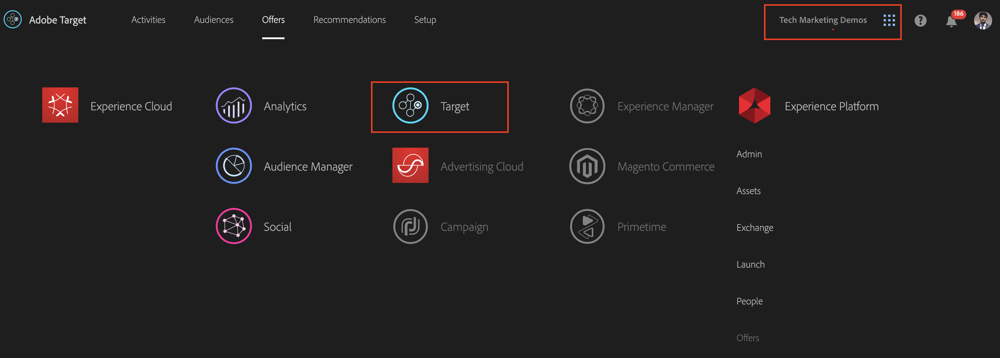

# 使用AEM體驗片段和Adobe Target的Personalization

有了將AEM體驗片段匯出至Adobe Target做為HTML選件的功能，您可以將AEM的易用性和威力，結合Target中強大的自動化智慧(AI)和機器學習(ML)功能，以大規模測試並個人化體驗。

AEM會將您的所有內容和資產集中在一個位置，為您的個人化策略提供助力。 AEM可讓您在單一位置輕鬆建立桌上型電腦、平板電腦和行動裝置的內容，而不需撰寫程式碼。 不需要為每個裝置建立頁面，AEM會自動根據您的內容調整每個體驗。

Target可讓您根據結合行為、情境和離線變數的規則型和AI驅動機器學習方法的組合，大規模提供個人化體驗。  透過Target，您可以輕鬆設定和執行A/B及多變數(MVT)活動，以決定最佳選件、內容和體驗。

體驗片段意味著，內容建立者與使用Target推動業務結果的行銷人員之間的連結有了巨大進步。

## 案例概述

WKND網站正計畫透過其網站在美國各地宣佈&#x200B;**SkateFest挑戰賽**，並希望其網站使用者註冊參加在每個州進行的試鏡。 行銷人員指派您在WKND網站首頁上執行行銷活動，包含與使用者位置相關的橫幅訊息以及事件詳細資訊頁面的連結。 讓我們探索WKND網站首頁，瞭解如何根據使用者目前位置為其建立和提供個人化體驗。

### 相關使用者

此練習需要下列使用者的參與，若要執行某些工作，您可能需要管理存取權。

* **內容製作者/內容編輯器** (Adobe Experience Manager)
* **行銷人員** (Adobe Target /最佳化團隊)

### 先決條件

* **AEM**
   * [AEM作者和發佈執行個體](./implementation.md#getting-aem)分別在localhost 4502和4503上執行。
* **Experience Cloud**
   * 存取您的組織Adobe Experience Cloud - `https://<yourcompany>.experiencecloud.adobe.com`
   * 布建下列解決方案的Experience Cloud
      * [Adobe Target](https://experiencecloud.adobe.com)

### wknd網站首頁

1. 行銷人員透過AEM內容編輯器發起WKND SkateFest行銷活動討論並詳細說明要求。
   * ***需求***：在WKND網站首頁上以來自美國各州的訪客的個人化內容來促銷WKND SkateFest行銷活動。 在含有背景影像、文字和按鈕的首頁輪播下方新增內容區塊。
      * **背景影像**：影像應該與使用者造訪WKND網站頁面的狀態相關。
      * **文字**： 「註冊Audition」
      * **按鈕**：指向WKND SkateFest頁面的「事件詳細資料」
      * **WKND SkateFest頁面**：包含活動詳細資訊的新頁面，包括試鏡場地、日期和時間。
1. AEM內容編輯器會根據需求，為內容區塊建立體驗片段，並將其以選件的形式匯出至Adobe Target。 為了向美國所有州提供個人化內容，內容作者可以建立一個體驗片段主要變數，然後建立50個其他變數，每個州各一個。 接著，您可以手動編輯每個狀態變數的內容以及相關影像和文字。 製作體驗片段時，內容編輯人員可使用「資產尋找器」選項，快速存取AEM Assets中可用的所有資產。 當體驗片段匯出至Adobe Target時，其所有變數也會以選件的形式推送至Adobe Target。

1. 從AEM將體驗片段匯出至Adobe Target做為選件後，行銷人員可以使用這些選件在Target中建立活動。 根據WKND網站SkateFest行銷活動，行銷人員需要為每個州的WKND網站訪客建立並提供個人化體驗。 若要建立體驗鎖定目標活動，行銷人員必須識別對象。 對於我們的WKND SkateFest行銷活動，我們需要根據訪客WKND網站的來源位置，建立50個個別的對象。
   * [對象](https://experienceleague.adobe.com/docs/target/using/introduction/target-key-concepts.html#section_3F32DA46BDF947878DD79DBB97040D01)會定義您活動的目標，並用於任何有目標定位可用的地方。 Target受眾是一組已定義的訪客條件。 選件可鎖定至特定對象（或區段）。 只有屬於該對象的訪客可以看到鎖定他們為目標的體驗。  例如，您可以將選件傳送給由使用特定瀏覽器或來自特定地理位置的訪客所組成的對象。
   * [選件](https://experienceleague.adobe.com/docs/target/using/introduction/target-key-concepts.html#section_973D4CC4CEB44711BBB9A21BF74B89E9)是在行銷活動或活動期間顯示在您網頁上的內容。 當您測試網頁時，會使用您位置中的不同選件來測量每個體驗的成功程度。 選件可包含不同型別的內容，包括：
      * 影像
      * 文字
      * **HTML**
         * *HTML選件用於此情境的活動*
      * 連結
      * 按鈕

## 內容編輯器活動

>[!VIDEO](https://video.tv.adobe.com/v/28596?quality=12&learn=on)

>[!NOTE]
>
>將體驗片段匯出至Adobe Target之前，先對其進行Publish。

## 行銷人員活動

### 使用地理鎖定目標建立對象 {#marketer-audience}

1. 導覽至您的組織[Adobe Experience Cloud](https://experiencecloud.adobe.com/) (`<https://<yourcompany>.experiencecloud.adobe.com`)
1. 使用您的Adobe ID登入，並確認您隸屬於正確的組織。
1. 在解決方案切換器中，按一下&#x200B;**Target**，然後按一下&#x200B;**啟動** Adobe Target。

   

1. 導覽至&#x200B;**選件**&#x200B;索引標籤並搜尋「WKND」選件。 您應該能夠檢視從AEM匯出為HTML選件的體驗片段變數清單。 每個選件都對應一個狀態。 例如，*WKND SkateFest California*&#x200B;是提供給來自加州的WKND網站訪客的選件。

   

1. 從主要導覽列中，按一下&#x200B;**對象**。

   行銷人員需要為來自美國各州的WKND網站訪客建立50個不同的受眾。

1. 若要建立對象，請按一下&#x200B;**建立對象**&#x200B;按鈕，然後提供對象名稱。

   **對象名稱格式： WKND-\&lt;*狀態*\>**

   

1. 按一下&#x200B;**新增規則>地理**。
1. 按一下&#x200B;**選取**，然後選取下列其中一個選項：
   * 國家/地區
   * **狀態** *（選取WKND網站SkateFest行銷活動的狀態）*
   * 城市
   * 郵遞區號
   * 緯度
   * 經度
   * DMA
   * 行動電信業者

   **地理** — 根據使用者的地理位置，包括其國家/地區、州/省、城市、郵遞區號、DMA或行動電信業者來鎖定使用者。 地理位置引數可讓您根據訪客的地理位置來鎖定目標活動和體驗。 此資料會根據訪客的IP位址，與每個Target請求一併傳送。 選取這些引數，就像任何定位值一樣。

   >[!NOTE]
   >訪客的IP位址會透過mbox要求傳遞(每次造訪（工作階段）一次)，用以解析該訪客的地理鎖定目標引數。

1. 選取運運算元為&#x200B;**符合**，提供適當的值（例如：加州）並&#x200B;**儲存**&#x200B;您的變更。 在本例中，請提供州名。

   

   >[!NOTE]
   >您可以為對象指派多個規則。

1. 重複步驟6至9，為其他狀態建立對象。

   

此時，我們已成功地為美利堅合眾國各州的所有WKND網站訪客建立受眾，並為每個州提供對應的HTML選件。 現在，讓我們建立體驗鎖定目標活動，以針對WKND網站首頁提供對應的選件來鎖定對象。

### 使用地理鎖定目標建立活動

1. 從您的Adobe Target視窗，導覽至&#x200B;**活動**&#x200B;標籤。
1. 按一下&#x200B;**建立活動**&#x200B;並選取&#x200B;**體驗鎖定目標**&#x200B;活動型別。
1. 選取&#x200B;**Web**&#x200B;通道，然後選擇&#x200B;**視覺化體驗撰寫器**。
1. 輸入&#x200B;**活動URL**&#x200B;並按一下[下一步]&#x200B;**以開啟視覺化體驗撰寫器。**

   WKND網站首頁Publish URL： http://localhost:4503/content/wknd/en.html

   

1. 若要載入&#x200B;**視覺化體驗撰寫器**，請啟用&#x200B;**允許載入瀏覽器上的Unsafe指令碼**，然後重新載入您的頁面。

   

1. 請注意，WKND網站首頁會在視覺化體驗撰寫器編輯器中開啟。

   

1. 若要新增對象至您的VEC，請按一下「對象」底下的&#x200B;**「新增體驗鎖定目標」**，然後選取WKND-California對象，並按一下&#x200B;**下一步**。

   

1. 按一下VEC內的WKND網站頁面，選取HTML元素以新增WKND-California對象的選件，並選擇&#x200B;**取代為**&#x200B;選項，然後選取&#x200B;**HTML選件**。

   

1. 從選件選取UI中為&#x200B;**WKND — 加州**&#x200B;對象選取&#x200B;**WKND SkateFest California** HTML選件，然後按一下&#x200B;**完成**。
1. 您現在應該能夠看到已新增至您WKND網站頁面的&#x200B;**WKND SkateFest California** HTML選件，供WKND-California對象使用。
1. 重複步驟7至10，為其他狀態新增體驗鎖定目標，並選擇對應的HTML選件。
1. 按一下[下一步]&#x200B;**&#x200B;**&#x200B;繼續，您可以看到對象與體驗的對應。
1. 按一下「下一步&#x200B;**&#x200B;**」以移至目標與設定。
1. 選擇您的報告來源並識別活動的主要目標。 針對我們的情境，我們將報告Source選為&#x200B;**Adobe Target**，測量活動為&#x200B;**轉換**，動作為已檢視頁面，以及指向WKND SkateFest詳細資訊頁面的URL。

   

   >[!NOTE]
   >您也可以選擇Adobe Analytics作為報表來源。

1. 暫留在目前的活動名稱上，您可以將它重新命名為&#x200B;**WKND SkateFest - USA**，然後&#x200B;**儲存並關閉**&#x200B;您的變更。
1. 在[活動詳細資料]畫面中，確定&#x200B;**啟動**&#x200B;您的活動。

   

1. 您的WKND SkateFest行銷活動現在已向所有WKND網站訪客開放。
1. 導覽至[WKND網站首頁](http://localhost:4503/content/wknd/en.html)，您應該能夠依據地理位置（*州：加州*）看到WKND SkateFest選件。

   

### 目標活動QA

1. 在「**活動詳細資料>總覽**」標籤下，按一下「**活動QA**」按鈕，即可取得所有體驗的直接QA連結。

   

1. 導覽至[WKND Site首頁](http://localhost:4503/content/wknd/en.html)，您應該能夠依據地理位置（狀態）看到WKND SkateFest選件。
1. 觀看以下影片，瞭解如何將優惠傳送至您的頁面、如何自訂回應Token和執行品質檢查。

>[!VIDEO](https://video.tv.adobe.com/v/28658?quality=12&learn=on)

## 摘要

在本章中，內容編輯能夠建立所有內容以在Adobe Experience Manager中支援WKND SkateFest促銷活動，並將其匯出至Adobe Target做為HTML選件，以根據使用者地理位置建立體驗鎖定目標。
