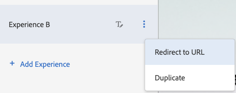
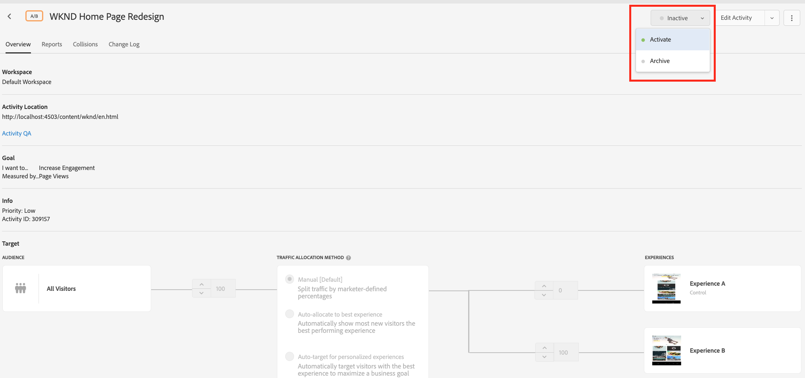

# 使用Adobe Target提供完整網頁體驗的Personalization

在上一章中，我們瞭解如何使用以HTML片段建立的內容以及從AEM匯出為Adobe Target選件，建立地理位置型活動。

在本章中，我們將探索建立活動，以使用Adobe Target將AEM上託管的網頁重新導向至新頁面。

## 案例概述

WKND網站重新設計了首頁，並且想要將其目前首頁的訪客重新導向至新的首頁。 同時，也瞭解重新設計的首頁如何有助於提高使用者參與度和收入。 身為行銷人員，您已被指派建立活動，以將訪客重新導向新首頁的任務。 讓我們探索WKND網站首頁，瞭解如何使用Adobe Target建立活動。

### 相關使用者

此練習需要下列使用者的參與，若要執行某些工作，您可能需要管理存取權。

* **內容製作者/內容編輯器** (Adobe Experience Manager)
* **行銷人員** (Adobe Target /最佳化團隊)

### wknd網站首頁

### 先決條件

* **AEM**
   * [AEM作者和發佈執行個體](./implementation.md#getting-aem)分別在localhost 4502和4503上執行。
   * [使用標籤與Adobe Target整合的AEM](./using-launch-adobe-io.md#aem-target-using-launch-by-adobe)
* **Experience Cloud**
   * 存取您的組織Adobe Experience Cloud - `https://<yourcompany>.experiencecloud.adobe.com`
   * 布建下列解決方案的Experience Cloud
      * [Adobe Target](https://experiencecloud.adobe.com)

## 內容編輯器活動

1. 行銷人員透過AEM內容編輯器起始WKND首頁重新設計討論並詳細說明要求。
   * ***需求*** ：使用卡片式設計重新設計WKND網站首頁。
2. 接著，AEM內容編輯器會根據需求，以卡片式設計建立新的WKND網站首頁，並發佈新首頁。

## 行銷人員活動

1. 行銷人員會建立A/B目標活動，將重新導向選件當作體驗，並將100%網站流量分配給新首頁，並新增成功目標和量度。
   1. 從您的Adobe Target視窗，導覽至&#x200B;**活動**&#x200B;標籤。
   2. 按一下&#x200B;**建立活動**&#x200B;按鈕，然後選取活動型別為&#x200B;**A/B測試**
      
   3. 選取&#x200B;**Web**&#x200B;通道，然後選擇&#x200B;**視覺化體驗撰寫器**。
   4. 輸入&#x200B;**活動URL**&#x200B;並按一下[下一步]**以開啟視覺化體驗撰寫器。**
      
   5. 若要載入&#x200B;**視覺化體驗撰寫器**，請啟用&#x200B;**允許載入瀏覽器上的Unsafe指令碼**，然後重新載入您的頁面。
      
   6. 請注意，WKND網站首頁會在視覺化體驗撰寫器編輯器中開啟。
      
   7. 將游標暫留在&#x200B;**體驗B**上，並選取檢視其他選項。
      
   8. 選取&#x200B;**重新導向至URL**選項，然後輸入新WKND首頁的URL。 (http://localhost:4503/content/wknd/en1.html)
      
   9. **儲存**&#x200B;您的變更，然後繼續活動建立的後續步驟。
   10. 選取&#x200B;**流量分配方法**&#x200B;作為手動，並為&#x200B;**體驗B**分配100%流量。
      
   11. 按一下「**下一步**」。
   12. 提供活動的&#x200B;**目標量度**，並儲存及關閉A/B測試。
      
   13. 提供活動的名稱（**WKND首頁重新設計**）並儲存變更。
   14. 在[活動詳細資料]畫面中，確定&#x200B;**啟動**您的活動。
      
   15. 導覽至WKND首頁(http://localhost:4503/content/wknd/en.html)，系統會將您重新導向重新設計的WKND網站首頁(http://localhost:4503/content/wknd/en1.html)。
      

## 摘要

在本章中，行銷人員能夠建立活動，使用Adobe Target將AEM上託管的網頁重新導向至新頁面。
