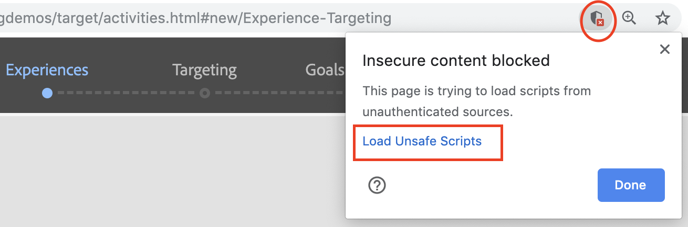
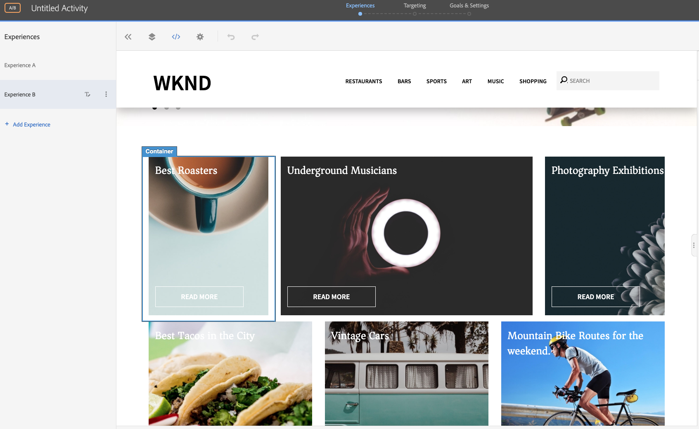
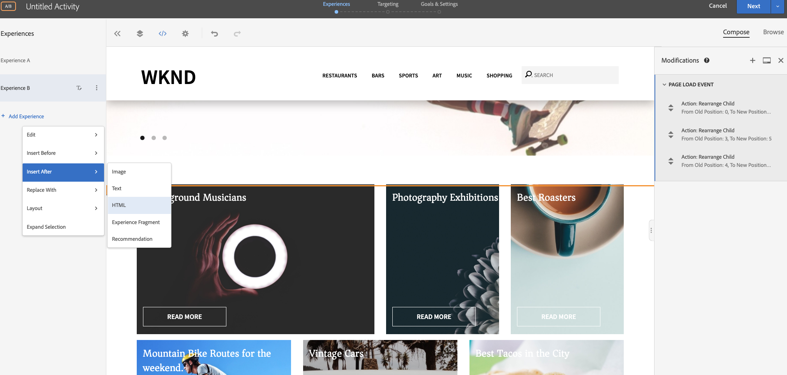
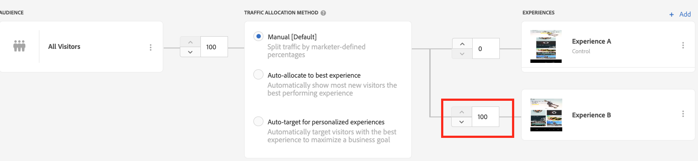
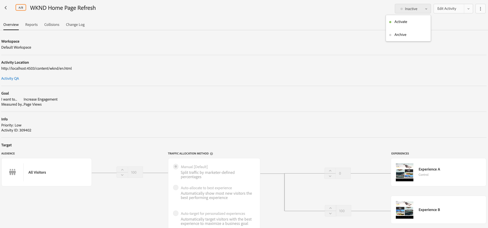

# 使用視覺化體驗撰寫器的Personalization

在本章中，我們將透過拖放、交換及修改Target中的網頁版面與內容，探索使用&#x200B;**視覺化體驗撰寫器**&#x200B;建立體驗。

## 案例概述

WKND網站首頁會以卡片版面配置的形式，顯示當地活動或城市周圍的最佳做法。 身為行銷人員，您已被指派透過重新排列卡片版面配置來修改首頁的任務，以檢視它如何影響使用者參與並促進轉換。

### 相關使用者

此練習需要下列使用者的參與，若要執行某些工作，您可能需要管理存取權。

* **內容製作者/內容編輯器** (Adobe Experience Manager)
* **行銷人員** (Adobe Target /最佳化團隊)

### wknd網站首頁


### 先決條件

* **AEM**
   * 在4503上執行的[AEM發佈執行個體](./implementation.md#getting-aem)
   * [使用標籤與Adobe Target整合的AEM](./using-launch-adobe-io.md#aem-target-using-launch-by-adobe)
* **Experience Cloud**
   * 存取您的組織Adobe Experience Cloud - `https://<yourcompany>.experiencecloud.adobe.com`
   * 已布建[Adobe Target](https://experiencecloud.adobe.com)的Experience Cloud

## 行銷人員活動

1. 行銷人員會在Adobe Target中建立A/B目標活動。
   1. 從您的Adobe Target視窗，導覽至&#x200B;**活動**&#x200B;標籤。
   2. 按一下&#x200B;**建立活動**&#x200B;按鈕，然後選取活動型別為&#x200B;**A/B測試**
      
   3. 選取&#x200B;**Web**&#x200B;通道，然後選擇&#x200B;**視覺化體驗撰寫器**。
   4. 輸入&#x200B;**活動URL**&#x200B;並按一下[下一步]**以開啟視覺化體驗撰寫器。**
      
   5. 若要載入&#x200B;**視覺化體驗撰寫器**，請啟用&#x200B;**允許載入瀏覽器上的Unsafe指令碼**，然後重新載入您的頁面。
      
   6. 請注意，WKND網站首頁會在視覺化體驗撰寫器編輯器中開啟。
      
   7. **體驗A**&#x200B;提供預設的WKND首頁，讓我們編輯&#x200B;**體驗B**的內容配置。
      
   8. 按一下其中一個卡片版面配置容器（*最佳燒錄機*），然後選取&#x200B;**重新排列**選項。
      
   9. 按一下您要重新排列的容器，並將其拖放至所需的位置。 讓我們將&#x200B;*最佳烘焙師*&#x200B;容器從第1列第1欄重新排列到第1列第3欄。 現在&#x200B;*最佳燒烤師*&#x200B;容器位於&#x200B;*攝影展覽*容器旁。
      
      交換後&#x200B;****
      
   10. 同樣地，重新排列其他卡片容器的位置。
      
   11. 我們也要在轉盤元件下方、卡片版面配置上方新增標題文字。
   12. 按一下轉盤容器，然後選取&#x200B;**在後面插入>HTML**選項以新增HTML。
      

      ```html
      <h1 style="text-align:center">Check Out the Hot Spots in Town</h1>
      ```

      
   13. 按一下[下一步]****&#x200B;繼續您的活動。
   14. 選取&#x200B;**流量分配方法**&#x200B;作為手動，並為&#x200B;**體驗B**分配100%流量。
      
   15. 按一下「**下一步**」。
   16. 提供活動的&#x200B;**目標量度**，並儲存及關閉A/B測試。
      
   17. 提供活動的名稱（**WKND首頁重新整理**）並儲存變更。
   18. 在[活動詳細資料]畫面中，確定&#x200B;**啟動**您的活動。
      
   19. 導覽至WKND首頁(http://localhost:4503/content/wknd/en.html)，您會注意到我們新增至WKND首頁重新整理A/B測試活動的變更。
      
   20. 開啟瀏覽器主控台，然後檢查網路索引標籤，尋找WKND首頁重新整理A/B測試活動的目標回應。
      

## 摘要

在本章中，行銷人員可以拖放、交換及修改網頁的版面和內容，不使用變更任何程式碼來執行測試，藉以使用視覺化體驗撰寫器建立體驗。
