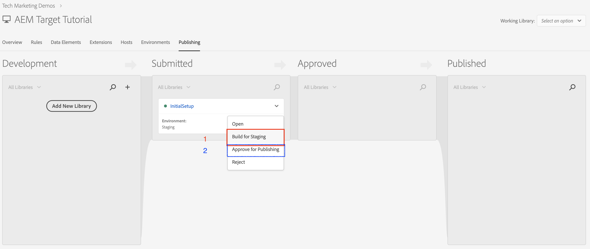

# 透過Adobe Developer Console使用標籤

## 先決條件

* [AEM作者和發佈執行個體](./implementation.md#set-up-aem)分別在localhost連線埠4502和4503上執行
* **Experience Cloud**
   * 存取您的組織Adobe Experience Cloud - `https://<yourcompany>.experiencecloud.adobe.com`
   * 透過下列解決方案提供Experience Cloud
      * [資料彙集](https://experiencecloud.adobe.com)
      * [Adobe Target](https://experiencecloud.adobe.com)
      * [Adobe Developer Console](https://developer.adobe.com/console/)

     >[!NOTE]
     >您應該具有開發、核准、Publish、管理擴充功能及管理資料收集中環境的許可權。 如果您因無法使用的使用者介面選項而無法完成其中任何步驟，請聯絡Experience Cloud管理員以請求存取許可權。 如需有關標籤許可權的詳細資訊，[請參閱檔案](https://experienceleague.adobe.com/docs/experience-platform/tags/admin/user-permissions.html?lang=zh-Hant)。

* **Chrome瀏覽器延伸模組**
   * Adobe Experience Cloud Debugger(https://chrome.google.com/webstore/detail/adobe-experience-platform/bfnnokhpnncpkdmbokanobigaccjkpob)

## 相關使用者

針對此整合，必須涉及以下對象，而若要執行某些工作，您可能需要管理存取權。

* 開發人員
* AEM管理員
* Experience Cloud管理員

## 簡介

AEM提供與標籤的現成整合。 此整合可讓AEM管理員透過簡單易用的介面輕鬆設定標籤，因此在設定這兩個工具時可減少工作量和錯誤次數。 此外，只要將Adobe Target擴充功能新增至標籤，就能協助我們在AEM網頁上使用Adobe Target的所有功能。

在本節中，我們將介紹下列整合步驟：

* 標記
   * 建立標籤屬性
   * 新增Target擴充功能
   * 建立資料元素
   * 建立頁面規則
   * 設定環境
   * 建置和Publish
* AEM
   * 建立Cloud Service
   * 建立

### 標記

#### 建立標籤屬性

屬性是一個容器，當您將標籤部署至網站時，在其中裝入擴充功能、規則、資料元素和程式庫。

1. 導覽至您的組織[Adobe Experience Cloud](https://experiencecloud.adobe.com/) (`https://<yourcompany>.experiencecloud.adobe.com`)
1. 使用您的Adobe ID登入，並確認您隸屬於正確的組織。
1. 在方案切換器中，按一下&#x200B;**Experience Platform**，然後按一下&#x200B;**資料彙集**&#x200B;區段，然後選取&#x200B;**標籤**。

1. 確定您隸屬於正確的組織，然後繼續建立標籤屬性。
   

   *如需建立屬性的詳細資訊，請參閱產品檔案中的[建立屬性](https://experienceleague.adobe.com/docs/experience-platform/tags/admin/companies-and-properties.html?lang=zh-Hant#create-or-configure-a-property)。*
1. 按一下&#x200B;**新增屬性**&#x200B;按鈕
1. 提供屬性的名稱(例如，*AEM Target教學課程*)
1. 網域請輸入&#x200B;*localhost.com*，因為這是WKND示範網站執行所在的網域。 雖然&#39;*Domain*&#39;欄位是必要欄位，標籤屬性仍可在任何已實作的網域上運作。 此欄位的主要用途是在規則產生器中預先填入功能表選項。
1. 按一下&#x200B;**儲存**&#x200B;按鈕。

   

1. 開啟您剛建立的屬性，然後按一下「擴充功能」標籤。

#### 新增Target擴充功能

Adobe Target擴充功能支援將Target JavaScript SDK用於現代網路`at.js`的使用者端實作。 仍在使用Target舊版程式庫`mbox.js`、[的客戶應升級至at.js](https://experienceleague.adobe.com/docs/target-dev/developer/client-side/at-js-implementation/upgrading-from-atjs-1x-to-atjs-20.html?lang=zh-Hant)，才能使用標籤。

Target擴充功能包含兩個主要部分：

* 管理核心程式庫設定的擴充功能設定
* 規則動作，可執行下列操作：
   * 載入Target (at.js)
   * 新增引數至所有Mbox
   * 將引數新增至全域mbox
   * 引發全域mbox

1. 在&#x200B;**擴充功能**&#x200B;底下，您可以看到已針對標籤屬性安裝的擴充功能清單。 (預設已安裝[Adobe啟動核心擴充功能](https://exchange.adobe.com/apps/ec/100223/adobe-launch-core-extension))
2. 按一下&#x200B;**擴充功能目錄**&#x200B;選項，然後在篩選器中搜尋目標。
3. 選取最新版的Adobe Target at.js，然後按一下&#x200B;**安裝**&#x200B;選項。
   

4. 按一下&#x200B;**設定**&#x200B;按鈕，您會注意到已匯入Target帳戶認證的設定視窗，以及此擴充功能的at.js版本。
   

   透過非同步標籤內嵌程式碼部署Target時，您應在標籤內嵌程式碼之前，先在頁面上以硬式編碼撰寫預先隱藏程式碼片段，以便管理內容閃爍問題。 我們稍後將深入瞭解預先隱藏的Snipper。 您可以在[這裡](assets/using-launch-adobe-io/prehiding.js)下載預先隱藏程式碼片段

5. 按一下[儲存]&#x200B;**&#x200B;**&#x200B;完成將Target擴充功能新增至標籤屬性，您現在應該能夠看到Target擴充功能列在[已安裝的]&#x200B;**&#x200B;**&#x200B;擴充功能清單下。

6. 重複上述步驟以搜尋「Experience CloudID服務」擴充功能並加以安裝。
   

#### 設定環境

1. 按一下網站屬性的&#x200B;**環境**&#x200B;標籤，您就可以看到為您的網站屬性建立的環境清單。 依預設，我們針對開發、測試和生產各建立一個例項。

#### 建置和Publish

1. 按一下網站屬性的&#x200B;**發佈**&#x200B;標籤，讓我們建立程式庫，以建置變更（資料元素、規則）並將其部署至開發環境。
   >[!VIDEO](https://video.tv.adobe.com/v/28412?quality=12&learn=on)
2. 將您從開發到測試環境的變更進行Publish。
   >[!VIDEO](https://video.tv.adobe.com/v/28419?quality=12&learn=on)
3. 執行&#x200B;**Build for Staging選項**
4. 建置完成後，請執行&#x200B;**核准以發佈**，這樣會將您的變更從中繼環境移至生產環境。
   
5. 最後，執行&#x200B;**建置和Publish至生產環境**&#x200B;選項，將您的變更推送至生產環境。
   

### Adobe Experience Manager

>[!VIDEO](https://video.tv.adobe.com/v/28416?quality=12&learn=on)

>[!NOTE]
>
> 授予Adobe Developer整合使用適當[角色選取工作區的存取權，以允許中央團隊只在少數幾個工作區中進行API導向的變更](https://experienceleague.adobe.com/docs/target/using/administer/manage-users/enterprise/configure-adobe-io-integration.html?lang=zh-Hant)。

1. 使用來自Adobe Developer的憑證在AEM中建立IMS整合。 （01:12至03:55）
2. 在資料收集中建立屬性。 （涵蓋[以上](#create-launch-property)）
3. 使用步驟1中的IMS整合，建立標籤整合以匯入標籤屬性。
4. 在AEM中，使用瀏覽器設定將標籤整合對應至網站。 （05:28至06:14）
5. 手動驗證整合。 （06:15至06:33）
6. 使用Adobe Experience Cloud Debugger瀏覽器外掛程式。 （06:51至07:22）

此時，您已順利使用標籤[&#128279;](./using-aem-cloud-services.md#integrating-aem-target-options)將AEM與Adobe Target整合（如選項1所述）。

若要使用AEM體驗片段選件來強化您的個人化活動，請前往下一章，並使用舊版雲端服務整合AEM與Adobe Target。
