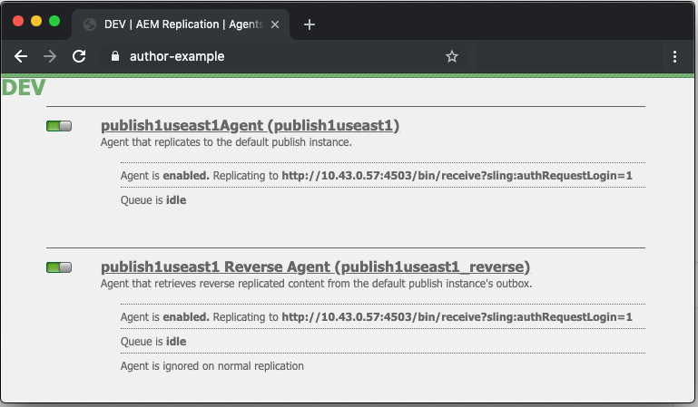
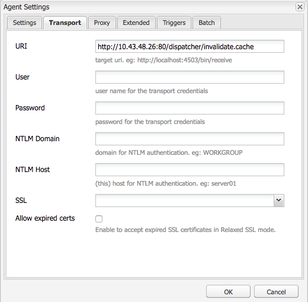

# 調度程式虛擬型URL

[目錄](./overview.md)

[&lt; — 上一個：使用和瞭解變數](./variables.md)

本文檔將指導如何進行刷新，並解釋執行快取刷新和無效的機制。


## 它的工作原理

### 操作順序

最好描述一下典型的工作流，內容作者將在發佈者收到新內容時激活頁面，它將觸發對Dispatcher的刷新請求，如下圖所示：

此事件連結將突出顯示只有在項目新建或已更改時才刷新項目。  這可確保在清除快取之前發佈者已接收到內容，以避免在能夠從發佈者中提取更改之前出現刷新的競爭情況。

## 複寫代理程式

在作者身上，配置了複製代理以指向發佈者，當某些內容被激活時，它將觸發向發佈者發送檔案及其所有依賴關係。

發佈伺服器收到檔案時，其已配置複製代理以指向在接收事件時觸發的Dispatcher。  然後，它將序列化刷新請求，並將其發佈到Dispatcher。

### 作者複製代理

以下是已配置標準複製代理的一些螢幕截圖示例


在作者上，通常為每個複製內容的發佈者配置1或2個複製代理。

首先是將內容激活推送到的標準複製代理。

第二個是反向代理。  這是可選的，並且設定為選中每個發佈器輸出框，以查看是否有新內容作為反向複製活動納入作者

### 發佈伺服器複製代理

下面是配置的標準刷新複製代理的螢幕截圖示例


### 接收虛擬主機的DISPATCHER刷新複製

Dispatcher模組查找特定的標頭，以瞭解何時POST請求是要傳遞到呈現的內容AEM，或者它是否是序列化的刷新請求，並且需要由Dispatcher處理程式本身處理。

下面是配置頁面的螢幕快照，其中顯示了以下值：


預設設定頁顯示 `Serialization Type` 如 `Dispatcher Flush` 並設定錯誤級別



在 `Transport` 頁籤 `URI` 設定為指向將接收刷新請求的Dispatcher的IP地址。  路徑 `/dispatcher/invalidate.cache` 不是模組如何確定它是否是刷新，它只是您在訪問日誌中可以看到的一個明顯的終結點，以知道它是刷新請求。  在 `Extended` 頁籤，我們將查看其中的內容，以確認這是對Dispatcher模組的刷新請求。


的 `HTTP Method` 對於刷新請求 `GET` 具有某些特殊請求標題的請求：
- CQ操作
   - 這會根據AEM請求使用變數，並且該值通常 *激活或刪除*
- CQ句柄
   - 這將使用基AEM於請求的變數，並且該值通常是刷新項的完整路徑，例如 `/content/dam/logo.jpg`
- CQ路徑
   - 這會使用基AEM於請求的變數，並且值通常是要刷新的項的完整路徑，例如 `/content/dam`
- 主機
   - 這裡 `Host` 報頭被偽造以特定目標 `VirtualHost` 在dispatcher Apache Web伺服器上配置(`/etc/httpd/conf.d/enabled_vhosts/aem_flush.vhost`)。  與中的條目匹配的硬編碼值 `aem_flush.vhost` 檔案 `ServerName` 或 `ServerAlias`


在 `Triggers` 頁籤，我們將記錄我們使用的切換觸發器及其內容

- `Ignore default`
   - 已啟用此功能，因此在頁面激活時不會觸發複製代理。  當作者實例更改頁面時，會觸發刷新。  因為這是一個發佈者我們不想觸發這種類型的事件。
- `On Receive`
   - 收到新檔案時，我們要觸發刷新。  因此，當作者向我們發送更新的檔案時，我們將觸發並向Dispatcher發送刷新請求。
- `No Versioning`
   - 我們檢查此項以避免發佈者生成新版本，因為收到了新檔案。  我們只需替換我們擁有的檔案，並依靠作者來跟蹤版本，而不是發佈者。

現在，如果我們查看一個典型的刷新請求的形式 `curl` 命令

```
$ curl \ 
-H "CQ-Action: Activate" \ 
-H "CQ-Handle: /content/dam/logo.jpg" \ 
-H "CQ-Path: /content/dam/" \ 
-H "Content-Length: 0" \  
-H "Content-Type: application/octect-stream" \ 
-H "Host: flush" \ 
http://10.43.0.32:80/dispatcher/invalidate.cache
```

此刷新示例將刷新 `/content/dam` 路徑 `.stat` 檔案。

## 的 `.stat` 檔案

沖洗機制在自然界中是簡單的，我們想解釋沖洗機制的重要性 `.stat` 在建立快取檔案的文檔根目錄中生成的檔案。

在 `.vhost` 和 `_farm.any` 檔案我們將配置一個文檔根指令，以指定快取的位置以及當最終用戶發出請求時儲存/服務檔案的位置。

如果要在Dispatcher伺服器上運行以下命令，您將開始查找 `.stat` 檔案

```
$ find /mnt/var/www/html/ -type f -name ".stat"
```

下面是一個圖，說明當快取中有項目並且Dispatcher模組已發送和處理了刷新請求時，此檔案結構的外觀


### STAT檔案級別

請注意，在每個目錄中 `.stat` 檔案。  這是發生刷新的指示器。  在上面的示例中 `statfilelevel` 設定設定為 `3` 在相應的場配置檔案中。

的 `statfilelevel` 設定指示模組將遍歷和更新的資料夾數 `.stat` 的子菜單。  .stat檔案為空，它只是帶有日期戳的檔案名，甚至可以手動建立，但在Dispatcher伺服器的命令行上運行touch命令。

如果stat檔案級別設定設定過高，則每個刷新請求都會遍歷接觸stat檔案的目錄樹。  這可能會成為對大型快取樹的主要效能打擊，並會影響Dispatcher的整體效能。

將此檔案級別設定得太低可能會導致刷新請求清除的次數超出預期。  這反過來又會導致快取更頻繁地出現混亂，而從快取中提供的請求更少，並可能導致效能問題。

<div style="color: #000;border-left: 6px solid #2196F3;background-color:#ddffff;"><b>注意:</b>

設定 `statfilelevel` 在合理水準上。  查看資料夾結構，並確保設定該結構以允許簡潔刷新，而無需遍歷太多目錄。   Test它，並確保它在系統的效能test中滿足您的需要。

一個支援語言的站點就是很好的例子。  典型內容樹將包含以下目錄

`/content/brand1/en/us/`

在本示例中，使用stat檔案級別設定4。  這將確保當您刷新位於 <b>`us`</b> 不會導致語言資料夾被刷新。
</div>

### STAT檔案時間戳握手

當內容請求進入同一常式時

1. 的時間戳 `.stat` 將檔案與請求檔案的時間戳進行比較
2. 如果 `.stat` 檔案比請求的檔案新，它會刪除快取的內容並從中提取新內容AEM並快取該內容。  然後提供內容
3. 如果 `.stat` 檔案比請求的檔案舊，它知道檔案是新的，可以提供內容。

### 快取握手 — 示例1

在上面的示例中，對內容的請求 `/content/index.html`

時間 `index.html` 2019-11-01 @ 6:21PM

最近的時間 `.stat` 2019-11-01 @ 12:22 PM

瞭解我們上面讀到的內容，您可以看到索引檔案比 `.stat` 檔案和檔案將從快取提供給請求該檔案的最終用戶

### 快取握手 — 示例2

在上面的示例中，對內容的請求 `/content/dam/logo.jpg`

時間 `logo.jpg` 2019-10-31 @ 1:13 PM

最近的時間 `.stat` 2019-11-01 @ 12:22 PM

如本示例中所示，檔案比 `.stat` 將刪除並從中拉出新檔案，AEM以在快取中替換它，然後再提供給請求它的最終用戶。

## 場檔案設定

所有文檔都位於此處，用於完整的配置選項： [https://docs.adobe.com/content/help/en/experience-manager-dispatcher/using/configuring/dispatcher-configuration.html#configuring-dispatcher_configuring-the-dispatcher-cache-cache](https://experienceleague.adobe.com/docs/experience-manager-dispatcher/using/configuring/dispatcher-configuration.html?lang=zh-Hant)

我們要突出顯示其中與快取刷新相關的少數內容

### 刷新場

有兩個鍵 `document root` 從作者和發佈者通信中快取檔案的目錄。  要使這些目錄與新內容保持最新，我們需要刷新快取。  這些刷新請求不想與您正常的客戶流量場配置糾纏在一起，這些配置可能會拒絕請求或執行不想要的操作。  相反，我們為此任務提供兩個刷新農場：

- `/etc/httpd.conf.d/available_farms/001_ams_author_flush_farm.any`
- `/etc/httpd.conf.d/available_farms/001_ams_publish_flush_farm.any`

這些場檔案除刷新文檔根目錄外，不執行任何操作。

```
/publishflushfarm {  
    /virtualhosts {
        "flush"
    }
    /cache {
        /docroot "${PUBLISH_DOCROOT}"
        /statfileslevel "${DEFAULT_STAT_LEVEL}"
        /rules {
            $include "/etc/httpd/conf.dispatcher.d/cache/ams_publish_cache.any"
        }
        /invalidate {
            /0000 {
                /glob "*"
                /type "allow"
            }
        }
        /allowedClients {
            /0000 {
                /glob "*.*.*.*"
                /type "deny"
            }
            $include "/etc/httpd/conf.dispatcher.d/cache/ams_publish_invalidate_allowed.any"
        }
    }
}
```

### 文檔根

此配置條目位於場檔案的以下部分：

```
/myfarm { 
    /cache { 
        /docroot
```

指定希望Dispatcher以快取目錄的形式填充和管理的目錄。

<div style="color: #000;border-left: 6px solid #2196F3;background-color:#ddffff;"><b>注：</b>
此目錄應與Web伺服器配置為使用的域的Apache文檔根設定匹配。

由於許多原因，將嵌套的Docroot資料夾置於每個場中，每個場都存在Apache文檔根的子資料夾。
</div>

### Stat檔案級別

此配置條目位於場檔案的以下部分：

```
/myfarm { 
    /cache { 
        /statfileslevel
```

此設定可測出 `.stat` 需要在刷新請求進入時生成檔案。

`/statfileslevel` 以下編號設定，文檔根為 `/var/www/html/` 在刷新時會出現以下結果 `/content/dam/brand1/en/us/logo.jpg`

- 0 — 將建立以下stat檔案
   - `/var/www/html/.stat`
- 1 — 將建立以下stat檔案
   - `/var/www/html/.stat`
   - `/var/www/html/content/.stat`
- 2 — 將建立以下stat檔案
   - `/var/www/html/.stat`
   - `/var/www/html/content/.stat`
   - `/var/www/html/content/dam/.stat`
- 3 — 將建立以下stat檔案
   - `/var/www/html/.stat`
   - `/var/www/html/content/.stat`
   - `/var/www/html/content/dam/.stat`
   - `/var/www/html/content/dam/brand1/.stat`
- 4 — 將建立以下stat檔案
   - `/var/www/html/.stat`
   - `/var/www/html/content/.stat`
   - `/var/www/html/content/dam/.stat`
   - `/var/www/html/content/dam/brand1/.stat`
   - `/var/www/html/content/dam/brand1/en/.stat`
- 5 — 將建立以下stat檔案
   - `/var/www/html/.stat`
   - `/var/www/html/content/.stat`
   - `/var/www/html/content/dam/.stat`
   - `/var/www/html/content/dam/brand1/.stat`
   - `/var/www/html/content/damn/brand1/en/.stat`
   - `/var/www/html/content/damn/brand1/en/us/.stat`


<div style="color: #000;border-left: 6px solid #2196F3;background-color:#ddffff;"><b>注意:</b>

請記住，當時間戳握手發生時，它會查找最接近 `.stat` 的子菜單。

有 `.stat` 檔案級別0和stat檔案僅位於 `/var/www/html/.stat` 意味著生活在 `/var/www/html/content/dam/brand1/en/us/` 會找最近的 `.stat` 檔案並遍歷5個資料夾，以查找 `.stat` 在0級存在並將日期與其進行比較的檔案。  這意味著，在某一級別的高處進行刷新，實際上會使快取的所有項無效。
</div>

### 允許無效

此配置條目位於場檔案的以下部分：

```
/myfarm { 
    /cache { 
        /allowedClients {
```

在此配置中，您將放入允許發送刷新請求的IP地址清單。  如果刷新請求進入調度程式，則它必須來自受信任的IP。  如果配置錯誤或從不受信任的IP地址發送刷新請求，您將在日誌檔案中看到以下錯誤：

```
[Mon Nov 11 22:43:05 2019] [W] [pid 3079 (tid 139859875088128)] Flushing rejected from 10.43.0.57
```

### 無效規則

此配置條目位於場檔案的以下部分：

```
/myfarm { 
    /cache { 
        /invalidate {
```

這些規則通常指示允許哪些檔案使用刷新請求無效。

為避免重要檔案因頁面激活而失效，您可以播放指定哪些檔案可以失效以及哪些檔案必須手動失效的規則。  下面是一組配置示例，它僅允許使html檔案無效：

```
/invalidate { 
   /0000 { /glob "*" /type "deny" } 
   /0001 { /glob "*.html" /type "allow" } 
}
```

## 測試/故障排除

當您激活頁面並獲得頁面激活成功的綠燈時，您應該預期您激活的內容也會從快取中清除。

你刷新你的頁面，看看舊東西！ 什麼？ 有綠燈了？!

讓我們手動執行幾個步驟來瞭解可能出錯的問題。  從發佈器shell使用curl運行以下刷新請求：

```
$ curl -H "CQ-Action: Activate" \ 
-H "CQ-Handle: /content/<PATH TO ITEM TO FLUSH>" \ 
-H "CQ-Path: /content/<PATH TO ITEM TO FLUSH>" \ 
-H "Content-Length: 0" -H "Content-Type: application/octet-stream" \ 
-H "Host: flush" \ 
http://<DISPATCHER IP ADDRESS>/dispatcher/invalidate.cache
```

test刷新請求示例

```
$ curl -H "CQ-Action: Activate" \ 
-H "CQ-Handle: /content/customer/en-us" \ 
-H "CQ-Path: /content/customer/en-us" \ 
-H "Content-Length: 0" -H "Content-Type: application/octet-stream" \ 
-H "Host: flush" \ 
http://169.254.196.222/dispatcher/invalidate.cache
```

一旦您向Dispatcher發出了request命令，您將希望查看它在日誌中所做的操作，以及 `.stat files`。  跟蹤日誌檔案，您應看到以下條目以確認刷新請求命中Dispatcher模組

```
[Wed Nov 13 16:54:12 2019] [I] [pid 19173:tid 140542721578752] Activation detected: action=Activate [/content/dam/logo.jpg] 
[Wed Nov 13 16:54:12 2019] [I] [pid 19173:tid 140542721578752] Touched /mnt/var/www/html/.stat 
[Wed Nov 13 16:54:12 2019] [I] [pid 19173:tid 140542721578752] Touched /mnt/var/www/html/content/.stat 
[Wed Nov 13 16:54:12 2019] [I] [pid 19173:tid 140542721578752] Touched /mnt/var/www/html/content/dam/.stat 
[Wed Nov 13 16:54:12 2019] [I] [pid 19173:tid 140542721578752] "GET /dispatcher/invalidate.cache" 200 purge [publishfarm/-] 0ms
```

現在，我們看到模組已接收並確認刷新請求，我們需要瞭解它對 `.stat` 的子菜單。  運行以下命令並在發出另一個刷新時監視時間戳更新：

```
$ watch -n 3 "find /mnt/var/www/html/ -type f -name ".stat" | xargs ls -la $1"
```

如您從命令中看到的，輸出當前的時間戳 `.stat` 檔案

```
-rw-r--r--. 1 apache apache 0 Nov 13 16:54 /mnt/var/www/html/content/dam/.stat 
-rw-r--r--. 1 apache apache 0 Nov 13 16:54 /mnt/var/www/html/content/.stat 
-rw-r--r--. 1 apache apache 0 Nov 13 16:54 /mnt/var/www/html/.stat
```

現在，如果我們再次運行刷新，您將觀看時間戳更新

```
-rw-r--r--. 1 apache apache 0 Nov 13 17:17 /mnt/var/www/html/content/dam/.stat 
-rw-r--r--. 1 apache apache 0 Nov 13 17:17 /mnt/var/www/html/content/.stat 
-rw-r--r--. 1 apache apache 0 Nov 13 17:17 /mnt/var/www/html/.stat
```

讓我們將內容時間戳與 `.stat` 檔案時間戳

```
$ stat /mnt/var/www/html/content/customer/en-us/.stat 
  File: `.stat' 
  Size: 0           Blocks: 0          IO Block: 4096   regular empty file 
Device: ca90h/51856d    Inode: 17154125    Links: 1 
Access: (0644/-rw-r--r--)  Uid: (   48/  apache)   Gid: (   48/  apache) 
Access: 2019-11-13 16:22:31.000000000 -0400 
Modify: 2019-11-13 16:22:31.000000000 -0400 
Change: 2019-11-13 16:22:31.000000000 -0400 
 
$ stat /mnt/var/www/html/content/customer/en-us/logo.jpg 
File: `logo.jpg' 
  Size: 15856           Blocks: 32          IO Block: 4096   regular file 
Device: ca90h/51856d    Inode: 9175290    Links: 1 
Access: (0644/-rw-r--r--)  Uid: (   48/  apache)   Gid: (   48/  apache) 
Access: 2019-11-11 22:41:59.642450601 +0000 
Modify: 2019-11-11 22:41:59.642450601 +0000 
Change: 2019-11-11 22:41:59.642450601 +0000
```

如果查看任何時間戳，您會注意到內容的時間比 `.stat` 檔案，該檔案指示模組從快取中提供檔案，因為它比 `.stat` 的子菜單。

清楚地顯示更新此檔案的時間戳的內容，這些時間戳不能將其「刷新」或替換。

[下一個 — >虛榮URL](./disp-vanity-url.md)
