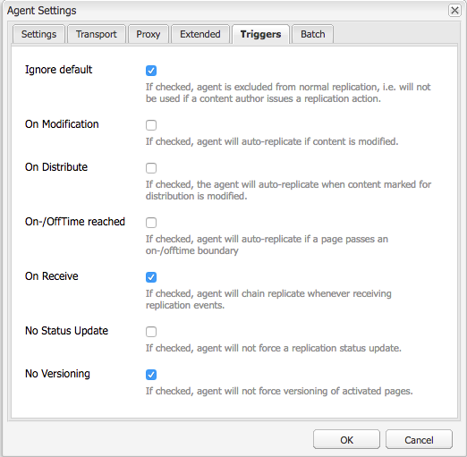
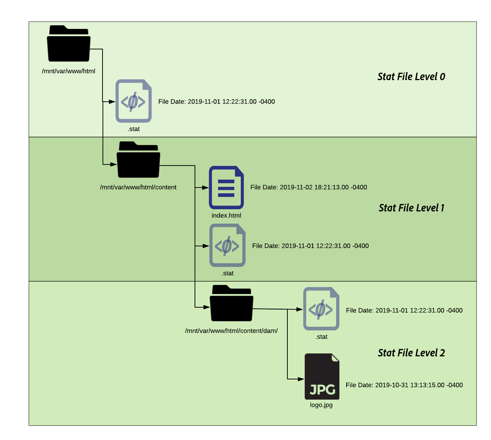

# Dispatcher虛名URL

[目錄](./overview.md)

[&lt; — 上一步：使用及瞭解變數](./variables.md)

本檔案將提供有關排清發生的方式，並解釋執行快取排清和失效的機制。


## 運作方式

### 作業順序

對典型的工作流程的最佳詮釋是，當內容作者啟動頁面時，發佈者收到新內容時會觸發對Dispatcher的排清請求，如下圖所示：

這個事件鏈結強調我們僅在專案是新的或變更時排清專案。  這可確保在清除快取之前，發佈者已收到內容，以避免在發佈者擷取變更之前可能發生排清的競爭條件。

## 複寫代理程式

在作者上，有一個復寫代理程式設定為指向發行者，當有東西啟動時，它會觸發將檔案及其所有相依性傳送給發行者。

發佈者收到檔案時，會將復寫代理程式設定為指向接收時觸發的Dispatcher。  接著會序列化排清請求，並將其發佈至Dispatcher。

### 作者復寫代理程式

以下是已設定標準復寫代理程式的一些熒幕擷取畫面範例
中的標準復寫代理程式熒幕擷圖

在作者上，通常為其復寫內容的每個發行者設定1或2個復寫代理。

第一個是將內容啟用推送到的標準復寫代理。

第二個是反向代理。  這是選擇性的，設定為檢查每個發佈者的寄件匣，以檢視是否有新內容可當作反向復寫活動提取至作者

### 發行者復寫代理程式

以下是已設定的標準排清復寫代理程式的熒幕擷取畫面範例
中的標準排清復寫代理程式熒幕擷圖

### Dispatcher FLUSH復寫接收虛擬主機

Dispatcher模組會尋找特定標頭，以瞭解POST請求何時可以傳遞給AEM轉譯器，或者該請求是否已序列化為排清請求，且需要由Dispatcher處理常式本身處理。

以下是顯示這些值的設定頁面熒幕擷圖：
主要組態畫面設定索引標籤的

預設設定頁面將`Serialization Type`顯示為`Dispatcher Flush`並設定錯誤層級


在`Transport`索引標籤上，您可以看到將`URI`設定為指向將接收排清請求的Dispatcher的IP位址。  路徑`/dispatcher/invalidate.cache`不是模組判斷其是否為排清的方式，它只是您可以在存取記錄檔中看到的明顯端點，用來知道其為排清請求。  在`Extended`標籤上，我們將瀏覽現有的專案，以確認其為Dispatcher模組的排清請求。


排清要求的`HTTP Method`只是具有某些特殊要求標題的`GET`要求：
- CQ-Action
   - 這會根據要求使用AEM變數，其值通常為&#x200B;*啟動或刪除*
- CQ-Handle
   - 這會根據要求使用AEM變數，其值通常是已清除專案的完整路徑，例如`/content/dam/logo.jpg`
- CQ-Path
   - 這會根據要求使用AEM變數，其值通常是要清除之專案的完整路徑，例如`/content/dam`
- 主機
   - 這是詐騙`Host`標頭以鎖定在Dispatcher Apache網頁伺服器(`/etc/httpd/conf.d/enabled_vhosts/aem_flush.vhost`)上設定之特定`VirtualHost`的位置。  這是硬式編碼值，符合`aem_flush.vhost`檔案`ServerName`或`ServerAlias`中的專案



在`Triggers`標籤上，我們會記下我們使用的切換觸發器及其內容

- `Ignore default`
   - 啟用此功能，頁面啟用時就不會觸發復寫代理程式。  這是指當作者執行個體對頁面進行變更時會觸發排清的情況。  因為這是發行者，所以我們不想觸發該型別的事件。
- `On Receive`
   - 收到新檔案時，我們想要觸發排清。  因此，當作者傳送更新的檔案給我們時，我們將會觸發並傳送排清請求給Dispatcher。
- `No Versioning`
   - 核取此項以避免發行者因為收到新檔案而產生新版本。  我們將取代現有的檔案，並仰賴作者而非發佈者來追蹤版本。

現在，如果我們檢視以`curl`命令形式呈現的典型排清請求

```
$ curl \ 
-H "CQ-Action: Activate" \ 
-H "CQ-Handle: /content/dam/logo.jpg" \ 
-H "CQ-Path: /content/dam/" \ 
-H "Content-Length: 0" \  
-H "Content-Type: application/octect-stream" \ 
-H "Host: flush" \ 
http://10.43.0.32:80/dispatcher/invalidate.cache
```

此排清範例會更新該目錄中的`.stat`檔案來排清`/content/dam`路徑。

## `.stat`檔案

排清機制本質上很簡單，我們要說明在建立快取檔案之檔案根目錄中產生的`.stat`檔案的重要性。

在`.vhost`和`_farm.any`檔案中，我們會設定檔案根指令，以指定當一般使用者的請求傳入時，快取的位置以及儲存/服務檔案的位置。

如果您要在Dispatcher伺服器上執行下列命令，就會開始尋找`.stat`個檔案

```
$ find /mnt/var/www/html/ -type f -name ".stat"
```

下圖是當快取中有專案，且Dispatcher模組已傳送並處理排清要求時，此檔案結構的外觀



### stat檔案層級

請注意，每個目錄中都有`.stat`個檔案。  這是表示已發生排清的指標。  在上述範例中，對應伺服器陣列組態檔內的`statfilelevel`設定設為`3`。

`statfilelevel`設定表示模組將周遊並更新`.stat`檔案的資料夾深度。  .stat檔案是空的，只不過是帶有datestamp的檔案名稱，甚至可以手動建立，但在Dispatcher伺服器的命令列上執行touch命令。

如果stat檔案層級設定得太高，則每個排清請求都會周遊接觸stat檔案的目錄樹狀結構。  這可能會嚴重影響大型快取樹狀結構的效能，並影響Dispatcher的整體效能。

將此檔案層級設定得太低，可能會導致排清請求清除的內容超出預期。  這進而會造成快取經常流失，使快取中提供的請求變少，進而導致效能問題。

>[!BEGINSHADEBOX &quot;Note&quot;]

將`statfilelevel`設定在合理的層級。 檢視您的資料夾結構，並確定其設定為允許簡潔的排清，而不需周遊太多目錄。 在系統效能測試期間進行測試並確定它符合您的需求。

支援語言的網站就是一個很好的範例。 典型的內容樹狀目錄如下

`/content/brand1/en/us/`

在此範例中，使用stat檔案層級設定4。 這可以確保當您排清位於&#x200B;**`us`**&#x200B;資料夾下的內容時，不會造成語言資料夾也遭到排清。

>[!ENDSHADEBOX]

### STAT檔案時間戳記交握

當對內容的請求進入相同的常式時

1. 會比較`.stat`檔案的時間戳記與要求的檔案時間戳記
2. 如果`.stat`檔案比要求的檔案新，它會刪除快取的內容，並從AEM擷取新的內容，然後快取該內容。  然後提供內容
3. 如果`.stat`檔案比要求的檔案舊，它就會知道檔案是新的，可以提供內容。

### 快取交握 — 範例1

在上述範例中，有內容`/content/index.html`的要求

`index.html`檔案的時間是2019-11-01 @ 6:21PM

最近的`.stat`檔案時間為2019-11-01 @ 12:22PM

瞭解我們上述所讀內容後，您會發現索引檔案比`.stat`檔案新，因此系統會從快取中提供該檔案給提出請求的一般使用者

### 快取交握 — 範例2

在上述範例中，有內容`/content/dam/logo.jpg`的要求

`logo.jpg`檔案的時間是2019-10-31 @ 1:13PM

最近的`.stat`檔案時間為2019-11-01 @ 12:22PM

如本範例所示，此檔案比`.stat`檔案舊，將會被移除並從AEM中拉取新的檔案，以便在提供給提出請求的一般使用者之前，在快取中取代它。

## 伺服器陣列檔案設定

完整的組態選項集說明檔案全部在這裡： [https://docs.adobe.com/content/help/en/experience-manager-dispatcher/using/configuring/dispatcher-configuration.html#configuring-dispatcher_configuring-the-dispatcher-cache-cache](https://experienceleague.adobe.com/docs/experience-manager-dispatcher/using/configuring/dispatcher-configuration.html?lang=zh-Hant)

我們將重點介紹其中幾個與快取排清相關的設定

### 排清陣列

有兩個金鑰`document root`目錄會快取來自作者和發行者流量的檔案。  為了以最新的內容保持這些目錄，我們需要清除快取。  這些排清請求不想與可能拒絕請求或做出不需要之事的正常客戶流量陣列設定糾纏在一起。  我們改為為此任務提供兩個排清陣列：

- `/etc/httpd.conf.d/available_farms/001_ams_author_flush_farm.any`
- `/etc/httpd.conf.d/available_farms/001_ams_publish_flush_farm.any`

這些伺服器陣列檔案只會排清檔案根目錄，不會執行任何動作。

```
/publishflushfarm {  
    /virtualhosts {
        "flush"
    }
    /cache {
        /docroot "${PUBLISH_DOCROOT}"
        /statfileslevel "${DEFAULT_STAT_LEVEL}"
        /rules {
            $include "/etc/httpd/conf.dispatcher.d/cache/ams_publish_cache.any"
        }
        /invalidate {
            /0000 {
                /glob "*"
                /type "allow"
            }
        }
        /allowedClients {
            /0000 {
                /glob "*.*.*.*"
                /type "deny"
            }
            $include "/etc/httpd/conf.dispatcher.d/cache/ams_publish_invalidate_allowed.any"
        }
    }
}
```

### 檔案根目錄

此設定專案位於伺服器陣列檔案的下列區段：

```
/myfarm { 
    /cache { 
        /docroot
```

您可以指定要Dispatcher填入並管理的目錄作為快取目錄。

>[!NOTE]
>
>此目錄應該與網頁伺服器設定要使用的網域的Apache檔案根目錄設定相符。
>
>出於許多原因，在每個陣列中讓巢狀docroot資料夾位於Apache檔案根目錄的子資料夾所在的位置是糟糕的想法。

### stat檔案層級

此設定專案位於伺服器陣列檔案的下列區段：

```
/myfarm { 
    /cache { 
        /statfileslevel
```

此設定會測量當排清請求傳入時需要產生多深的`.stat`檔案。

清除`/content/dam/brand1/en/us/logo.jpg`時，在檔案根目錄為`/var/www/html/`的下列數字上設定的`/statfileslevel`將產生下列結果

- 0 — 將建立下列stat檔案
   - `/var/www/html/.stat`
- 1 — 將建立下列stat檔案
   - `/var/www/html/.stat`
   - `/var/www/html/content/.stat`
- 2 — 將建立下列stat檔案
   - `/var/www/html/.stat`
   - `/var/www/html/content/.stat`
   - `/var/www/html/content/dam/.stat`
- 3 — 將建立下列stat檔案
   - `/var/www/html/.stat`
   - `/var/www/html/content/.stat`
   - `/var/www/html/content/dam/.stat`
   - `/var/www/html/content/dam/brand1/.stat`
- 4 — 將建立下列stat檔案
   - `/var/www/html/.stat`
   - `/var/www/html/content/.stat`
   - `/var/www/html/content/dam/.stat`
   - `/var/www/html/content/dam/brand1/.stat`
   - `/var/www/html/content/dam/brand1/en/.stat`
- 5 — 將建立下列stat檔案
   - `/var/www/html/.stat`
   - `/var/www/html/content/.stat`
   - `/var/www/html/content/dam/.stat`
   - `/var/www/html/content/dam/brand1/.stat`
   - `/var/www/html/content/damn/brand1/en/.stat`
   - `/var/www/html/content/damn/brand1/en/us/.stat`

>[!NOTE]
>
>請記住，發生時間戳記交握時，會尋找最近的`.stat`檔案。
>
>將`.stat`檔案層級0和僅位於`/var/www/html/.stat`的stat檔案表示，位於`/var/www/html/content/dam/brand1/en/us/`下的內容會尋找最近的`.stat`檔案，並遍歷5個資料夾以尋找僅存在於層級0的`.stat`檔案，並比較其日期。 這表示在如此高的層級排清實際上會使所有快取的專案失效。

### 允許失效

此設定專案位於伺服器陣列檔案的下列區段：

```
/myfarm { 
    /cache { 
        /allowedClients {
```

在此設定內部，放置了允許傳送排清請求的IP位址清單。  如果排清請求進入Dispatcher，則必須來自受信任的IP。  如果您設定錯誤或從不受信任的IP位址傳送排清請求，會在記錄檔中看到下列錯誤：

```
[Mon Nov 11 22:43:05 2019] [W] [pid 3079 (tid 139859875088128)] Flushing rejected from 10.43.0.57
```

### 無效規則

此設定專案位於伺服器陣列檔案的下列區段：

```
/myfarm { 
    /cache { 
        /invalidate {
```

這些規則通常會指出哪些檔案可透過排清請求失效。

為了避免重要檔案因頁面啟用而失效，您可以設定規則，指定哪些檔案可以失效以及哪些檔案必須手動失效。  以下是僅允許html檔案失效的設定範例：

```
/invalidate { 
   /0000 { /glob "*" /type "deny" } 
   /0001 { /glob "*.html" /type "allow" } 
}
```

## 測試/疑難排解

當您啟動頁面並獲得成功啟動頁面的綠燈時，您應該希望您啟動的內容也會從快取中清除。

您重新整理頁面，就能看到舊內容！ 什麼!? 有綠燈?!

讓我們依照幾個手動步驟進行排清程式，深入瞭解可能出現的問題。  從發佈者Shell使用curl執行以下排清請求：

```
$ curl -H "CQ-Action: Activate" \ 
-H "CQ-Handle: /content/<PATH TO ITEM TO FLUSH>" \ 
-H "CQ-Path: /content/<PATH TO ITEM TO FLUSH>" \ 
-H "Content-Length: 0" -H "Content-Type: application/octet-stream" \ 
-H "Host: flush" \ 
http://<DISPATCHER IP ADDRESS>/dispatcher/invalidate.cache
```

測試排清請求範例

```
$ curl -H "CQ-Action: Activate" \ 
-H "CQ-Handle: /content/customer/en-us" \ 
-H "CQ-Path: /content/customer/en-us" \ 
-H "Content-Length: 0" -H "Content-Type: application/octet-stream" \ 
-H "Host: flush" \ 
http://169.254.196.222/dispatcher/invalidate.cache
```

向Dispatcher發出請求命令後，您將會想要在記錄中檢視該命令已完成的內容，以及它對`.stat files`完成的操作。  追蹤記錄檔，您應該會看到下列專案，以確認排清請求已送達Dispatcher模組

```
[Wed Nov 13 16:54:12 2019] [I] [pid 19173:tid 140542721578752] Activation detected: action=Activate [/content/dam/logo.jpg] 
[Wed Nov 13 16:54:12 2019] [I] [pid 19173:tid 140542721578752] Touched /mnt/var/www/html/.stat 
[Wed Nov 13 16:54:12 2019] [I] [pid 19173:tid 140542721578752] Touched /mnt/var/www/html/content/.stat 
[Wed Nov 13 16:54:12 2019] [I] [pid 19173:tid 140542721578752] Touched /mnt/var/www/html/content/dam/.stat 
[Wed Nov 13 16:54:12 2019] [I] [pid 19173:tid 140542721578752] "GET /dispatcher/invalidate.cache" 200 purge [publishfarm/-] 0ms
```

模組已擷取並確認排清要求，我們需要看看它對`.stat`檔案有何影響。  執行以下命令，並在您發出另一個排清時監視時間戳記更新：

```
$ watch -n 3 "find /mnt/var/www/html/ -type f -name ".stat" | xargs ls -la $1"
```

如您所見，從命令輸出中可以看到目前`.stat`檔案的時間戳記

```
-rw-r--r--. 1 apache apache 0 Nov 13 16:54 /mnt/var/www/html/content/dam/.stat 
-rw-r--r--. 1 apache apache 0 Nov 13 16:54 /mnt/var/www/html/content/.stat 
-rw-r--r--. 1 apache apache 0 Nov 13 16:54 /mnt/var/www/html/.stat
```

現在，如果我們再次執行排清，您將看到時間戳記更新

```
-rw-r--r--. 1 apache apache 0 Nov 13 17:17 /mnt/var/www/html/content/dam/.stat 
-rw-r--r--. 1 apache apache 0 Nov 13 17:17 /mnt/var/www/html/content/.stat 
-rw-r--r--. 1 apache apache 0 Nov 13 17:17 /mnt/var/www/html/.stat
```

讓我們比較內容的時間戳記和`.stat`個檔案的時間戳記

```
$ stat /mnt/var/www/html/content/customer/en-us/.stat 
  File: `.stat' 
  Size: 0           Blocks: 0          IO Block: 4096   regular empty file 
Device: ca90h/51856d    Inode: 17154125    Links: 1 
Access: (0644/-rw-r--r--)  Uid: (   48/  apache)   Gid: (   48/  apache) 
Access: 2019-11-13 16:22:31.000000000 -0400 
Modify: 2019-11-13 16:22:31.000000000 -0400 
Change: 2019-11-13 16:22:31.000000000 -0400 
 
$ stat /mnt/var/www/html/content/customer/en-us/logo.jpg 
File: `logo.jpg' 
  Size: 15856           Blocks: 32          IO Block: 4096   regular file 
Device: ca90h/51856d    Inode: 9175290    Links: 1 
Access: (0644/-rw-r--r--)  Uid: (   48/  apache)   Gid: (   48/  apache) 
Access: 2019-11-11 22:41:59.642450601 +0000 
Modify: 2019-11-11 22:41:59.642450601 +0000 
Change: 2019-11-11 22:41:59.642450601 +0000
```

如果您檢視任何時間戳記，您會注意到內容的時間戳記比`.stat`檔案新，而後者指示模組從快取中提供檔案，因為它比`.stat`檔案新。

簡而言之，更新此檔案的時間戳記並不符合「清除」或取代的資格。

[下一個 — >虛名URL](./disp-vanity-url.md)
