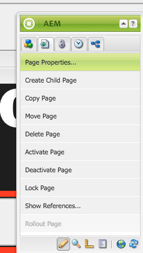

# 調度程式虛擬型URL

[目錄](./overview.md)

[&lt; — 上一個：調度程式刷新](./disp-flushing.md)

## 概觀

本文檔將幫助您瞭解如AEM何處理虛榮URL以及使用重寫規則將內容映射到更靠近交付邊緣的一些附加技術

## 什麼是虛榮URL

當您的內容位於具有合理意義的資料夾結構中時，它並不總是位於易於引用的URL中。  虛榮URL就像快捷方式。  引用真實內容所在位置的較短或唯一URL。

例如： `/aboutus` 指出 `/content/we-retail/us/en/about-us.html`

AEM作者可以選擇在中設定內容的虛榮url屬性並AEM將其發佈。

要使用此功能，您必須調整Dispatcher篩選器，以允許虛榮。  這對於以作者需要設定這些虛榮頁條目的速度調整Dispatcher配置檔案來說變得不合理。

因此，Dispatcher模組具有自動允許內容樹中列為虛榮狀態的任何內容的功能。


## 它的工作原理

### 創作虛榮URL

作者訪問中的某AEM個頁面，訪問頁面屬性，並在虛榮url部分添加條目。

一旦他們保存了更改並激活了頁面，虛榮心現在就會分配給此頁。

#### 觸控式 UI:


#### 經典內容查找器：




<div style="color: #000;border-left: 6px solid #2196F3;background-color:#ddffff;"><b>注：</b>
請瞭解這很容易引起名稱空間問題。

虛榮心條目對所有頁面都是全球性的，這只是你必須為變通辦法做準備的不足之一，我們稍後會解釋其中的一些。
</div>

## 資源解析/映射

每個虛榮項都是用於內部重定向的吊索映射項。

通過訪問Felix控制台實例AEM( `/system/console/jcrresolver` )

下面是由虛榮項建立的地圖項的螢幕快照：


在上例中，當我們要求實AEM例訪問 `/aboutus` 它決心 `/content/we-retail/us/en/about-us.html`

## Dispatcher自動允許篩選器

處於安全狀態的調度程式會過濾路徑上的請求 `/` 因為這是JCR樹的根。

必須確保發佈者僅允許來自 `/content` 和其他安全路徑等。  不像 `/system` 等。

這是你的麻煩，虛榮的小熊就住在 `/` 那麼，我們如何讓他們在保持安全的同時接觸出版商呢？

Simple Dispatcher具有自動篩選允許機制，您必須安裝AEM包，然後將Dispatcher配置為指向該包頁。

[https://experience.adobe.com/#/downloads/content/software-distribution/en/aem.html?package=/content/software-distribution/en/details.html/content/dam/aem/public/adobe/packages/granite/vanityurls-components](https://experience.adobe.com/#/downloads/content/software-distribution/en/aem.html?package=/content/software-distribution/en/details.html/content/dam/aem/public/adobe/packages/granite/vanityurls-components)

Dispatcher在其場檔案中有一個配置節：

```
/vanity_urls { 
    /url    "/libs/granite/dispatcher/content/vanityUrls.html" 
    /file   "/tmp/vanity_urls" 
    /delay  300 
}
```

此配置通知調度程式從其實例獲取此URLAEM，它每300秒就會傳送一次，以獲取我們要允許通過的項的清單。

它將響應的快取儲存在 `/file` 因此在此示例中 `/tmp/vanity_urls`

因此，如果您訪AEM問URI上的實例，您將看到它讀取的內容：


這簡直就是一份清單，非常簡單

## 將規則改寫為虛榮規則

為什麼我們要提到使用重寫規則，而不是如上所述AEM內置的預設機制？

簡單地說明了命名空間問題、效能以及可以更好處理的更高級邏輯。

讓我們來看一個虛榮心條目的例子 `/aboutus` 滿足於 `/content/we-retail/us/en/about-us.html` 使用Apache `mod_rewrite` 模組來完成此操作。

```
RewriteRule ^/aboutus /content/we-retail/us/en/about-us.html [PT,L,NC]
```

這條規則會尋找虛榮心 `/aboutus` 並使用PT標誌（傳遞）從呈現器中獲取完整路徑。

它還將停止處理所有其他規則L標籤（最後），這意味著它不必遍歷像JCR解析必須執行的那樣的大量規則清單。

此外，無需代理請求並等待發佈AEM者響應此方法的這兩個元素，使其效能大大提高。

然後，此處錦上添花的是NC標誌（不區分大小寫），這表示如果客戶使用 `/AboutUs` 而不是 `/aboutus` 它仍然有效，並允許讀取右頁。

要建立重寫規則以執行此操作，您將在Dispatcher上建立配置檔案(示例： `/etc/httpd/conf.d/rewrites/examplevanity_rewrite.rules`)，並將其包含在 `.vhost` 處理需要應用這些虛榮url的域的檔案。

下面是include inside的示例代碼段 `/etc/httpd/conf.d/enabled_vhosts/we-retail.vhost`

```
<VirtualHost *:80> 
 ServerName weretail.com 
 ServerAlias www.weretail.com 
        ........ SNIP ........ 
 <IfModule mod_rewrite.c> 
  ReWriteEngine on 
  LogLevel warn rewrite:info 
  Include /etc/httpd/conf.d/rewrites/examplevanity_rewrite.rules 
 </IfModule> 
        ........ SNIP ........ 
</VirtualHost>
```

## 哪種方法和位置

使用AEM控制虛擬值條目具有以下優點
- 作者可以即時建立它們
- 他們與內容一起生活，並可與內容一起打包

使用 `mod_rewrite` 控制虛榮項具有以下優點
- 更快地解析內容
- 更接近最終用戶內容請求的邊緣
- 更多擴展性和選項以控制內容在其他條件上的映射方式
- 可以不區分大小寫

請同時使用這兩種方法，但以下是建議和標準，在以下情況下可使用：
- 如果虛擬場是臨時的，並且計畫的流量級別較低，則使用AEM內置功能
- 如果虛榮心是不經常更改且經常使用的主要端點，則使用 `mod_rewrite` 規則。
- 如果虛榮名稱空間(例如： `/aboutus`)必須在同一實例上為多個品牌重新使用，AEM然後使用重寫規則。

<div style="color: #000;border-left: 6px solid #2196F3;background-color:#ddffff;"><b>注意:</b>

如果要使用虛榮特AEM徵並避免命名空間，可以制定命名約定。  使用嵌套如 `/brand1/aboutus`。 `brand2/aboutus`。 `brand3/aboutus`。
</div>

[下一步 — >常見日誌記錄](./common-logs.md)
