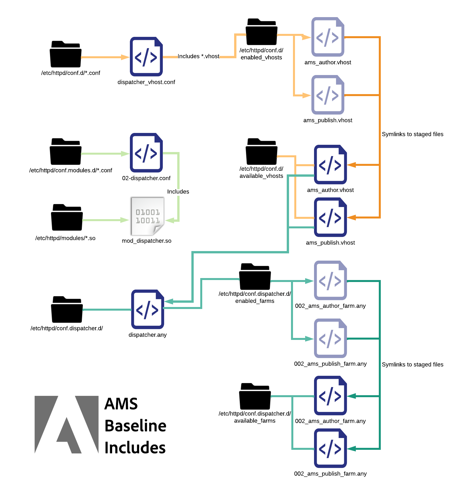

# 設定檔案說明

[目錄](./overview.md)

[&lt; — 上一步：基本檔案配置](./basic-file-layout.md)

本檔案將針對Adobe Managed Services布建的標準內建Dispatcher伺服器中部署的每個設定檔案，進行劃分和說明。 其使用、命名慣例等……

## 命名慣例

使用`Include`或`IncludeOptional`陳述式鎖定檔案為目標時，Apache Web Server實際上並不在乎該檔案的副檔名是什麼。  以能消除衝突與混淆的名稱正確命名這些專案，可協助<b>噸</b>。 使用的名稱會說明套用檔案的範圍，可讓工作更輕鬆。 如果所有專案都命名為`.conf`，這會讓人感到非常困惑。 我們希望避免檔案和副檔名命名不當。  以下是典型AMS設定的Dispatcher中所使用的不同自訂副檔名和命名慣例清單。

## conf.d/中包含的檔案

| 檔案 | 檔案目的地 | 說明 |
| ---- | ---------------- | ----------- |
| 檔案名稱`.conf` | `/etc/httpd/conf.d/` | 預設的Enterprise Linux安裝會使用此副檔名並包含資料夾，作為覆寫httpd.conf中宣告之設定的位置，並可讓您在Apache中的全域層級新增其他功能。 |
| 檔案名稱`.vhost` | 分段： `/etc/httpd/conf.d/available_vhosts/`<br>作用中： `/etc/httpd/conf.d/enabled_vhosts/`<br/><br/><b>注意：</b> .vhost檔案不會複製到enabled_vhosts資料夾，但會使用符號連結指向available_vhosts/\*.vhost檔案的相對路徑</u><br><br> | \*.vhost （虛擬主機）檔案為`<VirtualHosts>`  比對主機名稱的專案，並允許Apache使用不同規則處理每個網域流量。 從`.vhost`檔案中，將會包含其他檔案，例如`rewrites`、`whitelisting`、`etc`。 |
| 檔案名稱`_rewrite.rules` | `/etc/httpd/conf.d/rewrites/` | `*_rewrite.rules`檔案儲存`mod_rewrite`規則，以由`vhost`檔案明確包含和使用 |
| 檔案名稱`_whitelist.rules` | `/etc/httpd/conf.d/whitelists/` | `*_ipwhitelist.rules`個檔案包含在`*.vhost`個檔案中。 它包含IP規則運算式或允許拒絕規則，以允許將IP加入白名單。 如果您嘗試根據IP位址限制虛擬主機的檢視，您將會產生其中一個檔案，並從`*.vhost`檔案包含它 |

## conf.dispatcher.d/中包含的檔案

| 檔案 | 檔案目的地 | 說明 |
| --- | --- | --- |
| 檔案名稱`.any` | `/etc/httpd/conf.dispatcher.d/` | AEM Dispatcher Apache模組從`*.any`個檔案取得其設定。 預設的父包含檔案為`conf.dispatcher.d/dispatcher.any` |
| 檔案名稱`_farm.any` | 已暫存： `/etc/httpd/conf.dispatcher.d/available_farms/`<br>使用中： `/etc/httpd/conf.dispatcher.d/enabled_farms/`<br><br><b>注意：</b>這些伺服器陣列檔案不會複製到`enabled_farms`資料夾，但使用`symlinks`到`available_farms/*_farm.any`檔案<br/>`*_farm.any`的相對路徑，這些檔案包含在`conf.dispatcher.d/dispatcher.any`檔案中。 這些父伺服器陣列檔案可用來控制每個轉譯器或網站型別的模組行為。 在`available_farms`目錄中建立檔案，並在`symlink`目錄中啟用`enabled_farms`。  <br/>它會從`dispatcher.any`檔案依名稱自動包含這些專案。<br/><b>基準</b>伺服器陣列檔案以`000_`開頭，以確定它們會先載入。<br><b>自訂</b>伺服器陣列檔案應該在`100_`開始編號配置之後載入，以確保適當的包含行為。 | |
| 檔案名稱`_filters.any` | `/etc/httpd/conf.dispatcher.d/filters/` | `*_filters.any`個檔案包含在`conf.dispatcher.d/enabled_farms/*_farm.any`個檔案中。 每個陣列都有一組規則，可變更應該篩選掉的流量，而不會讓轉譯器得逞。 |
| 檔案名稱`_vhosts.any` | `/etc/httpd/conf.dispatcher.d/vhosts/` | `*_vhosts.any`個檔案包含在`conf.dispatcher.d/enabled_farms/*_farm.any`個檔案中。 這些檔案是主機名稱或URI路徑的清單，將透過blob比對來判斷要使用哪個轉譯器為該請求提供服務 |
| 檔案名稱`_cache.any` | `/etc/httpd/conf.dispatcher.d/cache/` | `*_cache.any`個檔案包含在`conf.dispatcher.d/enabled_farms/*_farm.any`個檔案中。 這些檔案指定快取和不快取的專案 |
| 檔案名稱`_invalidate_allowed.any` | `/etc/httpd/conf.dispatcher.d/cache/` | `*_invalidate_allowed.any`個檔案包含在`conf.dispatcher.d/enabled_farms/*_farm.any`個檔案中。 它們會指定允許哪些IP位址傳送排清和失效請求。 |
| 檔案名稱`_clientheaders.any` | `/etc/httpd/conf.dispatcher.d/clientheaders/` | `*_clientheaders.any`個檔案包含在`conf.dispatcher.d/enabled_farms/*_farm.any`個檔案中。 它們會指定要將哪些使用者端標題傳遞至每個轉譯器。 |
| 檔案名稱`_renders.any` | `/etc/httpd/conf.dispatcher.d/renders/` | `*_renders.any`個檔案包含在`conf.dispatcher.d/enabled_farms/*_farm.any`個檔案中。 它們為每個轉譯器指定IP、連線埠和逾時設定。 適當的轉譯器可以是Livecycle伺服器或Dispatcher可從中擷取/代理請求的任何AEM系統 |

## 已避免的問題

遵循命名慣例時，您可以避免某些容易犯的錯誤，這些錯誤可能造成災難性的結果。  我們將介紹一些範例。

### 問題範例

作為網站範例（如ExampleCo），兩個設定檔案是由Dispatcher設定的開發人員建立的。

<b>/etc/httpd/conf.d/exampleco.conf</b>

```
<VirtualHost *:80> 
    ServerName  "exampleco" 
    ServerAlias "www.exampleco.com" 
    .......... SNIP ............... 
    <IfModule mod_rewrite.c> 
        ReWriteEngine   on 
        LogLevel warn rewrite:trace1 
        Include /etc/httpd/conf.d/rewrites/exampleco.conf 
    </IfModule> 
</VirtualHost>
```

<b>/etc/httpd/conf.d/rewrites/exampleco.conf</b>

```
RewriteRule ^/$ /content/exampleco/en.html [PT,L] 
RewriteRule ^/robots.txt$ /content/dam/exampleco/robots.txt [PT,L]
```

#### `POTENTIAL DANGER - The file names are the same`

如果意外將`vhost`檔案放入`rewrites`資料夾，而將`rewrites file`放入`vhosts`資料夾。  檔案名稱似乎已正確部署，但Apache會擲回&#x200B;*錯誤*，而且問題不會立即顯現。

<b>這會如何變成問題</b>

如果將`two files`下載到`same`位置，他們可以`overwrite themselves`，或使其無法區分，使部署程式變成噩夢。

<b>檔案副檔名相同且容易自動加入</b>

檔案副檔名相同，且使用自動包含的副檔名，Apache會在許多預設資料夾中`auto include`任何`.conf`檔案。

<b>這會如何變成問題</b>

如果將副檔名為`.conf`的vhost檔案放入`/etc/httpd/conf.d/`資料夾，它會嘗試將它載入Apache上的記憶體（通常沒問題），但如果將副檔名為`.conf`的重寫規則檔案放入`/etc/httpd/conf.d/`資料夾，則會自動加入並套用至全域，造成混淆和不想要的結果。

## 解決方法

根據檔案的操作，在安全離開自動包含規則名稱空間的情況下將其命名。

如果是虛擬主機檔案名稱，則以`.vhost`作為副檔名。

如果是重寫規則檔案，請以site`_rewrite.rules`作為尾碼和副檔名來命名。 此命名慣例會清楚說明該網站用於哪個網站，且這是一組重寫規則。

如果是IP白名單規則檔案，請將其描述命名為`_whitelist.rules`作為尾碼和副檔名。 此命名慣例會提供其用途的說明，並指出這是一組IP比對規則。

如果檔案移至其不所屬的自動包含目錄，使用這些命名慣例可避免問題。

例如，將名為`.rules`、`.any`或`.vhost`的檔案放置在`/etc/httpd/conf.d/`的自動包含資料夾中不會有任何影響。

如果部署變更請求顯示「請將exampleco_rewrite.rules部署到生產Dispatcher」，則部署變更的人員可能已經知道他們不會新增網站，他們只是更新檔案名稱所指示的重寫規則。

### 包含訂單

在Enterprise Linux上安裝的Apache Webserver中擴充功能與設定時，您有一些重要的包含訂單，您會想要瞭解這些訂單

### Apache基準線包括


如上圖所示，httpd二進位檔案只會將httpd.conf檔案視為其設定檔案。  該檔案包含下列陳述式：

```
Include conf.modules.d/*.conf 
IncludeOptional conf.d/*.conf
```

### AMS最上層包含

當我們套用標準時，我們新增了一些其他檔案型別，並包含我們自己的檔案型別。

以下是AMS基準目錄和最上層包含
中的實際組態檔的符號連結

以Apache的基準為基礎，我們顯示AMS如何為`conf.d`個資料夾以及巢狀在`/etc/httpd/conf.dispatcher.d/`下的模組特定目錄建立一些其他資料夾和頂層包含

當Apache載入時，它會提取`/etc/httpd/conf.modules.d/02-dispatcher.conf`，而該檔案會將二進位檔案`/etc/httpd/modules/mod_dispatcher.so`納入其執行狀態。

```
LoadModule dispatcher_module modules /mod_dispatcher .so
```

若要在`<VirtualHost />`中使用模組，我們將設定檔拖放至名為`/etc/httpd/conf.d/`的`dispatcher_vhost.conf`中，在此檔案中，您會看到使用設定模組運作所需的基本引數：

```
<IfModule disp_apache2.c> 
    DispatcherConfig conf.dispatcher.d/dispatcher.any 
    ...SNIP... 
</IfModule>
```

如上所示，這包含最上層`dispatcher.any`檔案，供我們的Dispatcher模組從`/etc/httpd/conf.dispatcher.d/dispatcher.any`擷取其組態檔

請注意此檔案的內容：

```
/farms { 
    $include "enabled_farms/*_farm.any" 
}
```

最上層`dispatcher.any`檔案包含所有在`/etc/httpd/conf.dispatcher.d/enabled_farms/`中且檔案名稱為`FILENAME_farm.any`且遵循標準命名慣例的已啟用伺服器陣列檔案。

稍後在先前提到的`dispatcher_vhost.conf`檔案中，我們也會執行Include陳述式，以啟用每個在`/etc/httpd/conf.d/enabled_vhosts/`中啟用的虛擬主機檔案（檔案名稱為`FILENAME.vhost`），這些檔案會遵循我們的標準命名慣例。

```
IncludeOptional /etc/httpd/conf.d/enabled_vhosts/*.vhost
```

在每個.vhost檔案中，您會注意到Dispatcher模組已初始化為目錄的預設檔案處理常式。  以下是顯示語法的範例.vhost檔案：

```
<VirtualHost *:80> 
 ServerName "weretail" 
 ServerAlias www.weretail.com weretail.com 
 <Directory /> 
  <IfModule disp_apache2.c> 
   ....SNIP.... 
   SetHandler dispatcher-handler 
  </IfModule> 
  ....SNIP.... 
 </Directory> 
 ....SNIP.... 
</VirtualHost>
```

在頂層包含解析後，他們還有值得一提的其他子包含。  以下是有關陣列和vhosts檔案如何包含其他子元素的高階圖表

### AMS虛擬主機包含


當來自`.vhost`目錄的任何`/etc/httpd/conf.d/availabled_vhosts/`檔案被符號連結到`/etc/httpd/conf.d/enabled_vhosts/`目錄時，它們將被用於執行組態中。

`.vhost`個檔案具有根據我們找到之共同片段的Sub Include。  變數、白名單和重寫規則等。

`.vhost`檔案將根據每個檔案需要包含在`.vhost`檔案中的位置，為其包含include陳述式。  以下是`.vhost`檔案的語法範例，作為良好參考：

```
Include /etc/httpd/conf.d/variables/weretail.vars 
<VirtualHost *:80> 
 ServerName "${MAIN_DOMAIN}" 
 <Directory /> 
  Include /etc/httpd/conf.d/whitelists/weretail*_whitelist.rules 
  <IfModule disp_apache2.c> 
   ....SNIP.... 
   SetHandler dispatcher-handler 
  </IfModule> 
  ....SNIP.... 
 </Directory> 
 ....SNIP.... 
 <IfModule mod_rewrite.c> 
  ReWriteEngine   on 
  LogLevel warn rewrite:trace1 
  Include /etc/httpd/conf.d/rewrites/weretail_rewrite.rules 
 </IfModule> 
</VirtualHost>
```

如上面的範例所示，此設定檔案中需要納入的變數稍後會使用。

在檔案`/etc/httpd/conf.d/variables/weretail.vars`內，我們可以看到已定義哪些變數：

```
Define MAIN_DOMAIN dev.weretail.com
```

您也可以看到包含`_whitelist.rules`個檔案清單的一行，該清單會根據不同的白名單條件限制誰可以檢視此內容。  讓我們檢視其中一個白名單檔案`/etc/httpd/conf.d/whitelists/weretail_mainoffice_whitelist.rules`的內容：

```
<RequireAny> 
  Require ip 192.150.16.0/23 
</RequireAny>
```

您也可以看到包含一組重寫規則的行。  讓我們看看`weretail_rewrite.rules`檔案的內容：

```
RewriteRule ^/robots.txt$ /content/dam/weretail/robots.txt [NC,PT] 
RewriteCond %{SERVER_NAME} brand1.weretail.net [NC] 
RewriteRule ^/favicon.ico$ /content/dam/weretail/favicon.ico [NC,PT] 
RewriteCond %{SERVER_NAME} brand2.weretail.com [NC] 
RewriteRule ^/sitemap.xml$ /content/weretail/general/sitemap.xml [NC,PT] 
RewriteRule ^/logo.jpg$ /content/dam/weretail/general/logo.jpg [NC,PT]
```

### AMS伺服器陣列包含


當來自`/etc/httpd/conf.dispatcher.d/available_farms/`目錄的任何FILENAME_farm.any檔案被符號連結到`/etc/httpd/conf.dispatcher.d/enabled_farms/`目錄時，它們將被用於執行組態中。

伺服器陣列檔案具有以[伺服器陣列](https://experienceleague.adobe.com/docs/experience-manager-dispatcher/using/configuring/dispatcher-configuration.html?lang=zh-Hant#defining-farms-farms)的最上層區段為基礎的子包含，例如快取、clientheaders、篩選器、轉譯器和vhosts。

`FILENAME_farm.any`檔案會根據每個檔案需要包含在伺服器陣列檔案中的位置，為其包含include陳述式。  以下是`FILENAME_farm.any`檔案的語法範例，作為良好參考：

```
/weretailfarm {   
 /clientheaders { 
  $include "/etc/httpd/conf.dispatcher.d/clientheaders/ams_publish_clientheaders.any" 
  $include "/etc/httpd/conf.dispatcher.d/clientheaders/ams_common_clientheaders.any" 
 } 
 /virtualhosts { 
  $include "/etc/httpd/conf.dispatcher.d/vhosts/weretail_vhosts.any" 
 } 
 /renders { 
  $include "/etc/httpd/conf.dispatcher.d/renders/ams_publish_renders.any" 
 } 
 /filter { 
  $include "/etc/httpd/conf.dispatcher.d/filters/ams_publish_filters.any" 
  $include "/etc/httpd/conf.dispatcher.d/filters/weretail_search_filters.any" 
 } 
 ....SNIP.... 
 /cache { 
  ....SNIP.... 
  /rules { 
   $include "/etc/httpd/conf.dispatcher.d/cache/ams_publish_cache.any" 
  } 
  ....SNIP.... 
  /allowedClients { 
   /0000 { 
    /glob "*.*.*.*" 
    /type "deny" 
   } 
   $include "/etc/httpd/conf.dispatcher.d/cache/ams_publish_invalidate_allowed.any" 
  } 
 ....SNIP.... 
 } 
}
```

您可以看到Weretail陣列的每個區段，沒有所需的所有語法，而是使用Include陳述式。

讓我們來看看這幾項包含的語法，以瞭解每個子包含的外觀

`/etc/httpd/conf.dispatcher.d/vhosts/weretail_publish_vhosts.any`：

```
"brand1.weretail.com" 
"brand2.weretail.com" 
"www.weretail.comf"
```

如您所見，這是應以換行方式分隔的網域名稱清單，應從此伺服器陣列呈現，而不是其他伺服器陣列。

接下來，讓我們檢視`/etc/httpd/conf.dispatcher.d/filters/weretail_search_filters.any`：

```
/400 { /type "allow" /method "GET" /path "/bin/weretail/lists/*" /extension "json" } 
/401 { /type "allow" /method "POST" /path "/bin/weretail/search/' /extension "html" }
```

[下一個 — >瞭解快取](./understanding-cache.md)
