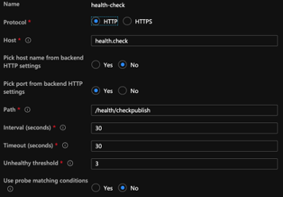

# AMS Dispatcher健康情況檢查

[目錄](./overview.md)

[&lt; — 上一步：唯讀檔案](./immutable-files.md)

安裝AMS基準線後，Dispatcher會隨附一些免費贈品。  其中一項功能是一組健康情況檢查指令碼。
這些指令碼可讓前端AEM棧疊的負載平衡器知道哪些腿狀況良好並保持其運作。


## 基本負載平衡器健康狀態檢查

當客戶流量透過網際網路到達您的AEM執行個體時，他們將透過負載平衡器


通過負載平衡器的每個請求都會將robin循環到每個執行個體。  負載平衡器已內建健康情況檢查機制，以確保它將流量傳送至健康的主機。

預設檢查通常是連線埠檢查，以檢視負載平衡器中鎖定的伺服器是否接聽連線埠流量進入（即TCP 80和443）

> `Note:` 雖然此功能可運作，但AEM是否運作狀況良好，沒有實際的測量結果。  它只會測試Dispatcher (Apache Web Server)是否啟動並執行。

## AMS健康情況檢查

為避免將流量傳送給遇到不健康的AEM執行個體的狀況良好的Dispatcher，AMS建立了一些額外專案來評估Leg的健康狀況，而不只是Dispatcher。


健康情況檢查包含下列片段
- 1 `Load balancer`
- 1 `Apache web server`
- 3 `Apache *VirtualHost* config files`
- 5 `CGI-Bin scripts`
- 1 `AEM instance`
- 1 `AEM package`

我們將說明每個專案的設定及其重要性

### AEM套件

若要指示AEM是否正常運作，您需要它執行一些基本頁面編譯並提供頁面。  Adobe Managed Services已建立包含測試頁面的基本套件。  頁面會測試存放庫是否啟動，以及資源與頁面範本是否可呈現。


以下是頁面。  它會顯示安裝的存放庫ID


> `Note:` 我們確定頁面不可快取。  如果每次傳回快取頁面時，都不會檢查實際狀態！

這是我們可以測試的輕量端點，以檢視AEM是否正常運作。

### 負載平衡器設定

我們將負載平衡器設定為指向CGI-BIN端點，而不使用連線埠檢查。




### Apache健康情況檢查虛擬主機

#### CGI-BIN虛擬主機 `(/etc/httpd/conf.d/available_vhosts/ams_health.vhost)`

這是 `<VirtualHost>` 可執行CGI-Bin檔案的Apache設定檔。

```
Listen 81
<VirtualHost *:81>
    ServerName	"health"
    ...SNIP...
    ScriptAlias /health/ "/var/www/cgi-bin/health/"
</VirtualHost>
```

> `Note:` cgi-bin檔案是可執行的指令碼。  這可能是一個易受攻擊的攻擊向量，並且AMS使用的這些指令碼無法公開存取，只能供負載平衡器測試。


#### 維護不健全的虛擬主機

- `/etc/httpd/conf.d/available_vhosts/000_unhealthy_author.vhost`
- `/etc/httpd/conf.d/available_vhosts/000_unhealthy_publish.vhost`

這些檔案已命名 `000_` 作為字首。  其原本設定為使用與即時網站相同的網域名稱。  其目的是讓此檔案在健康情況檢查偵測到其中一個AEM後端發生問題時啟用。  然後提供錯誤頁面，而不只是沒有頁面的503 HTTP回應代碼。  它會竊取正常情況下的流量 `.vhost` 檔案，因為它是在該檔案之前載入 `.vhost` 檔案共用相同檔案 `ServerName` 或 `ServerAlias`.  導致目的地為特定網域的頁面移至不正常的主機，而不是正常流量流經的預設主機。

健康情況檢查指令碼執行時，會登出目前的健康情況狀態。  每分鐘一次，伺服器上會執行一個cronjob，在記錄中尋找不健康的專案。  如果偵測到作者AEM執行個體狀況不良，則會啟用符號連結：

記錄專案：

```
# grep "ERROR\|publish" /var/log/lb/health_check.log
E, [2022-11-23T20:13:54.984379 #26794] ERROR -- : AUTHOR -- Exception caught: Connection refused - connect(2)
I, [2022-11-23T20:13:54.984403 #26794]  INFO -- : [checkpublish]-author:0-publish:1-[checkpublish]
```

Cron發現錯誤並做出反應：

```
# grep symlink /var/log/lb/health_check_reload.log
I, [2022-11-23T20:34:19.213179 #2275]  INFO -- : ADDING VHOST symlink /etc/httpd/conf.d/available_vhosts/000_unhealthy_author.vhost => /etc/httpd/conf.d/enabled_vhosts/000_unhealthy_author.vhost
```

您可以透過在中設定重新載入模式設定，來控制作者或已發佈網站是否可載入此錯誤頁面 `/var/www/cgi-bin/health_check.conf`

```
# grep RELOAD_MODE /var/www/cgi-bin/health_check.conf
RELOAD_MODE='author'
```

有效選項：
- 作者
   - 這是預設選項。
   - 這會在作者狀況不佳時為其建立維護頁面
- 發佈
   - 此選項會在publisher狀況不良時為其建立維護頁面
- 全部
   - 此選項會為作者或發佈者（或兩者）建立維護頁面（如果它們變得不正常）
- 無
   - 此選項會略過健康狀態檢查的這個功能

若檢視 `VirtualHost` 針對這些專案設定時，您會看到它們載入相同的檔案，作為啟用時每個請求的錯誤頁面：

```
<VirtualHost *:80>
	ServerName	unhealthyauthor
	ServerAlias	${AUTHOR_DEFAULT_HOSTNAME}
	ErrorDocument	503 /error.html
	DocumentRoot	/mnt/var/www/default
	<Directory />
		Options FollowSymLinks
		AllowOverride None
	</Directory>
	<Directory "/mnt/var/www/default">
		AllowOverride None
		Require all granted
	</Directory>
	<IfModule mod_headers.c>
		Header always add X-Dispatcher ${DISP_ID}
		Header always add X-Vhost "unhealthy-author"
	</IfModule>
	<IfModule mod_rewrite.c>
		ReWriteEngine   on
		RewriteCond %{REQUEST_URI} !^/error.html$
		RewriteRule ^/* /error.html [R=503,L,NC]
	</IfModule>
</VirtualHost>
```

回應代碼仍為 `HTTP 503`

```
# curl -I https://we-retail.com/
HTTP/1.1 503 Service Unavailable
X-Dispatcher: dispatcher1useast1
X-Vhost: unhealthy-author
```

他們將會取得此頁面，而不是空白頁面。


### CGI-Bin指令碼

您的CSE可以在負載平衡器設定中設定5個不同的指令碼，這些指令碼會變更將Dispatcher提取出負載平衡器的行為或條件。

#### /bin/checkauthor

此指令碼在使用時會檢查並記錄其前面的任何執行個體，但只有在 `author` AEM執行個體狀況不良

> `Note:` 請記住，如果發佈AEM執行個體不正常，Dispatcher將保留服務以允許流量流向創作AEM執行個體

#### /bin/checkpublish （預設）

此指令碼在使用時會檢查並記錄其前面的任何執行個體，但只有在 `publish` AEM執行個體狀況不良

> `Note:` 請記住，如果編寫AEM執行個體不正常，Dispatcher將保留在服務中以允許流量流向發佈AEM執行個體

#### /bin/checkeither

此指令碼在使用時會檢查並記錄其前面的任何執行個體，但只有在 `author` 或 `publisher` AEM執行個體狀況不良

> `Note:` 請記住，如果發佈AEM執行個體或編寫AEM執行個體不正常，Dispatcher會退出服務。  這表示如果其中一個變數正常，也不會收到流量

#### /bin/checkboth

此指令碼在使用時會檢查並記錄其前面的任何執行個體，但只有在 `author` 和 `publisher` AEM執行個體狀況不良

> `Note:` 請記住，如果發佈AEM執行個體或編寫AEM執行個體不正常，Dispatcher不會退出服務。  這表示如果其中一個不健康，就會繼續收到流量，並給要求資源的人造成錯誤。

#### /bin/healthy

使用此指令碼時，會檢查並記錄其目前所在的任何執行個體，但無論AEM是否傳回錯誤，都會正常傳回。

> `Note:` 健康情況檢查無法如預期運作，且允許覆寫將AEM執行個體保留在負載平衡器時，會使用此指令碼。

[下一頁 — > GIT符號連結](./git-symlinks.md)
