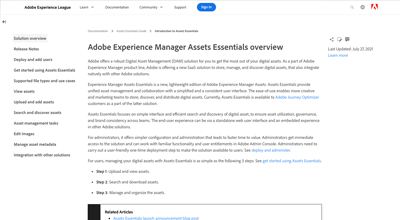

# Assets Essentials影片

Experience Manager Assets Essentials提供簡化的使用者介面，用於輕量版的資產管理和共同作業。

請觀看這些影片，瞭解如何使用Assets Essentials管理您的資產，以及如何將其與Adobe Journey Orchestrator整合！

## 進一步瞭解Assets Essentials

<table>
<td>
   
   

      <a href="./basics/managing.md">
      <strong>Assets Essentials快速入門</strong>
      </a>
   

   

      <em>瞭解Assets Essentials的基本概念！</em>
   

</td>
<td>
   
   

      <a href="https://experienceleague.adobe.com/docs/experience-manager-assets-essentials/help/introduction.html">
      <strong>Assets Essentials檔案</strong>
      </a>
   

   

      <em>請檢視Assets Essentials產品檔案！</em>
   

</td>
<td>
   
   

      <a href="https://experienceleague.adobe.com/docs/journey-optimizer-learn/tutorials/create-messages/create-email-content-with-the-message-editor.html">
      <strong>Adobe Journey Optimizer整合</strong>
      </a>
   

   

      <em>瞭解Assets Essentials如何與Adobe Journey Optimizer整合！</em>
   

</td>
</table>
