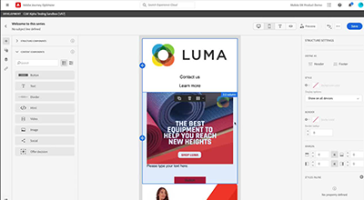

# Assets Essentials 影片

Experience Manager Assets Essentials 提供簡化的使用者介面，可進行簡易的資產管理和共同作業。

觀看這些影片，了解如何使用 Assets Essentials 管理資產，以及其如何與 Adobe Workfront 和 Adobe Journey Orchestrator 整合！

## 了解更多關於 Assets Essentials 的資訊

<table>
<td>
   
   

      <a href="./basics/managing.md">
      <strong>Assets Essentials 快速入門</strong>
      </a>
   

   

      <em>了解 Assets Essentials 的基礎知識！</em>
   

</td>
<td>
   
   

      <a href="https://experienceleague.adobe.com/docs/experience-manager-assets-essentials/help/introduction.html?lang=zh-Hant">
      <strong>Assets Essentials 文件</strong>
      </a>
   

   

      <em>查看 Assets Essentials 產品文件！</em>
   

</td>
<td>
   
   

      <a href="https://experienceleague.adobe.com/docs/journey-optimizer-learn/tutorials/create-messages/create-email-content-with-the-message-editor.html?lang=zh-Hant">
      <strong>Adobe Journey Optimizer 整合</strong>
      </a>
   

   

      <em>了解 Assets Essentials 如何與 Adobe Journey Optimizer 整合！</em>
   

</td>
</table>
