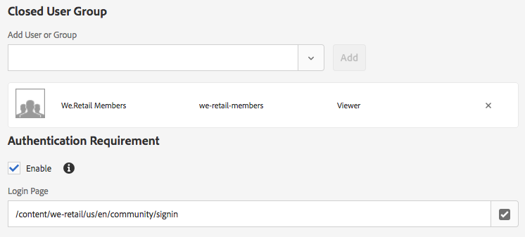

# 搭配AEM資產使用已關閉的使用者群組{#using-closed-user-groups-with-aem-assets}

「封閉使用者群組」(CUG)是一種功能，可用來限制對發佈網站上特定使用者群組的內容存取。 此影片說明如何搭配Adobe Experience Manager Assets使用「已關閉的使用者群組」，以限制對特定資產資料夾的存取。 AEM 6.4首次推出「使用AEM資產的封閉使用者群組」支援。

>[!VIDEO](https://video.tv.adobe.com/v/22155?quality=9&learn=on)

## 含AEM資產的封閉使用者群組(CUG)

* 設計為限制AEM Publish例項上資產的存取權。
* 授予一組使用者／群組的讀取存取權。
* CUG只能在資料夾級別配置。 CUG無法設定在個別資產上。
* 任何子資料夾和套用的資產會自動繼承CUG原則。
* 通過設定新的CUG策略，子資料夾可以覆蓋CUG策略。 應謹慎使用，不視為最佳實務。

## JCR中的CUG表示 {#cug-representation-in-the-jcr}



We.Retail成員群組新增為「已關閉的使用者群組」至資料夾：/content/dam/we-retail/tw/beta-products

混合的 **rep:CugMixin** 套用至 **/content/dam/we-retail/en/beta-products資料夾** 。 資料夾 **下面添加了rep:cugPolicy** 的節點，並將we-retail-members指定為承擔者。 另一組 **granite:AuthenticationRequired** 會套用至beta-products資料夾，而屬性** granite:loginPath**會指定在使用者未經過驗證並嘗試請求 **** beta-products資料夾下的資產時要使用的登入頁面。

JCR說明如下：

```xml
/beta-products
    - jcr:primaryType = sling:Folder
    - jcr:mixinTypes = rep:CugMixin, granite:AuthenticationRequired
    - granite:loginPath = /content/we-retail/us/en/community/signin
    + rep:cugPolicy
         - jcr:primaryType = rep:CugPolicy
         - rep:principalNames = we-retail-members
```

## 已關閉的用戶組與訪問控制清單 {#closed-user-groups-vs-access-control-lists}

「已關閉的使用者群組(CUG)」和「存取控制清單(ACL)」都可用來控制AEM中內容的存取權，並以AEM Security使用者和群組為基礎。 但是這些功能的應用和實現卻大不相同。 下表總結了兩個特徵之間的區別。

|  | ACL | CUG |
| ----------------- | -------------------------------------------------------------------------------------------------------------------------------- | ----------------------------------------------------------------------------------------------------------------------------- |
| 預期用途 | 設定並套用目前 **AEM例項上內容的權** 限。 | 在AEM作者例項上設定內容的CUG **原則** 。 在AEM **publish實例上套用** CUG原則。 |
| 權限層級 | 定義所有層級的使用者／群組已授與／拒絕權限：讀取、修改、建立、刪除、讀取ACL、編輯ACL、複製。 | 授予一組使用者／群組的讀取存取權。 拒絕對所有其他用戶／組的讀取訪問。 |
| 複寫 | ACL不與內容複製。 | CUG策略與內容一起複製。 |

## 支援連結 {#supporting-links}

* [管理資產和已關閉的使用者群組](https://helpx.adobe.com/experience-manager/6-5/assets/using/managing-assets-touch-ui.html#ClosedUserGroup)
* [建立已關閉的使用者群組](https://helpx.adobe.com/experience-manager/6-5/sites/administering/using/cug.html)
* [Oak Closed使用者群組檔案](https://jackrabbit.apache.org/oak/docs/security/authorization/cug.html)
