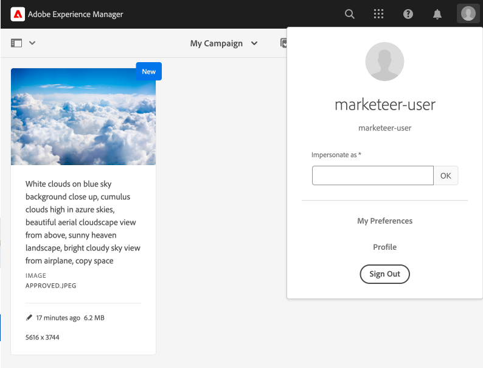

# 中繼資料導向的許可權{#metadata-driven-permissions}

中繼資料導向許可權是一項功能，可讓AEM Assets Author的存取控制決定以資產中繼資料屬性為基礎，而非檔案夾結構。 透過此功能，您可以定義存取控制原則來評估屬性，例如資產狀態、型別或任何您定義的自訂中繼資料屬性。

讓我們來看一個範例。 創意人員將其工作上傳至AEM Assets至行銷活動相關資料夾，可能是未獲核准使用的進行中資產。 我們希望確保行銷人員只看見此行銷活動的已核准資產。 我們可以運用中繼資料屬性，指出資產已核准，且可供行銷人員使用。

## 運作方式

啟用中繼資料導向許可權涉及定義哪些資產中繼資料屬性將驅動存取限制，例如「狀態」或「品牌」。 然後，這些屬性可用於建立存取控制專案，以指定哪些使用者群組有權存取具有特定屬性值的資產。

## 先決條件

若要設定中繼資料導向的許可權，必須存取更新至最新版本的AEMas a Cloud Service環境。


## 開發步驟

若要實作中繼資料導向的許可權：

1. 決定哪些資產中繼資料屬性將用於存取控制。 在我們的案例中，這會是名為的屬性 `status`.
1. 建立OSGi設定 `com.adobe.cq.dam.assetmetadatarestrictionprovider.impl.DefaultRestrictionProviderConfiguration.cfg.json` 在您的專案中。
1. 將下列JSON貼到建立的檔案中

   ```json
   {
     "restrictionPropertyNames":[
       "status"
     ],
     "restrictionPaths":[
       "/content/dam"
     ]
   }
   ```

1. 將屬性名稱和限制路徑取代為所需值。


新增限制型存取控制專案之前，應先新增頂層專案，以首先拒絕受限於資產（例如「貢獻者」或類似專案）許可權評估的所有群組的讀取存取：

1. 導覽至「工具→安全性→許可權」畫面
1. 選取「貢獻者」群組（或所有使用者群組所屬的其他自訂群組）
1. 按一下畫面右上角的「新增ACE」
1. 為路徑選取/content/dam
1. 輸入jcr：read以取得許可權
1. 選取拒絕許可權型別
1. 在「限制」下，選取rep：ntNames並輸入dam：Asset作為限制值
1. 按一下「儲存」


現在可以新增存取控制專案，以根據資產中繼資料屬性值授予使用者群組讀取存取權。

1. 導覽至「工具→安全性→許可權」畫面
1. 選取所需的群組
1. 按一下畫面右上角的「新增ACE」
1. 選取/content/dam （或子資料夾）作為路徑
1. 輸入jcr：read以取得許可權
1. 選取「允許許可權型別」
1. 在限制下，選取其中一個已設定的資產中繼資料屬性名稱（此處將包含OSGi設定中定義的屬性）
1. 在「限制值」欄位中輸入必要的中繼資料屬性值
1. 按一下「+」圖示，將限制新增至存取控制專案
1. 按一下「儲存」


範例資料夾包含一些資產。


設定許可權並相應地設定資產中繼資料屬性後，使用者（在此案例中為行銷人員使用者）將只會看到核准的資產。



## 優點與考量事項

中繼資料導向許可權的優點包括：

- 根據特定屬性對資產存取進行微調控制。
- 將存取控制原則與檔案夾結構分離，讓資產組織更具彈性。
- 能夠根據多個中繼資料屬性定義複雜的存取控制規則。

>[!NOTE]
>
> 請務必注意：
> 
> - 中繼資料屬性會根據使用字串等同性的限制進行評估（其他尚未支援的資料型別，例如日期）
> - 若要允許限制屬性有多個值，可以從「選取型別」下拉式清單中選取相同屬性，並輸入新的限制值(例如 `status=approved`， `status=wip`)並按一下「+」以新增專案限制
> 
> - 單一「存取控制專案」中具有多種限制，且屬性名稱不同(例如： `status=approved`， `brand=Adobe`)將評估為AND條件，也就是說，選取的使用者群組將被授與資產的讀取存取權， `status=approved AND brand=Adobe`
> 
> - 新增具有中繼資料屬性限制的存取控制專案將會建立專案的OR條件，例如，具有限制的單一專案 `status=approved` 和單一專案，包含 `brand=Adobe` 將會評估為 `status=approved OR brand=Adobe`
> 
