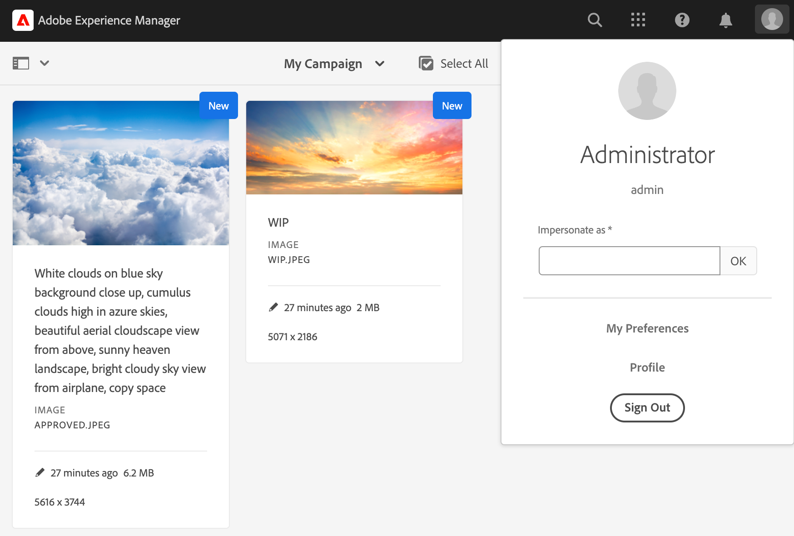

# 中繼資料導向的許可權{#metadata-driven-permissions}

中繼資料導向許可權是一項功能，可讓AEM Assets Author的存取控制決定以資產內容或中繼資料屬性為依據，而非檔案夾結構。 透過此功能，您可以定義存取控制原則以評估屬性，例如資產狀態、型別或您定義的任何自訂屬性。

讓我們來看一個範例。 創意人員將其工作上傳至AEM Assets至行銷活動相關資料夾，可能是未獲核准使用的進行中資產。 我們希望確保行銷人員只看見此行銷活動的已核准資產。 我們可以使用中繼資料屬性來指出資產已核准，且可供行銷人員使用。

## 運作方式

啟用中繼資料導向許可權涉及定義哪些資產內容或中繼資料屬性將驅動存取限制，例如「狀態」或「品牌」。 然後，這些屬性可用於建立存取控制專案，以指定哪些使用者群組有權存取具有特定屬性值的資產。

## 先決條件

若要設定中繼資料導向的許可權，必須存取更新至最新版本的AEM as a Cloud Service環境。

## OSGi設定 {#configure-permissionable-properties}

若要實作中繼資料導向許可權，開發人員必須將OSGi設定部署至AEM as a Cloud Service，此設定可啟用特定資產內容或中繼資料屬性，以支援中繼資料導向許可權。

1. 決定哪些資產內容或中繼資料屬性將用於存取控制。 屬性名稱是資產`jcr:content`或`jcr:content/metadata`資源上的JCR屬性名稱。 在我們的案例中，它將是一個名為`status`的屬性。
1. 在您的AEM Maven專案中建立OSGi設定`com.adobe.cq.dam.assetmetadatarestrictionprovider.impl.DefaultRestrictionProviderConfiguration.cfg.json`。
1. 將下列JSON貼到建立的檔案中：

   ```json
   {
     "restrictionPropertyNames":[
       "status",
       "brand"
     ],
     "restrictionContentPropertyNames":[],
     "enabled":true
   }
   ```

1. 以必要的值取代屬性名稱。  `restrictionContentPropertyNames`設定屬性是用來啟用`jcr:content`資源屬性的許可權，而`restrictionPropertyNames`設定屬性是啟用資產`jcr:content/metadata`資源屬性的許可權。

## 重設基本資產許可權

新增限制型存取控制專案之前，應先新增頂層專案，以首先拒絕受Assets許可權評估的所有群組（例如「貢獻者」或類似專案）的讀取存取：

1. 瀏覽至&#x200B;__工具→安全性→許可權__&#x200B;畫面
1. 選取&#x200B;__參與者__&#x200B;群組（或所有使用者群組所屬的其他自訂群組）
1. 按一下熒幕右上角的&#x200B;__新增ACE__
1. 為&#x200B;__路徑__&#x200B;選取`/content/dam`
1. 輸入&#x200B;__許可權__&#x200B;的`jcr:read`
1. 選取&#x200B;__許可權型別__&#x200B;的`Deny`
1. 在[限制]下，選取`rep:ntNames`並輸入`dam:Asset`作為&#x200B;__限制值__
1. 按一下&#x200B;__儲存__


## 透過中繼資料授予資產存取權

現在可以新增存取控制專案，以根據[設定的資產中繼資料屬性值](#configure-permissionable-properties)授予使用者群組的讀取存取權。

1. 瀏覽至&#x200B;__工具→安全性→許可權__&#x200B;畫面
1. 選取應具備資產存取權的使用者群組
1. 按一下熒幕右上角的&#x200B;__新增ACE__
1. 選取&#x200B;__路徑__&#x200B;的`/content/dam` （或子資料夾）
1. 輸入&#x200B;__許可權__&#x200B;的`jcr:read`
1. 選取&#x200B;__許可權型別__&#x200B;的`Allow`
1. 在&#x200B;__限制__&#x200B;下，選取OSGi設定](#configure-permissionable-properties)中設定的[個資產中繼資料屬性名稱之一
1. 在&#x200B;__限制值__&#x200B;欄位中輸入必要的中繼資料屬性值
1. 按一下&#x200B;__+__&#x200B;圖示，將限制新增至存取控制專案
1. 按一下&#x200B;__儲存__


## 有效中繼資料導向許可權

範例資料夾包含一些資產。



設定許可權並據此設定資產中繼資料屬性後，使用者（在此案例中為行銷人員使用者）將只會看到核准的資產。


## 優點與考量事項

中繼資料導向許可權的優點包括：

- 根據特定屬性對資產存取進行微調控制。
- 將存取控制原則與檔案夾結構分離，讓資產組織更具彈性。
- 能夠根據多個內容或中繼資料屬性定義複雜的存取控制規則。

>[!NOTE]
>
> 請務必注意：
> 
> - 使用&#x200B;__字串等同性__ (`=`) (尚未支援其他資料型別或運運算元，大於(`>`)或日期屬性)來針對限制評估屬性
> - 若要允許限制屬性有多個值，可以從[選取型別]下拉式選單中選取相同的屬性，然後輸入新的限制值（例如`status=approved`、`status=wip`），再按一下[+]將限制新增至專案，以新增其他限制至存取控制專案
> 
> - 支援&#x200B;__AND限制__，透過具有不同屬性名稱（例如`status=approved`、`brand=Adobe`）的單一Access Control專案中的多重限制，將評估為AND條件，亦即，選取的使用者群組將被授與具有`status=approved AND brand=Adobe`之資產的讀取存取權
> 
> - 新增具有中繼資料屬性限制的存取控制專案，可支援&#x200B;__OR限制__，為專案建立OR條件，例如，限製為`status=approved`的單一專案，以及限製為`brand=Adobe`的單一專案將評估為`status=approved OR brand=Adobe`
> 
