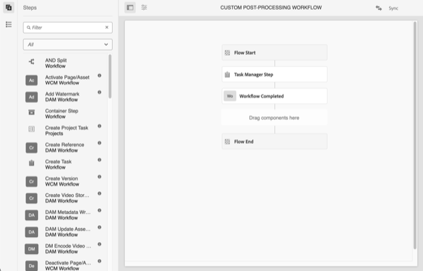

# 自動開始工作流程

自動開始工作流程會在上傳後自動叫用自訂工作流程，或在資產處理完成後重新處理，藉此延伸AEM as a Cloud Service的資產處理作業。

>[!VIDEO](https://video.tv.adobe.com/v/37323?quality=12&learn=on)

>[!NOTE]
>
>使用自動開始工作流程來自訂資產後續處理，而非使用工作流程啟動器。 自動啟動工作流程僅&#x200B;_在資產處理完成時叫用_，而不是在資產處理期間可能多次叫用的啟動器。

## 自訂後處理工作流程

若要自訂後續處理工作流程，請複製預設的Assets Cloud後續處理[工作流程模型](../../foundation/workflow/use-the-workflow-editor.md)。

1. 從「工作流程模型」畫面開始，瀏覽至&#x200B;_工具_ > _工作流程_ > _模型_
2. 尋找並選取&#x200B;_Assets雲端後續處理_&#x200B;工作流程模型 
   
3. 選取「_複製_」按鈕以建立自訂工作流程
4. 選取您現在的工作流程模型(將稱為&#x200B;_Assets Cloud Post-Processing1_)，然後按一下&#x200B;_編輯_&#x200B;按鈕以編輯工作流程
5. 從工作流程屬性中，為您的自訂後處理工作流程提供有意義的名稱 
   
6. 新增步驟以符合您的業務需求，在此案例中是在資產完成處理時新增工作。 確定工作流程的最後一個步驟永遠是&#x200B;_工作流程完成_&#x200B;步驟 
   

   >[!NOTE]
   >
   >自動開始工作流程會在每次資產上傳或重新處理時執行，因此請仔細考慮工作流程步驟的縮放影響，尤其是大量作業，例如[大量匯入](../../cloud-service/migration/bulk-import.md)或移轉。

7. 選取&#x200B;_同步_&#x200B;按鈕以儲存您的變更並同步工作流程模型

## 使用自訂後處理工作流程

已在資料夾上設定自訂後續處理。 若要在資料夾上設定「自訂後續處理工作流程」：

1. 選取您要設定工作流程的資料夾，並編輯資料夾屬性
2. 切換至&#x200B;_資產處理_&#x200B;標籤
3. 在&#x200B;_自動啟動工作流程_&#x200B;選取方塊 中選取您的自訂後續處理工作流程
   
4. 儲存您的變更

現在您的自訂後處理工作流程將會在該資料夾底下針對所有上傳或重新處理的資產執行。
