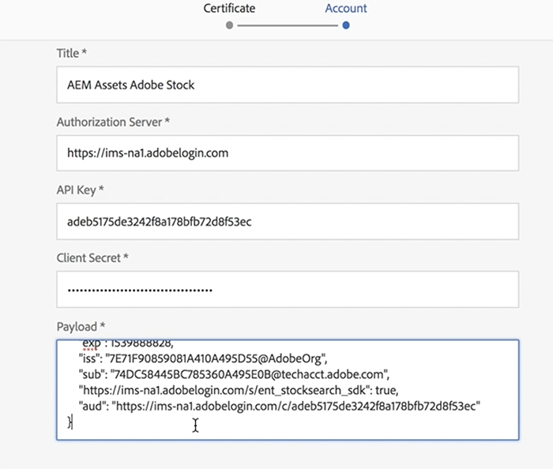

# 使用Adobe Stock與AEM Assets{#using-adobe-stock-assets-with-aem-assets}

AEM 6.4.2可讓使用者直接從中搜尋、預覽、儲存和授權Adobe Stock資產AEM。 企業組織現在可將其Adobe Stock企業計畫與AEM Assets整合，以確保其創意和行銷專案可廣泛使用授權資產，並具備強大的資產管理功能AEM。

>[!VIDEO](https://video.tv.adobe.com/v/24678/?quality=9&learn=on)

>[!NOTE]
>
>整合需要[企業版Adobe Stock計畫](https://landing.adobe.com/en/na/products/creative-cloud/ctir-4625-stock-for-enterprise/index.html)和AEM6.4，並且至少部署Service Pack 2。 有AEM關6.4 Service Pack的詳細資訊，請參見以下[發行說明](https://helpx.adobe.com/experience-manager/6-4/release-notes/sp-release-notes.html)。

Adobe Stock與AEM Assets的整合可讓內容作者和行銷人員輕鬆授權及使用股票資產，以進行創意或行銷。 您可以使用Omni Search、將位置篩選器新增為Adobe Stock，或瀏覽AEM Assets主導覽，然後按一下搜尋Adobe Stock珊瑚UI圖示，來執行Stock資產搜尋。

## 功能

### 搜尋與儲存

* 執行Adobe Stock資產搜尋，而不需離開AEM工作區。
* 儲存Adobe Stock資產以進行預覽，毋需取得資產授權。
* 將Adobe Stock資產授權並儲存至AEM Assets
* 能夠在AEM AssetsUI中從Adobe Stock搜索類似資產
* 在AEM AssetsAdobe Stock網站的Stock Search中檢視選取的資產
* 授權資產檔案上標有藍色授權徽章，以方便識別

### 資產中繼資料

* 授權資產會儲存在AEM Assets。 資產屬性在個別的資產中繼資料標籤下包含Stock中繼資料
* 能夠將授權參考新增至資產中繼資料

### 資產庫存設定檔

* 用戶可以在&#x200B;*User > My Preferences > Stock Configuration*&#x200B;下選擇Adobe Stock配置檔案
* 可將強制和選擇性參考新增至「資產授權」視窗。
* 可根據地區選擇資產授權視窗的語言偏好設定。

### 篩選

* 使用者可以根據「資產類型」、「方向」和「檢視類似」來篩選庫存資產
* 資產類型包括像片、插圖、向量、視訊、範本、3D、優質、編輯
* 方向包括水準、垂直和正方形。
* 檢視類似篩選需要Adobe Stock檔案號碼

### 存取控制

* 管理員可在設定Adobe Stock雲端服務設定時，為特定使用者／群組提供授權Stock資產的權限。
* 如果特定使用者／群組沒有授權Stock資產的權限，*Stock資產搜尋／資產授權*&#x200B;功能將會停用。

## 用AEM Assets設立Adobe Stock{#set-up-adobe-stock-with-aem-assets}

AEM 6.4.2可讓使用者直接從中搜尋、預覽、儲存和授權Adobe Stock資產AEM。 本影片介紹如何使用Adobe主控台與AEM Assets建立Adobe I/O股。

>[!VIDEO](https://video.tv.adobe.com/v/25043/?quality=12&learn=on)

>[!NOTE]
>
>對於Adobe Stock雲服務配置，必須選擇指向/content/dam的「PROD環境」(PROD Environment)和「授權」(Licensed)資產路徑。 環境欄位會在下一版中移除，AEM而授權的資產路徑是即將推出的功能的一部分，而此欄位的支援將會在下一版中AEM推出。

>[!NOTE]
>
>整合需要[企業級Adobe Stock計畫](https://landing.adobe.com/en/na/products/creative-cloud/ctir-4625-stock-for-enterprise/index.html)和AEM6.4，並且至少部署了[Service Pack 2](https://www.adobeaemcloud.com/content/marketplace/marketplaceProxy.html?packagePath=/content/companies/public/adobe/packages/cq640/servicepack/AEM-6.4.2.0)。 有AEM關6.4 Service Pack的詳細資訊，請參見以下[發行說明](https://helpx.adobe.com/experience-manager/6-4/release-notes/sp-release-notes.html)。 您還需要[Adobe I/O控制台](https://console.adobe.io/)、[Adobe Admin Console](https://adminconsole.adobe.com/)和Adobe Experience Manager的管理員權限才能設定整合。

### 安裝{#installations}

* 對於AEM6.4，您必須安裝[AEM Service Pack 2](https://www.adobeaemcloud.com/content/marketplace/marketplaceProxy.html?packagePath=/content/companies/public/adobe/packages/cq640/servicepack/AEM-6.4.2.0)，然後重新安裝cq-dam-stock-integration-content-1.0.4.zip檔案。
* 請確定您擁有[Adobe I/O控制台](https://console.adobe.io/)、[Adobe Admin Console](https://adminconsole.adobe.com/)和Adobe Experience Manager的管理員權限，以設定整合。

#### 使用Adobe控制台{#set-up-adobe-ims-configuration-using-adobe-i-o-console}設定Adobe I/OIMS配置

1. 在&#x200B;**工具>安全性**&#x200B;下建立AdobeIMS技術帳戶設定
2. 選擇&#x200B;*雲端解決方案*&#x200B;作為&#x200B;*Adobe Stock*，並建立新憑證或重新使用現有憑證進行設定。
3. 導覽至「Adobe I/O控制台」，並為&#x200B;*Adobe Stock*&#x200B;建立新的「服務帳戶」整合。
4. 將憑證從步驟2上傳至您的Adobe Stock服務帳戶整合。
5. 選擇所需的Adobe Stock配置檔案配置並完成服務整合。
6. 使用整合詳細資訊以完成AdobeIMS技術帳戶設定
7. 請確定您可以使用AdobeIMS技術帳戶接收存取Token。

#### 設定Adobe StockCloud Services{#set-up-adobe-stock-cloud-services}

1. 在&#x200B;**工具>Cloud Services下，為Adobe Stock建立新的雲端服務設定。**
2. 為&#x200B;*Adobe Stock雲*&#x200B;配置選擇在上節中建立的&#x200B;*AdobeIMS配置*

3. 請務必選擇&#x200B;**ENVIRONMENT**&#x200B;作為PROD。 不支援轉移環境，並將在下一版中刪除AEM。
4. **授權資** 產路徑可指向/content/dam下的任何目錄。此欄位的功能支援將新增至下一版的
5. 選擇您的地區並完成設定。
6. 您也可以將使用者／群組新增至您的Adobe Stock雲端服務，以啟用特定使用者或群組的存取權。

### 其他資源

* [Enterprise Stock計畫](https://landing.adobe.com/en/na/products/creative-cloud/ctir-4625-stock-for-enterprise/index.html)
* [AEM 6.4 Service Pack 2發行說明](https://helpx.adobe.com/experience-manager/6-4/release-notes/sp-release-notes.html)
* [整合AEM與Adobe Stock](https://helpx.adobe.com/experience-manager/6-5/assets/using/aem-assets-adobe-stock.html#IntegrateAEMandAdobeStock)
* [Adobe I/O主控台整合API](https://www.adobe.io/apis/cloudplatform/console/authentication/gettingstarted.html)
* [Adobe StockAPI檔案](https://www.adobe.io/apis/creativecloud/stock/docs.html)