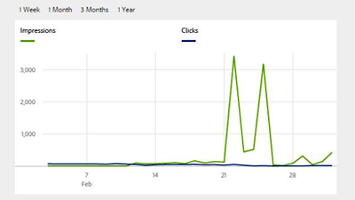

# AEM Assets視頻和教程 {#overview}

Adobe Experience Manager(AEM)資產是平台上的數字資產管理工具AEM，允許用戶在基於Web的儲存庫中建立、管理和共用其數字資產（影像、視頻、文檔和音頻剪輯）。 本使用手冊包含有關AEM Assets的許多功能和功能的視頻和教程。

>[!CONTEXTUALHELP]
>id="aemcloud_assets_overview"
>title="AEM Assets"
>abstract="了解如何快速尋找和編輯您需要的資產。"
>additional-url="https://video.tv.adobe.com/v/336196" text="AEM Assets 逐步說明"

## AEM Assets 逐步說明

瞭解AEM Assets是什麼以及它如何用於實現您組織的業務目標。

>[!VIDEO](https://video.tv.adobe.com/v/336196?quality=12&learn=on)

## 工作人員挑選

<table>
<td>
   
   

      <a href="./creative-workflows/aem-desktop-app.md">
      <strong>使用AEM案頭應用</strong>
      </a>
   

   

      <em>直接從桌AEM面訪問資產</em>
   

</td>
<td>
   
   

      <a href="./advanced/asset-insights-launch-tutorial.md">
      <strong>將AEMAsset Insights與Launch一起使用</strong>
      </a>
   

   

      <em>瞭解資產的使用方式</em>
   

</td>
<td>
   
   

      <a href="./dynamic-media/dynamic-media-overview-feature-video-use.md">
      <strong>Dynamic Media概述</strong>
      </a>
   

   

      <em>使用Dynamic Media管理和訪問媒體內容</em>
   

</td>
</table>

## 其他資源

* [AEM Assets 檔案](https://experienceleague.adobe.com/docs/experience-manager-65/assets/home.html?lang=en)
* [AEMas a Cloud Service教程](/help/cloud-service/overview.md)
* [AEM Sites教程](/help/sites/overview.md)
* [AEM Forms教程](/help/forms/overview.md)
* [基AEM礎教程](/help/foundation/overview.md)
