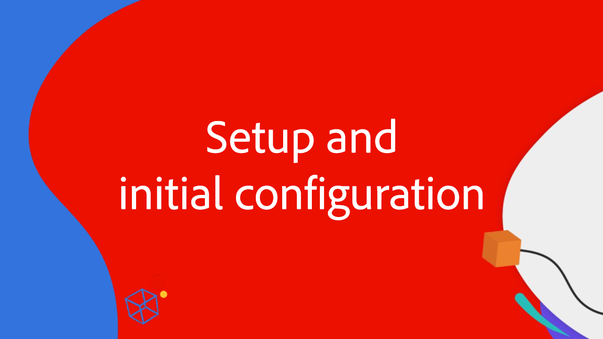

# 運用增強型連接器整合 Workfront 和 AEM Assets

觀看這個分為四部分的影片系列，加入 Adobe Workfront 和 Experience Manager Assets 專家的行列，看他們示範和討論使用增強型連接器整合 Workfront 和 AEM Assets 的各個面向。

這個包含四個部分的專家系列，由一組 Adobe 專家 (包括產品經理、顧問和 Adobe 合作夥伴) 進行討論：

1. [在 Workfront 和 AEM 中執行初始設定](./setup.md)
2. [設定 Workfront 自訂表單和 AEM 之間的中繼資料同步](./custom-forms.md)
3. [使用 AEM 標記、專案連結的資料夾、Adobe Asset Link 和資料夾中繼資料結構描述，實現最大的價值](./aem-tags-project-linked-folders-and-folder-metadata.md)
4. [使用進階 AEM 工作流程簡化 AEM 和 Workfront 之間的業務流程，以及其他進階設定](./advanced-settings-and-workflows.md)

<table>
  <td>
      
      

         <a href="./setup.md"><strong>建立與初始設定</strong></a>
          <em>第 1 部，共 4 部</em>
      

      

         
         了解如何建立和執行 Workfront for Experience Manager 增強型連接器的初始設定。
      

   </td>
   <!-- Workfront custom forms and metadata mapping -->
   <td>
      
      

         <a href="./custom-forms.md"><strong>Workfront 自訂表單和中繼資料對應</strong></a>
          <em>第 2 部，共 4 部</em>
      

      

         
         了解 Workfront 自訂表單，及其如何對應至 Experience Manager Assets 中繼資料結構描述以同步資料。
      

    </td>
    <!-- AEM Tags, project linked folders, and folder metadata -->
    <td>
      
      

         <a href="./aem-tags-project-linked-folders-and-folder-metadata.md"><strong>AEM 標記、專案連結的資料夾，以及資料夾中繼資料</strong></a>
          <em>第 3 部，共 4 部</em> 
      

      

         
            了解如何推動來自 Workfront 的 AEM 分類、使用專案連結的資料夾，以及將資料轉為 AEM 資產資料夾中繼資料。
      

   </td>   
   <!-- Advanced workflows -->
    <td>
      
      

         <a href="./advanced-settings-and-workflows.md"><strong>進階設定和工作流程</strong></a>
          <em>第 4 部，共 4 部</em>
      

      

         
            了解如何使用 Workfront for AEM 增強型連接器的進階設定，以及使用進階工作流程管理資料同步。
      

   </td>
  </tr>  
</tbody></table>

## 透過Workfront Fusion連線

如果您使用Workfront Fusion連結Workfront和AEM Assets，要自動化專案建立和工作流程協調，請參閱Workfront Fusion和AEM Assets整合檔案。

[使用Workfront Fusion將Workfront問題轉換為具有AEM工作流程的專案](https://experienceleague.adobe.com/zh-hant/docs/workfront/using/documents/wf-aem-integrations/wf-aem-essentials/use-fusion-to-create-project-with-workflows)
