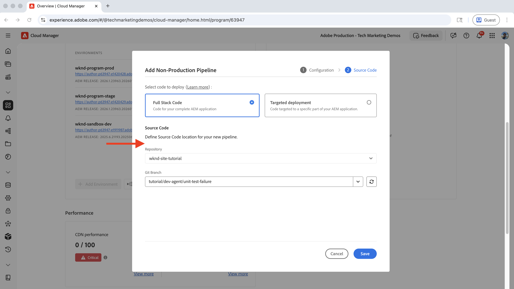
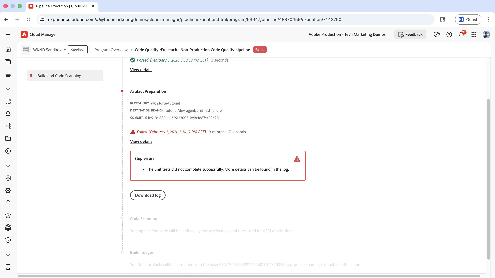
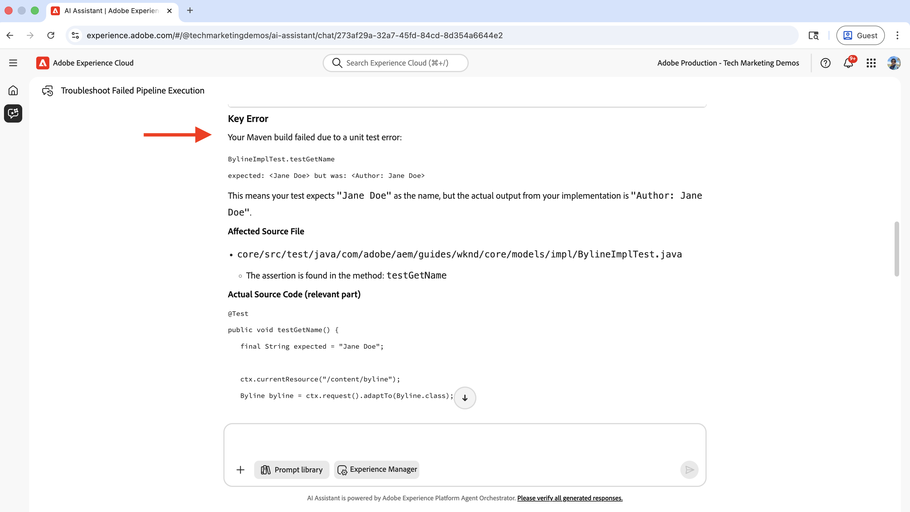
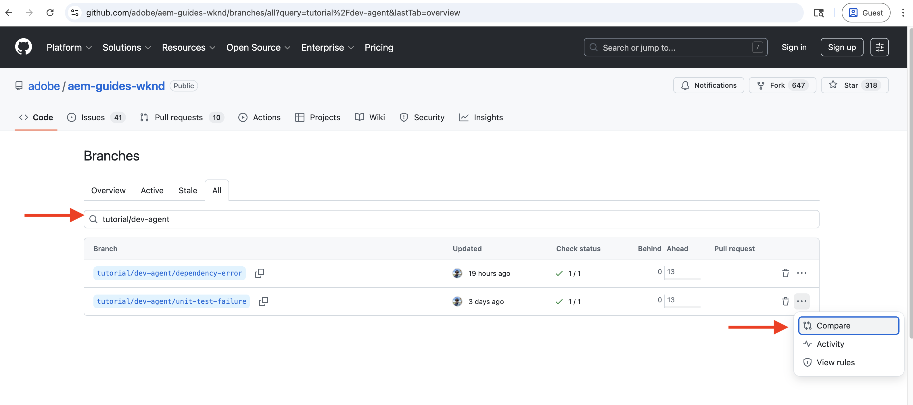

# 使用AEM Development Agent疑難排解CI/CD管道

瞭解如何使用AEM開發代理程式來疑難排解和修正失敗的CI/CD管道。

AEM開發代理程式可協助技術團隊（包括開發人員、DevOps工程師和管理員）提供&#x200B;**AI支援的指引和動作**，以&#x200B;_加速其工作流程_。

>[!TIP]
>
> 另請參閱[AEM代理程式概述](https://experienceleague.adobe.com/en/docs/experience-manager-cloud-service/content/ai-in-aem/agents/overview)，以取得AEM as a Cloud Service中可用代理程式的完整清單、其功能，以及您如何存取它們。


## 概觀

AEM Development Agent提供數種功能，包括列出、疑難排解及修正失敗的CI/CD管道的功能。 您可以透過AI Assistant叫用AEM開發代理程式，以解決您的特定使用案例。

本教學課程使用[WKND Sites專案](https://github.com/adobe/aem-guides-wknd)來示範如何使用AEM開發代理程式來疑難排解和修正失敗的CI/CD管道。 同樣的原則適用於任何AEM專案。

為簡化起見，本教學課程在`BylineImpl.java`檔案中介紹單元測試失敗，以展示AEM開發代理程式的管道疑難排解功能。

## 先決條件

若要按照本教學課程進行學習，您需要：

- AEM中的AI助理和代理程式已啟用。 參閱[在AEM中設定AI](./setup.md)以取得詳細資料，並注意該文章中提到的遊樂場將不具有AEM開發代理程式功能。
- 使用開發人員或方案管理員角色存取Adobe [Cloud Manager](https://my.cloudmanager.adobe.com/)。 如需詳細資訊，請參閱[角色定義](https://experienceleague.adobe.com/en/docs/experience-manager-cloud-manager/content/requirements/users-and-roles#role-definitions)。
- AEM as a Cloud Service環境
- 透過[Beta程式](https://experienceleague.adobe.com/en/docs/experience-manager-cloud-service/content/release-notes/release-notes/release-notes-current#aem-beta-programs)存取AEM中的代理程式
- [WKND Sites專案](https://github.com/adobe/aem-guides-wknd)已複製至您的本機電腦

### AEM Development Agent的目前功能

在深入了解教學課程之前，請先檢閱AEM Development Agent的目前功能：

- 列出CI/CD管道及其狀態
- 疑難排解並修正失敗的&#x200B;**完整棧疊**&#x200B;管道，包括&#x200B;_程式碼品質_&#x200B;和&#x200B;_部署_&#x200B;型別。
- 支援&#x200B;_完整棧疊_&#x200B;管道的&#x200B;_建置_ （程式碼編譯以產生可部署成品）和&#x200B;**程式碼品質** （透過SonarQube規則進行靜態程式碼分析）步驟。

AEM Development Agent的功能會持續擴充和定期更新。 如需意見與建議，請傳送電子郵件至[aem-devagent@adobe.com](mailto:aem-devagent@adobe.com)。

## 設定

請依照下列高階步驟完成本教學課程：

1. 複製[WKND Sites專案](https://github.com/adobe/aem-guides-wknd)，並將其推送至您的Cloud Manager Git存放庫
2. 建立及設定程式碼品質管道
3. 執行管道並觀察失敗的執行
4. 使用AEM開發代理程式來疑難排解並修正失敗的管道

以下逐一詳細介紹每個步驟。

### 使用WKND Sites專案作為示範專案

本教學課程使用WKND Sites專案的`tutorial/dev-agent/unit-test-failure`分支來示範如何使用AEM開發代理程式。 同樣的原則可套用至任何AEM專案。

- `BylineImpl.java`檔案已引入單元測試失敗，如下所示。 如果您使用自己的AEM專案，可以引入類似的單元測試失敗。

  ```java
  ...
  @Override
  public String getName() {
      if (name != null) {
          return "Author: " + name; // This line is intentionally incorrect to introduce a unit test failure.
      }
      return name;
  }
  ...
  ```

- 將[WKND Sites專案](https://github.com/adobe/aem-guides-wknd)複製至您的本機電腦，導覽至專案目錄，然後切換至`tutorial/dev-agent/unit-test-failure`分支。

  ```shell
  git clone https://github.com/adobe/aem-guides-wknd.git
  cd aem-guides-wknd
  git checkout tutorial/dev-agent/unit-test-failure
  ```

- 為WKND Sites專案建立新的Cloud Manager Git存放庫，並將其新增為本機Git存放庫的遠端：

   - 導覽至Adobe [Cloud Manager](https://my.cloudmanager.adobe.com/)並選取您的程式。
   - 按一下左側邊欄中的&#x200B;**存放庫**。
   - 按一下右上角的&#x200B;**新增存放庫**。
   - 輸入&#x200B;**存放庫名稱** （例如「wknd-site-tutorial」），然後按一下&#x200B;**儲存**。 等待建立存放庫。

     

   - 按一下右上角的&#x200B;**存取存放庫資訊**，並複製存放庫URL。

     

   - 將新建立的Cloud Manager Git存放庫新增為遠端，並移至您的本機Git存放庫：

     ```shell
     git remote add adobe https://git.cloudmanager.adobe.com/<your-adobe-organization>/wknd-site-tutorial/
     ```

- 將您的本機Git存放庫推送到Cloud Manager Git存放庫：

  ```shell
  git push adobe
  ```

  出現認證提示時，請提供Cloud Manager **存放庫資訊**&#x200B;強制回應視窗中的&#x200B;**使用者名稱**&#x200B;和&#x200B;**密碼**。

### 建立及設定程式碼品質管道

本教學課程使用程式碼品質管道（非生產）來觸發管道失敗，以進行疑難排解。 如需程式碼品質管道的詳細資訊，請參閱[&#x200B; CI/CD管道簡介](https://experienceleague.adobe.com/en/docs/experience-manager-cloud-service/content/implementing/using-cloud-manager/cicd-pipelines/introduction-ci-cd-pipelines#introduction)。

- 在Cloud Manager中，導覽至&#x200B;**管道**&#x200B;區段並選取&#x200B;**新增** > **新增非生產管道**。
- 在&#x200B;**新增非生產管道**&#x200B;對話方塊中，設定下列專案：

   - **設定**&#x200B;步驟：
      - 保留預設值，例如&#x200B;**管道型別**&#x200B;為`Code Quality Pipeline`，**部署觸發程式**&#x200B;為`Manual`。
      - 對於&#x200B;**非生產管道名稱**，請輸入`Code Quality::Fullstack`

     

   - **Source程式碼**&#x200B;步驟：
      - 選取&#x200B;**完整棧疊代碼**
      - 針對&#x200B;**存放庫**，選取新建立的Cloud Manager Git存放庫
      - 針對&#x200B;**Git分支**，請選取`tutorial/dev-agent/unit-test-failure`
      - 按一下「**儲存**」

     

- 按一下管道專案的三點式功能表中的&#x200B;**執行**，執行新建立的程式碼品質管道。

  


>[!IMPORTANT]
>
> 本教學課程不包含部署管道。 但是，您可以遵循相同的原則來疑難排解並修正失敗的部署管道。


### 觀察失敗的管道執行

程式碼品質管道在&#x200B;**成品準備**&#x200B;步驟中失敗，並出現錯誤：



如果沒有AEM Development Agent，此管道失敗需要手動疑難排解。 開發人員需要檢查記錄並檢視計畫碼，這是一個繁瑣且耗時的過程。

接下來，您會看到Agentic AI如何疑難排解並修正失敗的管道執行。

## 使用AEM開發代理程式來疑難排解並修正失敗的管道

您可以透過以自然語言描述管道失敗，使用AEM中的AI助理叫用AEM開發代理程式。

- 按一下右上角的&#x200B;**AI助理**&#x200B;圖示。

- 以自然語言（亦即&#x200B;**提示**）輸入管道失敗詳細資料。 例如：

  ```text
  I have a failed pipeline execution on %PROGRAM-NAME% program, help me to troubleshoot and fix it.
  ```

  

  已叫用&#x200B;**AEM開發代理程式**，以疑難排解並修正失敗的管道執行。

  >[!NOTE]
  >
  > 如果輸入的提示不清楚，「AI助理」會要求您澄清並提供資訊，以協助您調整提示。

- 推理完成後，按一下&#x200B;**全熒幕開啟**&#x200B;圖示以檢視詳細的疑難排解程式。

  

  結果包含有價值的深入分析，包括錯誤詳細資料、來源檔案、行號及&#x200B;**如何修正**&#x200B;區段，並提供解決問題的明確步驟。

- 在此情況下，代理程式正確地建議變更實作（`getName()`方法）或更新單元測試（`getNameTest()`方法）以修正問題。 它避免幻覺，使用人在迴路的方法，同時為開發人員提供可操作的程式碼變更。

  

- 使用建議的程式碼變更更新`BylineImpl.java`檔案，然後提交變更並推送到Cloud Manager Git存放庫。

  ```java
  ...
  @Override
  public String getName() {
      return name;
  }
  ...
  ```

- 再次執行管道並觀察成功執行。

## 其他範例

WKND Sites專案包括其他程式碼中斷和設定問題的範例，例如遺漏相依性和不正確的設定。 您可以檢視以[`tutorial/dev-agent/`開頭的](https://github.com/adobe/aem-guides-wknd/branches/all?query=tutorial%2Fdev-agent&lastTab=overview)分支，以探索這些範例。 若要檢視重大變更，您可以按一下「`tutorial/dev-agent/unit-test-failure`比較`main`」按鈕，比較&#x200B;**分支與**&#x200B;分支。 然後尋找&#x200B;_變更的檔案_&#x200B;區段。



另請參閱[範例提示](https://experienceleague.adobe.com/en/docs/experience-manager-cloud-service/content/ai-in-aem/agents/development/overview#sample-prompts)，以取得有關如何使用AEM Development Agent的更多概念。

## 摘要

在本教學課程中，您已瞭解如何使用AEM開發代理程式，透過AI助理對失敗的CI/CD管道進行疑難排解和修正。 您也瞭解到Agentic AI如何透過提供可操作的見解和程式碼變更來加速技術工作流程。

開始使用AEM中的AEM開發代理程式和其他代理程式來加速您的工作流程，如需詳細資訊，請參閱[AEM代理程式概觀](https://experienceleague.adobe.com/en/docs/experience-manager-cloud-service/content/ai-in-aem/agents/overview)。

## 其他資源

- [Experience Manager中的AI](./overview.md)
- [AEM代理程式概觀](https://experienceleague.adobe.com/en/docs/experience-manager-cloud-service/content/ai-in-aem/agents/overview)
- [開發代理程式總覽](https://experienceleague.adobe.com/en/docs/experience-manager-cloud-service/content/ai-in-aem/agents/development/overview)
- [AEM代理程式概觀](https://experienceleague.adobe.com/en/docs/experience-manager-cloud-service/content/ai-in-aem/agents/overview)
