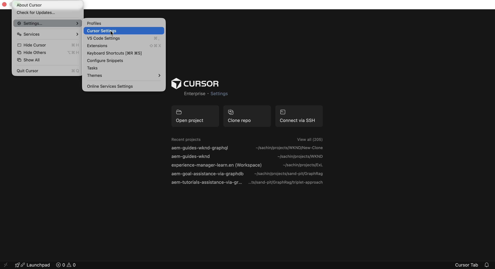
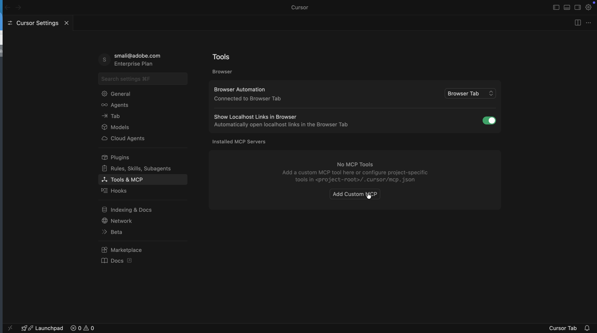
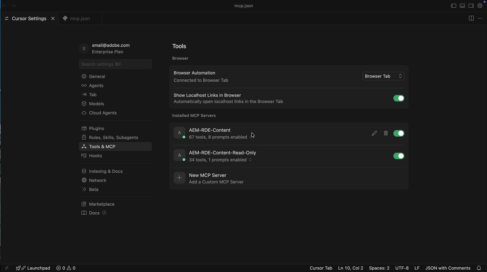
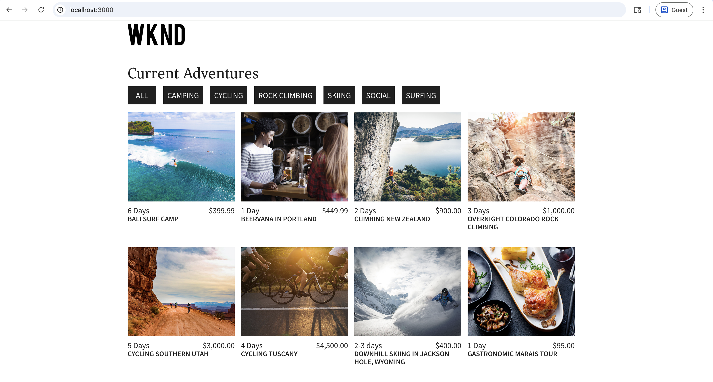
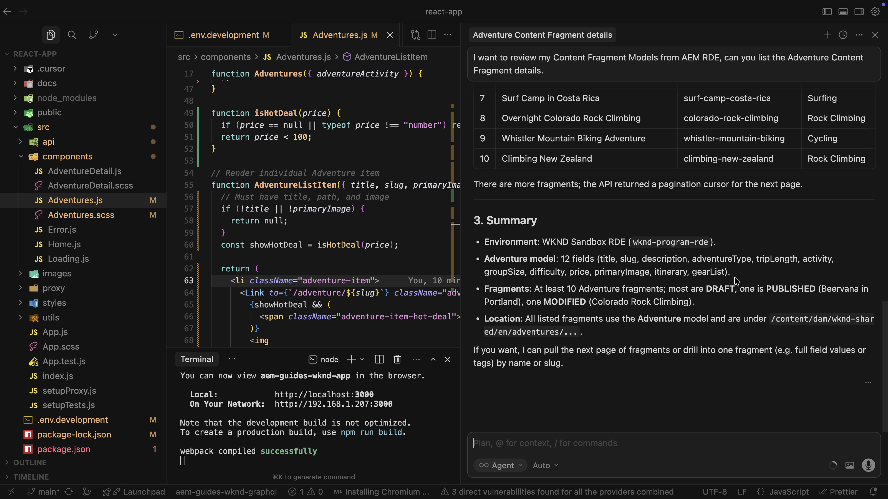

# 使用Content MCP伺服器加速AEM內容作業

使用AI支援的IDE （例如&#x200B;**Cursor IDE**）中的[Content MCP Server](https://www.cursor.com/)，以自然語言處理AEM內容，無低階API程式碼或UI導覽。

在本教學課程中，您&#x200B;_檢閱_&#x200B;冒險內容片段詳細資訊、_更新_&#x200B;片段（例如冒險價格）和&#x200B;_驗證_ IDE中的[WKND Adventures React應用程式](https://github.com/adobe/aem-guides-wknd-graphql/tree/main/react-app)變更，並針對&#x200B;_較低的AEM環境_ （RDE或開發）執行驗證，而不離開MCP流程。

>[!VIDEO](https://video.tv.adobe.com/v/3480906/?captions=chi_hant&learn=on&enablevpops)

## 概觀

AEM as a Cloud Service提供&#x200B;_MCP伺服器_，讓您的IDE或聊天應用程式可以安全地與AEM搭配使用。 **Content MCP Server**&#x200B;支援頁面、片段和資產。 如需詳細資訊，請參閱AEM[中的](./overview.md)MCP伺服器。

## 開發人員可如何加以使用

將[Cursor IDE](https://www.cursor.com/)連線至Content MCP Server，然後執行以下案例。

### 設定 — 游標中的Content MCP伺服器

讓我們使用下列步驟設定游標中的Content MCP Server。

1. 在您的電腦上開啟游標。

1. 從[游標]功能表移至&#x200B;**設定** > **游標設定**&#x200B;以開啟設定視窗。
   

1. 在左側邊欄中，按一下&#x200B;**工具與MCP**&#x200B;以開啟該面板。
   

1. 按一下&#x200B;**新增自訂MCP**&#x200B;或&#x200B;**新MCP伺服器**&#x200B;以開啟`mcp.json`，然後貼上這個組態：

   ```json
   {
       "mcpServers": {
           // Use this for create, read, update, and delete operations
           "AEM-RDE-Content": {
               "url": "https://mcp.adobeaemcloud.com/adobe/mcp/content"
           },
           //Use this for read-only operations
           "AEM-RDE-Content-Read-Only": {
               "url": "https://mcp.adobeaemcloud.com/adobe/mcp/content-readonly"
           }
       }
   }
   ```

   >[!CAUTION]
   >
   > 為教學課程之用，上述設定為此教學課程同時新增&#x200B;**Content**&#x200B;和&#x200B;**Content （唯讀）**。 實際上，**Content**&#x200B;已包含所有&#x200B;**Content （唯讀）**&#x200B;選件，以及建立/更新/刪除工具。
   >
   >
   > 如果您不想建立、修改或刪除任何內容，請僅設定&#x200B;**內容（唯讀）** (`/content-readonly`)並省略&#x200B;**內容** (`/content`)。 這樣您便可避免意外變更。

   

1. 在[游標設定]視窗中，按一下[連線]以啟動驗證程式。 **&#x200B;**&#x200B;它會使用OAuth 2.0 PKCE流程取得&#x200B;**使用者特定存取權杖**&#x200B;以存取AEM MCP伺服器。
   

1. 使用Adobe ID登入，然後返回「游標設定」視窗。
   

1. 確認&#x200B;**AEM-RDE-Content-Read-Only**&#x200B;和&#x200B;**AEM-RDE-Content**&#x200B;顯示為已連線。 您可以展開每個伺服器來檢視其工具。

   

### 設定 — WKND Adventures React應用程式

接下來，在Cursor中設定[WKND Adventures React App](https://github.com/adobe/aem-guides-wknd-graphql/tree/main/react-app)。

1. 複製您電腦上的這兩個存放庫：

   ```bash
   ## WKND GraphQL repo, the `react-app` folder is the WKND Adventures app
   $ git clone git@github.com:adobe/aem-guides-wknd-graphql.git
   
   ## WKND Site repo, you deploy this to RDE so the app can use its content fragments data via GraphQL
   $ git clone git@github.com:adobe/aem-guides-wknd.git
   ```

1. 將[WKND網站](https://github.com/adobe/aem-guides-wknd)專案部署至您的RDE。 如需詳細步驟，請參閱[如何使用快速開發環境](https://experienceleague.adobe.com/zh-hant/docs/experience-manager-learn/cloud-service/developing/rde/how-to-use#deploy-aem-artifacts-using-the-aem-rde-plugin)。

1. 在IDE中開啟`react-app`資料夾。

1. 編輯`.env.development`並設定：
   - `REACT_APP_HOST_URI`：您的RDE作者URL
   - `REACT_APP_AUTH_METHOD`：成為`basic`
   - `REACT_APP_BASIC_AUTH_USER`和`REACT_APP_AEM_AUTH_PASSWORD`：成為`aem-headless` （在RDE中建立此使用者，並將其新增至`administrators`群組）

1. 從IDE終端機，執行：

   ```bash
   $ cd aem-guides-wknd-graphql/react-app
   $ npm install
   $ npm start
   ```

1. 在您的瀏覽器中，前往[http://localhost:3000](http://localhost:3000)檢視WKND Adventures應用程式。

   

### 生產力案例 — AEM內容檢閱和更新

假設當符合簡單規則時，您需要在冒險卡片上顯示&#x200B;_熱門交易_&#x200B;橫幅。 常用的方法是：

- 檢視Adventure卡元件程式碼
- 新增何時顯示橫幅的邏輯
- 檢視AEM中的Adventure內容片段模型
- 變更一或多個Adventure片段屬性以測試規則

為了簡單起見，當冒險活動的價格低於$100時，讓我們顯示&#x200B;_熱門交易_&#x200B;橫幅。

由於React應用程式會從您的RDE環境取得其資料，因此您需要知道Adventure內容片段模式，然後更新正確的片段屬性。 這正是AEM Content MCP Server可協助處理的問題。 方法如下。

1. 在「游標」中，開啟新聊天並輸入：

   ```text
   I want to review my Content Fragment Models from AEM RDE, can you list the Adventure Content Fragment details.
   ```

   


   在叫用Content MCP Server之前，它會要求確認以繼續。 因此，您可以繼續掌控內容作業。

   AI會使用Content MCP伺服器擷取資料，然後以清晰、結構化的方式呈現。 其中包括內容片段模式詳細資訊、片段數量和摘要資訊。

1. 若要觸發&#x200B;_熱門交易_&#x200B;橫幅，請更新一次冒險的價格。 在同一次聊天中，請嘗試：

   ```text
   Can you update adventure Beervana in Portland's price to 99.99
   ```

   

   同樣地，AI會在更新內容之前要求確認以繼續進行。 也會概述更新前後的內容作業。

1. 在React應用程式中，確認Beervana卡現在顯示&#x200B;_HOT DEAL_&#x200B;橫幅。

   

### 其他提示

在IDE中嘗試這些以內容為中心的提示（連線到Content MCP Server）以探索更多工作流程和功能。

- 探索內容：

  ```text
  List all content fragments in the WKND Adventures folder
  
  List all WKND Site pages from US English site
  
  Can you give me page metadata for Tahoe Skiing English page? 
  
  List assets of Bali Surf camp
  
  What Content Fragment models are available in this environment?
  ```

- 搜尋內容：

  ```text
  Search for content fragments that mention 'cycling'
  
  Do we have a magazine page in US English site with "Camping" in it
  ```

- 更新內容：

  ```text
  In WKND US English create a copy of Downhill Skiing Wyoming as "Test Downhill Skiing Wyoming"
  
  In newly created "Test Downhill Skiing Wyoming" please change title to "Duplicated Page"
  ```

- 發佈或取消發佈：

  ```text
  Can you publish the page at /us/en/adventures/test-downhill-skiing-wyoming and give me publish page URL
  
  Can you unpublish the test-downhill-skiing-wyoming page
  ```

## 摘要

您可以在游標中設定AEM Content MCP Server，並將其連線至您的RDE （或開發）環境。 接著，您使用WKND Adventures React應用程式並以自然語言聊天，檢閱Adventure內容片段詳細資訊。 您還更新了片段的價格，讓AI在每次內容作業前要求您確認。 您已在執行中的應用程式中驗證變更。 您可以使用來自IDE的相同以人為中心的流程來檢閱、更新和建立AEM內容，而無需切換至AEM UI或撰寫低階API程式碼。
