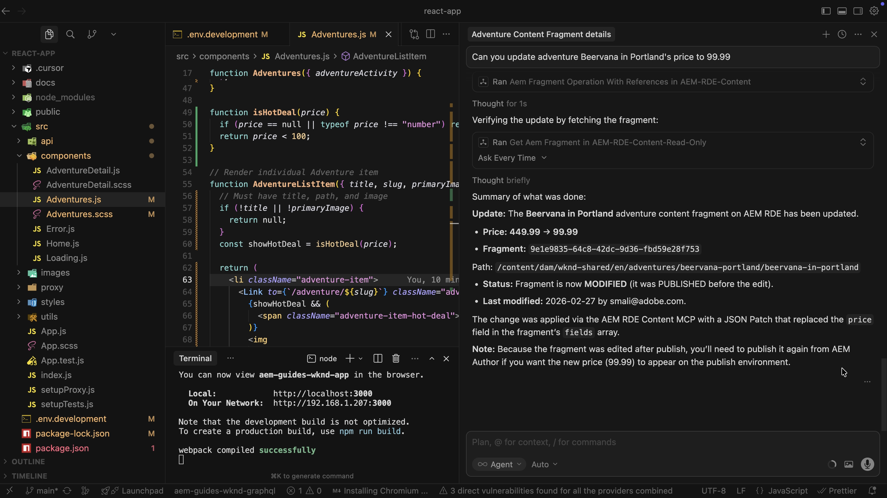

# AEM中的MCP伺服器

瞭解如何使用您偏好的AI支援IDE或聊天式應用程式中的AEM _模型內容通訊協定(MCP)伺服器_，以簡化並加速您的AEM內容工作。 您可以使用自然語言描述您想要的內容，而非撰寫低階API程式碼或透過AEM UI導覽。

## AEM MCP伺服器清單

所有AEM MCP伺服器都可在`https://mcp.adobeaemcloud.com/adobe/mcp/`下使用。 如需詳細資訊，請參閱[搭配AEM as a Cloud Service使用MCP](https://experienceleague.adobe.com/zh-hant/docs/experience-manager-cloud-service/content/ai-in-aem/using-mcp-with-aem-as-a-cloud-service)。

- **內容** (`/content`) — 建立、讀取、更新和刪除頁面、片段和資產的完整存取權。
- **內容（唯讀）** (`/content-readonly`) — 唯讀，可列出及取得頁面、片段和資產（無變更）。
- **Cloud Manager** (`/cloudmanager`) — 管理Adobe Cloud Manager方案、環境、存放庫和管道。

>[!TIP]
>
>每個伺服器公開的工具可能會隨著時間而改變。 若要檢視現在可用的專案，請要求您的AI列出所有AEM MCP工具（例如，`List all AEM MCP tools available from this server and describe what they do`），或在IDE中輸入`tools/list`提示。

## MCP伺服器的使用模式

開始使用AEM MCP伺服器之前，請先瞭解MCP伺服器的兩種主要使用模式：

- **以人為中心** — 您坐穩了駕駛座。 您會問，AI會在IDE中為您建議或執行工具。
- **代理程式** — 代理程式應用程式（代理程式或子代理程式）會自行呼叫伺服器，選擇工具，並以很少人力輸入達成目標。

以下是如何比較這兩種使用模式：

| 層面 | 以人為中心 | Agentic |
| ------ | ------------- | ------- |
| **誰會驅動動作** | 您。   AI會在IDE或聊天式應用程式中為您建議或執行工具。 | AI。  它會挑選要使用的工具，並以最小的指導持續進行。 |
| **決定授權單位** | 一切由您掌控。 您核准或觸發每個步驟。 | AI擁有更多自由。 高影響力的動作可能需要護欄或核准。 |
| **一般使用模式** | **每位開發人員**，您可從自己的IDE或聊天式應用程式使用它，每個工作階段一位開發人員，適合日常開發工作。 | **透過代理應用程式共用**，作為許多使用者或代理程式的共用服務和閘道。 |
| **最適合** | 檢閱內容、進行引導式更新、探索或重複工作，同時保持在循環中。 | 系統應在最少干預下執行的代理工作流程、批次工作、管道和目標。 |

### 在代理系統中使用MCP時

MCP伺服器是專為&#x200B;**個人操作的MCP使用者端**&#x200B;所設計，具有互動式UX和人力監督。 MCP工具規格建議&#x200B;_可以核准或拒絕工具呼叫的回圈中的人_。

如果您在代理或自主系統中使用MCP伺服器，請將其視為單獨的相容性階層。 請&#x200B;**不要在**&#x200B;提示&#x200B;_、_&#x200B;允許清單&#x200B;_或_&#x200B;路由邏輯&#x200B;_中硬式編碼_&#x200B;工具名稱。 在MCP中，_工具名稱_&#x200B;是程式化識別碼，_說明_&#x200B;是LLM的模型化提示。 偏好以提示和選擇為基礎的功能或說明。

透過`tools/list`實作執行階段探索、處理工具清單變更(`notifications/tools/list_changed`)，並在上線和版本設定時與MCP伺服器提供者一致（如果您需要超出通訊協定基準的穩定性保證）。

## MCP實體及其對應

MCP是圍繞三個實體建置，**主機**、**使用者端**&#x200B;和&#x200B;**伺服器**。 [MCP規格](https://modelcontextprotocol.io/docs/getting-started/intro)會正式定義它們。 不過，下表以簡單的辭彙說明每個變數，以及使用AEM MCP伺服器時的對應。

| 元件 | 標準定義 | 使用AEM MCP伺服器時 |
| --------- | ------------------- | ---------------- |
| **主機** | 此應用程式可執行所有工作、收集內容、與AI互動、處理許可權並建立使用者端。 | 您的&#x200B;**IDE** （游標）或聊天式應用程式是主機。 它會執行MCP使用者端並決定工作階段可以使用哪些工具和伺服器。 |
| **使用者端** | 從主機到一部伺服器的單一連線。 它會來回傳遞訊息，並將伺服器的存取與其他伺服器分開。 | **MCP使用者端**&#x200B;位於您的IDE或聊天式應用程式中。 當您在設定中新增AEM Content MCP Server時，IDE或Chat型應用程式會建立與該伺服器對話的使用者端。 您的提示和工具呼叫會透過此使用者端進行。 |
| **伺服器** | 透過MCP公開工具、資料和提示的服務。 它可以在您的電腦上執行或遠端執行。 | Adobe主控的&#x200B;**AEM MCP伺服器**&#x200B;提供建立、讀取、更新和刪除頁面、內容片段和資產的工具，讓您IDE或聊天式應用程式中的AI可以搭配您的AEM環境使用。 |

簡言之，**主機**&#x200B;是您的IDE或聊天式應用程式，**使用者端**&#x200B;是從IDE或聊天式應用程式到AEM的連線，**伺服器**&#x200B;是Adobe主控的AEM MCP伺服器，可執行這項工作。

## 設定

AEM MCP伺服器可搭配一組已定義的MCP相容應用程式運作。
若要在您偏好的IDE或聊天式應用程式中設定AEM MCP伺服器，請參閱[支援的MCP應用程式](https://experienceleague.adobe.com/zh-hant/docs/experience-manager-cloud-service/content/ai-in-aem/mcp-support/using-mcp-with-aem-as-a-cloud-service#supported-mcp-applications)以取得詳細資訊。

## 使用案例

<!-- 
CARDS
{target = _self}

* ./accelerate-content-operations-with-aem-mcp-server.md    
  {title = Accelerate Content Operations with AEM MCP Server}
  {description = Learn how to use the AEM Content MCP Server from Cursor IDE to streamline and accelerate your AEM content work.}
  {image = ../assets/content-mcp-server/update-adventure-price-prompt-response.png}
  {cta = Learn Content MCP Server}

* ./cloud-manager.md
  {title = Cloud Manager MCP Server}
  {description = Learn how to use the AEM Cloud Manager MCP Server from Cursor IDE to streamline and accelerate your AEM cloud manager work.}
  {image = ../assets/cm-mcp-server/start-pipeline.png}
  {cta = Learn Cloud Manager MCP Server}
-->
<!-- START CARDS HTML - DO NOT MODIFY BY HAND -->

    

        

            

                <figure class="image x-is-16by9">
                    
                </figure>
            

            

                

                    

                        <a href="./accelerate-content-operations-with-aem-mcp-server.md" target="_self" rel="referrer" title="使用AEM MCP伺服器加速內容作業">使用AEM MCP伺服器</a>加速內容作業
                    

                    
瞭解如何使用Cursor IDE中的AEM Content MCP Server簡化並加速AEM內容工作。

                

                <a href="./accelerate-content-operations-with-aem-mcp-server.md" target="_self" rel="referrer" class="spectrum-Button spectrum-Button--outline spectrum-Button--primary spectrum-Button--sizeM" style="align-self: flex-start; margin-top: 1rem;">
                    瞭解Content MCP伺服器
                </a>
            

        

    

    

        

            

                <figure class="image x-is-16by9">
                    
                </figure>
            

            

                

                    

                        <a href="./cloud-manager.md" target="_self" rel="referrer" title="Cloud Manager MCP伺服器">Cloud Manager MCP伺服器</a>
                    

                    
瞭解如何使用Cursor IDE中的AEM Cloud Manager MCP Server簡化並加速AEM Cloud Manager的工作。

                

                <a href="./cloud-manager.md" target="_self" rel="referrer" class="spectrum-Button spectrum-Button--outline spectrum-Button--primary spectrum-Button--sizeM" style="align-self: flex-start; margin-top: 1rem;">
                    瞭解Cloud Manager MCP伺服器
                </a>
            

        

    

<!-- END CARDS HTML - DO NOT MODIFY BY HAND -->
