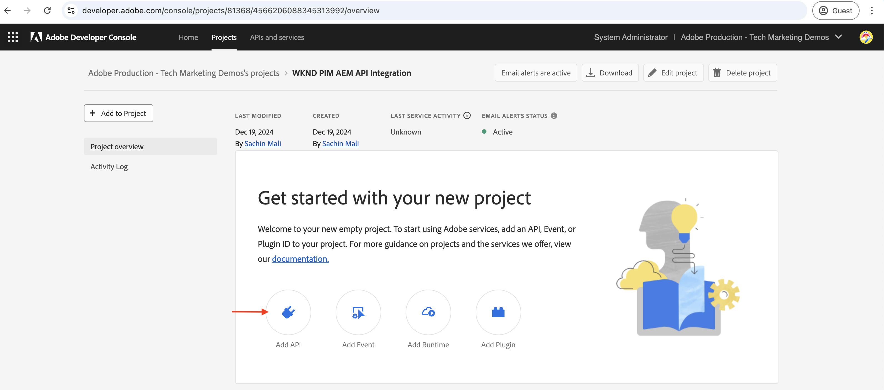
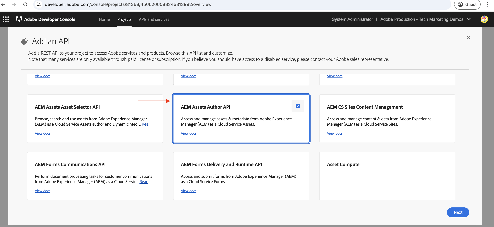
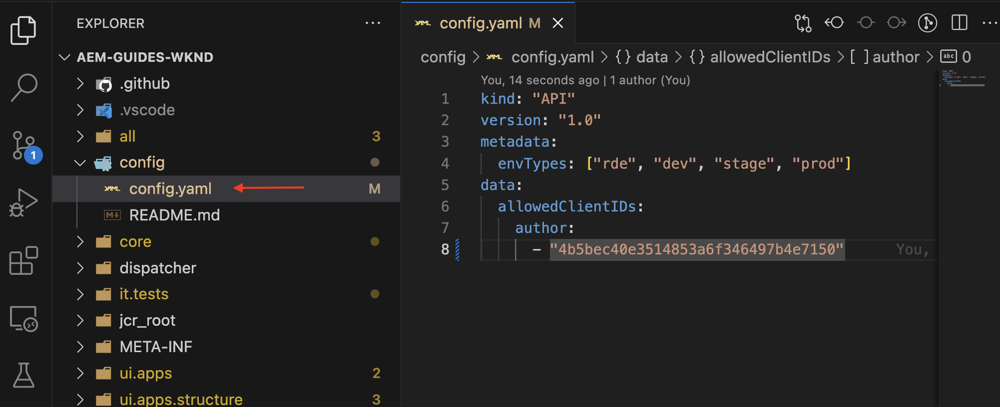
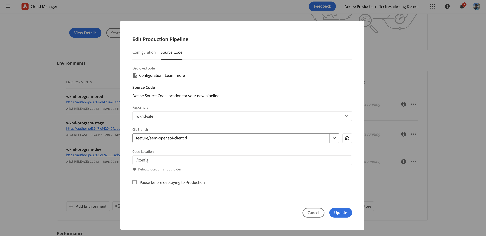

# 透過網頁應用程式的使用者驗證叫用OpenAPI型AEM API{#invoke-openapi-based-aem-apis-from-web-app}

瞭解如何使用來自外部網頁應用程式的使用者型驗證搭配OAuth網頁應用程式驗證，在AEM as a Cloud Service上叫用OpenAPI型AEM API。

OAuth網頁應用程式驗證適用於具有前端和&#x200B;_後端_&#x200B;元件，且需要&#x200B;**代表使用者**&#x200B;存取AEM API的網頁應用程式。 它使用OAuth 2.0 _authorization_code_&#x200B;授權型別來代表使用者取得存取權杖以存取AEM API。 如需詳細資訊，請參閱[ OAuth伺服器對伺服器與OAuth Web App/單頁應用程式認證之間的差異](./overview.md#difference-between-oauth-server-to-server-and-oauth-web-appsingle-page-app-credentials)

>[!AVAILABILITY]
>
>以OpenAPI為基礎的AEM API屬於搶先存取計畫的一部分。 如果您有興趣存取這些檔案，建議您傳送電子郵件至[aem-apis@adobe.com](mailto:aem-apis@adobe.com)，並提供使用案例的說明。

## 範例Web應用程式：WKND-PIM概觀和功能流程

開始之前，請先瞭解範例Web應用程式、WKND產品資訊管理(PIM)及其功能流程。

WKND PIM應用程式是範例Web應用程式，用來管理儲存在AEM as a Cloud Service中的產品屬性及其資產中繼資料。 此範例示範網頁應用程式如何與Adobe API緊密整合，以提供有效率、以使用者為中心的工作流程。

Adobe Developer Console (ADC)專案已設定為使用OAuth Web App驗證存取Assets Author API。 它為WKND-PIM網頁應用程式提供必要的&#x200B;_client_id_&#x200B;和&#x200B;_client_secret_，以起始&#x200B;_authorization_code_&#x200B;授權流程。


>[!VIDEO](https://video.tv.adobe.com/v/3442757?quality=12&learn=on)

下圖說明WKND-PIM網頁應用程式&#x200B;_取得使用者特定存取權杖以與Assets Author API_&#x200B;互動的功能流程。


1. 網頁應用程式會將使用者重新導向至AdobeIdentity Management系統(IMS)以進行驗證，藉此啟動程式。
1. 除了重新導向外，網頁應用程式也會將必要的&#x200B;_client_id_&#x200B;和&#x200B;_redirect_uri_&#x200B;傳遞至IMS。
1. IMS會驗證使用者，並將他們以&#x200B;_authorization_code_&#x200B;傳回指定的&#x200B;_redirect_uri_。
1. 網頁應用程式使用其&#x200B;_client_id_&#x200B;和&#x200B;_client_secret_，將&#x200B;_authorization_code_&#x200B;與IMS交換使用者特定的存取權杖。
1. 成功驗證後，IMS會發行使用者特定的&#x200B;_存取權杖_。
1. 網頁應用程式安全地使用&#x200B;_存取權杖_&#x200B;與Assets Author API互動，讓使用者能夠擷取或更新產品資產中繼資料。

WKND-PIM網頁應用程式是使用[Node.js](https://nodejs.org/en)和[Express](https://expressjs.com/)開發。 Express可做為伺服器，安全地管理私人機密和使用者特定的存取權杖。

其他網頁棧疊（Java、Python、.NET架構等）可用來建立應用程式，這些應用程式會使用本教學課程中說明的方法與Adobe API整合。

## 您能學到的內容{#what-you-learn}

在本教學課程中，您將學習如何：

- 建立和設定Adobe Developer Console (ADC)專案，以使用&#x200B;_OAuth Web App_&#x200B;驗證來存取OpenAPI型AEM API。
- 在自訂網頁應用程式中實作OAuth網頁應用程式驗證流程。
   - IMS使用者驗證和應用程式授權。
   - 使用者特定的存取權杖擷取。
   - 使用使用者特定的存取權杖存取OpenAPI型AEM API。

開始之前，請確定您已檢閱[存取AdobeAPI和相關概念](overview.md#accessing-adobe-apis-and-related-concepts)區段。

## 如何使用本教學課程{#how-to-use-this-tutorial}

您可以[檢閱網頁應用程式金鑰程式碼片段](#review-web-app-key-code-snippets)區段，瞭解WKND-PIM網頁應用程式中使用的OAuth網頁應用程式驗證流程和API呼叫程式碼片段。 或直接進入[設定並執行網頁應用程式](#setup-run-web-app)區段，在本機電腦上設定並執行WKND-PIM網頁應用程式。

## 檢閱網頁應用程式金鑰程式碼片段{#review-web-app-key-code-snippets}

讓我們檢閱WKND-PIM網頁應用程式中使用的關鍵程式碼片段，以瞭解OAuth網頁應用程式驗證流程和API呼叫。

### 下載WKND-PIM網頁應用程式程式碼

1. 下載[WKND-PIM網頁應用程式](./assets/web-app/wknd-pim-demo-web-app.zip) zip檔案並解壓縮。

1. 導覽至解壓縮的資料夾，並在您最愛的程式碼編輯器中開啟`.env.example`檔案。 檢閱必要的設定引數。

   ```plaintext
   ########################################################################
   # Adobe IMS, Adobe Developer Console (ADC), and AEM Assets Information
   ########################################################################
   # Adobe IMS OAuth endpoints
   ADOBE_IMS_AUTHORIZATION_ENDPOINT=https://ims-na1.adobelogin.com/ims/authorize/v2
   ADOBE_IMS_TOKEN_ENDPOINT=https://ims-na1.adobelogin.com/ims/token/v3
   ADOBE_IMS_USERINFO_ENDPOINT=https://ims-na1.adobelogin.com/ims/userinfo/v2
   
   # Adobe Developer Console (ADC) Project's OAuth Web App credential
   ADC_CLIENT_ID=<ADC Project OAuth Server-to-Server credential ClientID>
   ADC_CLIENT_SECRET=<ADC Project OAuth Server-to-Server credential Client Secret>
   ADC_SCOPES=<ADC Project OAuth Server-to-Server credential Scopes>
   
   # AEM Assets Information
   AEM_ASSET_HOSTNAME=<AEM Assets Hostname, e.g., https://author-p63947-e1502138.adobeaemcloud.com/>
   AEM_ASSET_IDS=< AEM Asset IDs Comma Seperated, e.g., urn:aaid:aem:9f20a8ce-934a-4560-8720-250e529fbb17,urn:aaid:aem:6e0123cd-8a67-4d1f-b721-1b3da987d831>
   
   ################################################
   # Web App Information
   ################################################
   # The port number on which this server (web app) will run
   PORT = 3000
   
   # The URL to which the user will be redirected after the OAuth flow is complete
   REDIRECT_URI=https://localhost:3001/callback
   
   # The Express (express-session) uses this secret to encrypt and verify the authenticity of that cookie
   EXPRESS_SESSION_SECRET=<Express Session Secret>
   ```

   您需要以Adobe Developer Console (ADC)專案和AEM as a Cloud Service Assets例項中的實際值取代預留位置。

### IMS使用者驗證和應用程式授權

讓我們檢閱起始IMS使用者驗證和應用程式授權的程式碼。 若要檢閱或更新資產中繼資料，使用者必須對Adobe IMS進行驗證，並授權WKND-PIM網頁應用程式代表他們存取Assets Author API。

在第一次登入嘗試時，使用者必須提供同意，允許WKND-PIM網頁應用程式代表他們存取Assets Author API。


1. `routes/update-product-attributes.js`檔案會驗證使用者的[快速工作階段](https://www.npmjs.com/package/express-session)是否有存取權杖。 如果沒有，則會將使用者重新導向至`/auth`路由。

   ```javascript
   ...
   // The update-product-attributes route, shows the product attributes form with tabs
   router.get("/update-product-attributes", async (req, res) => {
     // Check if the user is authenticated, if not redirect to the auth route
     if (!req.session.accessToken) {
         return res.redirect("/auth");
     }
     ...
   });
   ```

1. 在`routes/adobe-ims-auth.js`檔案中，`/auth`路由會起始IMS使用者驗證和應用程式授權流程。 請注意&#x200B;_client_id_、_redirect_uri_&#x200B;和&#x200B;_response_type_&#x200B;引數已傳遞至Adobe IMS授權端點。

   ```javascript
   ...
   // Route to initiate Adobe IMS user authentication
   router.get("/auth", (req, res) => {
     // Redirect user to Adobe IMS authorization endpoint
     try {
         // Constructing the authorization URL
         const params = new URLSearchParams({
         client_id: adobeADCConfig.clientId,
         redirect_uri: redirectUri,
         response_type: "code",
         });
   
         // Append scopes if defined in configuration
         if (adobeADCConfig?.scopes) params.append("scope", adobeADCConfig.scopes);
   
         // Redirect user to Adobe IMS authorization URL
         const imsAuthorizationUrl = `${
         adobeIMSConfig.authorizationEndpoint
         }?${params.toString()}`;
   
         res.redirect(imsAuthorizationUrl);
     } catch (error) {
         console.error("Error initiating Adobe IMS authentication:", error);
         res.status(500).send("Unable to initiate authentication");
     }
   });
   ...
   ```

如果未針對Adobe IMS驗證使用者，則會顯示Adobe ID登入頁面並要求使用者進行驗證。

若已驗證，系統會將使用者重新導向回具有&#x200B;_authorization_code_&#x200B;之WKND-PIM網頁應用程式的指定&#x200B;_redirect_uri_。

### 存取權杖擷取

WKND-PIM Web應用程式使用ADC專案的OAuth Web App認證的&#x200B;_client_id_&#x200B;和&#x200B;_client_secret_，將&#x200B;_authorization_code_&#x200B;與Adobe IMS安全地交換使用者特定的存取權杖。

在`routes/adobe-ims-auth.js`檔案中，`/callback`路由會將&#x200B;_authorization_code_&#x200B;與Adobe IMS交換使用者特定的存取權杖。

```javascript
...
// Callback route to exchange authorization code for access token
router.get("/callback", async (req, res) => {
  // Extracting authorization code from the query parameters
  const authorizationCode = req.query.code;

  if (!authorizationCode) {
    return res.status(400).send("Missing authorization code");
  }

  // Exchange authorization code for access token
  try {
    // Fetch access token from Adobe IMS token endpoint
    const response = await fetch(adobeIMSConfig.tokenEndpoint, {
      method: "POST",
      headers: {
        "Content-Type": "application/x-www-form-urlencoded",
        Authorization: `Basic ${Buffer.from(
          `${adobeADCConfig.clientId}:${adobeADCConfig.clientSecret}`
        ).toString("base64")}`,
      },
      body: new URLSearchParams({
        code: authorizationCode,
        grant_type: "authorization_code",
      }),
    });

    if (!response.ok) {
      console.error("Failed to fetch access token:", response.statusText);
      return res.status(500).send("Failed to fetch access token");
    }

    const data = await response.json();

    if (!data.access_token) {
      console.error("Access token missing in the response:", data);
      return res.status(500).send("Invalid response from token endpoint");
    }

    // For debugging purposes
    console.log("Access token:", data.access_token);

    // Store the access token in the session
    req.session.accessToken = data.access_token;

    // Redirect user to update product attributes
    res.redirect("/update-product-attributes");
  } catch (error) {
    console.error("Error exchanging authorization code:", error);
    res.status(500).send("Error during token exchange");
  }
});
```

存取Token會儲存在[快速工作階段](https://www.npmjs.com/package/express-session)中，以供後續要求使用Assets Author API。

### 使用存取權杖存取OpenAPI型AEM API

WKND-PIM網頁應用程式會安全地使用使用者特定的存取權杖來與Assets Author API互動，讓使用者能夠擷取或更新產品資產中繼資料。

在`routes/invoke-aem-apis.js`檔案中，`/api/getAEMAssetMetadata`和`/api/updateAEMAssetMetadata`路由使用存取權杖叫用Assets作者API。

```javascript
...
// API Route: Get AEM Asset Metadata
router.get("/api/getAEMAssetMetadata", async (req, res) => {
  const assetId = req.query.assetId;
  const bucketName = getBucketName(aemAssetsConfig.hostname);

  if (!assetId || !bucketName) {
    return res.status(400).json({ error: "Missing AEM Information" });
  }

  // Get the access token from the session
  const accessToken = req.session.accessToken;

  if (!accessToken) {
    return res.status(401).json({ error: "Not Authenticated with Adobe IMS" });
  }

  try {
    const assetMetadata = await invokeGetAssetMetadataAPI(
      bucketName,
      assetId,
      accessToken
    );

    const filteredMetadata = getFilteredMetadata(JSON.parse(assetMetadata));
    res.status(200).json(filteredMetadata);
  } catch (error) {
    console.error("Error getting asset metadata:", error.message);
    res.status(500).json({ error: `Internal Server Error: ${error.message}` });
  }
});

// Helper function to invoke the AEM API to get asset metadata
async function invokeGetAssetMetadataAPI(bucketName, assetId, accessToken) {
  const apiUrl = `https://${bucketName}.adobeaemcloud.com/adobe/assets/${assetId}/metadata`;


  // For debugging purposes
  console.log("API URL:", apiUrl);
  console.log("Access Token:", accessToken);
  console.log("API Key:", adobeADCConfig.clientId);

  try {
    const response = await fetch(apiUrl, {
      method: "GET",
      headers: {
        "If-None-Match": "string",
        "X-Adobe-Accept-Experimental": "1",
        Authorization: `Bearer ${accessToken}`,
        "X-Api-Key": adobeADCConfig.clientId,
      },
    });

    console.log("Response Status:", response.status);

    if (!response.ok) {
      throw new Error(`AEM API Error: ${response.statusText}`);
    }

    return await response.text();
  } catch (error) {
    throw new Error(`Failed to fetch asset metadata: ${error.message}`);
  }
}

// Helper function to filter the metadata properties like pim: and dc:
function getFilteredMetadata(data) {
  if (!data || !data.assetMetadata) {
    throw new Error("Invalid metadata structure received from API");
  }

  const properties = data.assetMetadata;
  return Object.keys(properties).reduce((filtered, key) => {
    if (
      key.startsWith("pim:") ||
      key === "dc:title" ||
      key === "dc:description"
    ) {
      filtered[key] = properties[key];
    }
    return filtered;
  }, {});
}

// API Route: Update AEM Asset Metadata
router.post("/api/updateAEMAssetMetadata", async (req, res) => {
  const { assetId, metadata } = req.body;

  if (!assetId || !metadata || typeof metadata !== "object") {
    return res.status(400).json({ error: "Invalid or Missing Metadata" });
  }

  const bucketName = getBucketName(aemAssetsConfig.hostname);
  if (!bucketName) {
    return res.status(400).json({ error: "Missing AEM Information" });
  }

  const accessToken = req.session.accessToken;
  if (!accessToken) {
    return res.status(401).json({ error: "Not Authenticated with Adobe IMS" });
  }

  try {
    const updatedMetadata = await invokePatchAssetMetadataAPI(
      bucketName,
      assetId,
      metadata,
      accessToken
    );
    res.status(200).json(updatedMetadata);
  } catch (error) {
    console.error("Error updating asset metadata:", error.message);
    res.status(500).json({ error: `Internal Server Error: ${error.message}` });
  }
});

// Helper function to invoke the AEM API to update asset metadata
async function invokePatchAssetMetadataAPI(
  bucketName,
  assetId,
  metadata,
  accessToken
) {
  const apiUrl = `https://${bucketName}.adobeaemcloud.com/adobe/assets/${assetId}/metadata`;
  const headers = {
    "Content-Type": "application/json-patch+json",
    "If-Match": "*",
    "X-Adobe-Accept-Experimental": "1",
    Authorization: `Bearer ${accessToken}`,
    "X-Api-Key": adobeADCConfig.clientId,
  };

  try {
    const response = await fetch(apiUrl, {
      method: "PATCH",
      headers,
      body: JSON.stringify(getTransformedMetadata(metadata)),
    });

    if (!response.ok) {
      throw new Error(`AEM API Error: ${response.statusText}`);
    }

    return await response.json();
  } catch (error) {
    throw new Error(`Failed to update asset metadata: ${error.message}`);
  }
}

// Helper function to transform metadata into JSON Patch format, e.g. [{ op: "add", path: "dc:title", value: "New Title" }]
function getTransformedMetadata(metadata) {
  return Object.keys(metadata).map((key) => ({
    op: "add",
    path: `/${key}`,
    value: metadata[key],
  }));
}
```

OpenAPI型AEM API呼叫是從伺服器端（Express中介軟體）發出，而非直接從使用者端（瀏覽器）發出，以確儲存取權杖受到安全管理，不會公開給使用者端。

### 重新整理存取權杖

若要在存取Token過期之前重新整理，您可以實作重新整理Token流程。 不過，為了簡化教學課程，WKND-PIM網頁應用程式不會實作重新整理權杖流程。


>[!TIP]
>
>您可以依照下一節所述，在本機電腦上試用WKND-PIM網頁應用程式，並取得OAuth網頁應用程式驗證流程和API呼叫的實作體驗。

## 設定並執行網頁應用程式

讓我們在您的本機電腦上設定並執行WKND-PIM網頁應用程式，以瞭解OAuth網頁應用程式驗證流程和API呼叫。

### 先決條件

若要完成本教學課程，您需要：

- 更新的AEM as a Cloud Service環境，其中包含：
   - AEM版本`2024.10.18459.20241031T210302Z`或更新版本。
   - 新樣式的產品設定檔（如果環境是在2024年11月之前建立的）

- 必須在其上部署範例[WKND Sites](https://github.com/adobe/aem-guides-wknd?#aem-wknd-sites-project)專案。

- 存取[Adobe Developer Console](https://developer.adobe.com/developer-console/docs/guides/getting-started/)。

- 在本機電腦上安裝[Node.js](https://nodejs.org/en/)，以執行範例NodeJS應用程式。

- 在本機電腦上安裝[local-ssl-proxy](https://www.npmjs.com/package/local-ssl-proxy#local-ssl-proxy)，以使用自我簽署憑證建立本機SSL HTTP Proxy。

### 開發步驟

高階開發步驟為：

1. AEM as a Cloud Service環境的現代化。
1. 啟用AEM API存取權。
1. 建立Adobe Developer Console (ADC)專案。
1. 設定ADC專案
   1. 新增所需的OpenAPI型AEM API
   1. 設定OAuth Web App認證
1. 設定AEM執行個體以啟用ADC專案通訊
1. 建立和套用資產中繼資料結構
1. 設定並執行WKND-PIM網頁應用程式
1. 驗證端對端流程

### AEM as a Cloud Service環境的現代化

請參閱[如何叫用OpenAPI型AEM API](invoke-openapi-based-aem-apis.md)教學課程中的[AEM as a Cloud Service環境現代化](invoke-openapi-based-aem-apis.md#modernization-of-aem-as-a-cloud-service-environment)一節。

### 啟用AEM API存取權

請參閱[如何叫用OpenAPI型AEM API](invoke-openapi-based-aem-apis.md)教學課程中的[啟用AEM API存取](invoke-openapi-based-aem-apis.md#enable-aem-apis-access)區段。

### 建立Adobe Developer Console (ADC)專案

請參閱[如何叫用OpenAPI型AEM API](invoke-openapi-based-aem-apis.md)教學課程中的[建立Adobe Developer Console (ADC)專案](invoke-openapi-based-aem-apis.md#create-adobe-developer-console-adc-project)區段。

### 設定ADC專案

接下來，設定ADC專案，以使用OAuth網頁應用程式驗證存取Assets Author API。

1. 若要新增AEM API，請按一下&#x200B;**新增API**&#x200B;按鈕。

   

1. 在&#x200B;_新增API_&#x200B;對話方塊中，依&#x200B;_Experience Cloud_&#x200B;篩選，並選取&#x200B;**AEM Assets作者API**&#x200B;卡片，然後按一下&#x200B;**下一步**。

   

1. 接著，在&#x200B;_設定API_&#x200B;對話方塊中，選取&#x200B;**使用者驗證**&#x200B;驗證選項，然後按一下&#x200B;**下一步**。

   

1. 在下一個&#x200B;_設定API_&#x200B;對話方塊中，選取&#x200B;**OAuth網頁應用程式**&#x200B;驗證選項，然後按一下&#x200B;**下一步**。

   

1. 在&#x200B;_設定OAuth網頁應用程式_&#x200B;對話方塊中，輸入下列詳細資料，然後按一下&#x200B;**下一步**。
   - 預設重新導向URI： `https://localhost:3001/callback`
   - 重新導向URI模式： `https://localhost:3001/callback`

   

1. 檢閱可用的範圍，然後按一下&#x200B;**儲存設定的API**。

   

1. 檢閱AEM API和驗證設定。

   

   

### 設定AEM執行個體以啟用ADC專案通訊

若要啟用ADC專案的OAuth Web App認證ClientID以與AEM執行個體通訊，您必須設定AEM執行個體。

這是透過在AEM專案的`config.yaml`檔案中定義組態來完成。 然後，使用Cloud Manager中的設定管道來部署`config.yaml`檔案。

1. 在AEM專案中，從`config`資料夾尋找或建立`config.yaml`檔案。

   

1. 將下列設定新增至`config.yaml`檔案。

   ```yaml
   kind: "API"
   version: "1.0"
   metadata: 
       envTypes: ["dev", "stage", "prod"]
   data:
       allowedClientIDs:
           author:
           - "<ADC Project's OAuth Web App credential ClientID>"
   ```

   以ADC專案的OAuth Web App認證的實際ClientID取代`<ADC Project's OAuth Web App credential ClientID>`。 此教學課程中使用的API端點僅可在作者層級使用，但對於其他API，yaml設定也可以有&#x200B;_發佈_&#x200B;或&#x200B;_預覽_&#x200B;節點。

1. 將設定變更提交至Git存放庫並將變更推送至遠端存放庫。

1. 使用Cloud Manager中的設定管道來部署上述變更。 請注意，也可以使用命令列工具將`config.yaml`檔案安裝在RDE中。

   

### 建立和套用資產中繼資料結構

依預設，WKND Sites專案沒有儲存產品屬性所需的資產中繼資料結構。 讓我們建立資產中繼資料結構，並將其套用至AEM例項中的資產資料夾。

1. 登入AEM as a Cloud Service資產例項。 使用[資產檢視](https://experienceleague.adobe.com/en/docs/experience-manager-learn/assets/authoring/switch-views)導覽至`/content/dam/wknd-shared/en`資料夾。

   

1. 建立&#x200B;**PIM**，並在其中建立&#x200B;**露營**&#x200B;資料夾，然後上傳&#x200B;**露營**&#x200B;資料夾中的[範例影像](./assets/web-app/camping-gear-imgs.zip)。

   

接下來，讓我們建立PIM屬性特定的中繼資料結構描述，並將其套用至&#x200B;**PIM**&#x200B;資料夾。

1. 從左側邊欄瀏覽至&#x200B;**設定** > **中繼資料Forms**&#x200B;選項，然後按一下&#x200B;**建立**&#x200B;按鈕。

1. 在&#x200B;**建立中繼資料表單**&#x200B;對話方塊中，輸入下列詳細資料，然後按一下&#x200B;**建立**。
   - 名稱：`PIM`
   - 使用現有的表單結構作為範本： `Check`
   - 選擇來源： `default`

   

1. 按一下&#x200B;**+**&#x200B;圖示以新增新的&#x200B;**PIM**&#x200B;索引標籤，並新增&#x200B;**單行文字**&#x200B;元件。 中繼資料屬性名稱的開頭應該是`pim:`首碼。

   

   | 標籤 | 預留位置 | 中繼資料屬性 |
   | --- | --- | --- |
   | SKU | 輸入SKU ID | `pim:sku` |
   | 產品型別 | 例如，揹包、帳篷、夾克 | `pim:productType` |
   | 產品類別 | 例如：野營、健行、登山 | `pim:productCategory` |
   | 製造商 | 輸入製造商名稱 | `pim:manufacturer` |
   | 模型 | 輸入模型名稱 | `pim:model` |
   | 品牌名稱 | 輸入品牌名稱 | `pim:brandName` |

1. 按一下&#x200B;**儲存**&#x200B;和&#x200B;**關閉**&#x200B;以儲存中繼資料表單。

1. 最後，將&#x200B;**PIM**&#x200B;中繼資料結構描述套用至&#x200B;**PIM**&#x200B;資料夾。

   

透過上述步驟，**PIM**&#x200B;資料夾中的資產已準備好儲存產品屬性中繼資料。

### 設定並執行WKND-PIM網頁應用程式

1. 下載[WKND-PIM網頁應用程式](./assets/web-app/wknd-pim-demo-web-app.zip) zip檔案並解壓縮。

1. 導覽至擷取的資料夾，並將`.env.example`檔案複製到`.env`。

1. 使用Adobe Developer Console (ADC)專案和AEM as a Cloud Service Assets執行個體中必要的設定引數更新`.env`檔案。

   ```plaintext
   ########################################################################
   # Adobe IMS, Adobe Developer Console (ADC), and AEM Assets Information
   ########################################################################
   # Adobe IMS OAuth endpoints
   ADOBE_IMS_AUTHORIZATION_ENDPOINT=https://ims-na1.adobelogin.com/ims/authorize/v2
   ADOBE_IMS_TOKEN_ENDPOINT=https://ims-na1.adobelogin.com/ims/token/v3
   ADOBE_IMS_USERINFO_ENDPOINT=https://ims-na1.adobelogin.com/ims/userinfo/v2
   
   # Adobe Developer Console (ADC) Project OAuth Web App credential
   ADC_CLIENT_ID=e1adsfsd59384320bbe4f9298f00b7ab
   ADC_CLIENT_SECRET=p8e-Mdfgfdsg43RHugVRTEOyWlmEU5m
   ADC_SCOPES=AdobeID,openid,aem.folders,aem.assets.author
   
   # AEM Assets Information
   AEM_ASSET_HOSTNAME=https://author-p3947-e1542138.adobeaemcloud.com/
   AEM_ASSET_IDS=urn:aaid:aem:aa689a9f-04da-4fbb-b460-74a5b6a69090,urn:aaid:aem:e4fdb6f6-1007-4e84-9726-a9522931786a
   
   ################################################
   # Web App Information
   ################################################
   # The port number on which this server (web app) will run
   PORT = 3000
   
   # The URL to which the user will be redirected after the OAuth flow is complete
   REDIRECT_URI=http://localhost:3000/auth/callback
   
   # The Express (express-session) uses this secret to encrypt and verify the authenticity of that cookie
   # For demonstration purposes, this is a simple secret. In production, you should use a strong secret
   EXPRESS_SESSION_SECRET=1234554321
   ```

   `AEM_ASSET_IDS`是&#x200B;**Camping**&#x200B;資料夾中已上傳影像的`jcr:uuid`屬性值。 如需詳細資訊，請參閱此[區段](invoke-openapi-based-aem-apis.md#review-the-api)。

1. 開啟終端機，並導覽至擷取的資料夾。 使用下列命令安裝必要的相依性。

   ```bash
   $ npm install
   ```

1. 使用以下命令啟動WKND-PIM網頁應用程式。

   ```bash
   $ npm start
   ```

1. 使用以下命令執行本機SSL HTTP Proxy。

   ```bash
   $ local-ssl-proxy --source 3001 --target 3000 --cert ./ssl/server.crt --key ./ssl/server.key
   ```

   本機SSL HTTP Proxy使用方式為：IMS要求重新導向URI為HTTPS。

### 驗證端對端流程

1. 開啟瀏覽器並導覽至`https://localhost:3001`以存取WKND-PIM網頁應用程式。 接受自我簽署憑證警告。

   

1. 按一下&#x200B;**立即試用**&#x200B;以檢閱和更新產品屬性中繼資料。 它會起始IMS使用者驗證和應用程式授權流程。

1. 使用您的Adobe ID憑證登入，並提供同意，以允許WKND-PIM網頁應用程式代表您存取Assets Author API。

1. 從`https://localhost:3001/update-product-attributes`路由/頁面，按一下&#x200B;**AEM資產屬性**&#x200B;索引標籤。 從&#x200B;**資產ID**&#x200B;下拉式清單中，選取資產ID以檢視資產中繼資料。

   

1. 更新資產中繼資料，然後按一下&#x200B;**更新AEM資產屬性**&#x200B;以更新資產中繼資料。

   

>[!IMPORTANT]
>
>如果驗證的使用者缺少檢閱或更新資產中繼資料所需的許可權，基於OpenAPI的AEM API會傳回403禁止錯誤。 這可確保即使使用者已通過驗證並擁有有效的IMS存取權杖，他們若無所需許可權仍無法存取AEM資源。


### 檢閱應用程式程式碼

讓我們檢閱WKND-PIM網頁應用程式的高階程式碼結構和主要入口點。 此應用程式是使用Node.js + Express開發。

1. `app.js`是應用程式的主要進入點。 它會初始化Express應用程式、設定工作階段及掛載路由。

1. `public`資料夾包含CSS、JavaScript和影像等靜態資產。 `script.js`檔案包含使用者端JavaScript程式碼，可與Express `/api/getAEMAssetMetadata`和`/api/updateAEMAssetMetadata`路由互動。

1. `routes`資料夾包含快速路由：
   1. `index.js`：轉譯首頁的主要路由。
   1. `update-product-attributes.js`：呈現具有索引標籤的產品屬性表單的路由，也會驗證存取權杖的快速工作階段。
   1. `adobe-ims-auth.js`：起始Adobe IMS使用者驗證和應用程式授權流程的路由。
   1. `invoke-aem-apis.js`：使用使用者特定的存取權杖叫用OpenAPI型AEM API的路由。

1. `views`資料夾包含轉譯HTML頁面的EJS範本。

1. `utils`資料夾包含公用程式函式。

1. `ssl`資料夾包含執行本機SSL HTTP Proxy的自簽憑證和金鑰檔案。

您可以使用其他伺服器端技術（例如Java、Python或.NET），開發現有的網頁應用程式或將其與Adobe API整合。

## 摘要

在本教學課程中，您已瞭解如何使用OAuth網頁應用程式驗證，從自訂網頁應用程式叫用AEM as a Cloud Service上的OpenAPI型AEM API。 您已檢閱WKND-PIM網頁應用程式中使用的關鍵程式碼片段，以瞭解OAuth網頁應用程式驗證流程。

您可以使用本教學課程作為參考，將OpenAPI型AEM API與您的自訂網頁應用程式整合，以提供有效率、以使用者為中心的工作流程。

## 其他資源

- [使用者驗證實作指南](https://developer.adobe.com/developer-console/docs/guides/authentication/UserAuthentication/implementation/)
- [授權要求](https://developer.adobe.com/developer-console/docs/guides/authentication/UserAuthentication/IMS/#authorize-request)
- [正在擷取存取權杖](https://developer.adobe.com/developer-console/docs/guides/authentication/UserAuthentication/IMS/#fetching-access-tokens)
- [正在重新整理存取權杖](https://developer.adobe.com/developer-console/docs/guides/authentication/UserAuthentication/IMS/#refreshing-access-tokens)
- [如何叫用OpenAPI型AEM API](invoke-openapi-based-aem-apis.md)
