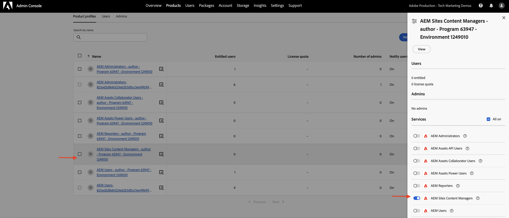

# 叫用以OpenAPI為基礎的AEM API，以進行伺服器對伺服器的驗證{#invoke-openapi-based-aem-apis}

瞭解如何使用&#x200B;_OAuth伺服器對伺服器_&#x200B;驗證，從自訂應用程式在AEM as a Cloud Service上設定及叫用OpenAPI型AEM API。

OAuth伺服器對伺服器驗證適用於需要API存取而不需使用者互動的後端服務。 它使用OAuth 2.0 _client_credentials_&#x200B;授權型別來驗證使用者端應用程式。

>[!AVAILABILITY]
>
>以OpenAPI為基礎的AEM API屬於搶先存取計畫的一部分。 如果您有興趣存取這些檔案，建議您傳送電子郵件至[aem-apis@adobe.com](mailto:aem-apis@adobe.com)，並提供使用案例的說明。

在本教學課程中，您將學習如何：

- 為您的AEM as a Cloud Service環境啟用OpenAPI型AEM API存取權。
- 建立並設定Adobe Developer Console (ADC)專案，以使用&#x200B;_OAuth伺服器對伺服器驗證_&#x200B;存取AEM API。
- 開發範例NodeJS應用程式，呼叫Assets Author API以擷取特定資產的中繼資料。

開始之前，請確定您已檢閱[存取AdobeAPI和相關概念](overview.md#accessing-adobe-apis-and-related-concepts)區段。

## 先決條件

若要完成本教學課程，您需要：

- 更新的AEM as a Cloud Service環境，其中包含：
   - AEM版本`2024.10.18459.20241031T210302Z`或更新版本。
   - 新樣式的產品設定檔（如果環境是在2024年11月之前建立的）

- 必須在其上部署範例[WKND Sites](https://github.com/adobe/aem-guides-wknd?#aem-wknd-sites-project)專案。

- 存取[Adobe Developer Console](https://developer.adobe.com/developer-console/docs/guides/getting-started/)。

- 在本機電腦上安裝[Node.js](https://nodejs.org/en/)，以執行範例NodeJS應用程式。

## 開發步驟

高階開發步驟為：

1. AEM as a Cloud Service環境的現代化。
1. 啟用AEM API存取權。
1. 建立Adobe Developer Console (ADC)專案。
1. 設定ADC專案
   1. 新增所需的AEM API
   1. 設定其驗證
   1. 將產品設定檔與驗證設定建立關聯
1. 設定AEM執行個體以啟用ADC專案通訊
1. 開發範例NodeJS應用程式
1. 驗證端對端流程

## AEM as a Cloud Service環境的現代化

讓我們從更新AEM as a Cloud Service環境開始。 只有在環境未現代化時，才需要執行此步驟。

AEM as a Cloud Service環境的現代化需要兩個步驟，

- 更新至最新AEM發行版本
- 將新的產品設定檔新增至其中。

### 更新AEM執行個體

若要更新AEM執行個體，請在Adobe[Cloud Manager](https://my.cloudmanager.adobe.com/)的&#x200B;_環境_&#x200B;區段中，選取環境名稱旁的&#x200B;_省略符號_&#x200B;圖示，並選取&#x200B;**更新**&#x200B;選項。


然後按一下&#x200B;**提交**&#x200B;按鈕並執行建議的完整棧疊管道。


在我的案例中，Fullstack管道的名稱是&#x200B;_Dev ：： Fullstack-Deploy_，而AEM環境名稱是&#x200B;_wknd-program-dev_，在您的案例中它可能會有所不同。

### 新增產品設定檔

若要將產品設定檔新增至AEM執行個體，請在Adobe[Cloud Manager](https://my.cloudmanager.adobe.com/)的&#x200B;_環境_&#x200B;區段中，選取環境名稱旁的&#x200B;_省略符號_&#x200B;圖示，並選取&#x200B;**新增產品設定檔**&#x200B;選項。


您可以按一下環境名稱旁的&#x200B;_省略符號_&#x200B;圖示，並選取&#x200B;**管理存取權** > **作者設定檔**，以檢閱新新增的產品設定檔。

_Admin Console_&#x200B;視窗會顯示新新增的產品設定檔。


上述步驟已完成AEM as a Cloud Service環境的現代化。

## 啟用AEM API存取權

新產品設定檔可在Adobe Developer Console (ADC)中啟用OpenAPI型AEM API存取。

新增的產品設定檔與&#x200B;_服務_&#x200B;相關聯，這些服務代表具有預先定義存取控制清單(ACL)的AEM使用者群組。 _服務_&#x200B;用來控制AEM API的存取層級。

您也可以選取或取消選取與產品設定檔相關聯的&#x200B;_服務_，以減少或增加存取層級。

按一下產品設定檔名稱旁的&#x200B;_檢視詳細資料_&#x200B;圖示，即可檢閱關聯。



依預設，**AEM Assets API Users**&#x200B;服務未與任何產品設定檔建立關聯。 讓我們將其與新新增的&#x200B;**AEM管理員 — 作者 — 方案XXX — 環境XXX**&#x200B;產品設定檔建立關聯。 在此關聯之後，ADC專案的&#x200B;_資產作者API_&#x200B;可以設定OAuth伺服器對伺服器驗證，並將驗證帳戶與產品設定檔建立關聯。


請務必注意，在現代化之前，在AEM Author執行個體中，有兩個可用的產品設定檔： **AEM Administrators-XXX**&#x200B;和&#x200B;**AEM Users-XXX**。 也可以將這些現有的產品設定檔與新服務建立關聯。

## 建立Adobe Developer Console (ADC)專案

接下來，建立ADC專案以存取AEM API。

1. 使用您的Adobe ID登入[Adobe Developer Console](https://developer.adobe.com/console)。

   

1. 在&#x200B;_快速入門_&#x200B;區段中，按一下&#x200B;**建立新專案**&#x200B;按鈕。

   

1. 它會以預設名稱建立新專案。

   

1. 按一下右上角的&#x200B;**編輯專案**&#x200B;按鈕以編輯專案名稱。 提供有意義的名稱，然後按一下[儲存]。****

   

## 設定ADC專案

接下來，設定ADC專案以新增AEM API、設定其驗證，並關聯產品設定檔。

1. 若要新增AEM API，請按一下&#x200B;**新增API**&#x200B;按鈕。

   

1. 在&#x200B;_新增API_&#x200B;對話方塊中，依&#x200B;_Experience Cloud_&#x200B;篩選，並選取&#x200B;**AEM Assets作者API**&#x200B;卡片，然後按一下&#x200B;**下一步**。

   

1. 接著，在&#x200B;_設定API_&#x200B;對話方塊中，選取&#x200B;**伺服器對伺服器**&#x200B;驗證選項，然後按一下&#x200B;**下一步**。 伺服器對伺服器驗證適用於需要API存取而不需使用者互動的後端服務。

   

1. 重新命名認證以方便識別（如有需要），然後按一下&#x200B;**下一步**。 為了示範目的，會使用預設名稱。

   

1. 選取&#x200B;**AEM管理員 — 作者 — 方案XXX — 環境XXX**&#x200B;產品設定檔，然後按一下&#x200B;**儲存**。 如您所見，僅與AEM Assets API Users Service相關聯的產品設定檔可供選取。

   

1. 檢閱AEM API和驗證設定。

   

   


## 設定AEM執行個體以啟用ADC專案通訊

若要啟用ADC Project的OAuth伺服器對伺服器認證ClientID來與AEM執行個體通訊，您必須設定AEM執行個體。

這是透過在AEM專案的`config.yaml`檔案中定義組態來完成。 然後，使用Cloud Manager中的設定管道來部署`config.yaml`檔案。

1. 在AEM專案中，從`config`資料夾尋找或建立`config.yaml`檔案。

   

1. 將下列設定新增至`config.yaml`檔案。

   ```yaml
   kind: "API"
   version: "1.0"
   metadata: 
       envTypes: ["dev", "stage", "prod"]
   data:
       allowedClientIDs:
           author:
           - "<ADC Project's OAuth Server-to-Server credential ClientID>"
   ```

   以ADC專案的OAuth伺服器對伺服器認證的實際ClientID取代`<ADC Project's OAuth Server-to-Server credential ClientID>`。 此教學課程中使用的API端點僅可在作者層級使用，但對於其他API，yaml設定也可以有&#x200B;_發佈_&#x200B;或&#x200B;_預覽_&#x200B;節點。

1. 將設定變更提交至Git存放庫並將變更推送至遠端存放庫。

1. 使用Cloud Manager中的設定管道來部署上述變更。 請注意，也可以使用命令列工具將`config.yaml`檔案安裝在RDE中。

   

## 開發範例NodeJS應用程式

讓我們開發一個呼叫Assets Author API的範例NodeJS應用程式。

您可以使用其他程式語言（如Java、Python等）來開發應用程式。

為了測試目的，您可以使用[Postman](https://www.postman.com/)、[curl](https://curl.se/)或任何其他REST使用者端來叫用AEM API。

### 檢閱API

在開發應用程式之前，請先檢閱&#x200B;_Assets作者API_&#x200B;中的[傳遞指定資產的中繼資料](https://developer.adobe.com/experience-cloud/experience-manager-apis/api/experimental/assets/author/#operation/getAssetMetadata)端點。 API語法為：

```http
GET https://{bucket}.adobeaemcloud.com/adobe/assets/{assetId}/metadata
```

若要擷取特定資產的中繼資料，您需要`bucket`和`assetId`值。 `bucket`是不含Adobe網域名稱(.adobeaemcloud.com)的AEM執行個體名稱，例如`author-p63947-e1420428`。

`assetId`是首碼為`urn:aaid:aem:`之資產的JCR UUID，例如`urn:aaid:aem:a200faf1-6d12-4abc-bc16-1b9a21f870da`。 有多種方式可取得`assetId`：

- 附加AEM資產路徑`.json`副檔名以取得資產中繼資料。 例如，`https://author-p63947-e1420429.adobeaemcloud.com/content/dam/wknd-shared/en/adventures/cycling-southern-utah/adobestock-221043703.jpg.json`並尋找`jcr:uuid`屬性。

- 或者，您可以在瀏覽器的元素檢查器中檢查資產，以取得`assetId`。 尋找`data-id="urn:aaid:aem:..."`屬性。

  

### 使用瀏覽器叫用API

在開發應用程式之前，請先使用[API檔案](https://developer.adobe.com/experience-cloud/experience-manager-apis/api/experimental/assets/author/#operation/getAssetMetadata)中的&#x200B;**嘗試它**&#x200B;功能叫用API。

1. 在瀏覽器中開啟[Assets作者API檔案](https://developer.adobe.com/experience-cloud/experience-manager-apis/api/experimental/assets/author)。

1. 展開&#x200B;_中繼資料_&#x200B;區段，然後按一下&#x200B;**傳遞指定資產的中繼資料**&#x200B;選項。

1. 在右窗格中，按一下&#x200B;**嘗試它**按鈕。
   

1. 輸入下列值：
   1. `bucket`值是不含Adobe網域名稱(.adobeaemcloud.com)的AEM執行個體名稱，例如`author-p63947-e1420428`。

   1. 已從ADC專案的OAuth伺服器對伺服器認證取得&#x200B;**安全性**&#x200B;區段相關的`Bearer Token`和`X-Api-Key`值。 按一下&#x200B;**產生存取權杖**&#x200B;以取得`Bearer Token`值，並使用`ClientID`值做為`X-Api-Key`。
      

   1. **引數**&#x200B;區段相關的`assetId`值是AEM中資產的唯一識別碼。 `X-Adobe-Accept-Experimental`設定為1。

      

1. 按一下&#x200B;**傳送**&#x200B;以叫用API。

1. 檢閱&#x200B;**回應**&#x200B;標籤以檢視API回應。

   

上述步驟確認AEM as a Cloud Service環境的現代化，啟用AEM API存取。 它也會確認ADC專案的成功設定，以及與AEM編寫執行個體的OAuth伺服器對伺服器認證ClientID通訊。

### NodeJS應用程式範例

讓我們開發一個範例NodeJS應用程式。

若要開發應用程式，您可以使用&#x200B;_Run-the-sample-application_&#x200B;或&#x200B;_逐步開發_&#x200B;指示。


>[!BEGINTABS]

>[!TAB Run-the-sample-application]

1. 下載範例[demo-nodejs-app-to-invoke-aem-openapi](assets/demo-nodejs-app-to-invoke-aem-openapi.zip)應用程式zip檔案並解壓縮。

1. 導覽至解壓縮的資料夾並安裝相依性。

   ```bash
   $ npm install
   ```

1. 以ADC專案的OAuth伺服器對伺服器認證中的實際值取代`.env`檔案中的預留位置。

1. 將`src/index.js`檔案中的`<BUCKETNAME>`和`<ASSETID>`取代為實際值。

1. 執行NodeJS應用程式。

   ```bash
   $ node src/index.js
   ```

>[!TAB 逐步開發]

1. 建立新的NodeJS專案。

   ```bash
   $ mkdir demo-nodejs-app-to-invoke-aem-openapi
   $ cd demo-nodejs-app-to-invoke-aem-openapi
   $ npm init -y
   ```

1. 安裝&#x200B;_擷取_&#x200B;和&#x200B;_dotenv_&#x200B;程式庫，分別發出HTTP要求並讀取環境變數。

   ```bash
   $ npm install node-fetch
   $ npm install dotenv
   ```

1. 在您最愛的程式碼編輯器中開啟專案，並更新`package.json`檔案以將`type`新增至`module`。

   ```json
   {
       ...
       "version": "1.0.0",
       "type": "module",
       "main": "index.js",
       ...
   }
   ```

1. 建立`.env`檔案並新增下列組態。 將預留位置取代為ADC專案的OAuth伺服器對伺服器認證中的實際值。

   ```properties
   CLIENT_ID=<ADC Project OAuth Server-to-Server credential ClientID>
   CLIENT_SECRET=<ADC Project OAuth Server-to-Server credential Client Secret>
   SCOPES=<ADC Project OAuth Server-to-Server credential Scopes>
   ```

1. 建立`src/index.js`檔案並新增下列程式碼，並以實際值取代`<BUCKETNAME>`和`<ASSETID>`。

   ```javascript
   // Import the dotenv configuration to load environment variables from the .env file
   import "dotenv/config";
   
   // Import the fetch function to make HTTP requests
   import fetch from "node-fetch";
   
   // REPLACE THE FOLLOWING VALUES WITH YOUR OWN
   const bucket = "<BUCKETNAME>"; // Bucket name is the AEM instance name (e.g. author-p63947-e1420428)
   const assetId = "<ASSETID>"; // Asset ID is the unique identifier for the asset in AEM (e.g. urn:aaid:aem:a200faf1-6d12-4abc-bc16-1b9a21f870da). You can get it by inspecting the asset in browser's element inspector, look for data-id="urn:aaid:aem:..."
   
   // Load environment variables for authentication
   const clientId = process.env.CLIENT_ID; // Adobe IMS client ID
   const clientSecret = process.env.CLIENT_SECRET; // Adobe IMS client secret
   const scopes = process.env.SCOPES; // Scope for the API access
   
   // Adobe IMS endpoint for obtaining an access token
   const adobeIMSV3TokenEndpointURL =
   "https://ims-na1.adobelogin.com/ims/token/v3";
   
   // Function to obtain an access token from Adobe IMS
   const getAccessToken = async () => {
       console.log("Getting access token from IMS"); // Log process initiation
       //console.log("Client ID: " + clientId); // Display client ID for debugging purposes
   
       // Configure the HTTP POST request to fetch the access token
       const options = {
           method: "POST",
           headers: {
           "Content-Type": "application/x-www-form-urlencoded", // Specify form data content type
           },
           // Send client ID, client secret, and scopes as the request body
           body: `grant_type=client_credentials&client_id=${clientId}&client_secret=${clientSecret}&scope=${scopes}`,
       };
   
       // Make the HTTP request to fetch the access token
       const response = await fetch(adobeIMSV3TokenEndpointURL, options);
   
       //console.log("Response status: " + response.status); // Log the HTTP status for debugging
   
       const responseJSON = await response.json(); // Parse the JSON response
   
       console.log("Access token received"); // Log success message
   
       // Return the access token
       return responseJSON.access_token;
   };
   
   // Function to retrieve metadata for a specific asset from AEM
   const getAssetMetadat = async () => {
       // Fetch the access token using the getAccessToken function
       const accessToken = await getAccessToken();
   
       console.log("Getting asset metadata from AEM");
   
       // Invoke the Assets Author API to retrieve metadata for a specific asset
       const resp = await fetch(
           `https://${bucket}.adobeaemcloud.com/adobe/assets/${assetId}/metadata`, // Construct the URL with bucket and asset ID
           {
           method: "GET",
           headers: {
               "If-None-Match": "string", // Header to handle caching (not critical for this tutorial)
               "X-Adobe-Accept-Experimental": "1", // Header to enable experimental Adobe API features
               Authorization: "Bearer " + accessToken, // Provide the access token for authorization
               "X-Api-Key": clientId, // Include the OAuth S2S ClientId for identification
           },
           }
       );
   
       const data = await resp.json(); // Parse the JSON response
   
       console.log("Asset metadata received"); // Log success message
       console.log(data); // Display the retrieved metadata
   };
   
   // Call the getAssets function to start the process
   getAssetMetadat();
   ```

1. 執行NodeJS應用程式。

   ```bash
   $ node src/index.js
   ```

>[!ENDTABS]

### API回應

成功執行後，主控台中會顯示API回應。 回應包含指定資產的中繼資料。

```json
{
  "assetId": "urn:aaid:aem:9c09ff70-9ee8-4b14-a5fa-ec37baa0d1b3",
  "assetMetadata": {    
    ...
    "dc:title": "A Young Mountain Biking Couple Takes A Minute To Take In The Scenery",
    "xmp:CreatorTool": "Adobe Photoshop Lightroom Classic 7.5 (Macintosh)",
    ...
  },
  "repositoryMetadata": {
    ...
    "repo:name": "adobestock-221043703.jpg",
    "repo:path": "/content/dam/wknd-shared/en/adventures/cycling-southern-utah/adobestock-221043703.jpg",
    "repo:state": "ACTIVE",
    ...
  }
}
```

恭喜！您已成功使用OAuth伺服器對伺服器驗證，從自訂應用程式叫用以OpenAPI為基礎的AEM API。

### 檢閱應用程式程式碼

範例NodeJS應用程式程式碼中的關鍵圖說文字為：

1. **IMS驗證**：已在ADC專案中使用OAuth伺服器對伺服器認證設定擷取存取權杖。

   ```javascript
   // Function to obtain an access token from Adobe IMS
   const getAccessToken = async () => {
   
       // Configure the HTTP POST request to fetch the access token
       const options = {
           method: "POST",
           headers: {
           "Content-Type": "application/x-www-form-urlencoded", // Specify form data content type
           },
           // Send client ID, client secret, and scopes as the request body
           body: `grant_type=client_credentials&client_id=${clientId}&client_secret=${clientSecret}&scope=${scopes}`,
       };
   
       // Make the HTTP request to fetch the access token from Adobe IMS token endpoint https://ims-na1.adobelogin.com/ims/token/v3
       const response = await fetch(adobeIMSV3TokenEndpointURL, options);
   
       const responseJSON = await response.json(); // Parse the JSON response
   
       // Return the access token
       return responseJSON.access_token;
   };
   ...
   ```

1. **API引動**：叫用Assets Author API，以提供授權的存取權杖來擷取特定資產的中繼資料。

   ```javascript
   // Function to retrieve metadata for a specific asset from AEM
   const getAssetMetadat = async () => {
       // Fetch the access token using the getAccessToken function
       const accessToken = await getAccessToken();
   
       console.log("Getting asset metadata from AEM");
   
       // Invoke the Assets Author API to retrieve metadata for a specific asset
       const resp = await fetch(
           `https://${bucket}.adobeaemcloud.com/adobe/assets/${assetId}/metadata`, // Construct the URL with bucket and asset ID
           {
           method: "GET",
           headers: {
               "If-None-Match": "string", // Header to handle caching (not critical for this tutorial)
               "X-Adobe-Accept-Experimental": "1", // Header to enable experimental Adobe API features
               Authorization: "Bearer " + accessToken, // Provide the access token for authorization
               "X-Api-Key": clientId, // Include the OAuth S2S ClientId for identification
           },
           }
       );
   
       const data = await resp.json(); // Parse the JSON response
   
       console.log("Asset metadata received"); // Log success message
       console.log(data); // Display the retrieved metadata
   };
   ...
   ```

## 摘要

在本教學課程中，您已瞭解如何從自訂應用程式叫用OpenAPI型AEM API。 您已啟用AEM API存取，並建立和設定Adobe Developer Console (ADC)專案。
在ADC專案中，您已新增AEM API、設定其驗證型別，並與產品設定檔建立關聯。 您也將AEM例項設定為啟用ADC專案通訊，並開發呼叫Assets Author API的範例NodeJS應用程式。
