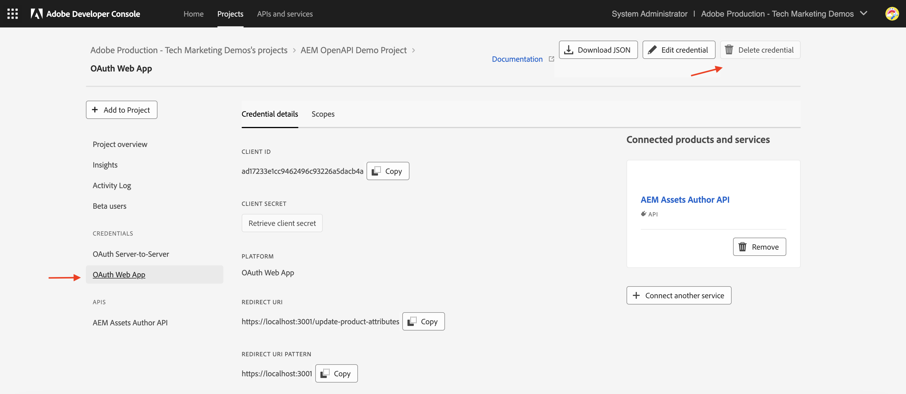

# API認證和產品設定檔管理

瞭解如何管理OpenAPI型AEM API的&#x200B;_認證和產品設定檔_。

在本教學課程中，您將瞭解如何新增或移除：

- _認證_：提供AEM API的驗證。
- _產品設定檔_：提供憑證的許可權（或授權）以存取AEM資源。

## 背景

使用AEM API時，您需要在Adobe Developer Console （或ADC）專案中定義&#x200B;_認證_&#x200B;和&#x200B;_產品設定檔_。 在以下熒幕擷圖中，您可以看到AEM Assets作者API的&#x200B;_認證_&#x200B;和&#x200B;_產品設定檔_：

_認證_&#x200B;提供API的驗證機制。 _產品設定檔_&#x200B;授予&#x200B;_許可權（或授權）_&#x200B;給認證，以存取AEM資源。 API要求可以代表應用程式或使用者。

產品設定檔與一或多個&#x200B;_服務_&#x200B;相關聯。 在AEM as a Cloud Service中，_服務_&#x200B;代表具有預先定義之存放庫節點存取控制清單(ACL)的使用者群組，允許精細的許可權管理。

成功引發API後，會在AEM作者服務中建立代表ADC專案憑證的使用者，以及符合產品設定檔和服務設定的使用者群組。

在上述案例中，使用者`1323d2...`是在AEM Author服務中建立的，並且是使用者群組`AEM Assets Collaborator Users - Service`和`AEM Assets Collaborator Users - author - Program XXX - Environment XXX`的成員。

## 新增或移除認證

AEM API支援下列型別的驗證認證：

1. **OAuth伺服器對伺服器**：專為機器對機器互動所設計。
1. **OAuth網頁應用程式**：專為使用者端應用程式中與後端伺服器的使用者導向互動所設計。
1. **OAuth Single Page App**：專為使用者端應用程式中沒有後端伺服器的使用者導向互動所設計。

您可以使用不同型別的憑證來支援各種使用案例。

所有認證都會在您的ADC專案中進行管理。

>[!BEGINTABS]

>[!TAB 新增認證]

若要新增AEM API的認證，請移至ADC專案的&#x200B;**API**&#x200B;區段，然後按一下&#x200B;**連線其他認證**。 然後，按照您特定認證型別的指示操作。

>[!TAB 移除認證]

若要移除AEM API認證，請在ADC專案的&#x200B;**API**&#x200B;區段中選取它，然後按一下&#x200B;**刪除認證**。

>[!ENDTABS]

## 新增或移除產品設定檔

_產品設定檔_&#x200B;提供認證的&#x200B;_許可權（或授權）_&#x200B;以存取AEM資源。 _產品設定檔_&#x200B;提供的許可權是以與&#x200B;_產品設定檔_&#x200B;相關聯的&#x200B;_服務_&#x200B;為基礎。 大部分&#x200B;_服務_&#x200B;透過與&#x200B;_服務_&#x200B;具有相同名稱的AEM執行個體中的使用者群組，提供對AEM資源的&#x200B;_讀取_&#x200B;許可權。

有時憑證（亦稱為技術帳戶使用者）需要其他許可權，例如AEM資源的&#x200B;_建立、更新、刪除_ (CUD)。 在這種情況下，您需要新增與提供必要許可權的&#x200B;_服務_&#x200B;相關聯的新&#x200B;_產品設定檔_。

例如，當AEM Assets Author API引動收到非GET請求的[403錯誤](../use-cases/invoke-api-using-oauth-s2s.md#403-error-for-non-get-requests)時，您可以新增&#x200B;**AEM Administrators - author - Program XXX - Environment XXX** _產品設定檔_&#x200B;以解決此問題。

>[!CAUTION]
>
>**AEM Administrators**&#x200B;服務提供&#x200B;_完整_ Experience Manager管理存取權。 或者，您可以更新[服務許可權](./services-user-group-permission-management.md)以僅提供必要許可權。

>[!BEGINTABS]

>[!TAB 新增產品設定檔]

若要為AEM API新增產品設定檔，請在ADC專案的&#x200B;**API**&#x200B;區段中按一下&#x200B;**編輯產品設定檔**，在&#x200B;**設定API**&#x200B;對話方塊中選取所需的產品設定檔，然後儲存變更。

    ！[編輯產品設定檔](../assets/how-to/edit-product-profiles.png)

選取與所需服務相關聯的所需產品設定檔(例如&#x200B;**AEM Administrators - author - Program XXX - Environment XXX**)，然後儲存變更。

    ！[選取產品設定檔](../assets/how-to/select-product-profile.png)

請注意，**AEM管理員 — 作者 — 方案XXX — 環境XXX**&#x200B;產品設定檔與&#x200B;**AEM管理員**&#x200B;服務和&#x200B;**AEM Assets API使用者**&#x200B;服務皆有關聯。 如果沒有後者，產品設定檔將不會顯示在可用的產品設定檔清單中。

    ！[產品設定檔服務](../assets/how-to/product-profile-services.png)

更新資產中繼資料的&#x200B;**PATCH**&#x200B;請求現在應該可以正常運作，而不會發生問題。

    ！[PATCH要求](../assets/how-to/patch-request.png)

>[!TAB 移除產品設定檔]

若要移除AEM API的產品設定檔，請在ADC專案的&#x200B;**API**&#x200B;區段中按一下&#x200B;**編輯產品設定檔**，在&#x200B;**設定API**對話方塊中取消選取所需的產品設定檔，然後儲存變更。

>[!ENDTABS]

## 摘要

您已瞭解如何使用Adobe Developer Console (ADC)專案中的&#x200B;_憑證和產品設定檔_&#x200B;來變更AEM API的驗證機制和許可權。
