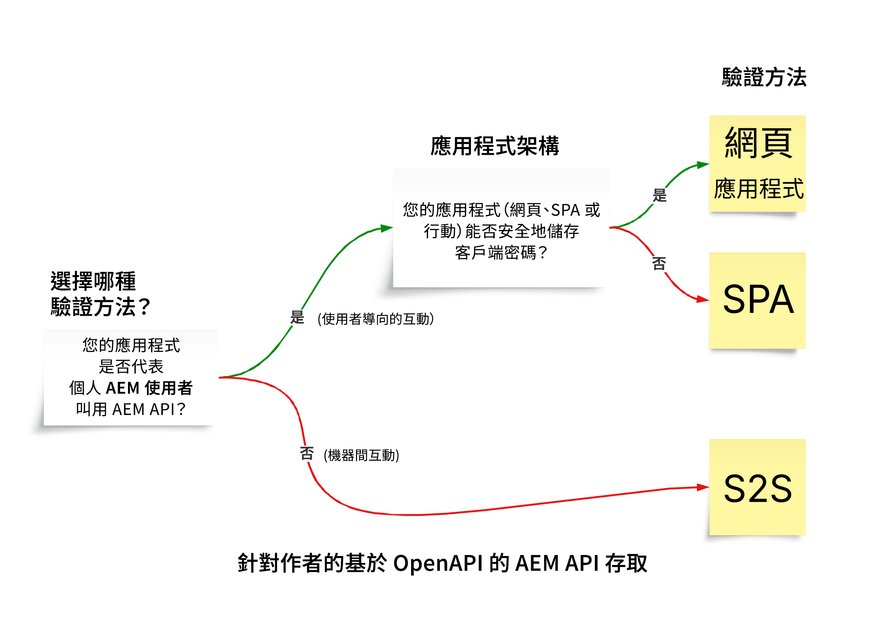

# 基於 OpenAPI 的 AEM API

>[!IMPORTANT]
>
>基於 OpenAPI 的 AEM API 只有在 AEM as a Cloud Service 中可以使用，而且與 AEM 6.X 不相容。

了解基於 OpenAPI 的 AEM API，包括驗證支援、主要概念，以及如何存取 Adobe API。

[OpenAPI 規格](https://swagger.io/specification/) (以前稱為 Swagger) 是用於定義 RESTful API 的廣泛使用標準。AEM as a Cloud Service 提供多個以 OpenAPI 規格為基礎的 API (或簡單稱為基於 OpenAPI 的 AEM API)，因此可以更輕鬆地建立與 AEM 的製作或發佈服務類型互動的自訂應用程式。以下是一些範例：

**Sites**

- [Sites API](https://developer.adobe.com/experience-cloud/experience-manager-apis/api/stable/sites/)：使用內容片段時適用的 API。

**資產**

- [資料夾 API](https://developer.adobe.com/experience-cloud/experience-manager-apis/api/experimental/folders/)：使用資料夾時適用的 API，例如建立、列出和刪除資料夾。

- [資產製作 API](https://developer.adobe.com/experience-cloud/experience-manager-apis/api/experimental/assets/author/)：使用資產及其中繼資料時適用的 API。

**表單**

- [表單通訊 API](https://developer.adobe.com/experience-cloud/experience-manager-apis/api/experimental/document/)：使用表單和文件時適用的 API。

在未來的版本中，將會增加更多基於 OpenAPI 的 AEM API 來支援更多使用案例。

## 驗證支援{#authentication-support}

基於 OpenAPI 的 AEM API 支援 OAuth 2.0 驗證，包括以下授權憑證類型：

- **OAuth 伺服器對伺服器認證**：非常適合需要 API 存取而無使用者互動的後端服務。其使用 _client_credentials_ 授權憑證類型，可以在伺服器層級進行安全存取管理。如需詳細資訊，請參閱 [OAuth 伺服器對伺服器認證](https://developer.adobe.com/developer-console/docs/guides/authentication/ServerToServerAuthentication/#oauth-server-to-server-credential)。

- **OAuth 網頁應用程式認證**：適用於擁有代表使用者存取 AEM API 的前端和&#x200B;_後端_&#x200B;元件的網頁應用程式。其使用 _authorization_code_ 授權憑證類型，其中後端伺服器安全地管理密碼和權杖。如需詳細資訊，請參閱 [OAuth 網頁應用程式認證](https://developer.adobe.com/developer-console/docs/guides/authentication/UserAuthentication/implementation#oauth-web-app-credential)。

- **OAuth 單頁應用程式認證**：專為在瀏覽器中運作的 SPA 所設計，其需要代表使用者存取 API 而無後端伺服器。其使用 _authorization_code_ 授權憑證類型，並依賴使用 PKCE (Proof Key for Code Exchange) 的用戶端安全性機制來保護授權代碼流程。如需詳細資訊，請參閱 [OAuth 單頁應用程式認證](https://developer.adobe.com/developer-console/docs/guides/authentication/UserAuthentication/implementation#oauth-single-page-app-credential)。

## 要使用哪種驗證方式{#auth-method-decision}

在決定要使用哪種驗證方式時，請考量以下事項：

每當涉及 AEM 使用者內容時，使用者驗證 (網頁應用程式或單頁應用程式) 應為預設的選擇。這可確保存放庫中的所有動作都正確歸屬於已驗證的使用者，並且該使用者僅限於其擁有權限的範圍內。
使用伺服器對伺服器 (或技術系統帳戶) 代表個人使用者執行動作，會繞過安全性模型並造成權限提升和不準確稽核等風險。

## OAuth 伺服器對伺服器、網頁應用程式以及單頁應用程式認證之間的區別{#difference-between-oauth-server-to-server-vs-web-app-vs-single-page-app-credentials}

以下表格統整基於 OpenAPI 的 AEM API 支援之三種 OAuth 驗證方式之間的差異：

|  | OAuth 伺服器對伺服器 | OAuth 網頁應用程式 | OAuth 單頁應用程式 (SPA) |
| --- | --- | --- | --- |
| **驗證目的** | 專為機器對機器互動所設計。 | 專為具有&#x200B;_後端_&#x200B;之網頁應用程式中的使用者驅動互動所設計。 | 專為&#x200B;_用戶端 JavaScript 應用程式_&#x200B;中的使用者驅動互動所設計。 |
| **權杖行為** | 發出代表用戶端應用程式本身的存取權杖。 | _透過後端_&#x200B;發出代表經驗證使用者的存取權杖。 | _透過僅限前端的流程_&#x200B;發出代表經驗證使用者的存取權杖。 |
| **使用案例** | 需要 API 存取而無使用者互動的後端服務。 | 具有前端和後端元件代表使用者存取 API 的網頁應用程式。 | 代表使用者存取 API 而無需後端的純前端 (JavaScript) 應用程式。 |
| **安全性考量** | 安全地將敏感認證 (`client_id`、`client_secret`) 儲存於後端系統中。 | 使用者驗證後，會&#x200B;_透過後端呼叫授予他們本身的臨時存取權杖_。安全地將敏感認證 (`client_id`、`client_secret`) 儲存於後端系統中，藉以交換存取權杖的授權碼。 | 使用者驗證後，會&#x200B;_透過前端呼叫授予他們自己的臨時存取權杖_。請勿使用 `client_secret`，因為將其儲存在前端應用程式中並不安全。依靠 PKCE 來交換存取權杖的授權碼。 |
| **授權憑證類型** | _client_credentials_ | _authorization_code_ | _authorization_code_ 和 **PKCE** |
| **Adobe Developer Console 認證類型** | OAuth 伺服器對伺服器 | OAuth 網頁應用程式 | OAuth 單頁應用程式 |
| **教學課程** | [使用伺服器對伺服器驗證叫用 API](./use-cases/invoke-api-using-oauth-s2s.md) | [使用網頁應用程式驗證叫用 API](./use-cases/invoke-api-using-oauth-web-app.md) | [使用單頁應用程式驗證叫用 API](./use-cases/invoke-api-using-oauth-single-page-app.md) |

## 存取 Adobe API 和相關概念{#accessing-adobe-apis-and-related-concepts}

在存取 Adobe API 之前，必須了解以下關鍵結構：

- **[Adobe Developer Console](https://developer.adobe.com/)**：用於存取 Adobe API、SDK、即時事件、無伺服器功能等的開發人員中心。請注意，其不同於 _AEM_ Developer Console，後者用於針對 AEM 應用程式進行偵錯。

- **[Adobe Developer Console 專案](https://developer.adobe.com/developer-console/docs/guides/projects/)**：管理 API 整合、事件和執行階段功能的中心位置。在這裡，您可以設定 API、設定驗證，以及產生所需的認證。

- **[產品設定檔](https://helpx.adobe.com/tw/enterprise/using/manage-product-profiles.html)**：產品設定檔提供權限預設集，讓您可以控制使用者或應用程式對於 Adobe 產品 (如 AEM、Adobe Target、Adobe Analytics 等) 的存取權。每項 Adobe 產品都有與其關聯的預定義產品設定檔。

- **服務**：服務會定義實際權限，並與產品設定檔相關聯。若要減少或增加權限預設集，您可以取消選取或選取與產品設定檔關聯的服務。因此，您可以控制對產品及其 API 的存取權等級。在 AEM as a Cloud Service 中，服務代表擁有存放庫節點之預先定義存取控制清單 (ACL) 的使用者群組，能達到精細的權限管理。

## 快速入門

了解如何建立 AEM as a Cloud Service 環境和 Adobe Developer Console 專案，以便能夠存取基於 OpenAPI 的 AEM API。也可以使用瀏覽器存取 AEM API 來驗證設定並檢閱要求和回應。

<!-- CARDS
{target = _self}

* ./setup.md
  {title = Set up OpenAPI-based AEM APIs}
  {description = Learn how to set up your AEM as a Cloud Service environment to enable access to the OpenAPI-based AEM APIs.}
  {image = ./assets/setup/OpenAPI-Setup.png}
-->
<!-- START CARDS HTML - DO NOT MODIFY BY HAND -->

    

        

            

                <figure class="image x-is-16by9">
                    
                </figure>
            

            

                

                    

                        <a href="./setup.md" target="_self" rel="referrer" title="設定基於 OpenAPI 的 AEM API">設定基於 OpenAPI 的 AEM API</a>
                    

                    
了解如何建立您的 AEM as a Cloud Service 環境，以便能夠存取基於 OpenAPI 的 AEM API。

                

                <a href="./setup.md" target="_self" rel="referrer" class="spectrum-Button spectrum-Button--outline spectrum-Button--primary spectrum-Button--sizeM" style="align-self: flex-start; margin-top: 1rem;">
                    了解更多
                </a>
            

        

    

<!-- END CARDS HTML - DO NOT MODIFY BY HAND -->

## API 教學課程

了解如何運用使用不同 OAuth 驗證方式的基於 OpenAPI 的 AEM API：

<!-- CARDS
{target = _self}

* ./use-cases/invoke-api-using-oauth-s2s.md
  {title = Invoke API using Server-to-Server authentication}
  {description = Learn how to invoke OpenAPI-based AEM APIs from a custom NodeJS application using OAuth Server-to-Server authentication.}
  {image = ./assets/s2s/OAuth-S2S.png}
* ./use-cases/invoke-api-using-oauth-web-app.md
  {title = Invoke API using Web App authentication}
  {description = Learn how to invoke OpenAPI-based AEM APIs from a custom web application using OAuth Web App authentication.}
  {image = ./assets/web-app/OAuth-WebApp.png}
* ./use-cases/invoke-api-using-oauth-single-page-app.md
  {title = Invoke API using Single Page App authentication}
  {description = Learn how to invoke OpenAPI-based AEM APIs from a custom Single Page App (SPA) using OAuth Single Page App authentication.}
  {image = ./assets/spa/OAuth-SPA.png}  
-->
<!-- START CARDS HTML - DO NOT MODIFY BY HAND -->

    

        

            

                <figure class="image x-is-16by9">
                    
                </figure>
            

            

                

                    

                        <a href="./use-cases/invoke-api-using-oauth-s2s.md" target="_self" rel="referrer" title="使用伺服器對伺服器驗證叫用 API">使用伺服器對伺服器驗證叫用 API</a>
                    

                    
了解如何使用 OAuth 伺服器對伺服器驗證，從自訂 NodeJS 應用程式叫用基於 OpenAPI 的 AEM API。

                

                <a href="./use-cases/invoke-api-using-oauth-s2s.md" target="_self" rel="referrer" class="spectrum-Button spectrum-Button--outline spectrum-Button--primary spectrum-Button--sizeM" style="align-self: flex-start; margin-top: 1rem;">
                    了解更多
                </a>
            

        

    

    

        

            

                <figure class="image x-is-16by9">
                    
                </figure>
            

            

                

                    

                        <a href="./use-cases/invoke-api-using-oauth-web-app.md" target="_self" rel="referrer" title="使用網頁應用程式驗證叫用 API">使用網頁應用程式驗證叫用 API</a>
                    

                    
了解如何使用 OAuth 網頁應用程式驗證從自訂網頁應用程式叫用基於 OpenAPI 的 AEM API。

                

                <a href="./use-cases/invoke-api-using-oauth-web-app.md" target="_self" rel="referrer" class="spectrum-Button spectrum-Button--outline spectrum-Button--primary spectrum-Button--sizeM" style="align-self: flex-start; margin-top: 1rem;">
                    了解更多
                </a>
            

        

    

    

        

            

                <figure class="image x-is-16by9">
                    
                </figure>
            

            

                

                    

                        <a href="./use-cases/invoke-api-using-oauth-single-page-app.md" target="_self" rel="referrer" title="使用單頁應用程式驗證叫用 API">使用單頁應用程式驗證叫用 API</a>
                    

                    
了解如何使用 OAuth 單頁應用程式驗證從自訂單頁應用程式 (SPA) 叫用基於 OpenAPI 的 AEM API。

                

                <a href="./use-cases/invoke-api-using-oauth-single-page-app.md" target="_self" rel="referrer" class="spectrum-Button spectrum-Button--outline spectrum-Button--primary spectrum-Button--sizeM" style="align-self: flex-start; margin-top: 1rem;">
                    了解更多
                </a>
            

        

    

<!-- END CARDS HTML - DO NOT MODIFY BY HAND -->
