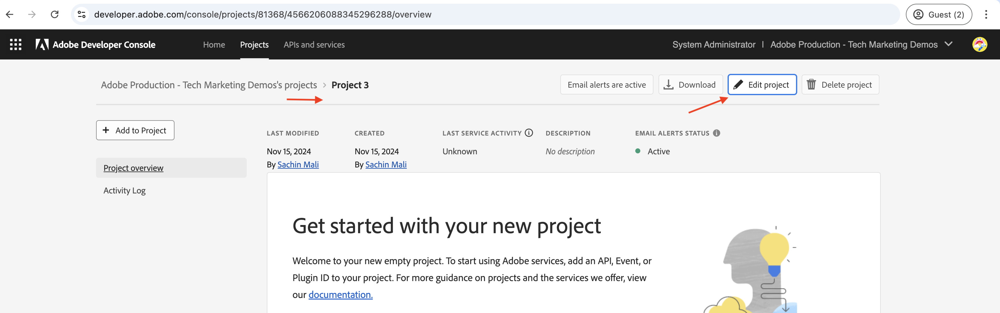

# 設定OpenAPI型AEM API

瞭解如何設定您的AEM as a Cloud Service環境，以啟用對OpenAPI型AEM API的存取權。

>[!AVAILABILITY]
>
>以OpenAPI為基礎的AEM API可作為搶先存取計畫的一部分提供。 如果您有興趣存取這些檔案，建議您傳送電子郵件至[aem-apis@adobe.com](mailto:aem-apis@adobe.com)，並提供使用案例的說明。

高層級設定程式涉及下列步驟：

1. AEM as a Cloud Service環境的現代化。
1. 啟用AEM API存取權。
1. 建立Adobe Developer Console (ADC)專案。
1. 設定ADC專案
1. 設定AEM執行個體以啟用ADC專案通訊。

## AEM as a Cloud Service環境的現代化

AEM as a Cloud Service環境的現代化是一項針對每個環境的一次性活動，其中涉及以下步驟：

- 更新至AEM版本&#x200B;**2024.10.18459.20241031T210302Z**&#x200B;或更新版本。
- 如果環境是在2024.10.18459.20241031T210302Z版之前建立，請新增產品設定檔。

### 更新AEM執行個體

若要更新AEM執行個體，請在Adobe [Cloud Manager](https://my.cloudmanager.adobe.com/)的&#x200B;_環境_&#x200B;區段中，選取環境名稱旁的&#x200B;_省略符號_&#x200B;圖示，並選取&#x200B;**更新**&#x200B;選項。


然後按一下&#x200B;**提交**&#x200B;按鈕並執行&#x200B;_建議_&#x200B;全棧疊管道。


在我的案例中，Fullstack管道名為&#x200B;**Dev ：： Fullstack-Deploy**，而AEM環境名為&#x200B;**wknd-program-dev**。 您的名稱可能不同。

### 新增產品設定檔

若要將產品設定檔新增至AEM執行個體，請在Adobe [Cloud Manager](https://my.cloudmanager.adobe.com/)的&#x200B;_環境_&#x200B;區段中，選取環境名稱旁的&#x200B;_省略符號_&#x200B;圖示，並選取&#x200B;**新增產品設定檔**&#x200B;選項。


您可以按一下環境名稱旁的&#x200B;_省略符號_&#x200B;圖示，並選取&#x200B;**管理存取權** > **作者設定檔**，以檢閱新新增的產品設定檔。

_Admin Console_&#x200B;視窗會顯示新新增的產品設定檔。


上述步驟已完成AEM as a Cloud Service環境的現代化。

## 啟用AEM API存取權

_新產品設定檔_&#x200B;的存在會在Adobe Developer Console (ADC)中啟用OpenAPI型AEM API存取。 回想一下，[Adobe Developer Console (ADC)](./overview.md#accessing-adobe-apis-and-related-concepts)是存取Adobe API、SDK、即時事件、無伺服器函式等的開發人員中心。

新增的產品設定檔與&#x200B;_服務_&#x200B;相關聯，這些服務代表&#x200B;_具有預先定義存取控制清單(ACL)_的AEM使用者群組。
_服務_&#x200B;是用來控制AEM API的存取層級。

您也可以選取或取消選取與產品設定檔相關聯的&#x200B;_服務_，以減少或增加存取層級。

按一下產品設定檔名稱旁的&#x200B;_檢視詳細資料_&#x200B;圖示，即可檢閱關聯。


依預設，**AEM Assets API Users**&#x200B;服務未與任何產品設定檔建立關聯。 讓我們將其與新新增的&#x200B;**AEM Assets Collaborator使用者 — 作者 — 方案XXX — 環境XXX**&#x200B;產品設定檔建立關聯。 在此關聯之後，ADC專案的&#x200B;_資產作者API_&#x200B;可以設定所需的驗證，並將驗證帳戶與產品設定檔建立關聯。


## 建立Adobe Developer Console (ADC)專案

ADC專案用於新增所需的API、設定其驗證，以及將驗證帳戶與產品設定檔建立關聯。

若要建立ADC專案：

1. 使用您的Adobe ID登入[Adobe Developer Console](https://developer.adobe.com/console)。

   

1. 在&#x200B;_快速入門_&#x200B;區段中，按一下&#x200B;**建立新專案**&#x200B;按鈕。

   

1. 它會以預設名稱建立新專案。

   

1. 按一下右上角的&#x200B;**編輯專案**&#x200B;按鈕以編輯專案名稱。 提供有意義的名稱，然後按一下[儲存]。****

   

## 設定ADC專案

建立ADC專案後，您必須新增所需的AEM API、設定其驗證，並將驗證帳戶與產品設定檔建立關聯。

1. 若要新增AEM API，請按一下&#x200B;**新增API**&#x200B;按鈕。

   

1. 在&#x200B;_新增API_&#x200B;對話方塊中，依&#x200B;_Experience Cloud_&#x200B;篩選，並選取所需的AEM API。 例如，在此案例中，已選取&#x200B;_資產作者API_。

   

1. 接下來，在&#x200B;_設定API_&#x200B;對話方塊中，選取所需的驗證選項。 例如，在此案例中，已選取&#x200B;**伺服器對伺服器**&#x200B;驗證選項。

   

   伺服器對伺服器驗證適用於需要API存取而不需使用者互動的後端服務。 「網頁應用程式」和「單頁應用程式」驗證選項適用於需要代表使用者存取API的應用程式。 如需詳細資訊，請參閱[ OAuth伺服器對伺服器與OAuth Web App/單頁應用程式認證之間的差異](./overview.md#difference-between-oauth-server-to-server-and-oauth-web-app-single-page-app-credentials)。

1. 如有需要，您可以重新命名API以方便識別。 為了示範目的，會使用預設名稱。

   

1. 在此情況下，驗證方法是&#x200B;**OAuth伺服器對伺服器**，因此您需要將驗證帳戶與產品設定檔建立關聯。 選取&#x200B;**AEM Assets Collaborator使用者 — 作者 — 方案XXX — 環境XXX**&#x200B;產品設定檔，然後按一下&#x200B;**儲存**。

   

1. 檢閱AEM API和驗證設定。

   

   

如果您選擇&#x200B;**OAuth網頁應用程式**&#x200B;或&#x200B;**OAuth單頁應用程式**&#x200B;驗證方法，將不會提示產品設定檔關聯，但需要應用程式重新導向URI。 應用程式重新導向URI用於在透過授權碼進行驗證後，將使用者重新導向至應用程式。 相關使用案例教學課程會概述此類驗證特定配置。

## 設定AEM執行個體以啟用ADC專案通訊

若要啟用ADC專案的ClientID以與AEM執行個體通訊，您需要設定AEM執行個體。

若要完成，請在的`config.yaml`檔案中定義API設定
AEM專案，並使用Cloud Manager中的設定管道進行部署。

1. 在AEM專案中，從`config`資料夾中找到或建立`config.yaml`檔案。

   

1. 將下列設定新增至`config.yaml`檔案。

   ```yaml
   kind: "API"
   version: "1.0"
   metadata: 
       envTypes: ["dev", "stage", "prod"]
   data:
       allowedClientIDs:
           author:
           - "<ADC Project's Credentials ClientID>"
   ```

   以ADC專案的認證值的實際ClientID取代`<ADC Project's Credentials ClientID>`。 此教學課程中使用的API端點僅可在作者層級使用，但對於其他API，yaml設定也可以有&#x200B;_發佈_&#x200B;或&#x200B;_預覽_&#x200B;節點。

   >[!CAUTION]
   >
   > 為了示範，所有環境都會使用相同的ClientID。 建議您針對每個環境（開發、階段、生產）使用個別的ClientID，以提升安全性和控制能力。

1. 提交設定變更並將變更推送到Cloud Manager管道所連線的遠端Git存放庫。

1. 使用Cloud Manager中的設定管道來部署上述變更。 請注意，也可以使用命令列工具將`config.yaml`檔案安裝在RDE中。

   

## 後續步驟

將AEM執行個體設定為啟用ADC專案通訊後，您就可以開始使用以OpenAPI為基礎的AEM API。 瞭解如何使用不同的OAuth驗證方法以OpenAPI為基礎的AEM API：

<!-- CARDS
{target = _self}

* ./use-cases/invoke-api-using-oauth-s2s.md
  {title = Invoke API using Server-to-Server authentication}
  {description = Learn how to invoke OpenAPI-based AEM APIs from a custom NodeJS application using OAuth Server-to-Server authentication.}
  {image = ./assets/s2s/OAuth-S2S.png}
* ./use-cases/invoke-api-using-oauth-web-app.md
  {title = Invoke API using Web App authentication}
  {description = Learn how to invoke OpenAPI-based AEM APIs from a custom web application using OAuth Web App authentication.}
  {image = ./assets/web-app/OAuth-WebApp.png}  
-->
<!-- START CARDS HTML - DO NOT MODIFY BY HAND -->
<div class="columns">
    <div class="column is-half-tablet is-half-desktop is-one-third-widescreen" aria-label="Invoke API using Server-to-Server authentication">
        <div class="card" style="height: 100%; display: flex; flex-direction: column; height: 100%;">
            <div class="card-image">
                <figure class="image x-is-16by9">
                    <a href="./use-cases/invoke-api-using-oauth-s2s.md" title="使用伺服器對伺服器驗證叫用API" target="_self" rel="referrer">
                        
                    </a>
                </figure>
            </div>
            <div class="card-content is-padded-small" style="display: flex; flex-direction: column; flex-grow: 1; justify-content: space-between;">
                <div class="top-card-content">
                    <p class="headline is-size-6 has-text-weight-bold">
                        <a href="./use-cases/invoke-api-using-oauth-s2s.md" target="_self" rel="referrer" title="使用伺服器對伺服器驗證叫用API">使用伺服器對伺服器驗證啟動API</a>
                    </p>
                    <p class="is-size-6">瞭解如何使用OAuth伺服器對伺服器驗證，從自訂NodeJS應用程式叫用OpenAPI型AEM API。</p>
                </div>
                <a href="./use-cases/invoke-api-using-oauth-s2s.md" target="_self" rel="referrer" class="spectrum-Button spectrum-Button--outline spectrum-Button--primary spectrum-Button--sizeM" style="align-self: flex-start; margin-top: 1rem;">
                    <span class="spectrum-Button-label has-no-wrap has-text-weight-bold">進一步瞭解</span>
                </a>
            </div>
        </div>
    </div>
    <div class="column is-half-tablet is-half-desktop is-one-third-widescreen" aria-label="Invoke API using Web App authentication">
        <div class="card" style="height: 100%; display: flex; flex-direction: column; height: 100%;">
            <div class="card-image">
                <figure class="image x-is-16by9">
                    <a href="./use-cases/invoke-api-using-oauth-web-app.md" title="使用網頁應用程式驗證叫用API" target="_self" rel="referrer">
                        
                    </a>
                </figure>
            </div>
            <div class="card-content is-padded-small" style="display: flex; flex-direction: column; flex-grow: 1; justify-content: space-between;">
                <div class="top-card-content">
                    <p class="headline is-size-6 has-text-weight-bold">
                        <a href="./use-cases/invoke-api-using-oauth-web-app.md" target="_self" rel="referrer" title="使用網頁應用程式驗證叫用API">使用網頁應用程式驗證啟動API</a>
                    </p>
                    <p class="is-size-6">瞭解如何使用OAuth網頁應用程式驗證，從自訂網頁應用程式叫用OpenAPI型AEM API。</p>
                </div>
                <a href="./use-cases/invoke-api-using-oauth-web-app.md" target="_self" rel="referrer" class="spectrum-Button spectrum-Button--outline spectrum-Button--primary spectrum-Button--sizeM" style="align-self: flex-start; margin-top: 1rem;">
                    <span class="spectrum-Button-label has-no-wrap has-text-weight-bold">進一步瞭解</span>
                </a>
            </div>
        </div>
    </div>
</div>
<!-- END CARDS HTML - DO NOT MODIFY BY HAND -->

