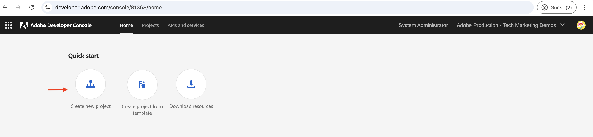
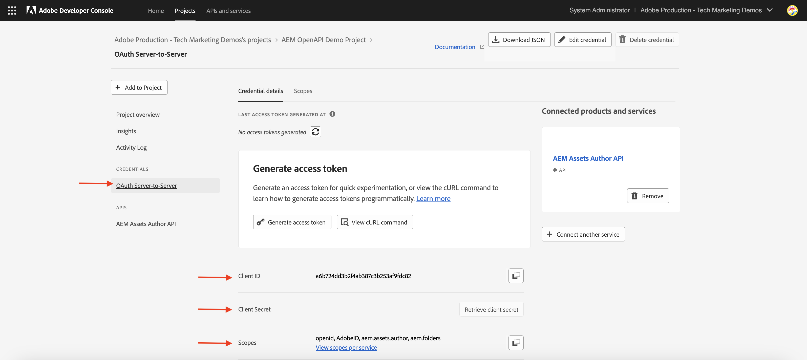

# 設定基於 OpenAPI 的 AEM API

了解如何建立您的 AEM as a Cloud Service 環境，以便能夠存取基於 OpenAPI 的 AEM API。

在此範例中，使用&#x200B;**伺服器對伺服器**&#x200B;驗證方法的&#x200B;**AEM Assets API**&#x200B;用於示範OpenAPI型AEM API設定程式。 您可以依照類似的步驟設定[其他OpenAPI型AEM API](https://developer.adobe.com/experience-cloud/experience-manager-apis/#openapi-based-apis)。

>[!VIDEO](https://video.tv.adobe.com/v/3457510?quality=12&learn=on)

高層級設定程式涉及下列步驟：

1. AEM as a Cloud Service環境的現代化。
1. 啟用AEM API存取權。
1. 建立Adobe Developer Console (ADC)專案。
1. 設定ADC專案。
1. 設定AEM執行個體以啟用ADC專案通訊。

## 先決條件

- 存取Cloud Manager和AEM as a Cloud Service環境
- 存取Adobe Developer Console (ADC)。
- 在`api.yaml`檔案中新增或更新API設定的AEM專案。

## AEM as a Cloud Service環境的現代化{#modernization-of-aem-as-a-cloud-service-environment}

AEM as a Cloud Service環境的現代化是每個環境活動&#x200B;**一次性的**，其中涉及以下步驟。 如果您已更新AEM as a Cloud Service環境，可略過此步驟。

- 更新至AEM版本&#x200B;**2024.10.18459.20241031T210302Z**&#x200B;或更新版本。
- 如果環境是在2024.10.18459.20241031T210302Z版之前建立，請新增產品設定檔。

### 更新AEM執行個體{#update-aem-instance}

- 若要更新AEM執行個體，請在登入Adobe [Cloud Manager](https://my.cloudmanager.adobe.com/)後，導覽至&#x200B;_環境_&#x200B;區段，選取環境名稱旁的&#x200B;_省略符號_&#x200B;圖示，然後選取&#x200B;**更新**&#x200B;選項。


- 然後按一下&#x200B;**提交**&#x200B;按鈕並執行&#x200B;_建議_&#x200B;全棧疊管道。


在我的案例中，Fullstack管道名為&#x200B;**Dev ：： Fullstack-Deploy**，而AEM環境名為&#x200B;**wknd-program-dev**。 您的名稱可能不同。

### 新增產品設定檔{#add-new-product-profiles}

- 若要將產品設定檔新增至AEM執行個體，請在Adobe [Cloud Manager](https://my.cloudmanager.adobe.com/)的&#x200B;_環境_&#x200B;區段中，選取環境名稱旁的&#x200B;_省略符號_&#x200B;圖示，並選取&#x200B;**新增產品設定檔**&#x200B;選項。


- 按一下環境名稱旁的&#x200B;_省略符號_&#x200B;圖示，並選取&#x200B;**管理存取權** > **作者設定檔**，以檢閱新新增的產品設定檔。

- _Admin Console_&#x200B;視窗會顯示新新增的產品設定檔。 根據您的AEM權益，如AEM Assets、AEM Sites、AEM Forms等，您可能會看到不同的產品設定檔。 例如，我擁有AEM Assets和Sites許可權，因此可檢視下列產品設定檔。


- 上述步驟已完成AEM as a Cloud Service環境的現代化。

## 啟用AEM API存取權{#enable-aem-apis-access}

_新產品設定檔_&#x200B;的存在會在[Adobe Developer Console (ADC)](https://developer.adobe.com/)中啟用OpenAPI型AEM API存取。 如果沒有這些產品設定檔，您就無法在Adobe Developer Console (ADC)中設定OpenAPI型AEM API。

新增的產品設定檔與&#x200B;_服務_&#x200B;相關聯，這些服務代表&#x200B;_具有預先定義存取控制清單(ACL)_&#x200B;的AEM使用者群組。 _服務_&#x200B;是用來控制AEM API的存取層級。 您也可以選取或取消選取與產品設定檔相關聯的&#x200B;_服務_，以減少或增加存取層級。

按一下產品設定檔名稱旁的&#x200B;_檢視詳細資料_&#x200B;圖示，即可檢閱關聯。 在下列熒幕擷圖中，您可以看到&#x200B;**AEM Sites內容管理員 — 作者 — 方案XXX — 環境XXX**&#x200B;產品設定檔與&#x200B;**AEM Sites內容管理員**&#x200B;服務的關聯。 檢閱其他產品設定檔及其與「服務」的關聯。


### 啟用AEM Assets API存取權{#enable-aem-assets-apis-access}

在此範例中，**AEM Assets API**&#x200B;用於示範OpenAPI型AEM API設定程式。 不過，依預設，**AEM Assets API Users**&#x200B;服務未與任何產品設定檔建立關聯。 您需要將其與所需的產品設定檔建立關聯。

讓我們將其與新新增的&#x200B;**AEM Assets Collaborator使用者 — 作者 — 方案XXX — 環境XXX**&#x200B;產品設定檔或您要用於AEM Assets API存取的任何其他產品設定檔建立關聯。


### 啟用伺服器對伺服器驗證

若要針對所需的OpenAPI型AEM API啟用伺服器對伺服器驗證，使用Adobe Developer Console (ADC)設定整合的使用者必須作為開發人員新增至與&#x200B;_服務_&#x200B;相關聯的&#x200B;_產品設定檔_。

例如，若要啟用AEM Assets API的伺服器對伺服器驗證，使用者必須新增為開發人員至&#x200B;**AEM Assets Collaborator使用者 — 作者 — 方案XXX — 環境XXX** _產品設定檔_。


在此關聯之後，ADC專案的&#x200B;_資產作者API_&#x200B;可以設定所需的伺服器對伺服器驗證，並將ADC專案（在下一步中建立）中的驗證帳戶與產品設定檔建立關聯。

>[!IMPORTANT]
>
>上述步驟對於啟用所需AEM API的伺服器對伺服器驗證至關重要。 若沒有此關聯，AEM API就無法與伺服器對伺服器驗證方法搭配使用。

透過執行上述所有步驟，您已準備AEM as a Cloud Service環境以啟用OpenAPI型AEM API存取。 接下來，您需要建立Adobe Developer Console (ADC)專案，以設定OpenAPI型AEM API。

## 建立Adobe Developer Console (ADC)專案{#adc-project}

Adobe Developer Console (ADC)專案是用來設定OpenAPI型AEM API。 回想一下，[Adobe Developer Console (ADC)](./overview.md#accessing-adobe-apis-and-related-concepts)是存取Adobe API、SDK、即時事件、無伺服器函式等的開發人員中心。

ADC專案用於新增所需的API、設定其驗證，以及將驗證帳戶與產品設定檔建立關聯。

若要建立ADC專案：

1. 使用您的Adobe ID登入[Adobe Developer Console](https://developer.adobe.com/console)。

   

1. 在&#x200B;_快速入門_&#x200B;區段中，按一下&#x200B;**建立新專案**&#x200B;按鈕。

   

1. 它會以預設名稱建立新專案。

   

1. 按一下右上角的&#x200B;**編輯專案**&#x200B;按鈕以編輯專案名稱。 提供有意義的名稱，然後按一下[儲存]。**&#x200B;**

   

## 設定ADC專案{#configure-adc-project}

建立ADC專案後，您必須新增所需的AEM API、設定其驗證，並將驗證帳戶與產品設定檔建立關聯。

在此案例中，**AEM Assets API**&#x200B;用於示範OpenAPI型AEM API設定程式。 不過，您可以依照類似的步驟，新增其他OpenAPI型AEM API (例如&#x200B;**AEM Sites API**、**AEM Forms API**&#x200B;等)。 AEM許可權會決定Adobe Developer Console (ADC)中可用的API。

1. 若要新增AEM API，請按一下&#x200B;**新增API**&#x200B;按鈕。

   

1. 在&#x200B;_新增API_&#x200B;對話方塊中，依&#x200B;_Experience Cloud_&#x200B;篩選，並選取所需的AEM API。 例如，在此案例中，已選取&#x200B;_資產作者API_。

   

   >[!TIP]
   >
   >    如果所需的&#x200B;**AEM API卡**&#x200B;已停用，且&#x200B;_為什麼此卡已停用？_&#x200B;資訊顯示&#x200B;**需要授權**&#x200B;訊息，其中一個原因可能是您尚未更新AEM as a Cloud Service環境，如需詳細資訊，請參閱[更新AEM as a Cloud Service環境](#modernization-of-aem-as-a-cloud-service-environment)。

1. 接下來，在&#x200B;_設定API_&#x200B;對話方塊中，選取所需的驗證選項。 例如，在此案例中，已選取&#x200B;**伺服器對伺服器**&#x200B;驗證選項。

   

   伺服器對伺服器驗證適用於需要API存取而不需使用者互動的後端服務。 「網頁應用程式」和「單頁應用程式」驗證選項適用於需要代表使用者存取API的應用程式。 如需詳細資訊，請參閱[&#x200B; OAuth伺服器對伺服器與Web應用程式與單頁應用程式認證之間的差異](./overview.md#difference-between-oauth-server-to-server-vs-web-app-vs-single-page-app-credentials)。

   >[!TIP]
   >
   >如果您沒有看到「伺服器對伺服器」驗證選項，這表示設定整合的使用者不會新增為開發人員至與服務相關聯的產品設定檔。 如需詳細資訊，請參閱[啟用伺服器對伺服器驗證](#enable-server-to-server-authentication)。


1. 如有需要，您可以重新命名API以方便識別。 為了示範目的，會使用預設名稱。

   

1. 在此情況下，驗證方法是&#x200B;**OAuth伺服器對伺服器**，因此您需要將驗證帳戶與產品設定檔建立關聯。 選取&#x200B;**AEM Assets Collaborator使用者 — 作者 — 方案XXX — 環境XXX**&#x200B;產品設定檔，然後按一下&#x200B;**儲存**。

   

1. 檢閱AEM API和驗證設定。

   

   

如果您選擇&#x200B;**OAuth網頁應用程式**&#x200B;或&#x200B;**OAuth單頁應用程式**&#x200B;驗證方法，將不會提示產品設定檔關聯，但需要應用程式重新導向URI。 應用程式重新導向URI用於在透過授權碼進行驗證後，將使用者重新導向至應用程式。 相關使用案例教學課程會概述此類驗證特定配置。

## 設定AEM執行個體以啟用ADC專案通訊{#configure-aem-instance}

接下來，您需要設定AEM執行個體以啟用上述ADC專案通訊。

若沒有此設定，ADC專案的ClientID無法與AEM執行個體通訊，並導致403禁止錯誤。 將此設定視為防火牆規則，僅允許允許允許的ClientID與AEM執行個體通訊。

讓我們依照設定AEM執行個體的步驟來啟用上述ADC專案通訊。

1. 在本機電腦上，導覽至AEM專案(或複製專案（如果尚未複製），然後找到`config`資料夾。

1. 在AEM專案中，從`api.yaml`資料夾中找到或建立`config`檔案。 以我為例，[AEM WKND Sites專案](https://github.com/adobe/aem-guides-wknd)是用來示範OpenAPI型AEM API設定程式。

   

1. 將下列設定新增至`api.yaml`檔案，以允許ADC專案的ClientID與AEM執行個體通訊。

   ```yaml
   kind: "API"
   version: "1.0"
   metadata: 
       envTypes: ["dev", "stage", "prod"]
   data:
       allowedClientIDs:
           author:
           - "<ADC Project's Credentials ClientID>"
   ```

   以ADC專案的認證值的實際ClientID取代`<ADC Project's Credentials ClientID>`。 此教學課程中使用的API端點僅可在作者層級使用，但對於其他API，yaml設定也可以有&#x200B;_發佈_&#x200B;或&#x200B;_預覽_&#x200B;節點。

   >[!CAUTION]
   >
   > 為了示範，所有環境都會使用相同的ClientID。 建議您針對每個環境（開發、階段、生產）使用個別的ClientID，以提升安全性和控制能力。

1. 提交設定變更並將變更推送到Cloud Manager管道所連線的遠端Git存放庫。

1. 在Cloud Manager中使用[設定管道](https://experienceleague.adobe.com/en/docs/experience-manager-cloud-service/content/implementing/using-cloud-manager/cicd-pipelines/introduction-ci-cd-pipelines#config-deployment-pipeline)部署上述變更。

   

請注意，`api.yaml`檔案也可以使用命令列工具[安裝在](https://experienceleague.adobe.com/en/docs/experience-manager-learn/cloud-service/developing/rde/overview)RDE[、](https://experienceleague.adobe.com/en/docs/experience-manager-learn/cloud-service/developing/rde/how-to-use#deploy-configuration-yaml-files)中。 在將設定變更部署到生產環境之前，這非常有用。

>[!CAUTION]
>
>YAML (`api.yaml`)檔案是設定AEM執行個體以啟用與ADC專案通訊的唯一方法。 此設定不支援其他方法，例如使用環境變數。


## 後續步驟

將AEM執行個體設定為啟用ADC專案通訊後，您就可以開始使用以OpenAPI為基礎的AEM API。 了解如何運用使用不同 OAuth 驗證方式的基於 OpenAPI 的 AEM API：

<!-- CARDS
{target = _self}

* ./use-cases/invoke-api-using-oauth-s2s.md
  {title = Invoke API using Server-to-Server authentication}
  {description = Learn how to invoke OpenAPI-based AEM APIs from a custom NodeJS application using OAuth Server-to-Server authentication.}
  {image = ./assets/s2s/OAuth-S2S.png}
* ./use-cases/invoke-api-using-oauth-web-app.md
  {title = Invoke API using Web App authentication}
  {description = Learn how to invoke OpenAPI-based AEM APIs from a custom web application using OAuth Web App authentication.}
  {image = ./assets/web-app/OAuth-WebApp.png}
* ./use-cases/invoke-api-using-oauth-single-page-app.md
  {title = Invoke API using Single Page App authentication}
  {description = Learn how to invoke OpenAPI-based AEM APIs from a custom Single Page App (SPA) using OAuth 2.0 PKCE flow.}
  {image = ./assets/spa/OAuth-SPA.png}  
-->
<!-- START CARDS HTML - DO NOT MODIFY BY HAND -->
<div class="columns">
    <div class="column is-half-tablet is-half-desktop is-one-third-widescreen" aria-label="Invoke API using Server-to-Server authentication">
        <div class="card" style="height: 100%; display: flex; flex-direction: column; height: 100%;">
            <div class="card-image">
                <figure class="image x-is-16by9">
                    <a href="./use-cases/invoke-api-using-oauth-s2s.md" title="使用伺服器對伺服器驗證叫用 API" target="_self" rel="referrer">
                        
                    </a>
                </figure>
            </div>
            <div class="card-content is-padded-small" style="display: flex; flex-direction: column; flex-grow: 1; justify-content: space-between;">
                <div class="top-card-content">
                    <p class="headline is-size-6 has-text-weight-bold">
                        <a href="./use-cases/invoke-api-using-oauth-s2s.md" target="_self" rel="referrer" title="使用伺服器對伺服器驗證叫用 API">使用伺服器對伺服器驗證叫用 API</a>
                    </p>
                    <p class="is-size-6">了解如何使用 OAuth 伺服器對伺服器驗證，從自訂 NodeJS 應用程式叫用基於 OpenAPI 的 AEM API。</p>
                </div>
                <a href="./use-cases/invoke-api-using-oauth-s2s.md" target="_self" rel="referrer" class="spectrum-Button spectrum-Button--outline spectrum-Button--primary spectrum-Button--sizeM" style="align-self: flex-start; margin-top: 1rem;">
                    <span class="spectrum-Button-label has-no-wrap has-text-weight-bold">了解更多</span>
                </a>
            </div>
        </div>
    </div>
    <div class="column is-half-tablet is-half-desktop is-one-third-widescreen" aria-label="Invoke API using Web App authentication">
        <div class="card" style="height: 100%; display: flex; flex-direction: column; height: 100%;">
            <div class="card-image">
                <figure class="image x-is-16by9">
                    <a href="./use-cases/invoke-api-using-oauth-web-app.md" title="使用網頁應用程式驗證叫用 API" target="_self" rel="referrer">
                        
                    </a>
                </figure>
            </div>
            <div class="card-content is-padded-small" style="display: flex; flex-direction: column; flex-grow: 1; justify-content: space-between;">
                <div class="top-card-content">
                    <p class="headline is-size-6 has-text-weight-bold">
                        <a href="./use-cases/invoke-api-using-oauth-web-app.md" target="_self" rel="referrer" title="使用網頁應用程式驗證叫用 API">使用網頁應用程式驗證叫用 API</a>
                    </p>
                    <p class="is-size-6">了解如何使用 OAuth 網頁應用程式驗證從自訂網頁應用程式叫用基於 OpenAPI 的 AEM API。</p>
                </div>
                <a href="./use-cases/invoke-api-using-oauth-web-app.md" target="_self" rel="referrer" class="spectrum-Button spectrum-Button--outline spectrum-Button--primary spectrum-Button--sizeM" style="align-self: flex-start; margin-top: 1rem;">
                    <span class="spectrum-Button-label has-no-wrap has-text-weight-bold">了解更多</span>
                </a>
            </div>
        </div>
    </div>
    <div class="column is-half-tablet is-half-desktop is-one-third-widescreen" aria-label="Invoke API using Single Page App authentication">
        <div class="card" style="height: 100%; display: flex; flex-direction: column; height: 100%;">
            <div class="card-image">
                <figure class="image x-is-16by9">
                    <a href="./use-cases/invoke-api-using-oauth-single-page-app.md" title="使用單頁應用程式驗證叫用 API" target="_self" rel="referrer">
                        
                    </a>
                </figure>
            </div>
            <div class="card-content is-padded-small" style="display: flex; flex-direction: column; flex-grow: 1; justify-content: space-between;">
                <div class="top-card-content">
                    <p class="headline is-size-6 has-text-weight-bold">
                        <a href="./use-cases/invoke-api-using-oauth-single-page-app.md" target="_self" rel="referrer" title="使用單頁應用程式驗證叫用 API">使用單頁應用程式驗證叫用 API</a>
                    </p>
                    <p class="is-size-6">瞭解如何使用OAuth 2.0 PKCE流程，從自訂單頁應用程式(SPA)叫用OpenAPI型AEM API。</p>
                </div>
                <a href="./use-cases/invoke-api-using-oauth-single-page-app.md" target="_self" rel="referrer" class="spectrum-Button spectrum-Button--outline spectrum-Button--primary spectrum-Button--sizeM" style="align-self: flex-start; margin-top: 1rem;">
                    <span class="spectrum-Button-label has-no-wrap has-text-weight-bold">了解更多</span>
                </a>
            </div>
        </div>
    </div>
</div>
<!-- END CARDS HTML - DO NOT MODIFY BY HAND -->
