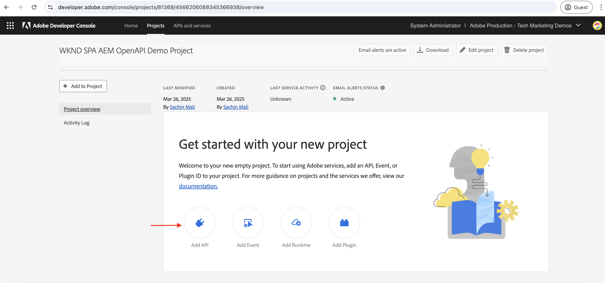
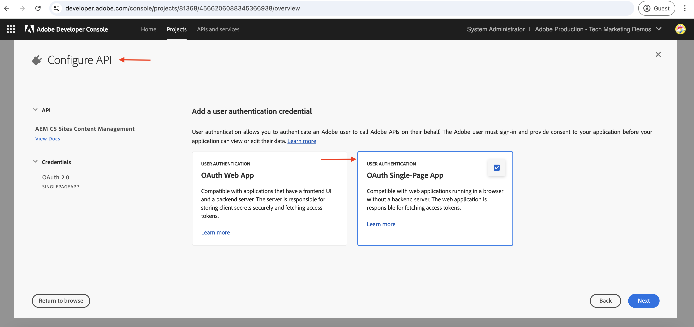
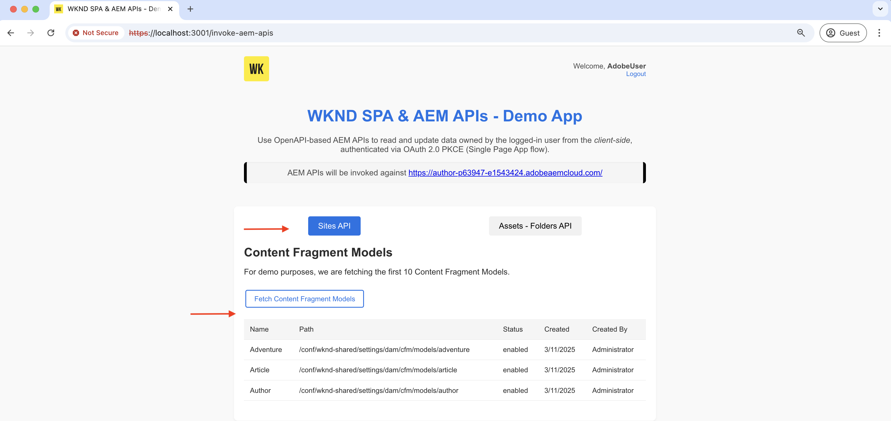
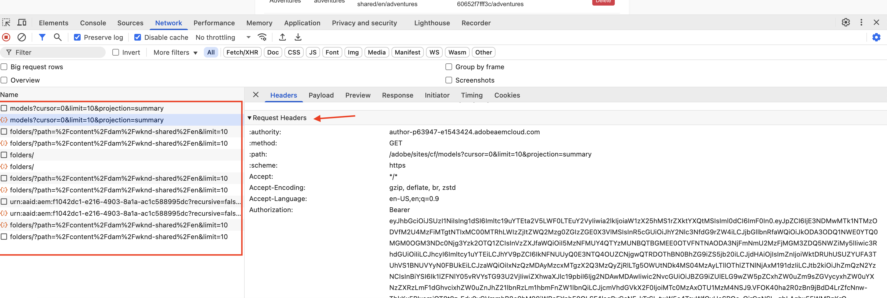

# 使用OAuth單頁應用程式叫用OpenAPI型AEM API

瞭解如何使用&#x200B;**OAuth單頁應用程式驗證**，在AEM as a Cloud Service上叫用OpenAPI型AEM API。 它遵循OAuth 2.0 PKCE （程式碼交換的Proof Key）流程，用於單頁應用程式(SPA)中的使用者型驗證。

OAuth單頁應用程式驗證非常適合在瀏覽器中執行的JavaScript型應用程式。 無論他們缺乏後端伺服器，還是需要擷取存取權杖以代表使用者與AEM API互動。

PKCE流程延伸OAuth 2.0 _authorization_code_&#x200B;授權型別，藉由防止授權代碼攔截來增強安全性。 如需詳細資訊，請參閱[OAuth伺服器對伺服器與Web應用程式與單頁應用程式認證之間的差異](../overview.md#difference-between-oauth-server-to-server-vs-web-app-vs-single-page-app-credentials)區段。

## 您能學到的內容{#what-you-learn}

在本教學課程中，您將學習如何：

- 設定Adobe Developer Console (ADC)專案，以使用&#x200B;_OAuth Single Page App_&#x200B;驗證或通常稱為&#x200B;_OAuth 2.0 PKCE流程_&#x200B;來存取OpenAPI型AEM API。

- 在自訂SPA中實作OAuth單頁應用程式驗證流程。
   - IMS使用者驗證和應用程式授權。
   - 使用OAuth 2.0 PKCE流程存取權杖擷取。
   - 使用存取權杖以叫用以OpenAPI為基礎的AEM API。

開始之前，請務必檢閱下列內容：

- [存取Adobe API和相關概念](../overview.md#accessing-adobe-apis-and-related-concepts)區段。
- [設定OpenAPI型AEM API](../setup.md)文章。

## WKND SPA概觀和功能流程{#wknd-spa-overview-and-functional-flow}

讓我們來探索什麼是WKND SPA、其建置方式及其運作方式。

WKND SPA是&#x200B;**React型單頁應用程式**，示範如何安全地取得使用者特定的存取權杖，並直接從使用者端與AEM API互動。 它會透過Adobe IMS實作OAuth 2.0 PKCE驗證流程，並與兩個關鍵AEM API整合：

1. **網站API**：用於存取內容片段模型
1. **Assets API**：用於管理DAM資料夾

Adobe Developer Console (ADC)專案已設定為啟用OAuth單頁應用程式驗證，提供必要的&#x200B;**client_id**&#x200B;以起始OAuth 2.0 PKCE流程。

>[!IMPORTANT]
>
>ADC專案未提供&#x200B;_client_secret_。 相反地，SPA會產生&#x200B;_code_verifier_&#x200B;和&#x200B;_code_challenge_，以安全地交換&#x200B;_存取權杖_&#x200B;的授權代碼。 如此一來，使用者端便無需儲存使用者端密碼，進而提升安全性。


>[!VIDEO](https://video.tv.adobe.com/v/3456964?quality=12&learn=on)


下圖說明WKND SPA _取得使用者特定存取權杖以叫用OpenAPI型AEM API_&#x200B;的功能流程：


1. SPA透過透過透過授權請求將使用者導向到Adobe Identity Management系統(IMS)來啟動驗證流程。
1. 作為授權要求的一部分，SPA會依照OAuth 2.0 PKCE流程，將&#x200B;_client_id_、_redirect_uri_&#x200B;和&#x200B;_code_challenge_&#x200B;傳送至IMS。 SPA產生隨機&#x200B;_code_verifier_，使用SHA-256進行雜湊處理，Base64會編碼結果以建立&#x200B;_code_challenge_。
1. IMS會驗證使用者，並在成功驗證後發出&#x200B;_authorization_code_，這會透過&#x200B;_redirect_uri_&#x200B;傳回SPA。
1. SPA會傳送POST要求至IMS權杖端點，以交換&#x200B;_存取權杖_&#x200B;的&#x200B;_authorization_code_。 它在驗證先前傳送的&#x200B;_code_challenge_&#x200B;的要求中包含&#x200B;_code_verifier_。 這可確保授權請求（步驟2）和權杖請求（步驟4）都與相同的驗證流程相關聯，以防止攔截攻擊。
1. IMS驗證&#x200B;_code_verifier_&#x200B;並傳回使用者特定的&#x200B;_存取權杖_。
1. SPA在對AEM發出的API要求中包含&#x200B;_存取權杖_，以驗證及擷取使用者特定內容。

WKND SPA是以[React](https://react.dev/)為基礎的應用程式，它使用[React內容](https://react.dev/reference/react/createContext)進行驗證狀態管理，[React路由器](https://reactrouter.com/home)進行導覽。

其他SPA架構(例如Angular、Vue或vanilla JavaScript)可用來建立與Adobe API整合的SPA，使用本教學課程中說明的方法。

## 如何使用本教學課程{#how-to-use-this-tutorial}

您可以透過兩種方式處理本教學課程：

- [檢閱SPA金鑰程式碼片段](#review-spa-key-code-snippets)：瞭解OAuth Single Page App驗證流程，並探索WKND SPA中的金鑰API呼叫實作。
- [設定並執行SPA](#setup-and-run-the-spa)：依照逐步指示，在本機電腦上設定並執行WKND SPA。

選擇最符合您需求的路徑！

## 檢閱SPA重要程式碼片段{#review-spa-key-code-snippets}

讓我們深入探討WKND SPA的主要程式碼片段，示範如何：

- 使用OAuth單頁應用程式驗證流程取得使用者特定存取權杖。

- 直接從使用者端叫用以OpenAPI為基礎的AEM API。

這些片段可協助您瞭解SPA內的驗證程式和API互動。

### 下載SPA程式碼{#download-the-spa-code}

1. 下載[WKND SPA和AEM API — 示範應用程式](../assets/spa/wknd-spa-with-aemapis-demo.zip) zip檔案並解壓縮。

1. 導覽至解壓縮的資料夾，並在您最愛的程式碼編輯器中開啟`.env.example`檔案。 檢閱必要的設定引數。

   ```plaintext
   ########################################################################
   # Adobe IMS, Adobe Developer Console (ADC), and AEM as a Cloud Service Information
   ########################################################################
   # Adobe IMS OAuth endpoints
   REACT_APP_ADOBE_IMS_AUTHORIZATION_ENDPOINT=https://ims-na1.adobelogin.com/ims/authorize/v2
   REACT_APP_ADOBE_IMS_TOKEN_ENDPOINT=https://ims-na1.adobelogin.com/ims/token/v3
   
   # Adobe Developer Console (ADC) Project's OAuth Single-Page App credential
   REACT_APP_ADC_CLIENT_ID=<ADC Project OAuth Single-Page App credential ClientID>
   REACT_APP_ADC_SCOPES=<ADC Project OAuth Single-Page App credential Scopes>
   
   # AEM Assets Information
   REACT_APP_AEM_ASSET_HOSTNAME=<AEMCS Hostname, e.g., https://author-p63947-e1502138.adobeaemcloud.com/>
   
   ################################################
   # Single Page Application Information
   ################################################
   
   # Enable HTTPS for local development
   HTTPS=true
   PORT=3001
   
   # SSL Certificate and Key for local development 
   SSL_CRT_FILE=./ssl/server.crt
   SSL_KEY_FILE=./ssl/server.key
   
   # The URL to which the user will be redirected after the OAuth flow is complete
   REACT_APP_REDIRECT_URI=https://localhost:3000/callback
   ```

   您需要以Adobe Developer Console (ADC)專案和AEM as a Cloud Service Assets例項中的實際值取代預留位置。

### IMS使用者驗證和SPA授權{#ims-user-authentication-and-spa-authorization}

讓我們探索處理IMS使用者驗證和SPA授權的程式碼。 若要擷取內容片段模型和DAM資料夾，使用者必須透過Adobe IMS驗證，並授予WKND SPA許可權以代表他們存取AEM API。

在初始登入期間，系統會提示使用者提供同意，允許WKND SPA安全地存取所需的資源。


1. 在`src/context/IMSAuthContext.js`檔案中，`login`函式會啟動IMS使用者驗證和應用程式授權流程。 它會產生隨機`code_verifier`和`code_challenge`，以安全地交換`code`做為存取權杖。 `code_verifier`儲存在本機存放區以供稍後使用。 如先前所述，SPA不會儲存或使用`client_secret`，它會即時產生一個，並分兩個步驟使用： `authorize`和`token`要求。

   ```javascript
   ...
   const login = async () => {
       try {
           const codeVerifier = generateCodeVerifier();
           const codeChallenge = generateCodeChallenge(codeVerifier);
   
           localStorage.setItem(STORAGE_KEYS.CODE_VERIFIER, codeVerifier);
   
           const params = new URLSearchParams(
               getAuthParams(AUTH_METHODS.S256, codeChallenge, codeVerifier)
           );
   
           window.location.href = `${
               APP_CONFIG.adobe.ims.authorizationEndpoint //https://ims-na1.adobelogin.com/ims/authorize/v2
           }?${params.toString()}`;
       } catch (error) {
           console.error("Login initialization failed:", error);
           throw error;
       }
   };
   ...
   
   // Generate a random code verifier
   export function generateCodeVerifier() {
       const array = new Uint8Array(32);
       window.crypto.getRandomValues(array);
       const wordArray = CryptoJS.lib.WordArray.create(array);
       return base64URLEncode(wordArray);
   }
   
   // Generate code challenge using SHA-256
   export function generateCodeChallenge(codeVerifier) {
       const hash = CryptoJS.SHA256(codeVerifier);
       return base64URLEncode(hash);
   }
   
   // Get authorization URL parameters
   const getAuthParams = useCallback((method, codeChallenge, codeVerifier) => {
       const baseParams = {
           client_id: APP_CONFIG.adobe.adc.clientId, // ADC Project OAuth Single-Page App credential ClientID
           scope: APP_CONFIG.adobe.adc.scopes, // ADC Project OAuth Single-Page App credential Scopes
           response_type: "code",
           redirect_uri: APP_CONFIG.adobe.spa.redirectUri, // SPA redirect URI https://localhost:3000/callback
           code_challenge_method: method, // S256 or plain
       };
   
       return {
           ...baseParams,
           code_challenge:
               method === AUTH_METHODS.S256 ? codeChallenge : codeVerifier,
           };
   }, []);    
   ...
   ```

   如果未針對Adobe IMS驗證使用者，則會顯示Adobe ID登入頁面並要求使用者進行驗證。

   如果已驗證，系統會將使用者重新導向回具有&#x200B;_authorization_code_&#x200B;的WKND SPA之指定&#x200B;_redirect_uri_。

### 使用OAuth 2.0 PKCE流程擷取存取權杖{#access-token-retrieval-using-oauth-20-pkce-flow}

WKND SPA使用&#x200B;_client_id_&#x200B;和&#x200B;_code_verifier_，安全地與Adobe IMS交換&#x200B;_authorization_code_&#x200B;以取得使用者特定的存取權杖。

1. 在`src/context/IMSAuthContext.js`檔案中，`exchangeCodeForToken`函式會將&#x200B;_authorization_code_&#x200B;交換為使用者特定的存取權杖。

   ```javascript
   ...
   // Handle the callback from the Adobe IMS authorization endpoint
   const handleCallback = async (code) => {
       if (authState.isProcessingCallback) return;
   
       try {
           updateAuthState({ isProcessingCallback: true });
   
           const data = await exchangeCodeForToken(code);
   
           if (data.access_token) {
               handleStorageToken(data.access_token);
               localStorage.removeItem(STORAGE_KEYS.CODE_VERIFIER);
           }
       } catch (error) {
           console.error("Error exchanging code for token:", error);
           throw error;
       } finally {
           updateAuthState({ isProcessingCallback: false });
       }
   };
   
   ...
   // Exchange the authorization code for an access token
   const exchangeCodeForToken = useCallback(async (code) => {
       const codeVerifier = localStorage.getItem(STORAGE_KEYS.CODE_VERIFIER);
   
       if (!codeVerifier) {
           throw new Error("No code verifier found");
       }
   
       //https://ims-na1.adobelogin.com/ims/token/v3
       const response = await fetch(APP_CONFIG.adobe.ims.tokenEndpoint, {
           method: "POST",
           headers: { "Content-Type": "application/x-www-form-urlencoded" },
           body: new URLSearchParams({
               grant_type: "authorization_code",
               client_id: APP_CONFIG.adobe.adc.clientId, // ADC Project OAuth Single-Page App credential ClientID
               code_verifier: codeVerifier, // Code verifier generated during login
               code, // Authorization code received from the IMS
               redirect_uri: `${window.location.origin}/callback`,
           }),
       });
   
       if (!response.ok) {
           throw new Error("Token request failed");
       }
   
       return response.json();
   }, []);
   
   const handleStorageToken = useCallback(
       (token) => {
           if (token) {
               localStorage.setItem(STORAGE_KEYS.ACCESS_TOKEN, token);
               updateAuthState({ isLoggedIn: true, accessToken: token });
           }
       },
       [updateAuthState]
   );
   ...
   ```

   存取Token會儲存在瀏覽器的本機儲存空間中，並用於後續對AEM API發出的API呼叫。

### 使用存取權杖存取OpenAPI型AEM API{#accessing-openapi-based-aem-apis-using-the-access-token}

WKND SPA使用使用者特定的存取權杖來叫用內容片段模型和DAM資料夾API端點。

在`src/components/InvokeAemApis.js`檔案中，`fetchContentFragmentModels`函式示範如何使用存取權杖從使用者端叫用OpenAPI型AEM API。

```javascript
    ...
  // Fetch Content Fragment Models
  const fetchContentFragmentModels = useCallback(async () => {
    try {
      updateState({ isLoading: true, error: null });
      const data = await makeApiRequest({
        endpoint: `${API_PATHS.CF_MODELS}?cursor=0&limit=10&projection=summary`,
      });
      updateState({ cfModels: data.items });
    } catch (err) {
      updateState({ error: err.message });
      console.error("Error fetching CF models:", err);
    } finally {
      updateState({ isLoading: false });
    }
  }, [makeApiRequest, updateState]);

  // Common API request helper
  const makeApiRequest = useCallback(
    async ({ endpoint, method = "GET", passAPIKey = false, body = null }) => {
    
      // Get the access token from the local storage
      const token = localStorage.getItem("adobe_ims_access_token");
      if (!token) {
        throw new Error("No access token available. Please login again.");
      }

      const headers = {
        Authorization: `Bearer ${token}`,
        "Content-Type": "application/json",
        ...(passAPIKey && { "x-api-key": APP_CONFIG.adobe.adc.clientId }),
      };

      const response = await fetch(
        `${APP_CONFIG.adobe.aem.hostname}${endpoint}`,
        {
          method,
          headers,
          ...(body && { body: JSON.stringify(body) }),
        }
      );

      if (!response.ok) {
        throw new Error(`API request failed: ${response.statusText}`);
      }

      return method === "DELETE" ? null : response.json();
    },
    []
  );
  ...
```

## 設定和執行SPA{#setup-and-run-the-spa}

讓我們在本機電腦上設定並執行WKND SPA，瞭解OAuth單頁應用程式驗證流程和API呼叫。

### 先決條件{#prerequisites}

若要完成本教學課程，您需要：

- 更新的AEM as a Cloud Service環境，其中包含：
   - AEM版本`2024.10.18459.20241031T210302Z`或更新版本。
   - 新樣式的產品設定檔（如果環境是在2024年11月之前建立的）

  如需詳細資訊，請參閱[設定OpenAPI型AEM API](../setup.md)文章。

- 必須在其上部署範例[WKND Sites](https://github.com/adobe/aem-guides-wknd?#aem-wknd-sites-project)專案。

- 存取[Adobe Developer Console](https://developer.adobe.com/developer-console/docs/guides/getting-started/)。

- 在本機電腦上安裝[Node.js](https://nodejs.org/en/)，以執行範例NodeJS應用程式。

### 開發步驟{#development-steps}

高階開發步驟為：

1. 設定ADC專案
   1. 新增Assets和Sites API。
   1. 設定OAuth單頁應用程式認證。
1. 設定AEM執行個體
   1. 啟用ADC專案通訊的方式
   1. 允許SPA透過設定CORS來存取AEM API。
1. 在本機電腦上設定並執行WKND SPA
1. 驗證端對端流程

### 設定ADC專案{#configure-adc-project}

設定ADC專案步驟是[設定OpenAPI型AEM API](../setup.md)中的&#x200B;_重複_。 請重複新增Assets、Sites API，並將其驗證方法設定為OAuth單頁應用程式。

1. 從[Adobe Developer Console](https://developer.adobe.com/console/projects)，開啟所需的專案。

1. 若要新增AEM API，請按一下&#x200B;**新增API**&#x200B;按鈕。

   

1. 在&#x200B;_新增API_&#x200B;對話方塊中，依&#x200B;_Experience Cloud_&#x200B;篩選，並選取&#x200B;**AEM CS Sites內容管理**&#x200B;卡片，然後按一下&#x200B;**下一步**。

   

1. 接著，在&#x200B;_設定API_&#x200B;對話方塊中，選取&#x200B;**使用者驗證**&#x200B;驗證選項，然後按一下&#x200B;**下一步**。

   

1. 在下一個&#x200B;_設定API_&#x200B;對話方塊中，選取&#x200B;**OAuth單頁應用程式**&#x200B;驗證選項並按一下&#x200B;**下一步**。

   

1. 在&#x200B;_設定OAuth單頁應用程式_&#x200B;對話方塊中，輸入下列詳細資料，然後按一下&#x200B;**下一步**。
   - 預設重新導向URI： `https://localhost:3001/callback`
   - 重新導向URI模式： `https://localhost:3001/callback`

   

1. 檢閱可用的範圍，然後按一下&#x200B;**儲存設定的API**。

   

1. 重複上述步驟以新增&#x200B;**AEM Assets Author API**。

1. 檢閱AEM API和驗證設定。

   

   

### 設定AEM執行個體以啟用ADC專案通訊{#configure-aem-instance-to-enable-adc-project-communication}

遵循[設定OpenAPI型AEM API](../setup.md#configure-the-aem-instance-to-enable-adc-project-communication)文章中的指示，設定AEM執行個體以啟用ADC專案通訊。

### AEM CORS設定{#aem-cors-configuration}

AEM as a Cloud Service的跨原始資源共用(CORS)協助非AEM Web屬性對AEM API進行瀏覽器型使用者端呼叫。

1. 在AEM專案中，從`/ui.config/src/main/content/jcr_root/apps/wknd/osgiconfig/config.author/`資料夾中找到或建立`com.adobe.granite.cors.impl.CORSPolicyImpl~wknd-graphql.cfg.json`檔案。

   

1. 將下列設定新增至檔案。

   ```json
   {
       "alloworigin":[
         ""
       ],
       "alloworiginregexp":[
         "https://localhost:.*",
         "http://localhost:.*"
       ],
       "allowedpaths": [
         "/adobe/sites/.*",
         "/graphql/execute.json.*",
         "/content/_cq_graphql/wknd-shared/endpoint.json",
         "/content/experience-fragments/.*"
       ],
       "supportedheaders": [
         "Origin",
         "Accept",
         "X-Requested-With",
         "Content-Type",
         "Access-Control-Request-Method",
         "Access-Control-Request-Headers",
         "Authorization"
       ],
       "supportedmethods":[
         "GET",
         "HEAD",
         "POST"
       ],
       "maxage:Integer": 1800,
       "supportscredentials": true,
       "exposedheaders":[ "" ]
   }
   ```

1. 提交設定變更並將變更推送到Cloud Manager管道所連線的遠端Git存放庫。

1. 在Cloud Manager中使用FullStack管道來部署上述變更。

### 設定並執行SPA{#configure-and-run-the-spa}

1. 下載[WKND SPA和AEM API — 示範應用程式](../assets/spa/wknd-spa-with-aemapis-demo.zip) zip檔案並解壓縮。

1. 導覽至擷取的資料夾，並將`.env.example`檔案複製到`.env`。

1. 使用Adobe Developer Console (ADC)專案和AEM as a Cloud Service環境中的必要設定引數更新`.env`檔案。 例如：

   ```plaintext
   ########################################################################
   # Adobe IMS, Adobe Developer Console (ADC), and AEM as a Cloud Service Information
   ########################################################################
   # Adobe IMS OAuth endpoints
   REACT_APP_ADOBE_IMS_AUTHORIZATION_ENDPOINT=https://ims-na1.adobelogin.com/ims/authorize/v2
   REACT_APP_ADOBE_IMS_TOKEN_ENDPOINT=https://ims-na1.adobelogin.com/ims/token/v3
   REACT_APP_ADOBE_IMS_USERINFO_ENDPOINT=https://ims-na1.adobelogin.com/ims/userinfo/v2
   
   # Adobe Developer Console (ADC) Project's OAuth Single-Page App credential
   REACT_APP_ADC_CLIENT_ID=ddsfs455a4a440c48c7474687c96945d
   REACT_APP_ADC_SCOPES=AdobeID,openid,aem.folders,aem.assets.author,aem.fragments.management
   
   # AEM Assets Information
   REACT_APP_AEM_ASSET_HOSTNAME=https://author-p69647-e1453424.adobeaemcloud.com/
   
   ################################################
   # Single Page Application Information
   ################################################
   
   # Enable HTTPS for local development
   HTTPS=true
   PORT=3001
   
   # SSL Certificate and Key for local development 
   SSL_CRT_FILE=./ssl/server.crt
   SSL_KEY_FILE=./ssl/server.key
   
   # The URL to which the user will be redirected after the OAuth flow is complete
   REACT_APP_REDIRECT_URI=https://localhost:3000/callback
   ```

1. 開啟終端機，並導覽至擷取的資料夾。 安裝必要的相依性，並使用以下命令啟動WKND SPA。

   ```bash
   $ npm install
   $ npm start
   ```

### 驗證端對端流程{#verify-the-end-to-end-flow}

1. 開啟瀏覽器並導覽至`https://localhost:3001`以存取WKND SPA。 接受自我簽署憑證警告。

   

1. 按一下&#x200B;**Adobe IMS登入**&#x200B;按鈕，以起始OAuth單頁應用程式驗證流程。

1. 依據Adobe IMS進行驗證並提供同意，以允許WKND SPA代表您存取資源。

1. 成功驗證後，您會重新導向回WKND SPA的`/invoke-aem-apis`路由，且存取權杖會儲存在瀏覽器的本機儲存空間中。

   

1. 從`https://localhost:3001/invoke-aem-apis`路由，按一下&#x200B;**擷取內容片段模型**&#x200B;按鈕以叫用內容片段模型API。 SPA會顯示內容片段模式清單。

   

1. 同樣地，在&#x200B;**Assets — 資料夾API**&#x200B;索引標籤中，您可以列出、建立和刪除DAM資料夾。

   

1. 在瀏覽器的開發人員工具中，您可以檢查網路要求和回應，以瞭解API呼叫。

   

>[!IMPORTANT]
>
>如果驗證的使用者缺少列出、建立或刪除AEM資源的必要許可權，API呼叫會失敗並出現403禁止錯誤。 這可確保，即使使用者已通過驗證並擁有有效的IMS存取權杖，若無所需許可權，他們仍無法存取AEM資源。

### 檢閱SPA程式碼{#review-the-spa-code}

讓我們檢閱高階程式碼結構和WKND SPA的主要入口點。 SPA是使用React架構所建置，並使用React Context API進行驗證和狀態管理。

1. `src/App.js`檔案是WKND SPA的主要進入點。 應用程式元件會包裝整個應用程式並初始化`IMSAuthProvider`內容。

1. `src/context/IMSAuthContext.js`會建立Adobe IMSAuthContext以提供子元件的驗證狀態。 它包含login、logout和handleCallback函式，用以起始OAuth單頁應用程式驗證流程。

1. `src/components`資料夾包含各種元件，用於示範AEM API的API呼叫。 `InvokeAemApis.js`元件示範如何使用存取權杖來叫用AEM API。

1. `src/config/config.js`檔案從`.env`檔案載入環境變數，並將其匯出以用於應用程式。

1. `src/utils/auth.js`檔案包含公用程式函式，可產生OAuth 2.0 PKCE流程的程式碼驗證器和程式碼挑戰。

1. `ssl`資料夾包含執行本機SSL HTTP Proxy的自簽憑證和金鑰檔案。

您可以使用本教學課程中說明的方法，開發或整合現有SPA與Adobe API。

## 摘要{#summary}

在本教學課程中，您已瞭解如何透過OAuth 2.0 PKCE流程，使用來自單頁應用程式(SPA)的使用者型驗證，在AEM as a Cloud Service上叫用OpenAPI型AEM API。

## 其他資源{#additional-resources}

- [Adobe Experience Manager as a Cloud Service API](https://developer.adobe.com/experience-cloud/experience-manager-apis/)
- [使用者驗證實作指南](https://developer.adobe.com/developer-console/docs/guides/authentication/UserAuthentication/implementation/)
- [授權要求](https://developer.adobe.com/developer-console/docs/guides/authentication/UserAuthentication/IMS/#authorize-request)
- [正在擷取存取權杖](https://developer.adobe.com/developer-console/docs/guides/authentication/UserAuthentication/IMS/#fetching-access-tokens)
