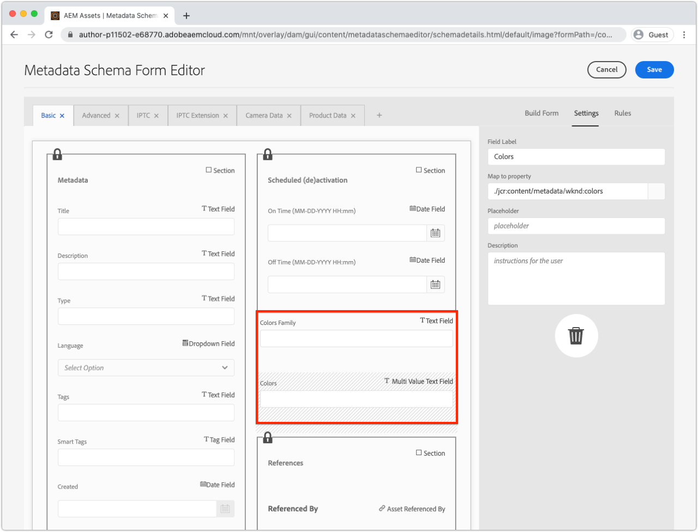

# 開發Asset compute中繼資料背景工作

自訂Asset compute背景工作可產生XMP (XML)資料，這些資料會傳回AEM並儲存為資產上的中繼資料。

常見的使用案例包括：

+ 與協力廠商系統(例如PIM （產品資訊管理系統）)的整合，其中必須擷取其他中繼資料並儲存在資產上
+ 與Adobe服務（例如Content and Commerce AI）整合，透過其他機器學習屬性來增強資產中繼資料
+ 從資產的二進位檔衍生有關資產的中繼資料，並將其儲存為AEMas a Cloud Service中的資產中繼資料

## 您將要執行的動作

>[!VIDEO](https://video.tv.adobe.com/v/327313?quality=12&learn=on)

在本教學課程中，我們將建立Asset compute中繼資料背景工作，它會衍生影像資產中最常使用的顏色，並將顏色名稱寫入回AEM中的資產中繼資料。 雖然背景工作本身至關重要，但本教學課程將利用此背景工作來探索如何使用Asset compute背景工作將中繼資料回寫至AEMas a Cloud Service中的資產。

## asset compute中繼資料工作者引動處理的邏輯流程

asset compute中繼資料背景工作程式的引動方式幾乎與相同 [產生背景工作的二進位轉譯](../develop/worker.md)，主要差異在於傳回型別是XMP (XML)轉譯，其值也會寫入資產的中繼資料。

asset compute背景工作程式會在中實施Asset computeSDK背景工作API合約 `renditionCallback(...)` 函式，其概念為：

+ __輸入：__ AEM資產的原始二進位檔和處理設定檔引數
+ __輸出：__ XMP (XML)轉譯會保留至AEM資產作為轉譯，並保留至資產的中繼資料


1. AEM作者服務會叫用Asset compute中繼資料背景工作，提供資產的 __(1a)__ 原始二進位檔案，和 __(1b)__ 處理設定檔中定義的任何引數。
1. asset computeSDK會協調自訂Asset compute中繼資料背景工作程式的執行 `renditionCallback(...)` 函式，根據資產的二進位衍生出XMP (XML)轉譯 __(1a)__ 以及任何處理設定檔引數 __(1b)__.
1. asset compute工作者會將XMP (XML)表示法儲存至 `rendition.path`.
1. 寫入的XMP (XML)資料 `rendition.path` 會透過Asset compute SDK傳輸至AEM Author Service，並公開為 __(4a)__ 文字轉譯和 __(4b)__ 保留至資產的中繼資料節點。

## 設定manifest.yml{#manifest}

所有Asset compute背景工作都必須在 [manifest.yml](../develop/manifest.md).

開啟專案的 `manifest.yml` 並新增可設定新背景工作的工作者專案，在此案例中 `metadata-colors`.

_記住 `.yml` 區分空格。_

```
packages:
  __APP_PACKAGE__:
    license: Apache-2.0
    actions: 
      worker:
        function: actions/worker/index.js 
        web: 'yes' 
        runtime: 'nodejs:12'
        limits:
          timeout: 60000 # in ms
          memorySize: 512 # in MB
          concurrency: 10 
        annotations:
          require-adobe-auth: true
      metadata-colors:
        function: actions/metadata-colors/index.js 
        web: 'yes' 
        runtime: 'nodejs:12'
        limits:
          memorySize: 512 # in MB   
```

`function` 指向在中建立的工作者實作 [下一步](#metadata-worker). 以語義方式為背景工作命名(例如 `actions/worker/index.js` 名稱可能更適合 `actions/rendition-circle/index.js`)，如下所示 [工作者的URL](#deploy) 也會決定 [worker的測試套裝資料夾名稱](#test).

此 `limits` 和 `require-adobe-auth` 每個工作者分別設定。 在這個工作者中， `512 MB` 配置記憶體時，程式碼會檢查（潛在）大型二進位影像資料。 其他 `limits` 會移除以使用預設值。

## 開發中繼資料背景工作{#metadata-worker}

在路徑的Asset compute專案中建立新的中繼資料背景工作JavaScript檔案 [已為新背景工作定義manifest.yml](#manifest)，在 `/actions/metadata-colors/index.js`

### 安裝npm模組

安裝額外的npm模組([@adobe/asset-compute-xml](https://www.npmjs.com/package/@adobe/asset-compute-xmp?activeTab=versions)， [get-image-colors](https://www.npmjs.com/package/get-image-colors)、和 [color-namer](https://www.npmjs.com/package/color-namer))，此元件會用於此Asset compute背景工作。

```
$ npm install @adobe/asset-compute-xmp
$ npm install get-image-colors
$ npm install color-namer
```

### 中繼資料背景工作代碼

此背景工作與 [產生轉譯的背景工作](../develop/worker.md)，主要差異在於它會將XMP (XML)資料寫入 `rendition.path` 以儲存回AEM。


```javascript
"use strict";

const { worker, SourceCorruptError } = require("@adobe/asset-compute-sdk");
const fs = require("fs").promises;

// Require the @adobe/asset-compute-xmp module to create XMP 
const { serializeXmp } = require("@adobe/asset-compute-xmp");

// Require supporting npm modules to derive image colors from image data
const getColors = require("get-image-colors");
// Require supporting npm modules to convert image colors to color names
const namer = require("color-namer");

exports.main = worker(async (source, rendition, params) => {
  // Perform any necessary source (input) checks
  const stats = await fs.stat(source.path);
  if (stats.size === 0) {
    // Throw appropriate errors whenever an erring condition is met
    throw new SourceCorruptError("source file is empty");
  }
  const MAX_COLORS = 10;
  const DEFAULT_COLORS_FAMILY = 'basic';

  // Read the color family parameter to use to derive the color names
  let colorsFamily = rendition.instructions.colorsFamily || DEFAULT_COLORS_FAMILY;

  if (['basic', 'hex', 'html', 'ntc', 'pantone', 'roygbiv'].indexOf(colorsFamily) === -1) { 
      colorsFamily = DEFAULT_COLORS_FAMILY;
  }
  
  // Use the `get-image-colors` module to derive the most common colors from the image
  let colors = await getColors(source.path, { options: MAX_COLORS });

  // Convert the color Chroma objects to their closest names
  let colorNames = colors.map((color) => getColorName(colorsFamily, color));

  // Serialize the data to XMP metadata
  // These properties are written to the [dam:Asset]/jcr:content/metadata resource
  // This stores
  // - The list of color names is stored in a JCR property named `wknd:colors`
  // - The colors family used to derive the color names is stored in a JCR property named `wknd:colorsFamily`
  const xmp = serializeXmp({
      // Use a Set to de-duplicate color names
      "wknd:colors": [...new Set(colorNames)],
      "wknd:colorsFamily": colorsFamily
    }, {
      // Define any property namespaces used in the above property/value definition
      // These namespaces are automatically registered in AEM if they do not yet exist
      namespaces: {
        wknd: "https://wknd.site/assets/1.0/",
      },
    }
  );

  // Save the XMP metadata to be written back to the asset's metadata node
  await fs.writeFile(rendition.path, xmp, "utf-8");
});

/**
 * Helper function that derives the closest color name for the color, based on the colors family
 * 
 * @param {*} colorsFamily the colors name family to use
 * @param {*} color the color to convert to a name
 */
function getColorName(colorsFamily, color) {
    if ('hex' === colorsFamily) {  return color; }

    let names = namer(color.rgb())[colorsFamily];

    if (names.length >= 1) { return names[0].name; }
}
```

## 在本機執行中繼資料背景工作{#development-tool}

背景工作程式碼完成時，可使用本機Asset compute開發工具執行。

因為我們的Asset compute專案包含兩個背景工作(前一個 [圓形轉譯](../develop/worker.md) 以及這個 `metadata-colors` worker)， [asset compute開發工具的](../develop/development-tool.md) 設定檔定義會列出兩個背景工作者的執行設定檔。 第二個設定檔定義指向新的 `metadata-colors` 背景工作。


1. 從Asset compute專案的根目錄
1. 執行 `aio app run` 啟動Asset compute開發工具
1. 在 __選取檔案……__ 下拉式清單，選取 [影像範例](../assets/samples/sample-file.jpg) 待處理
1. 在第二個設定檔定義組態中，指向 `metadata-colors` 背景工作，更新 `"name": "rendition.xml"` 當此背景工作產生XMP (XML)轉譯時。 或者，新增 `colorsFamily` 引數（支援的值） `basic`， `hex`， `html`， `ntc`， `pantone`， `roygbiv`)。

   ```json
   {
       "renditions": [
           {
               "worker": "...",
               "name": "rendition.xml",
               "colorsFamily": "pantone"
           }
       ]
   }
   ```

1. 點選 __執行__ 並等待XML轉譯產生
   + 由於兩個背景工作都列在設定檔定義中，因此兩個轉譯都會產生。 選擇性地指向以下連結的上層設定檔定義： [圓形轉譯背景工作](../develop/worker.md) 可刪除，以避免從開發工具中執行。
1. 此 __轉譯__ 區段會預覽所產生的轉譯。 點選 `rendition.xml` 若要下載檔案，並以VS Code （或您最愛的XML/文字編輯器）開啟檔案以供檢閱。

## 測試背景工作{#test}

中繼資料背景工作可使用以下工具進行測試： [與二進位轉譯相同的Asset compute測試架構](../test-debug/test.md). 唯一的區別是 `rendition.xxx` 測試案例中的檔案必須是預期的XMP (XML)轉譯。

1. 在Asset compute專案中建立下列結構：

   ```
   /test/asset-compute/metadata-colors/success-pantone/
   
       file.jpg
       params.json
       rendition.xml
   ```

2. 使用 [範例檔案](../assets/samples/sample-file.jpg) 作為測試案例的 `file.jpg`.
3. 將下列JSON新增至 `params.json`.

   ```
   {
       "fmt": "xml",
       "colorsFamily": "pantone"
   }
   ```

   請注意 `"fmt": "xml"` 是指示測試套裝產生 `.xml` 文字型轉譯。

4. 提供中預期的XML `rendition.xml` 檔案。 這可透過以下方式取得：
   + 透過開發工具執行測試輸入檔案並儲存（已驗證的） XML轉譯。

   ```
   <?xml version="1.0" encoding="UTF-8"?><rdf:RDF xmlns:rdf="http://www.w3.org/1999/02/22-rdf-syntax-ns#" xmlns:wknd="https://wknd.site/assets/1.0/"><rdf:Description><wknd:colors><rdf:Seq><rdf:li>Silver</rdf:li><rdf:li>Black</rdf:li><rdf:li>Outer Space</rdf:li></rdf:Seq></wknd:colors><wknd:colorsFamily>pantone</wknd:colorsFamily></rdf:Description></rdf:RDF>
   ```

5. 執行 `aio app test` 從Asset compute專案的根目錄執行所有測試套裝。

### 將背景工作部署至Adobe I/O Runtime{#deploy}

若要從AEM Assets叫用這個新的中繼資料工作程式，必須使用命令將其部署到Adobe I/O Runtime：

```
$ aio app deploy
```


請注意，這將部署專案中的所有背景工作。 檢閱 [未刪節的部署指示](../deploy/runtime.md) 瞭解如何部署到中繼和生產工作區。

### 與AEM處理設定檔整合{#processing-profile}

透過建立新的或修改現有的自訂處理設定檔服務來從AEM叫用背景工作程式，此自訂處理設定檔服務會叫用這個已部署的背景工作程式。


1. 以身分登入AEMas a Cloud Service作者服務 __AEM管理員__
1. 瀏覽至 __工具>資產>處理設定檔__
1. __建立__ 新的，或 __編輯__ 和現有，處理設定檔
1. 點選 __自訂__ 標籤，然後點選 __新增__
1. 定義新服務
   + __建立中繼資料轉譯__：切換至使用中
   + __端點：__ `https://...adobeioruntime.net/api/v1/web/wkndAemAssetCompute-0.0.1/metadata-colors`
      + 這是工作程式的URL，取得期間為 [部署](#deploy) 或使用指令 `aio app get-url`. 根據AEMas a Cloud Service環境，確保URL指向正確的工作區。
   + __服務引數__
      + 點選 __新增引數__
         + 索引鍵： `colorFamily`
         + 值： `pantone`
            + 支援的值： `basic`， `hex`， `html`， `ntc`， `pantone`， `roygbiv`
   + __Mime型別__
      + __包括：__ `image/jpeg`， `image/png`， `image/gif`， `image/svg`
         + 這是第三方npm模組唯一支援的MIME型別，用來衍生顏色。
      + __排除：__ `Leave blank`
1. 點選 __儲存__ 在右上方
1. 將處理設定檔套用至AEM Assets資料夾（如果尚未套用）

### 更新中繼資料結構{#metadata-schema}

若要檢閱色彩中繼資料，請將影像中繼資料結構描述上的兩個新欄位，對應到背景工作填入的新中繼資料屬性。



1. 在AEM Author服務中，瀏覽至 __「工具>資產>中繼資料結構」__
1. 導覽至 __預設__ 並選取和編輯 __影像__ 並新增唯讀表單欄位以公開產生的色彩中繼資料
1. 新增 __單行文字__
   + __欄位標籤__： `Colors Family`
   + __對應至屬性__： `./jcr:content/metadata/wknd:colorsFamily`
   + __規則>欄位>停用編輯__：已勾選
1. 新增 __多值文字__
   + __欄位標籤__： `Colors`
   + __對應至屬性__： `./jcr:content/metadata/wknd:colors`
1. 點選 __儲存__ 在右上方

## 正在處理資產


1. 在AEM Author服務中，瀏覽至 __「資產」>「檔案」__
1. 導覽至該資料夾或子資料夾，處理設定檔將套用至
1. 上傳新影像(JPEG、PNG、GIF或SVG)至資料夾，或使用更新的重新處理現有影像 [處理設定檔](#processing-profile)
1. 處理完成後，選取資產，然後點選 __屬性__ ，以顯示其中繼資料
1. 檢閱 `Colors Family` 和 `Colors` [中繼資料欄位](#metadata-schema) 適用於從自訂Asset compute中繼資料背景工作回寫的中繼資料。

將色彩中繼資料寫入資產的中繼資料後，請前往 `[dam:Asset]/jcr:content/metadata` 資源，此中繼資料已編制索引，可透過搜尋利用這些辭彙提高資產探索能力，而且這些辭彙甚至可回寫至資產的二進位檔案（如果存在的話） __DAM中繼資料回寫__ 系統會在其上叫用工作流程。

### AEM Assets中的中繼資料轉譯


asset compute中繼資料背景工作產生的實際XMP檔案也會儲存為資產上的分散式轉譯。 一般不會使用此檔案，而是使用套用至資產中繼資料節點的值，但背景工作的原始XML輸出可在AEM中使用。

## Github上的metadata-colors背景工作代碼

最終的 `metadata-colors/index.js` 可在Github上取得，網址為：

+ [aem-guides-wknd-asset-compute/actions/metadata-colors/index.js](https://github.com/adobe/aem-guides-wknd-asset-compute/blob/master/actions/metadata-colors/index.js)

最終的 `test/asset-compute/metadata-colors` Github提供測試套裝，網址為：

+ [aem-guides-wknd-asset-compute/test/asset-compute/metadata-colors](https://github.com/adobe/aem-guides-wknd-asset-compute/blob/master/test/asset-compute/metadata-colors)
