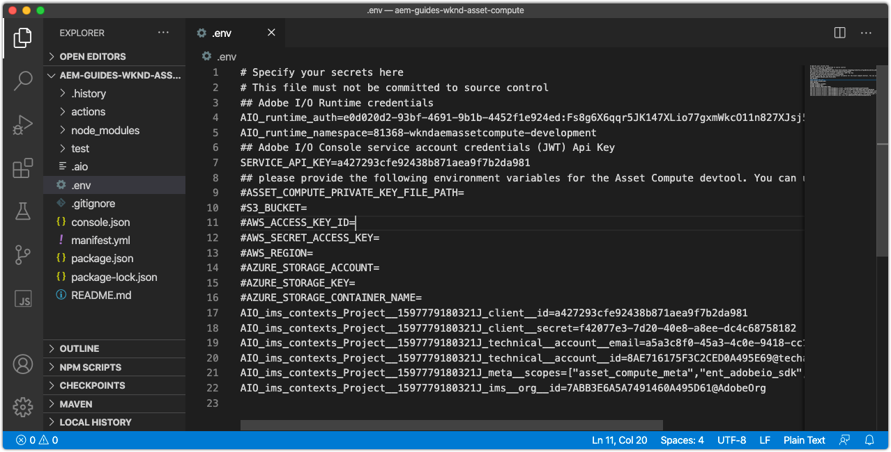

# 配置環境變數



在開始開發Asset compute工作人員之前，確保項目已配置Adobe I/O和雲儲存資訊。 此資訊儲存在項目的 `.env`  它只用於本地開發，而不用Git儲存。 的 `.env` 檔案提供了一種將鍵/值對暴露給本地Asset compute本地開發環境的方便方法。 當 [部署](../deploy/runtime.md) asset compute工人到Adobe I/O Runtime `.env` 不使用檔案，而是通過環境變數傳遞值的子集。 其他自定義參數和機密可以儲存在 `.env` 檔案，如第三方Web服務的開發憑據。

## 引用 `private.key`


開啟 `.env` 檔案，取消注釋 `ASSET_COMPUTE_PRIVATE_KEY_FILE_PATH` 鍵，並將檔案系統上的絕對路徑提供給 `private.key` 與添加到您的Adobe I/OApp Builder項目的公共證書配對。

+ 如果密鑰對是由Adobe I/O生成的，則它將作為  `config.zip`。
+ 如果您為Adobe I/O提供了公鑰，則還應擁有匹配的私鑰。
+ 如果沒有這些密鑰對，則可以生成新的密鑰對或在以下位置的底部上載新的公鑰：
   [https://console.adobe.com](https://console.adobe.io) >您的Asset computeApp Builder項目> Workspaces @ Development > Service Account(JWT)。

記住 `private.key` 檔案不應簽入Git，因為它包含機密，而應儲存在項目外的安全位置。

例如，在macOS，這可能是：

```
...
ASSET_COMPUTE_PRIVATE_KEY_FILE_PATH=/Users/example-user/credentials/aem-guides-wknd-asset-compute/private.key
...
```

## 配置雲儲存憑據

asset compute工人的地方發展需要 [雲儲存](../set-up/accounts-and-services.md#cloud-storage)。 中提供了用於本地開發的雲儲存憑據 `.env` 的子菜單。

本教程傾向於使用Azure Blob儲存，但是AmazonS3及其在 `.env` 可以改用檔案。

### 使用Azure Blob儲存

取消注釋並填充以下鍵 `.env` 檔案，並用Azure門戶上找到的已設定雲儲存的值填充這些值。


1. 值 `AZURE_STORAGE_CONTAINER_NAME` 鍵
1. 值 `AZURE_STORAGE_ACCOUNT` 鍵
1. 值 `AZURE_STORAGE_KEY` 鍵

例如，這可能看起來類似（僅用於插圖的值）:

```
...
AZURE_STORAGE_ACCOUNT=aemguideswkndassetcomput
AZURE_STORAGE_KEY=Va9CnisgdbdsNJEJBqXDyNbYppbGbZ2V...OUNY/eExll0vwoLsPt/OvbM+B7pkUdpEe7zJhg==
AZURE_STORAGE_CONTAINER_NAME=asset-compute
...
```

結果 `.env` 檔案如下所示：


如果您未使用MicrosoftAzure Blob儲存，請刪除或保留這些注釋(通過使用 `#`)。

### 使用AmazonS3雲儲存{#amazon-s3}

如果您正在使用AmazonS3雲儲存取消注釋，並在 `.env` 的子菜單。

例如，這可能看起來類似（僅用於插圖的值）:

```
...
S3_BUCKET=aemguideswkndassetcompute
AWS_ACCESS_KEY_ID=KKIXZLZYNLXJLV24PLO6
AWS_SECRET_ACCESS_KEY=Ba898CnisgabdsNJEJBqCYyVrYttbGbZ2...OiNYExll0vwoLsPtOv
AWS_REGION=us-east-1
...
```

## 驗證項目配置

一旦已配置生成的Asset compute項目，請先驗證配置，然後進行代碼更改，以確保在 `.env` 的子菜單。

要啟動Asset compute項目的Asset compute開發工具，請執行以下操作：

1. 在Asset compute項目根目錄中開啟命令行（在VS代碼中，可通過「終端」>「新終端」直接在IDE中開啟），然後執行以下命令：

   ```
   $ aio app run
   ```

1. 本地Asset compute開發工具將在預設Web瀏覽器中開啟， __http://localhost:9000__。

   

1. 在開發工具初始化時，查看命令行輸出和Web瀏覽器中的錯誤消息。
1. 要停止Asset compute開發工具，請點擊 `Ctrl-C` 窗口中 `aio app run` 終止進程。

## 疑難排解

+ [由於缺少private.key，開發工具無法啟動](../troubleshooting.md#missing-private-key)
