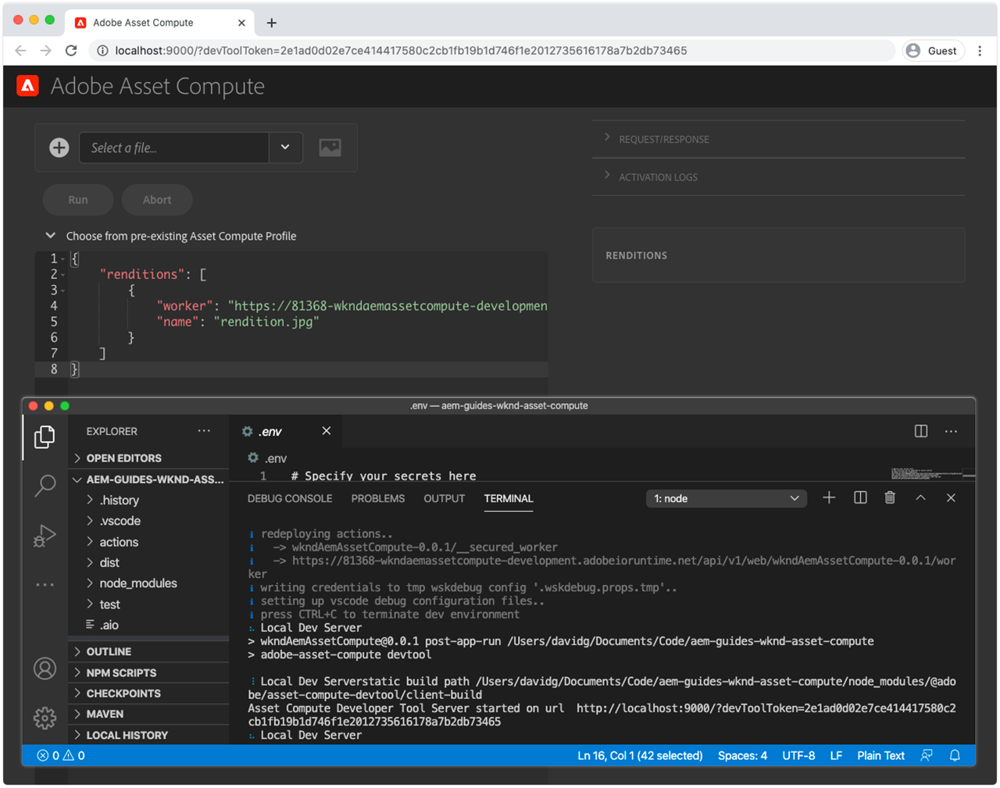

# 配置環境變數


在開始開發資產計算工作人員之前，請確定專案已設定Adobe I/O和雲端儲存資訊。 這項資訊會儲存在專案中， `.env` 僅用於本端開發，而不儲存在Git中。 此檔 `.env` 案提供將金鑰／值配對公開至本機資產計算本機開發環境的方便方式。 將 [Asset](../deploy/runtime.md) Compute Worker部署至Adobe I/O Runtime時，不會使用檔案， `.env` 而是透過環境變數傳入值的子集。 其他自訂參數和機密也可儲存在 `.env` 檔案中，例如協力廠商web services的開發認證。

## 參考 `private.key`


開啟檔 `.env` 案、取消註解金 `ASSET_COMPUTE_PRIVATE_KEY_FILE_PATH` 鑰，並提供檔案系統上與Adobe I/O FireFly專案中新增之公 `private.key` 用憑證配對的絕對路徑。

+ 如果您的金鑰對是由Adobe I/O產生，則會自動下載為的一部分 `config.zip`。
+ 如果您將公開金鑰提供給Adobe I/O，則您也應擁有相符的私密金鑰。
+ 如果您沒有這些密鑰對，則可以生成新的密鑰對，或在以下位置的底部上載新的公鑰：
   [https://console.adobe.com](https://console.adobe.io) >您的資產計算Firefly專案>開發工作區>服務帳戶(JWT)。

記住， `private.key` 檔案不應簽入Git，因為它包含機密，而應儲存在專案外的安全位置。

例如，在macOS上，這看起來可能是：

```
...
ASSET_COMPUTE_PRIVATE_KEY_FILE_PATH=/Users/example-user/credentials/aem-guides-wknd-asset-compute/private.key
...
```

## 設定雲端儲存憑證

資產計算工作人員的本地開發需要訪問雲 [儲存](../set-up/accounts-and-services.md#cloud-storage)。 檔案中提供用於本機開發的雲端儲存憑證 `.env` 。

本教學課程偏好使用Azure Blob儲存空間，但Amazon S3及其檔案中的對 `.env` 應金鑰可改用。

### 使用Azure Blob儲存空間

取消注釋並填入檔案中的 `.env` 下列索引鍵，然後以Azure Portal上所提供之雲端儲存空間的值填入這些索引鍵。


1. 索引鍵的 `AZURE_STORAGE_CONTAINER_NAME` 值
1. 索引鍵的 `AZURE_STORAGE_ACCOUNT` 值
1. 索引鍵的 `AZURE_STORAGE_KEY` 值

例如，這看起來可能類似（僅限插圖的值）:

```
...
AZURE_STORAGE_ACCOUNT=aemguideswkndassetcomput
AZURE_STORAGE_KEY=Va9CnisgdbdsNJEJBqXDyNbYppbGbZ2V...OUNY/eExll0vwoLsPt/OvbM+B7pkUdpEe7zJhg==
AZURE_STORAGE_CONTAINER_NAME=asset-compute
...
```

生成的 `.env` 檔案如下所示：


如果您未使用Microsoft Azure Blob儲存，請刪除或保留這些注釋(使用前置詞 `#`)。

### 使用Amazon S3雲端儲存空間{#amazon-s3}

如果您使用Amazon S3雲端儲存空間取消註解，並在檔案中填入下列 `.env` 金鑰。

例如，這看起來可能類似（僅限插圖的值）:

```
...
S3_BUCKET=aemguideswkndassetcompute
AWS_ACCESS_KEY_ID=KKIXZLZYNLXJLV24PLO6
AWS_SECRET_ACCESS_KEY=Ba898CnisgabdsNJEJBqCYyVrYttbGbZ2...OiNYExll0vwoLsPtOv
AWS_REGION=us-east-1
...
```

## 驗證項目配置

在已配置生成的資產計算項目後，在更改代碼之前驗證配置，以確保在檔案中提供支援服 `.env` 務。

要為資產計算項目啟動資產計算開發工具，請執行以下操作：

1. 在「資產計算」項目根目錄中開啟命令行（在VS代碼中，此命令可直接在IDE中通過「終端機>新終端機」開啟），然後執行命令：

   ```
   $ aio app run
   ```

1. 本機資產計算開發工具將在您的預設網頁瀏覽器中開啟，網址為 __http://localhost:9000__。

   

1. 當開發工具初始化時，請觀看命令列輸出和Web瀏覽器中的錯誤訊息。
1. 若要停止資產計算開發工具，請在執 `Ctrl-C` 行的視窗中點選以 `aio app run` 終止程式。

## 疑難排解

### 由於缺少private.key，資產計算本地開發工具無法啟動

+ __錯誤：__ 本機開發伺服器錯誤：validatePrivateKeyFile中缺少所需檔案……. (透過標準輸出命令 `aio app run` )
+ __原因：__ 檔 `ASSET_COMPUTE_PRIVATE_KEY_FILE_PATH` 案中的 `.env` 值不指向目前使用者 `private.key` ，或 `private.key` 者無法讀取。
+ __解析度：__ 檢視檔 `ASSET_COMPUTE_PRIVATE_KEY_FILE_PATH` 案中的 `.env` 值，並確定它包含檔案系統上的完整 `private.key` 絕對路徑。
