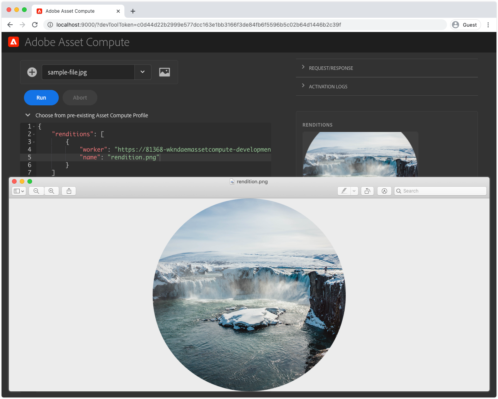

# 開發資產計算員工

資產計算工作者是資產計算項目的核心，因為它提供了對資產執行或協調的定製功能，以建立新的轉譯。

「資產計算」項目會自動生成一個簡單工作器，該工作器將資產的原始二進位檔案複製到命名格式副本中，而不進行任何轉換。 在本教程中，我們將修改此工作器，以製作更有趣的轉譯，以說明「資產計算」工作器的強大功能。

我們將建立一個「資產計算」工作器，生成新的水準影像格式副本，該格式副本在資產格式副本的左側和右側覆蓋空白空間，並且資產版本模糊。 最終轉譯的寬度、高度和模糊都會參數化。

## 資產計算工作器調用的邏輯流

資產計算工作者在`renditionCallback(...)`函式中實作資產計算SDK工作者API合約，該合約在概念上是：

+ __輸入：__ AEM資產的原始二進位和處理描述檔參數
+ __輸出：__ 要新增至AEM資產的一或多個轉譯


1. AEM Author服務會叫用「資產計算工作者」，提供資產的&#x200B;__(1a)__&#x200B;原始二進位檔（`source`參數）和&#x200B;__(1b)__&#x200B;處理設定檔（`rendition.instructions`參數）中所定義的任何參數。
1. 資產計算SDK可協調自訂資產計算中繼資料工作者的`renditionCallback(...)`函式，根據資產的原始二進位&#x200B;__(1a)__&#x200B;和任何參數&#x200B;__(1b)__&#x200B;產生新的二進位轉譯。

   + 在本教學課程中，會建立「正在處理中」的轉譯，這表示工作者會合成轉譯，不過，來源二進位檔也可以傳送至其他Web服務API，以產生轉譯。

1. 資產計算工作器將新格式副本的二進位資料保存到`rendition.path`。
1. 寫入至`rendition.path`的二進位資料會透過Asset Compute SDK傳輸至AEM Author Service，並以&#x200B;__(4a)__&#x200B;文字轉譯和&#x200B;__(4b)__&#x200B;保存至資產的中繼資料節點的方式公開。

上圖說明了資產計算開發人員關注的問題和資產計算工作者調用的邏輯流程。 對於好奇的人，[資產計算執行的內部詳細資料](https://docs.adobe.com/content/help/en/asset-compute/using/extend/custom-application-internals.html)可供使用，但只有公開的資產計算SDK API合約可依賴。

## 工人解剖

所有資產計算員工都遵循相同的基本結構和輸入／輸出合同。

```javascript
'use strict';

// Any npm module imports used by the worker
const { worker, SourceCorruptError } = require('@adobe/asset-compute-sdk');
const fs = require('fs').promises;

/**
Exports the worker implemented by a custom rendition callback function, which parametrizes the input/output contract for the worker.
 + `source` represents the asset's original binary used as the input for the worker.
 + `rendition` represents the worker's output, which is the creation of a new asset rendition.
 + `params` are optional parameters, which map to additional key/value pairs, including a sub `auth` object that contains Adobe I/O access credentials.
**/
exports.main = worker(async (source, rendition, params) => {
    // Perform any necessary source (input) checks
    const stats = await fs.stat(source.path);
    if (stats.size === 0) {
        // Throw appropriate errors whenever an erring condition is met
        throw new SourceCorruptError('source file is empty');
    }

    // Access any custom parameters provided via the Processing Profile configuration
    let param1 = rendition.instructions.exampleParam;

    /** 
    Perform all work needed to transform the source into the rendition.
    
    The source data can be accessed:
        + In the worker via a file available at `source.path`
        + Or via a presigned GET URL at `source.url`
    **/
    if (success) {
        // A successful worker must write some data back to `renditions.path`. 
        // This example performs a trivial 1:1 copy of the source binary to the rendition
        await fs.copyFile(source.path, rendition.path);
    } else {
        // Upon failure an Asset Compute Error (exported by @adobe/asset-compute-commons) should be thrown.
        throw new GenericError("An error occurred!", "example-worker");
    }
});

/**
Optionally create helper classes or functions the worker's rendition callback function invokes to help organize code.

Code shared across workers, or to complex to be managed in a single file, can be broken out across supporting JavaScript files in the project and imported normally into the worker. 
**/
function customHelperFunctions() { ... }
```

## 開啟工作器index.js


1. 確保資產計算項目在VS代碼中開啟
1. 導覽至`/actions/worker`資料夾
1. 開啟`index.js`檔案

這是我們在本教程中將修改的工作JavaScript檔案。

## 安裝和導入支援NPM模組

資產計算項目基於Node.js，可從強健的[npm模組生態系統](https://npmjs.com)中獲益。 要利用npm模組，我們必須首先將它們安裝到Asset Compute項目中。

在此員工中，我們利用[jimp](https://www.npmjs.com/package/jimp)直接在Node.js代碼中建立和操作轉譯映像。

>[!WARNING]
>
>資產計算並非所有用於資產操縱的npm模組都受到支援。 不支援依賴ImageMagick或其他OS相關庫等應用程式存在的npm模組。 最好限制僅限JavaScriptnpm模組的使用。

1. 在資產計算項目的根目錄中開啟命令行（可通過&#x200B;__終端機>新終端機__&#x200B;在VS代碼中完成此操作），然後執行命令：

   ```
   $ npm install jimp
   ```

1. 將`jimp`模組導入到工作代碼中，以便通過`Jimp` JavaScript對象使用。
更新工作器`index.js`頂部的`require`指令，從`jimp`模組導入`Jimp`對象：

   ```javascript
   'use strict';
   
   const { Jimp } = require('jimp');
   const { worker, SourceCorruptError } = require('@adobe/asset-compute-sdk');
   const fs = require('fs').promises;
   
   exports.main = worker(async (source, rendition, params) => {
       // Check handle a corrupt input source
       const stats = await fs.stat(source.path);
       if (stats.size === 0) {
           throw new SourceCorruptError('source file is empty');
       }
   
       // Do work here
   });
   ```

## 讀取參數

資產計算工作者可以讀取參數，這些參數可以透過在AEM中定義為雲端服務作者服務的處理設定檔傳入。 參數通過`rendition.instructions`對象傳遞到工作器。

可通過訪問工作代碼中的`rendition.instructions.<parameterName>`來讀取這些代碼。

在此，我們將閱讀可設定轉譯的`SIZE`、`BRIGHTNESS`和`CONTRAST`，提供若未透過處理設定檔提供預設值。 請注意，從AEM以「雲端服務處理設定檔」叫用`renditions.instructions`時，會以字串形式傳入，因此請確定這些設定檔已轉換為工作程式碼中的正確資料類型。

```javascript
'use strict';

const { Jimp } = require('jimp');
const { worker, SourceCorruptError } = require('@adobe/asset-compute-sdk');
const fs = require('fs').promises;

exports.main = worker(async (source, rendition, params) => {
    const stats = await fs.stat(source.path);
    if (stats.size === 0) {
        throw new SourceCorruptError('source file is empty');
    }

    // Read in parameters and set defaults if parameters are provided
    // Processing Profiles pass in instructions as Strings, so make sure to parse to correct data types
    const SIZE = parseInt(rendition.instructions.size) || 800; 
    const CONTRAST = parseFloat(rendition.instructions.contrast) || 0;
    const BRIGHTNESS = parseFloat(rendition.instructions.brightness) || 0;

    // Do work here
}
```

## 拋出錯誤{#errors}

資產計算工作者可能會遇到導致錯誤的情況。 Adobe Asset Compute SDK提供[一套預先定義的錯誤](https://github.com/adobe/asset-compute-commons#asset-compute-errors)，在遇到此類情況時可拋出。 如果未應用特定錯誤類型，則可以使用`GenericError` ，或者可以定義特定的自定義`ClientErrors`。

在開始處理轉譯之前，請檢查以確保所有參數在此工作器的上下文中都有效且受支援：

+ 確保`SIZE`、`CONTRAST`和`BRIGHTNESS`的轉譯指令參數有效。 如果沒有，則拋出自定義錯誤`RenditionInstructionsError`。
   + 在此檔案底部定義了擴展`ClientError`的自定義`RenditionInstructionsError`類。 當[為工作器寫入測試](../test-debug/test.md)時，使用特定的自定義錯誤非常有用。

```javascript
'use strict';

const { Jimp } = require('jimp');
// Import the Asset Compute SDK provided `ClientError` 
const { worker, SourceCorruptError, ClientError } = require('@adobe/asset-compute-sdk');
const fs = require('fs').promises;

exports.main = worker(async (source, rendition, params) => {
    const stats = await fs.stat(source.path);
    if (stats.size === 0) {
        throw new SourceCorruptError('source file is empty');
    }

    // Read in parameters and set defaults if parameters are provided
    const SIZE = parseInt(rendition.instructions.size) || 800; 
    const CONTRAST = parseFloat(rendition.instructions.contrast) || 0;
    const BRIGHTNESS = parseFloat(rendition.instructions.brightness) || 0;

    if (SIZE <= 10 || SIZE >= 10000) {
        // Ensure size is within allowable bounds
        throw new RenditionInstructionsError("'size' must be between 10 and 1,0000");
    } else if (CONTRAST <= -1 || CONTRAST >= 1) {
        // Ensure contrast is valid value
        throw new RenditionInstructionsError("'contrast' must between -1 and 1");
    } else if (BRIGHTNESS <= -1 || BRIGHTNESS >= 1) {
        // Ensure contrast is valid value
        throw new RenditionInstructionsError("'brightness' must between -1 and 1");
    }

    // Do work here
}

// Create a new ClientError to handle invalid rendition.instructions values
class RenditionInstructionsError extends ClientError {
    constructor(message) {
        // Provide a:
        // + message: describing the nature of this erring condition
        // + name: the name of the error; usually same as class name
        // + reason: a short, searchable, unique error token that identifies this error
        super(message, "RenditionInstructionsError", "rendition_instructions_error");

        // Capture the strack trace
        Error.captureStackTrace(this, RenditionInstructionsError);
    }
}
```

## 建立轉譯

在讀取、淨化和驗證參數後，會編寫程式碼以產生轉譯。 產生轉譯的虛擬碼如下：

1. 以透過`size`參數指定的平方尺度建立新的`renditionImage`畫布。
1. 從來源資產的二進位檔建立`image`物件
1. 使用&#x200B;__Jimp__&#x200B;程式庫來轉換影像：
   + 將原始影像裁切為置中的正方形
   + 從「平方」影像的中央剪下圓
   + 縮放以符合`SIZE`參數值所定義的尺寸
   + 根據`CONTRAST`參數值調整對比
   + 根據`BRIGHTNESS`參數值調整亮度
1. 將已轉換的`image`置於具有透明背景的`renditionImage`的中心
1. 將合成的內容`renditionImage`寫入`rendition.path`，如此它就可以儲存回AEM，做為資產轉譯。

此程式碼會使用[Jimp APIs](https://github.com/oliver-moran/jimp#jimp)來執行這些影像轉換。

資產計算工作者必須同步完成工作，並且`rendition.path`必須在工作者的`renditionCallback`完成前完全寫回。 這要求使用`await`運算子同步進行非同步函式呼叫。 如果您不熟悉JavaScript非同步函式，以及如何讓它們以同步方式執行，請熟悉[JavaScript的wait運算子](https://developer.mozilla.org/en-US/docs/Web/JavaScript/Reference/Operators/await)。

完成的工作器`index.js`應如下所示：

```javascript
'use strict';

const Jimp = require('jimp');
const { worker, SourceCorruptError, ClientError } = require('@adobe/asset-compute-sdk');
const fs = require('fs').promises;

exports.main = worker(async (source, rendition, params) => {
    const stats = await fs.stat(source.path);
    if (stats.size === 0) {
        throw new SourceCorruptError('source file is empty');
    }

    const SIZE = parseInt(rendition.instructions.size) || 800; 
    const CONTRAST = parseFloat(rendition.instructions.contrast) || 0;
    const BRIGHTNESS = parseFloat(rendition.instructions.brightness) || 0;

    if (SIZE <= 10 || SIZE >= 10000) {
        throw new RenditionInstructionsError("'size' must be between 10 and 10,000");
    } else if (CONTRAST <= -1 || CONTRAST >= 1) {
        throw new RenditionInstructionsError("'contrast' must between -1 and 1");
    } else if (BRIGHTNESS <= -1 || BRIGHTNESS >= 1) {
        throw new RenditionInstructionsError("'brightness' must between -1 and 1");
    }

    // Create target rendition image of the target size with a transparent background (0x0)
    let renditionImage =  new Jimp(SIZE, SIZE, 0x0);

    // Read and perform transformations on the source binary image
    let image = await Jimp.read(source.path);

    // Crop a circle from the source asset, and then apply contrast and brightness using Jimp
    image.crop(
            image.bitmap.width < image.bitmap.height ? 0 : (image.bitmap.width - image.bitmap.height) / 2,
            image.bitmap.width < image.bitmap.height ? (image.bitmap.height - image.bitmap.width) / 2 : 0,
            image.bitmap.width < image.bitmap.height ? image.bitmap.width : image.bitmap.height,
            image.bitmap.width < image.bitmap.height ? image.bitmap.width : image.bitmap.height
        )   
        .circle()
        .scaleToFit(SIZE, SIZE)
        .contrast(CONTRAST)
        .brightness(BRIGHTNESS);

    // Place the transformed image onto the transparent renditionImage to save as PNG
    renditionImage.composite(image, 0, 0)

    // Write the final transformed image to the asset's rendition
    renditionImage.write(rendition.path);
});

// Custom error used for renditions.instructions parameter checking
class RenditionInstructionsError extends ClientError {
    constructor(message) {
        super(message, "RenditionInstructionsError", "rendition_instructions_error");
        Error.captureStackTrace(this, RenditionInstructionsError);
    }
}
```

## 運行工作器

現在工作程式碼已完成，而且先前已在[manifest.yml](./manifest.md)中註冊並設定，您可使用本機資產計算開發工具來執行它，以檢視結果。

1. 從資產計算項目的根目錄
1. 執行 `aio app run`
1. 等待資產計算開發工具在新窗口中開啟
1. 在&#x200B;__選擇檔案……__&#x200B;下拉式清單，選取要處理的範例影像
   + 選取範例影像檔案，做為來源資產二進位檔
   + 如果尚未存在，請點選左側的&#x200B;__(+)__，並上傳[範例影像](../assets/samples/sample-file.jpg)檔案，然後重新整理「開發工具」瀏覽器視窗
1. 將`"name": "rendition.png"`更新為此工作器，以生成透明PNG。
   + 請注意，此&quot;name&quot;參數僅用於開發工具，不應依賴。

   ```json
   {
       "renditions": [
           {
               "worker": "...",
               "name": "rendition.png"
           }
       ]
   }
   ```
1. 點選「__執行__」，等待轉譯產生
1. __轉譯__&#x200B;區段會預覽產生的轉譯。 點選轉譯預覽以下載完整的轉譯

   

### 使用參數運行工作器

透過「處理描述檔」設定傳入的參數，可在「資產計算開發工具」中模擬，方法是在轉譯參數JSON上提供它們作為索引鍵／值配對。

>[!WARNING]
>
>在本端開發期間，當從AEM以Cloud Service Processing Profiles以字串形式傳入時，可以使用各種資料類型傳入值，因此請務必分析正確的資料類型。
> 例如，Jimp的`crop(width, height)`函式要求其參數為`int`。如果`parseInt(rendition.instructions.size)`未解析為int，則對`jimp.crop(SIZE, SIZE)`的調用將失敗，因為參數類型將不相容「字串」。

我們的程式碼接受下列參數：

+ `size` 定義轉譯的大小（高度和寬度為整數）
+ `contrast` 定義對比度調整，必須介於-1和1之間，作為浮標
+ `brightness`  定義亮調整，必須介於-1和1之間，作為浮動

這些通過以下方式在工作器`index.js`中讀取：

+ `const SIZE = parseInt(rendition.instructions.size) || 800`
+ `const CONTRAST = parseFloat(rendition.instructions.contrast) || 0`
+ `const BRIGHTNESS = parseFloat(rendition.instructions.brightness) || 0`

1. 更新轉譯參數以自訂大小、對比和亮度。

   ```json
   {
       "renditions": [
           {
               "worker": "...",
               "name": "rendition.png",
               "size": "450",
               "contrast": "0.30",
               "brightness": "0.15"
           }
       ]
   }
   ```

1. 再次點選&#x200B;__執行__
1. 點選轉譯預覽以下載並檢視產生的轉譯。 請注意其尺寸，以及對比度和亮度與預設轉譯的變更方式。

   

1. 將其他映像上載到&#x200B;__源檔案__&#x200B;下拉式清單中，然後嘗試使用不同的參數對其運行工作器！

## Github上的Worker index.js

最終`index.js`可在Github上取得，網址為：

+ [aem-guides-wknd-asset-compute/actions/worker/index.js](https://github.com/adobe/aem-guides-wknd-asset-compute/blob/master/actions/worker/index.js)

## 疑難排解

+ [傳回的轉譯部分繪製／損毀](../troubleshooting.md#rendition-returned-partially-drawn-or-corrupt)
