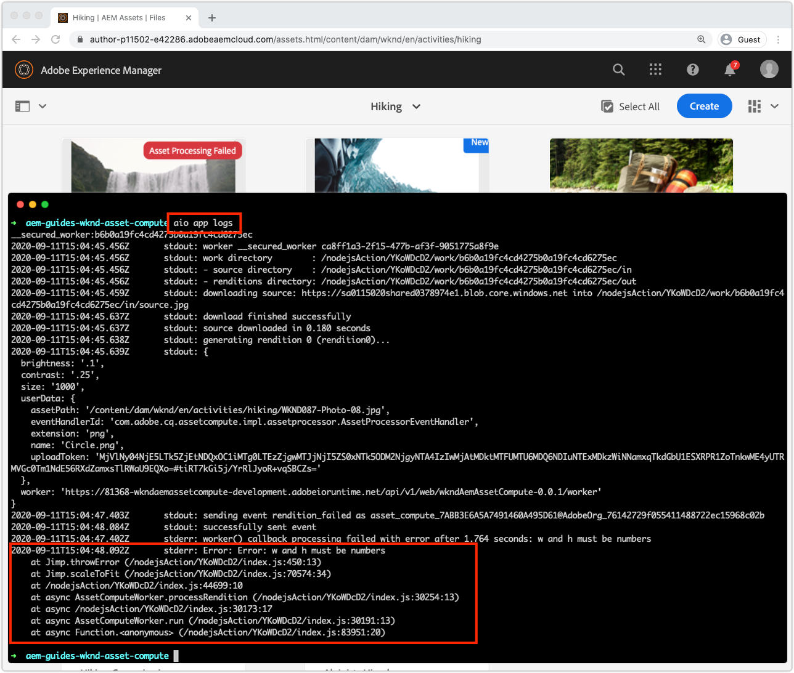

# 調試Asset compute工作器

asset compute工作者可以通過多種方式進行調試，從簡單的調試日誌語句到附加的VS代碼作為遠程調試程式，再到提取從Cloud Service啟動的Adobe I/O Runtime激活日AEM志。

## 記錄

除錯Asset compute工作程式的最基本形式是在工作程式碼中使用傳統的`console.log(..)`語句。 `console` JavaScript物件是隱式的全域物件，因此不需要匯入或要求它，因為它永遠存在於所有的上下文中。

根據Asset compute工作者的執行方式，這些日誌語句可用於查看的方式不同：

+ 從`aio app run`，將列印記錄至標準輸出，並將[開發工具的](../develop/development-tool.md)啟動記錄記錄記錄檔記錄在案
   
+ 從`aio app test`將打印記錄到`/build/test-results/test-worker/test.log`
   
+ 使用`wskdebug`，將日誌語句打印到VS代碼調試控制台（查看>調試控制台），標準輸出
   
+ 使用`aio app logs`,log語句打印到激活日誌輸出

## 透過附加除錯程式進行遠端除錯

>[!WARNING]
>
>使用Microsoft Visual Studio代碼1.48.0或更新版本，以與wskdebug相容

[wskdebug](https://www.npmjs.com/package/@openwhisk/wskdebug) npm模組支援將除錯程式附加至Asset compute工作，包括在VS程式碼中設定中斷點並逐步執行程式碼。

>[!VIDEO](https://video.tv.adobe.com/v/40383/?quality=12&learn=on)

_使用wskdebug調試Asset compute工作器的點進（無音頻）_

1. 確保已安裝[wskdebug](../set-up/development-environment.md#wskdebug)和[ngrok](../set-up/development-environment.md#ngork) npm模組
1. 確保[Docker Desktop和支援的Docker映像](../set-up/development-environment.md#docker)已安裝並運行
1. 關閉「開發工具」的任何作用中執行例項。
1. 使用`aio app deploy`部署最新代碼並記錄已部署的操作名稱（`[...]`之間的名稱）。 這將用於更新步驟8中的`launch.json`。

   ```
   ℹ Info: Deploying package [wkndAemAssetCompute-0.0.1]...
   ```


1. 使用命令`npx adobe-asset-compute devtool`啟動新的Asset compute開發工具實例
1. 在「VS程式碼」中，點選左側導覽中的「除錯」圖示
   + 如果出現提示，請點選&#x200B;__建立launch.json檔案> Node.js__&#x200B;以建立新的`launch.json`檔案。
   + 否則，請點選&#x200B;__Launch Program__&#x200B;下拉式清單右側的&#x200B;__Gear__&#x200B;圖示，以開啟編輯器中現有的`launch.json`。
1. 將下列JSON物件設定新增至`configurations`陣列：

   ```json
   {
       "type": "pwa-node",
       "request": "launch",
       "name": "wskdebug",
       "attachSimplePort": 0,
       "runtimeExecutable": "wskdebug",
       "args": [
           "wkndAemAssetCompute-0.0.1/__secured_worker",  // Version must match your Asset Compute worker's version
           "${workspaceFolder}/actions/worker/index.js",  // Points to your worker
           "-l",
           "--ngrok"
       ],
       "localRoot": "${workspaceFolder}",
       "remoteRoot": "/code",
       "outputCapture": "std",
       "timeout": 30000
   }
   ```

1. 從下拉式清單中選取新的&#x200B;__wskdebug__
1. 點選&#x200B;__Run__&#x200B;按鈕（位於&#x200B;__wskdebug__&#x200B;下拉式清單左側）
1. 開啟`/actions/worker/index.js`並點選行號左側以新增中斷點1。 導覽至在步驟6中開啟的「Asset compute開發工具Web瀏覽器」視窗
1. 按一下&#x200B;__運行__&#x200B;按鈕以執行工作器
1. 導覽回「VS程式碼」，導覽至`/actions/worker/index.js`並逐步執行程式碼
1. 若要退出可除錯的開發工具，請在執行步驟6中`npx adobe-asset-compute devtool`命令的終端中點選`Ctrl-C`

## 從Adobe I/O Runtime訪問日誌{#aio-app-logs}

[作AEM為Cloud Service，您可透過「處理分析」](../deploy/processing-profiles.md) 直接在Adobe I/O Runtime叫用Asset compute工作者。由於這些調用不涉及本地開發，因此無法使用本地工具(如Asset compute開發工具或wskdebug)調試其執行。 相反，Adobe I/OCLI可用於從Adobe I/O Runtime某特定工作區中執行的工作器中提取日誌。

1. 根據需要除錯的工作區，確保通過`AIO_runtime_namespace`和`AIO_runtime_auth`設定[工作區特定的環境變數](../deploy/runtime.md)。
1. 從命令行執行`aio app logs`
   + 如果工作區產生大量流量，請透過`--limit`標幟來擴充啟動記錄檔數：
      `$ aio app logs --limit=25`
1. 將返回最近（最多提供的`--limit`）激活日誌作為命令的輸出以進行查看。

   

## 疑難排解

+ [除錯程式未附加](../troubleshooting.md#debugger-does-not-attach)
+ [中斷點不會暫停](../troubleshooting.md#breakpoints-no-pausing)
+ [VS程式碼除錯程式未連接](../troubleshooting.md#vs-code-debugger-not-attached)
+ [VS代碼調試器在工作器執行開始後附加](../troubleshooting.md#vs-code-debugger-attached-after-worker-execution-began)
+ [在調試時工作器超時](../troubleshooting.md#worker-times-out-while-debugging)
+ [無法終止調試器進程](../troubleshooting.md#cannot-terminate-debugger-process)
