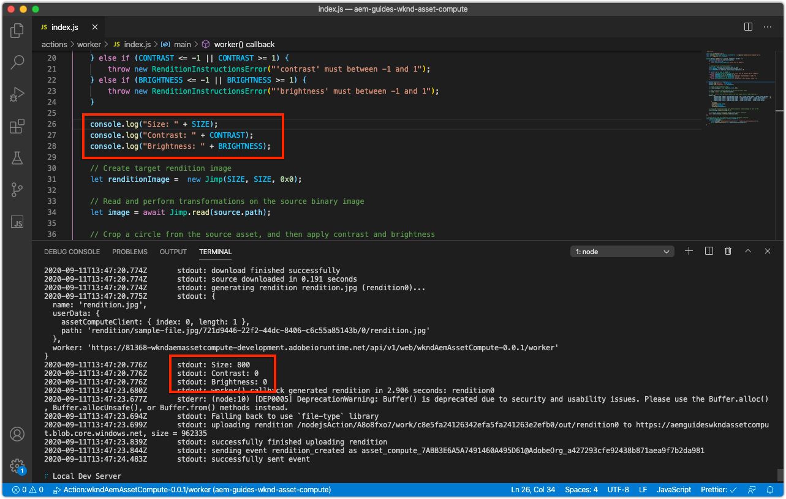
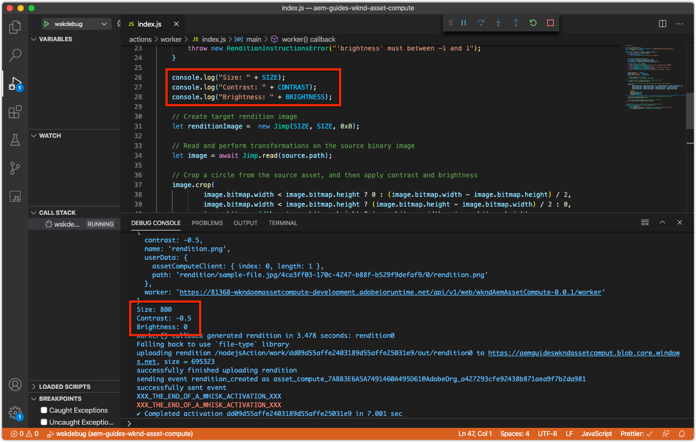

# 對Asset Compute背景工作進行除錯

Asset Compute背景工作可透過數種方式進行除錯，包括簡單的除錯記錄陳述式、附加的VS Code （作為遠端除錯工具），乃至於從起始自AEM as a Cloud Service的Adobe I/O Runtime中提取啟用的記錄。

## 記錄

偵錯Asset Compute背景工作的最基本形式是使用背景工作程式碼中的傳統`console.log(..)`陳述式。 `console` JavaScript物件是隱含的全域物件，因此不需要匯入或要求它，因為它一律存在於所有內容中。

根據Asset Compute背景工作程式的執行方式，可檢視這些記錄陳述式：

+ 從`aio app run`，記錄檔列印至標準輸出，以及[開發工具的](../develop/development-tool.md)啟動記錄檔
  
+ 從`aio app test`，記錄列印至`/build/test-results/test-worker/test.log`
  
+ 使用`wskdebug`，將記錄陳述式列印到VS程式碼偵錯主控台（檢視>偵錯主控台），標準輸出
  
+ 使用`aio app logs`，將記錄陳述式列印至啟動記錄輸出

## 透過附加的偵錯工具進行遠端偵錯

>[!WARNING]
>
>使用Microsoft Visual Studio Code 1.48.0或更新版本，以與wskdebug相容

[wskdebug](https://www.npmjs.com/package/@openwhisk/wskdebug) npm模組支援將偵錯工具附加至Asset Compute背景工作，包括在VS程式碼中設定中斷點，以及逐步執行程式碼的功能。

>[!VIDEO](https://video.tv.adobe.com/v/40383?quality=12&learn=on)

_使用wskdebug （無音訊）偵錯Asset Compute背景工作程式的點進_

1. 確定已安裝[wskdebug](../set-up/development-environment.md#wskdebug)和[ngrok](../set-up/development-environment.md#ngork) npm模組
1. 確保[Docker Desktop和支援的Docker映像](../set-up/development-environment.md#docker)已安裝並執行
1. 關閉開發工具的任何使用中的執行中例項。
1. 使用`aio app deploy`部署最新的程式碼並記錄部署的動作名稱（名稱介於`[...]`之間）。 這可用來更新步驟8中的`launch.json`。

   ```
   ℹ Info: Deploying package [wkndAemAssetCompute-0.0.1]...
   ```


1. 使用命令`npx adobe-asset-compute devtool`啟動Asset Compute開發工具的新執行個體
1. 在VS Code中，點選左側導覽中的偵錯圖示
   + 如果出現提示，請點選&#x200B;__建立launch.json檔案> Node.js__&#x200B;以建立新的`launch.json`檔案。
   + 否則，點選「__Launch程式__」下拉式清單右側的&#x200B;__齒輪__&#x200B;圖示，在編輯器中開啟現有的`launch.json`。
1. 將下列JSON物件組態新增至`configurations`陣列：

   ```json
   {
       "type": "pwa-node",
       "request": "launch",
       "name": "wskdebug",
       "attachSimplePort": 0,
       "runtimeExecutable": "wskdebug",
       "args": [
           "wkndAemAssetCompute-0.0.1/__secured_worker",  // Version must match your Asset Compute worker's version
           "${workspaceFolder}/actions/worker/index.js",  // Points to your worker
           "-l",
           "--ngrok"
       ],
       "localRoot": "${workspaceFolder}",
       "remoteRoot": "/code",
       "outputCapture": "std",
       "timeout": 30000
   }
   ```

1. 從下拉式清單中選取新的&#x200B;__wskdebug__
1. 點選&#x200B;__wskdebug__&#x200B;下拉式清單左側的綠色&#x200B;__執行__&#x200B;按鈕
1. 開啟`/actions/worker/index.js`並點選行號左邊以新增破斷點1。 導覽至在步驟6開啟的Asset Compute開發工具網頁瀏覽器視窗
1. 點選&#x200B;__執行__&#x200B;按鈕以執行背景工作
1. 導覽回VS程式碼至`/actions/worker/index.js`並逐步執行程式碼
1. 若要結束可偵錯的開發工具，請在步驟6中執行`npx adobe-asset-compute devtool`命令的終端機中點選`Ctrl-C`

## 從Adobe I/O Runtime存取記錄檔{#aio-app-logs}

[AEM as a Cloud Service透過處理設定檔](../deploy/processing-profiles.md)運用Asset Compute背景工作，方法是直接在Adobe I/O Runtime中叫用這些設定檔。 由於這些叫用不涉及本機開發，因此無法使用本機工具(例如Asset Compute開發工具或wskdebug)來偵錯其執行。 反之，Adobe I/O CLI可用於擷取在Adobe I/O Runtime中特定工作區執行之背景工作程式的記錄檔。

1. 根據需要偵錯的工作區，確定已透過`AIO_runtime_namespace`和`AIO_runtime_auth`設定[工作區特定的環境變數](../deploy/runtime.md)。
1. 從命令列，執行`aio app logs`
   + 如果工作區發生大量流量，請透過`--limit`旗標擴充啟用記錄檔的數量：
     `$ aio app logs --limit=25`
1. 最近（至提供的`--limit`）啟用記錄會傳回作為命令的輸出以供檢閱。

   

## 疑難排解

+ [偵錯工具未附加](../troubleshooting.md#debugger-does-not-attach)
+ [中斷點未暫停](../troubleshooting.md#breakpoints-no-pausing)
+ [未附加VS程式碼偵錯工具](../troubleshooting.md#vs-code-debugger-not-attached)
+ [背景工作執行開始後附加的VS程式碼偵錯工具](../troubleshooting.md#vs-code-debugger-attached-after-worker-execution-began)
+ [Worker在偵錯時逾時](../troubleshooting.md#worker-times-out-while-debugging)
+ [無法終止偵錯工具程式](../troubleshooting.md#cannot-terminate-debugger-process)
