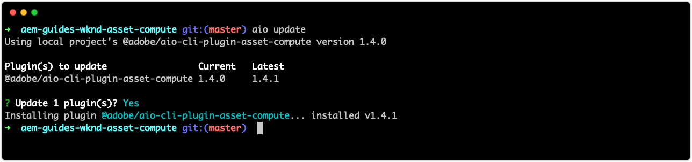

# 疑難排解資產計算擴充性

以下是開發和部署AEM Assets的自訂「資產計算」工作者時，可能遇到的常見問題和錯誤以及解決方案的索引。

## 開發{#develop}

### 傳回部分繪製／損毀的轉譯{#rendition-returned-partially-drawn-or-corrupt}

+ __錯誤__:轉譯會呈現不完整（當影像時）或損毀且無法開啟。

   

+ __原因__:工作者的功 `renditionCallback` 能會在轉譯完全寫入之前退出 `rendition.path`。
+ __解析度__:檢閱自訂工作程式碼，並確保所有非同步呼叫都是使用同步呼叫 `await`。

## 開發工具{#development-tool}

### manifest.yml中的YAML縮排不正確{#incorrect-yaml-indentation}

+ __錯誤：__ YAMLException:在行X，列Y:（通過從命令中標準輸出）處對映條目進行不 `aio app run` 良縮進
+ __原因：__ Yaml檔案會以白色間隔顯示，可能是縮排不正確。
+ __解析度：__ 檢閱您的 `manifest.yml` 縮排，並確保所有縮排正確無誤。

### memorySize限制設定為過低{#memorysize-limit-is-set-too-low}

+ __錯誤：__ 本機開發伺服器OpenWhiskError:PUT https://adobeioruntime.net/api/v1/namespaces/xxx-xxx-xxx/actions/xxx-0.0.1/__secured_workeroverwrite=true傳回HTTP 400（錯誤請求）—> &quot;請求內容格式錯誤：requirement失敗：記憶體低於允許的閾值64 MB 134217728 B&quot;
+ __原因：__ 在中 `memorySize` 為工作器設定的限制 `manifest.yml` 低於錯誤消息報告的允許的最小閾值（以位元組為單位）。
+ __解析度：__ 檢閱中 `memorySize` 的限制， `manifest.yml` 並確保這些限制都大於允許的最小閾值。

### 由於缺少private.key，開發工具無法啟動{#missing-private-key}

+ __錯誤：__ 本機開發伺服器錯誤：validatePrivateKeyFile中缺少所需檔案……. (透過標準輸出命令 `aio app run` )
+ __原因：__ 檔 `ASSET_COMPUTE_PRIVATE_KEY_FILE_PATH` 案中的 `.env` 值不指向目前使用者 `private.key` ，或 `private.key` 者無法讀取。
+ __解析度：__ 檢視檔 `ASSET_COMPUTE_PRIVATE_KEY_FILE_PATH` 案中的 `.env` 值，並確定它包含檔案系統上的完整 `private.key` 絕對路徑。

### 來源檔案下拉式清單不正確{#source-files-dropdown-incorrect}

資產計算開發工具可能會進入其提取過時資料的狀態，在顯示錯誤項目的「來源檔案」下拉式清單 __中__ ，這個狀態最為明顯。

+ __錯誤：__ 來源檔案下拉式清單顯示不正確的項目。
+ __原因：__ 過期的快取瀏覽器狀態會導致
+ __解析度：__ 在您的瀏覽器中，完全清除瀏覽器標籤的「應用程式狀態」、瀏覽器快取、本機儲存空間和服務工作者。

### 遺失或無效的devToolToken查詢參數{#missing-or-invalid-devtooltoken-query-parameter}

+ __錯誤：__ 資產計算開發工具中的「未授權」通知
+ __原因：__`devToolToken` 遺失或無效
+ __解析度：__ 關閉「資產計算開發工具」瀏覽器窗口，終止任何通過命令啟動的運行中的「開發工具」 `aio app run` 進程，然後重新啟動「開發工具」(使用 `aio app run`)。

### 無法刪除源檔案{#unable-to-remove-source-files}

+ __錯誤：__ 無法從開發工具UI移除新增的來源檔案
+ __原因：__ 此功能尚未實作
+ __解析度：__ 使用中定義的憑證登入您的雲端儲存供應商 `.env`。 找出「開發工具」(也在中指定 `.env`)所使用的容器，導覽至 __來源__ ，並刪除任何來源影像。 如果刪除的來源檔案仍繼續顯示在下拉式清單中 [](#source-files-dropdown-incorrect) ,YOu可能需要執行「來源檔案」下拉式清單中概述的步驟，因為這些檔案可能會在開發工具的「應用程式狀態」中快取在本機。

   

## 測試{#test}

### 測試執行期間未產生轉譯{#test-no-rendition-generated}

+ __錯誤：__ 失敗：未產生轉譯。
+ __原因：__ 由於意外錯誤（如JavaScript語法錯誤），工作者無法產生轉譯。
+ __解析度：__ 查看測試執行的位 `test.log` 置 `/build/test-results/test-worker/test.log`。 在此檔案中找到與失敗測試案例對應的部分，並查看錯誤。

   

### 測試會產生錯誤的轉譯，導致測試失敗{#tests-generates-incorrect-rendition}

+ __錯誤：__ 失敗：轉譯&#39;rendition.xxx&#39;不如預期。
+ __原因：__ 工作者輸出與測試案例中提供的格 `rendition.<extension>` 式副本不同的格式副本。
   + 如果在測 `rendition.<extension>` 試案例中，未以與本機產生的轉譯完全相同的方式建立預期的檔案，則測試可能會失敗，因為位可能會有一些差異。 例如，如果「資產計算」工作人員使用API變更對比，而預期的結果是透過調整Adobe Photoshop CC中的對比來建立，則檔案可能會顯示相同，但位元的細微變化可能不同。
+ __解析度：__ 導覽至測試以檢視轉譯輸出，並 `/build/test-worker/<worker-name>/<test-run-timestamp>/<test-case>/rendition.<extension>`將它與測試案例中預期的轉譯檔案比較。 若要建立精確的預期資產，請執行下列任一動作：
   + 使用「開發工具」產生轉譯、驗證其正確性，並將其當做預期的轉譯檔案使用
   + 或者，在驗證測試產生的檔 `/build/test-worker/<worker-name>/<test-run-timestamp>/<test-case>/rendition.<extension>`案、驗證其正確性，並將其用作預期的轉譯檔案

## 偵錯


### 除錯程式未附加{#debugger-does-not-attach}

+ __錯誤__:處理啟動時出錯：錯誤：無法連接到調試目標……
+ __原因__:Docker Desktop未在本地系統上運行。 檢視VS程式碼除錯主控台（「檢視>除錯主控台」）以確認此錯誤，並報告此錯誤。
+ __解析度__:啟動 [Docker Desktop，並確認安裝了必要的Docker映像](./set-up/development-environment.md#docker)。

### 中斷點不會暫停{#breakpoints-no-pausing}

+ __錯誤__:從可除錯的開發工具執行Asset Compute工具時，VS程式碼不會在中斷點暫停。

#### VS程式碼除錯程式未連接{#vs-code-debugger-not-attached}

+ __原因：__ VS代碼調試器已停止／斷開。
+ __解析度：__ 重新啟動VS程式碼除錯程式，並透過檢視VS程式碼除錯輸出主控台（檢視>除錯主控台）來驗證它是否連接

#### VS代碼調試器在工作器執行開始後附加{#vs-code-debugger-attached-after-worker-execution-began}

+ __原因：__ 在點選「在開發工具中執行」之前，VS程式碼除錯程 __式__ 未附加。
+ __解析度：__ 檢視VS程式碼的除錯控制台（「檢視>除錯控制台」），然後從開發工具重新執行Asset Compute Worker，以確保除錯程式已附加。

### 在調試時工作器超時{#worker-times-out-while-debugging}

+ __錯誤__:「除錯控制台」報告「動作將逾時-XXX毫秒」或 [Asset Compute Development Tool的轉譯預覽無限期旋轉](./develop/development-tool.md) ，或
+ __原因__:在除錯期間，會超出manifest.yml中 [定義的工作器逾時](./develop/manifest.md) 。
+ __解析度__:暫時增加manifest.yml中工作者的逾 [時](./develop/manifest.md) ，或加速除錯活動。

### 無法終止調試器進程{#cannot-terminate-debugger-process}

+ __錯誤__: `Ctrl-C` 命令行上不終止調試程式進程(`npx adobe-asset-compute devtool`)。
+ __原因__:1.3.x `@adobe/aio-cli-plugin-asset-compute` 中出現錯誤，導致 `Ctrl-C` 無法識別為終止命令。
+ __解析度__:更 `@adobe/aio-cli-plugin-asset-compute` 新至1.4.1+版

   ```
   $ aio update
   ```

   

## 部署{#deploy}

### AEM中資產中遺失自訂轉譯{#custom-rendition-missing-from-asset}

+ __錯誤：__ 新資產和重新處理的資產處理成功，但遺失自訂轉譯

#### 處理配置檔案未應用到祖先資料夾

+ __原因：__ 資產不存在於使用自訂工作器的「處理設定檔」資料夾下
+ __解析度：__ 將處理描述檔套用至資產的祖先資料夾

#### 處理設定檔由較低的處理設定檔取代

+ __原因：__ 資產存在於套用自訂工作者處理設定檔的資料夾下方，但該資料夾與資產之間已套用不使用客戶工作者的不同處理設定檔。
+ __解析度：__ 合併或協調兩個處理配置檔案並刪除中間處理配置檔案

### AEM中的資產處理失敗{#asset-processing-fails}

+ __錯誤：__ 資產處理失敗標章顯示在資產上
+ __原因：__ 自定義工作器的執行時出錯
+ __解析度：__ 請依照使用 [除錯Adobe I/O Runtime啟動的指示](./test-debug/debug.md#aio-app-logs)`aio app logs`。


