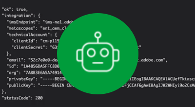

# AEMas a Cloud Service驗證

AEMas a Cloud Service支援多個身份驗證選項，並因服務類型而異。

|  | AEM 作者 | AEM 發佈 |
|-----------------------|:----------:|:-----------:|
| [Adobe IMS](../accessing/overview.md) | ✔ | ✘ |
| [SAML 2.0](./saml-2-0.md) | ✘ | ✔ |
| [令牌驗證](../../headless-tutorial/authentication/overview.md) | ✔ | ✔ |

## 驗證選項

按一下下面的相應連結以瞭解有關如何設定和使用身份驗證方法的詳細資訊。

<table>
  <tr>
   <td>
      
      
<strong><a href="../accessing/overview.md">Adobe IMS</a></strong>

      

          使用Adobe IMS通過Adobe Admin Console管理AEM作者訪問。
      

    </td>   
   <td>
      
      
<strong><a href="./saml-2-0.md">SAML 2.0</a></strong>

      

        使用AEM發佈服務的SAML 2.0整合，將網站的用戶驗證到IDP。
      

    </td>   
   <td>
      
      
<strong><a href="../../headless-tutorial/authentication/overview.md">令牌驗證</a></strong>

      

        允許應用程式和中間件使用AEMAPI服務令牌進行身份驗證。
      

    </td>   
  </tr>
</table>
