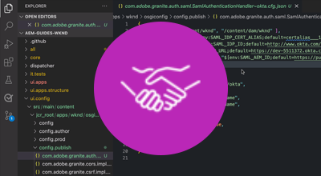

# AEM as a Cloud Service驗證

AEM as a Cloud Service支援多種驗證選項，且會因服務型別而異。

|                       | AEM 作者 | AEM 發佈 |
|-----------------------|:----------:|:-----------:|
| [Adobe IMS](../accessing/overview.md) | ✔ | ✘ |
| · [SAML 2.0 （透過Adobe IMS](https://experienceleague.adobe.com/docs/experience-manager-cloud-service/content/security/ims-support.html#how-to-set-up)） | ✔ | ✘ |
| [SAML 2.0](./saml-2-0.md) | ✘ | ✔ |
| [單一登入(SSO)](https://experienceleague.adobe.com/docs/experience-manager-cloud-service/content/sites/authoring/personalization/user-and-group-sync-for-publish-tier.html#integration-with-an-idp) | ✘ | ✔ |
| [OAuth](https://experienceleague.adobe.com/docs/experience-manager-cloud-service/content/sites/authoring/personalization/user-and-group-sync-for-publish-tier.html#integration-with-an-idp) | ✘ | ✔ |
| [權杖驗證](../../headless-tutorial/authentication/overview.md) | ✔ | ✔ |
| 基本驗證 | ✘ | ✘ |

## 驗證選項

按一下以下對應的連結，以取得有關如何設定及使用驗證方法的詳細資訊。

<table>
  <tr>
   <td>
      
      
<strong><a href="../accessing/overview.md">Adobe IMS</a></strong>

      

          透過Adobe Admin Console使用Adobe IMS管理AEM作者存取權。
      

    </td>   
   <td>
      
      
<strong><a href="./saml-2-0.md">SAML 2.0</a></strong>

      

        使用AEM Publish服務的SAML 2.0整合，向IDP驗證您網站的使用者。
      

    </td>   
   <td>
      
      
<strong><a href="../../headless-tutorial/authentication/overview.md">權杖驗證</a></strong>

      

        允許應用程式和中介軟體使用API服務權杖向AEM進行驗證。
      

    </td>   
  </tr>
</table>
