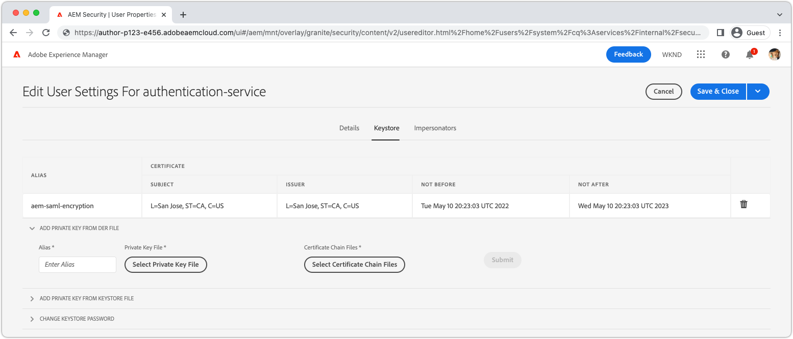

# SAML 2.0身份驗證{#saml-2-0-authentication}

瞭解如何設定最終用戶（而非作者）並AEM驗證其是否與您選擇的SAML 2.0相容的IDP。

## 什麼SAMLAEMas a Cloud Service?

SAML 2.0與AEM發佈（或預覽）整合，允許基於Web體驗的最終用戶向非AdobeIDP（身份提供程式）進AEM行身份驗證，並以指定的授權用戶AEM身份訪問。

|  | AEM 作者 | AEM 發佈 |
|-----------------------|:----------:|:-----------:|
| SAML 2.0支援 | ✘ | ✔ |

+++ 瞭解SAML 2.0流，具AEM體

AEM發佈SAML整合的典型流如下：

1. 用戶向AEM發出請求發佈指示需要身份驗證。
   + 用戶請求受CUG/ACL保護的資源。
   + 用戶請求受身份驗證要求約束的資源。
   + 用戶跟蹤到登AEM錄終結點的連結(即 `/system/sling/login`)。
1. 向IDPAEM發出AuthnRequest ，請求IDP啟動身份驗證過程。
1. 用戶驗證到IDP。
   + IDP提示用戶獲取憑據。
   + 用戶已經通過IDP驗證，無需提供進一步的憑據。
1. IDP生成包含用戶資料的SAML斷言，並使用IDP的私有證書對其簽名。
1. IDP通過HTTPPOST，通過用戶的Web瀏覽器，將SAML斷言發送到AEM發佈。
1. AEM Publish接收SAML斷言，並使用IDP公共證書驗證SAML斷言的完整性和真實性。
1. AEM發佈基於AEMSAML 2.0 OSGi配置和SAML聲明的內容來管理用戶記錄。
   + 建立用戶
   + 同步用戶屬性
   + 更新AEM用戶組成員
1. AEM發佈設定AEM `login-token` HTTP響應上的cookie，用於驗證後續對AEM發佈的請求。
1. AEM發佈將用戶重定向到AEM發佈上的URL，如 `saml_request_path` 餅乾。

+++

## 配置瀏覽

>[!VIDEO](https://video.tv.adobe.com/v/343040?quality=12&learn=on)

該視頻介紹了如何設定SAML 2.0與AEMas a Cloud Service發佈服務的整合，以及使用Okta作為IDP。

## 必備條件

設定SAML 2.0身份驗證時，需要以下內容：

+ 部署管理器對雲管理器的訪問
+ 管AEM理員訪問AEMas a Cloud Service環境
+ 管理員對IDP的訪問
+ （可選）訪問用於加密SAML負載的公共/專用密鑰對

SAML 2.0僅支援對AEM發佈或預覽進行身份驗證。 要管理AEM作者使用和IDP的身份驗證， [將IDP與Adobe IMS整合。](https://helpx.adobe.com/tw/enterprise/using/set-up-identity.html)。


## 在上安裝IDP公共證AEM書

IDP的公共證書將添加到全AEM局信任儲存，用於驗證由IDP發送的SAML斷言是否有效。

+++SAML斷言簽名流


1. 用戶驗證到IDP。
1. IDP生成包含用戶資料的SAML斷言。
1. IDP使用IDP的私有證書籤署SAML聲明。
1. IDP啟動客戶端HTTPPOST到AEM發佈的SAML終結點(`.../saml_login`)，其中包含簽名的SAML斷言。
1. AEM發佈接收包含已簽名的SAML斷言的HTTPPOST，可以使用IDP公共證書驗證簽名。

+++


1. 獲取 __公共證書__ 檔案。 此證書AEM允許驗證IDP提供的AEMSAML斷言。

   證書採用PEM格式，應類似於：

   ```
   -----BEGIN CERTIFICATE-----
   MIIC4jCBAcoCCQC33wnybT5QZDANBgkqhkiG9w0BAQsFADAyMQswCQYDVQQGEwJV
   ...
   m0eo2USlSRTVl7QHRTuiuSThHpLKQQ==
   -----END CERTIFICATE-----
   ```

1. 以管理員身份登錄到AEM作AEM者。
1. 導航到 __「工具」>「安全性」>「信任儲存」__。
1. 建立或開啟全局信任儲存。 如果建立全局信任儲存，請將密碼儲存到某個安全位置。
1. 展開 __從CER檔案添加證書__。
1. 選擇 __選擇證書檔案__，並上載IDP提供的證書檔案。
1. 離開 __將證書映射到用戶__ 空白。
1. 選擇 __提交__。
1. 新添加的證書顯示在 __從CRT檔案添加證書__ 的子菜單。
1. 記錄 __別名__，因為在 [SAML 2.0身份驗證處理程式OSGi配置](#saml-2-0-authentication-handler-osgi-configuration)。
1. 選擇 __保存並關閉__。

全局信任儲存在AEM作者上配置了IDP的公共證書，但由於SAML僅在AEM發佈上使用，因此必須將全局信任儲存複製到AEM發佈，以便IDP公共證書可在此訪問。


1. 導覽至&#x200B;__工具 > 部署 > 套件__。
1. 建立包
   + 包名稱： `Global Trust Store`
   + 版本: `1.0.0`
   + 群組: `com.your.company`
1. 編輯新 __全局信任儲存__ 檔案。
1. 選擇 __篩選器__ 頁籤，並為根路徑添加篩選器 `/etc/truststore`。
1. 選擇 __完成__ 然後 __保存__。
1. 選擇 __生成__ 按鈕 __全局信任儲存__ 檔案。
1. 生成後，選擇 __更多__ > __複製__ 激活全局信任儲存節點(`/etc/truststore`)到AEM發佈。

## 建立身份驗證服務密鑰庫{#authentication-service-keystore}

_在 [SAML 2.0身份驗證處理程式OSGi配置屬性 `handleLogout` 設定為 `true`](#saml-20-authenticationsaml-2-0-authentication) 或 [AuthnRequest簽名/SAML斷言加密](#install-aem-public-private-key-pair) 必填_

1. 以管理員身份登錄到AEM作AEM者，以上載私鑰。
1. 導航到 __工具>安全>用戶__，然後選擇 __認證服務__ 用戶，然後選擇 __屬性__ 按鈕。
1. 選擇 __密鑰庫__ 頁籤。
1. 建立或開啟密鑰庫。 如果建立密鑰庫，請確保口令安全。
   + A [公共/私有密鑰庫已安裝到此密鑰庫中](#install-aem-public-private-key-pair) 僅當需要AuthnRequest簽名/SAML斷言加密時。
   + 如果此SAML整合支援註銷，但不支援AuthnRequest簽名/SAML斷言，則空密鑰庫就足夠了。
1. 選擇 __保存並關閉__。
1. 建立包含已更新的包 __認證服務__ 。

   _使用包使用以下臨時解決方法：_

   1. 導覽至&#x200B;__工具 > 部署 > 套件__。
   1. 建立包
      + 包名稱： `Authentication Service`
      + 版本: `1.0.0`
      + 群組: `com.your.company`
   1. 編輯新 __身份驗證服務密鑰儲存__ 檔案。
   1. 選擇 __篩選器__ 頁籤，並為根路徑添加篩選器 `/home/users/system/cq:services/internal/security/<AUTHENTICATION SERVICE UUID>/keystore`。
      + 的 `<AUTHENTICATION SERVICE UUID>` 可導航到 __工具>安全>用戶__，選擇 __認證服務__ 。 UUID是URL的最後一部分。
   1. 選擇 __完成__ 然後 __保存__。
   1. 選擇 __生成__ 按鈕 __身份驗證服務密鑰儲存__ 檔案。
   1. 生成後，選擇 __更多__ > __複製__ 將身份驗證服務密鑰儲存激活到AEM發佈。

## 安裝AEM公鑰/私鑰對{#install-aem-public-private-key-pair}

_可選AEM安裝公共/私鑰對_

AEM發佈可配置為對AuthnRequests（到IDP）進行簽名，並對SAML斷言(到AEM)進行加密。 這是通過為AEM發佈提供一個私鑰來實現的，並且它與IDP匹配公共密鑰。

+++ 瞭解AuthnRequest簽名流（可選）

AuthnRequest（AEM Publish向IDP發出的啟動登錄過程的請求）可以由AEM Publish簽名。 為此，AEM Publish使用私鑰簽名AuthnRequest，然後IDP使用公鑰驗證簽名。 這保證IDP AuthnRequest是由AEM Publish發起和請求的，而不是惡意第三方。


1. 用戶向AEM發佈發出HTTP請求，導致向IDP發出SAML驗證請求。
1. AEM發佈生成發送到IDP的SAML請求。
1. AEM發佈使用私鑰對SAML請AEM求籤名。
1. AEM發佈啟動AuthnRequest,HTTP客戶端重定向到包含簽名的SAML請求的IDP。
1. IDP接收AuthnRequest，並使用公鑰驗證簽AEM名，保證AEM Publish啟動了AuthnRequest。
1. 然後，AEM Publish使用IDP公共證書驗證解密的SAML斷言的完整性和真實性。

+++

+++ 瞭解SAML斷言加密流（可選）

IDP和AEM發佈之間的所有HTTP通信都應通過HTTPS進行，因此預設情況下是安全的。 但是，在需要HTTPS提供的保密性之外，SAML斷言可以根據需要進行加密。 為此，IDP使用私鑰對SAML斷言資料進行加密，AEM發佈使用私鑰對SAML斷言進行解密。


1. 用戶驗證到IDP。
1. IDP生成包含用戶資料的SAML斷言，並使用IDP的私有證書對其簽名。
1. 然後，IDP使用公鑰對SAML斷言AEM進行加密，這需要AEM私鑰才能解密。
1. 加密的SAML斷言通過用戶的Web瀏覽器發送到AEM發佈。
1. AEM Publish接收SAML斷言，並使用私鑰對其AEM解密。
1. IDP提示用戶進行身份驗證。

+++

AuthnRequest簽名和SAML斷言加密都是可選的，但是，使用 [SAML 2.0身份驗證處理程式OSGi配置屬性 `useEncryption`](#saml-20-authenticationsaml-2-0-authentication)，表示不能同時使用或兩者都不能使用。



1. 獲取用於對AuthnRequest進行簽名和加密SAML斷言的公鑰、私鑰（PKCS#8以DER格式）和證書鏈檔案（這可能是公鑰）。 密鑰通常由IT組織的安全團隊提供。

   + 可以使用 __門__:

   ```
   $ openssl req -x509 -sha256 -days 365 -newkey rsa:4096 -keyout aem-private.key -out aem-public.crt
   
   # Provide a password (keep in safe place), and other requested certificate information
   
   # Convert the keys to AEM's required format 
   $ openssl rsa -in aem-private.key -outform der -out aem-private.der
   $ openssl pkcs8 -topk8 -inform der -nocrypt -in aem-private.der -outform der -out aem-private-pkcs8.der
   ```

1. 將公鑰上載到IDP。
   + 使用 `openssl` 以上方法，公鑰為 `aem-public.crt` 的子菜單。
1. 以管理員身份登錄到AEM作AEM者，以上載私鑰。
1. 導航到 __「工具」>「安全性」>「信任儲存」__，然後選擇 __認證服務__ 用戶，然後選擇 __屬性__ 按鈕。
1. 導航到 __工具>安全>用戶__，然後選擇 __認證服務__ 用戶，然後選擇 __屬性__ 按鈕。
1. 選擇 __密鑰庫__ 頁籤。
1. 建立或開啟密鑰庫。 如果建立密鑰庫，請確保口令安全。
1. 選擇 __從DER檔案添加私鑰__，並將私鑰和鏈檔案添加到AEM:
   + __別名__:提供一個有意義的名稱，通常是國內流離失所者的名稱。
   + __私鑰檔案__:上載私鑰檔案（PKCS#8的DER格式）。
      + 使用 `openssl` 方法，這是 `aem-private-pkcs8.der` 檔案
   + __選擇證書鏈檔案__:上載隨附的鏈檔案（這可能是公鑰）。
      + 使用 `openssl` 方法，這是 `aem-public.crt` 檔案
   + 選擇 __提交__
1. 新添加的證書顯示在 __從CRT檔案添加證書__ 的子菜單。
   + 記錄 __別名__ 在 [SAML 2.0身份驗證處理程式OSGi配置](#saml-20-authentication-handler-osgi-configuration)
1. 選擇 __保存並關閉__。
1. 建立包含已更新的包 __認證服務__ 。

   _使用包使用以下臨時解決方法：_

   1. 導覽至&#x200B;__工具 > 部署 > 套件__。
   1. 建立包
      + 包名稱： `Authentication Service`
      + 版本: `1.0.0`
      + 群組: `com.your.company`
   1. 編輯新 __身份驗證服務密鑰儲存__ 檔案。
   1. 選擇 __篩選器__ 頁籤，並為根路徑添加篩選器 `/home/users/system/cq:services/internal/security/<AUTHENTICATION SERVICE UUID>/keystore`。
      + 的 `<AUTHENTICATION SERVICE UUID>` 可導航到 __工具>安全>用戶__，選擇 __認證服務__ 。 UUID是URL的最後一部分。
   1. 選擇 __完成__ 然後 __保存__。
   1. 選擇 __生成__ 按鈕 __身份驗證服務密鑰儲存__ 檔案。
   1. 生成後，選擇 __更多__ > __複製__ 將身份驗證服務密鑰儲存激活到AEM發佈。

## 配置SAML 2.0身份驗證處理程式{#configure-saml-2-0-authentication-handler}

通AEM過 __Adobe花崗岩SAML 2.0身份驗證處理程式__ OSGi配置。
該配置是OSGi工廠配置，這意味著單個AEMas a Cloud Service發佈服務可能具有多個覆蓋儲存庫離散資源樹的SAML配置；這對於多站點部署非常AEM有用。

+++ SAML 2.0身份驗證處理程式OSGi配置辭彙表

### Adobe花崗岩SAML 2.0身份驗證處理程式OSGi配置{#configure-saml-2-0-authentication-handler-osgi-configuration}

|  | OSGi屬性 | 必要 | 值格式 | 預設值 | 說明 |
|-----------------------------------|-------------------------------|:--------:|:---------------------:|---------------------------|-------------|
| 路徑 | `path` | ✔ | 字串陣列 | `/` | 此驗AEM證處理程式用於的路徑。 |
| IDP URL | `idpUrl` | ✔ | 字串 |  | 發送SAML驗證請求的IDP URL。 |
| IDP證書別名 | `idpCertAlias` | ✔ | 字串 |  | 在全局信任儲存中找到的IDP證AEM書的別名 |
| IDP HTTP重定向 | `idpHttpRedirect` | ✘ | 布林值 | `false` | 指示HTTP是否重定向到IDP URL，而不是發送AuthnRequest。 設定為 `true` IDP啟動的身份驗證。 |
| IDP標識符 | `idpIdentifier` | ✘ | 字串 |  | 唯一IDP Id可確保AEM用戶和組的唯一性。 如果為空，則 `serviceProviderEntityId` 的雙曲餘切值。 |
| 斷言使用者服務URL | `assertionConsumerServiceURL` | ✘ | 字串 |  | 的 `AssertionConsumerServiceURL` AuthnRequest中的URL屬性，指定 `<Response>` 必須將消息發送AEM至。 |
| SP實體ID | `serviceProviderEntityId` | ✔ | 字串 |  | 對國內流離失所AEM者唯一地確定；通常是AEM主機名。 |
| SP加密 | `useEncryption` | ✘ | 布林值 | `true` | 指示IDP是否加密SAML斷言。 需要 `spPrivateKeyAlias` 和 `keyStorePassword` 來設定。 |
| SP私鑰別名 | `spPrivateKeyAlias` | ✘ | 字串 |  | 中私鑰的別名 `authentication-service` 用戶密鑰儲存。 如果 `useEncryption` 設定為 `true`。 |
| SP密鑰儲存密碼 | `keyStorePassword` | ✘ | 字串 |  | 「authentication-service」用戶密鑰儲存的密碼。 如果 `useEncryption` 設定為 `true`。 |
| 預設重定向 | `defaultRedirectUrl` | ✘ | 字串 | `/` | 成功驗證後的預設重定向URL。 可以是相對於主AEM機(例如， `/content/wknd/us/en/html`)。 |
| 用戶ID屬性 | `userIDAttribute` | ✘ | 字串 | `uid` | 包含用戶ID的SAML斷言屬性的名AEM稱。 留空以使用 `Subject:NameId`。 |
| 自動建立用AEM戶 | `createUser` | ✘ | 布林值 | `true` | 指示是否AEM在成功驗證時建立用戶。 |
| AEM用戶中間路徑 | `userIntermediatePath` | ✘ | 字串 |  | 創AEM建用戶時，此值用作中間路徑(例如， `/home/users/<userIntermediatePath>/jane@wknd.com`)。 需要 `createUser` 設定為 `true`。 |
| AEM用戶屬性 | `synchronizeAttributes` | ✘ | 字串陣列 |  | 要在用戶上儲存的SAML屬性映AEM射清單，格式為 `[ "saml-attribute-name=path/relative/to/user/node" ]` (例如， `[ "firstName=profile/givenName" ]`)。 查看 [本機屬性的完整列AEM表](#aem-user-attributes)。 |
| 將用戶添加到AEM組 | `addGroupMemberships` | ✘ | 布林值 | `true` | 指示成功AEM驗證後是否將用戶自AEM動添加到用戶組。 |
| AEM組成員屬性 | `groupMembershipAttribute` | ✘ | 字串 | `groupMembership` | SAML斷言屬性的名稱，該屬性包含應AEM將用戶添加到的用戶組清單。 需要 `addGroupMemberships` 設定為 `true`。 |
| 預設AEM組 | `defaultGroups` | ✘ | 字串陣列 |  | 始終向AEM添加經過身份驗證的用戶組清單(例如， `[ "wknd-user" ]`)。 需要 `addGroupMemberships` 設定為 `true`。 |
| 名稱IDPolicy格式 | `nameIdFormat` | ✘ | 字串 | `urn:oasis:names:tc:SAML:2.0:nameid-format:transient` | 要在AuthnRequest消息中發送的NameIDPolicy格式參數的值。 |
| 儲存SAML響應 | `storeSAMLResponse` | ✘ | 布林值 | `false` | 指示 `samlResponse` 值儲存在AEM `cq:User` 的下界。 |
| 處理註銷 | `handleLogout` | ✘ | 布林值 | `false` | 指示此SAML驗證處理程式是否處理註銷請求。 需要 `logoutUrl` 來設定。 |
| 註銷URL | `logoutUrl` | ✘ | 字串 |  | 將SAML註銷請求發送到的IDP的URL。 如果 `handleLogout` 設定為 `true`。 |
| 時鐘容差 | `clockTolerance` | ✘ | 整數 | `60` | 驗證AEMSAML斷言時IDP和(SP)時鐘偏差容限。 |
| 摘要方法 | `digestMethod` | ✘ | 字串 | `http://www.w3.org/2001/04/xmlenc#sha256` | IDP在簽名SAML消息時使用的摘要算法。 |
| 簽名方法 | `signatureMethod` | ✘ | 字串 | `http://www.w3.org/2001/04/xmldsig-more#rsa-sha256` | IDP在簽名SAML消息時使用的簽名算法。 |
| 標識同步類型 | `identitySyncType` | ✘ | `default` 或 `idp` | `default` | 不更改 `from` 預設AEM為as a Cloud Service。 |
| 服務排名 | `service.ranking` | ✘ | 整數 | `5002` | 對於相同的配置，更高級別的配置是首選的 `path`。 |

### AEM用戶屬性{#aem-user-attributes}

使AEM用以下用戶屬性，可通過 `synchronizeAttributes` AdobeGranite SAML 2.0身份驗證處理程式OSGi配置中的屬性。  任何IDP屬性都可以與任何用戶屬AEM性同步，但映射到使AEM用屬性屬性（如下所列）則AEM允許自然使用它們。

| 用戶屬性 | 相對屬性路徑 `rep:User` 節點 |
|--------------------------------|--------------------------|
| 標題(例如， `Mrs`) | `profile/title` |
| 給定名稱（即名） | `profile/givenName` |
| 姓（即姓氏） | `profile/familyName` |
| 職務 | `profile/jobTitle` |
| 電子郵件地址 | `profile/email` |
| 街道地址 | `profile/street` |
| 城市 | `profile/city` |
| 郵遞區號 | `profile/postalCode` |
| 國家/地區 | `profile/country` |
| 電話號碼 | `profile/phoneNumber` |
| 關於我 | `profile/aboutMe` |

+++

1. 在項目中建立OSGi配置檔案，地址為 `/ui.config/src/main/content/jcr_root/wknd-examples/osgiconfig/config.publish/com.adobe.granite.auth.saml.SamlAuthenticationHandler~saml.cfg.json` 在IDE中開啟。
   + 更改 `/wknd-examples/` 到 `/<project name>/`
   + 位於 `~` 檔案名中應唯一標識此配置，因此它可能是IDP的名稱，如 `...~okta.cfg.json`。 值應為帶連字元的字母數字。
1. 將以下JSON貼上到 `com.adobe.granite.auth.saml.SamlAuthenticationHandler~...cfg.json` 檔案，並更新 `wknd` 根據需要引用。

   ```json
   {
       "path": [ "/content/wknd", "/content/dam/wknd" ], 
       "idpCertAlias": "$[env:SAML_IDP_CERT_ALIAS;default=certalias___1652125559800]",
       "idpIdentifier": "$[env:SAML_IDP_ID;default=http://www.okta.com/exk4z55r44Jz9C6am5d7]",
       "idpUrl": "$[env:SAML_IDP_URL;default=https://dev-5511372.okta.com/app/dev-5511372_aemasacloudservice_1/exk4z55r44Jz9C6am5d7/sso/saml]",
       "serviceProviderEntityId": "$[env:SAML_AEM_ID;default=https://publish-p123-e456.adobeaemcloud.com]",
       "useEncryption": false,
       "createUser": true,
       "userIntermediatePath": "wknd/idp",
       "synchronizeAttributes":[
           "firstName=profile/givenName"
       ],
       "addGroupMemberships": true,
       "defaultGroups": [ 
           "wknd-users"
       ]
   }
   ```

1. 根據項目要求更新值。 查看 __SAML 2.0身份驗證處理程式OSGi配置辭彙表__ 上面是配置屬性說明
1. 建議但不必使用OSGi環境變數和機密，當值可能與發行週期不同步時，或當類似環境類型/服務層之間的值不同時，則應使用OSGi。 可使用 `$[env:..;default=the-default-value]"` 語法如上所示。

每個環境的OSGi配置(`config.publish.dev`。 `config.publish.stage`, `config.publish.prod`如果SAML配置在不同環境之間不同，則可以使用特定屬性定義。

### 使用加密

當 [加密AuthnRequest和SAML斷言](#encrypting-the-authnrequest-and-saml-assertion)，需要以下屬性： `useEncryption`。 `spPrivateKeyAlias`, `keyStorePassword`。 的 `keyStorePassword` 包含密碼，因此值不能儲存在OSGi配置檔案中，而是使用 [機密配置值](https://experienceleague.adobe.com/docs/experience-manager-cloud-service/content/implementing/deploying/configuring-osgi.html#secret-configuration-values)

+++（可選）更新OSGi配置以使用加密

1. 開啟 `/ui.config/src/main/content/jcr_root/wknd-examples/osgiconfig/config.publish/com.adobe.granite.auth.saml.SamlAuthenticationHandler~saml.cfg.json` 在IDE中。
1. 添加三個屬性 `useEncryption`。 `spPrivateKeyAlias`, `keyStorePassword` 如下所示。

   ```json
   {
   "path": [ "/content/wknd", "/content/dam/wknd" ], 
   "idpCertAlias": "$[env:SAML_IDP_CERT_ALIAS;default=certalias___1234567890]",
   "idpIdentifier": "$[env:SAML_IDP_ID;default=http://www.okta.com/abcdef1235678]",
   "idpUrl": "$[env:SAML_IDP_URL;default=https://dev-5511372.okta.com/app/dev-123567890_aemasacloudservice_1/abcdef1235678/sso/saml]",
   "serviceProviderEntityId": "$[env:SAML_AEM_ID;default=https://publish-p123-e456.adobeaemcloud.com]",
   "useEncryption": true,
   "spPrivateKeyAlias": "$[env:SAML_AEM_KEYSTORE_ALIAS;default=aem-saml-encryption]",
   "keyStorePassword": "$[secret:SAML_AEM_KEYSTORE_PASSWORD]",
   "createUser": true,
   "userIntermediatePath": "wknd/idp"
   "synchronizeAttributes":[
       "firstName=profile/givenName"
   ],
   "addGroupMemberships": true,
   "defaultGroups": [ 
       "wknd-users"
   ]
   }
   ```

1. 加密所需的三個OSGi配置屬性包括：

+ `useEncryption` 設定為 `true`
+ `spPrivateKeyAlias` 包含SAML整合所使用的私鑰的密鑰庫條目別名。
+ `keyStorePassword` 包含 [OSGi密碼配置變數](https://experienceleague.adobe.com/docs/experience-manager-cloud-service/content/implementing/deploying/configuring-osgi.html#secret-configuration-values) 包含 `authentication-service` 用戶密鑰庫的口令。

+++

## 配置引用篩選器

在SAML驗證過程中，IDP將啟動客戶端HTTPPOST到AEM發佈的 `.../saml_login` 終點。 如果IDP和AEM Publish存在於不同的來源，則AEM Publish的 __引用篩選器__ 通過OSGi配置進行配置，以允許來自IDP源的HTTP POST。

1. 在項目中建立（或編輯）OSGi配置檔案 `/ui.config/src/main/content/jcr_root/wknd-examples/osgiconfig/config.publish/org.apache.sling.security.impl.ReferrerFilter.cfg.json`。
   + 更改 `/wknd-examples/` 到 `/<project name>/`
1. 確保 `allow.empty` 值設定為 `true`，也請參見Wiki頁。 `allow.hosts` (或者如果你願意， `allow.hosts.regexp`)包含IDP的來源， `filter.methods` 包括 `POST`。 OSGi配置應類似於：

   ```json
   {
       "allow.empty": true,
       "allow.hosts.regexp": [ ],
       "allow.hosts": [ 
           "$[env:SAML_IDP_REFERRER;default=dev-123567890.okta.com]"
       ],
       "filter.methods": [
           "POST",
       ],
       "exclude.agents.regexp": [ ]
   }
   ```

AEM發佈支援單個引用者篩選器配置，因此將SAML配置要求與任何現有配置合併。

每個環境的OSGi配置(`config.publish.dev`。 `config.publish.stage`, `config.publish.prod`)，如果 `allow.hosts` 或 `allow.hosts.regex`)因環境而異。

## 配置跨源資源共用(CORS)

在SAML驗證過程中，IDP將啟動客戶端HTTPPOST到AEM發佈的 `.../saml_login` 終點。 如果IDP和AEM發佈存在於不同的主機/域上，則AEM發佈的 __CRoss-Origin資源共用(CORS)__ 必須配置為允許IDP的主機/域的HTTP POST。

此HTTPPOST請求 `Origin` 標頭的值通常與AEM發佈主機不同，因此需要CORS配置。

在本地SDK上測試SAML驗AEM證時(`localhost:4503`), IDP可以設定 `Origin` 標題 `null`。 如果是，請添加 `"null"` 到 `alloworigin` 清單框。

1. 在項目中建立OSGi配置檔案，地址為 `/ui.config/src/main/content/jcr_root/wknd-examples/osgiconfig/config.publish/com.adobe.granite.cors.impl.CORSPolicyImpl~saml.cfg.json`
   + 更改 `/wknd-examples/` 到項目名稱
   + 位於 `~` 檔案名中應唯一標識此配置，因此它可能是IDP的名稱，如 `...CORSPolicyImpl~okta.cfg.json`。 值應為帶連字元的字母數字。
1. 將以下JSON貼上到 `com.adobe.granite.cors.impl.CORSPolicyImpl~...cfg.json` 的子菜單。

```json
{
    "alloworigin": [ 
        "$[env:SAML_IDP_ORIGIN;default=https://dev-1234567890.okta.com]", 
        "null"
    ],
    "allowedpaths": [ 
        ".*/saml_login"
    ],
    "supportedmethods": [ 
        "POST"
    ]
}
```

每個環境的OSGi配置(`config.publish.dev`。 `config.publish.stage`, `config.publish.prod`)，如果 `alloworigin` 和 `allowedpaths` 不同的環境。

## 配置AEMDispatcher以允許SAML HTTP POST

成功驗證IDP後，IDP將協調HTTPPOST，返回注AEM冊 `/saml_login` 端點（在IDP中配置）。 此HTTPPOST到 `/saml_login` 在Dispatcher中預設被阻止，因此必須使用以下Dispatcher規則明確允許：

1. 開啟 `dispatcher/src/conf.dispatcher.d/filters/filters.any` 在IDE中。
1. 在檔案底部添加HTTP POST到以結尾的URL的允許規則 `/saml_login`。

```
...

# Allow SAML HTTP POST to ../saml_login end points
/0190 { /type "allow" /method "POST" /url "*/saml_login" }
```

如果配置了Apache Webserver上的URL重寫(`dispatcher/src/conf.d/rewrites/rewrite.rules`)，確保向 `.../saml_login` 端點不會意外損壞。

## 啟用資料同步和封裝令牌

一旦SAML驗證流在AEM發佈中建立用戶，則AEM用戶節點可跨AEM發佈服務層進行身份驗證。
這需要 [資料同步](https://experienceleague.adobe.com/docs/experience-manager-cloud-service/content/sites/authoring/personalization/user-and-group-sync-for-publish-tier.html#data-synchronization) 和 [封裝的令牌](https://experienceleague.adobe.com/docs/experience-manager-cloud-service/content/sites/authoring/personalization/user-and-group-sync-for-publish-tier.html#sticky-sessions-and-encapsulated-tokens) 由AEM發佈服務上的Adobe支援啟用。

向Adobe客戶支援發送請求(通過 [管理控制台](https://adminconsole.adobe.com) >支援)請求：

> 資料同步和封裝的令牌在程式X和環境Y的AEM發佈服務上啟用。

## 部署SAML配置

OSGi配置必須提交到Git，並且必須使用雲管理AEM器部署到as a Cloud Service。

```
$ git remote -v            
adobe   https://git.cloudmanager.adobe.com/myOrg/myCloudManagerGit/ (fetch)
adobe   https://git.cloudmanager.adobe.com/myOrg/myCloudManagerGit/ (push)
$ git add .
$ git commit -m "SAML 2.0 configurations"
$ git push adobe saml-auth:develop
```

部署目標Cloud Manager Git分支(在本示例中， `develop`)，使用完整堆棧部署管道。
