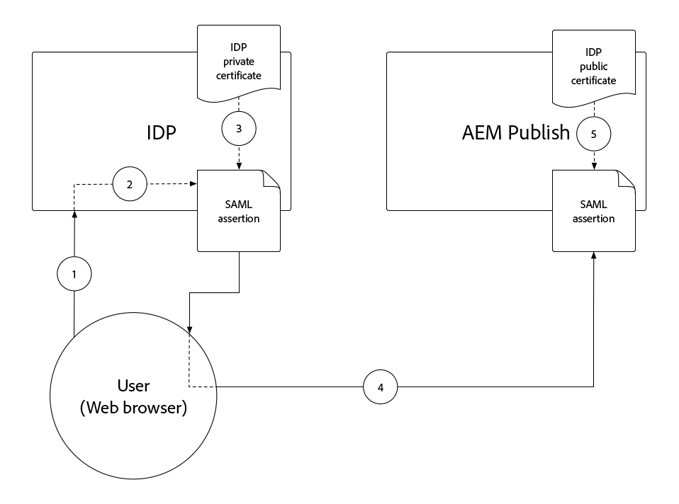

# SAML 2.0身份驗證

瞭解如何設定最終用戶（而非作者）並AEM驗證其是否與您選擇的SAML 2.0相容的IDP。

SAML 2.0與AEMPublish（或預覽）整合，允許基於Web體驗的最終用戶向非AdobeIDP（身份提供方）進行身份驗證，並以已命AEM名的授權用戶身份訪問。

|                       | AEM 作者 | AEM Publish |
|-----------------------|:----------:|:-----------:|
| SAML 2.0支援 | ✘ | ✔ |

+++ 透過AEM瞭解SAML 2.0流程

AEM Publish SAML整合的典型流程如下：

1. 使用者向AEM發佈提出要求，並指示需要驗證。
   + 使用者請求受CUG/ACL保護的資源。
   + 使用者請求受驗證需求約束的資源。
   + 使用者依循明確要求登入動作的AEM登入端點連結（即`/system/sling/login`）。
1. AEM會向IDP發出AuthnRequest，要求IDP開始驗證程式。
1. 使用者向IDP進行驗證。
   + IDP會提示使用者輸入認證。
   + 使用者已透過IDP驗證，無需再提供認證。
1. IDP會產生包含使用者資料的SAML宣告，並使用IDP的私人憑證加以簽署。
1. IDP會透過HTTP POST，透過使用者的網頁瀏覽器(RESPONSIVE_PROTECTED_PATH/saml_login)將SAML宣告傳送至AEM Publish。
1. AEM Publish會收到SAML判斷提示，並使用IDP公開憑證驗證SAML判斷提示的完整性和真實性。
1. AEM Publish會根據SAML 2.0 OSGi設定和SAML宣告的內容來管理AEM使用者記錄。
   + 建立使用者
   + 同步使用者屬性
   + 更新AEM使用者群組成員資格
1. AEM Publish會在HTTP回應上設定AEM `login-token` Cookie，用於向AEM Publish驗證後續請求。
1. AEM發佈會將使用者重新導向至`saml_request_path` Cookie所指定的AEM發佈上的URL。

+++

## 設定逐步說明

>[!VIDEO](https://video.tv.adobe.com/v/343040?quality=12&learn=on)

本影片逐步解說如何設定SAML 2.0與AEM as a Cloud Service Publish服務的整合，以及使用Okta做為IDP。

## 先決條件

設定SAML 2.0驗證時，需要下列專案：

+ 部署管理員對Cloud Manager的存取權
+ AEM管理員對AEM as a Cloud Service環境的存取權
+ IDP的管理員存取權
+ 選擇性地存取用來加密SAML裝載的公開/私人金鑰組
+ AEM Sites頁面（或頁面樹），發佈AEM到Publish,[受關閉用戶組(CUG)保護](https://experienceleague.adobe.com/zh-hant/docs/experience-manager-cloud-service/content/sites/authoring/sites-console/page-properties#permissions)

SAML 2.0僅支援對Publish或預覽AEM進行身份驗證。 要管理使用和AEMIDP的作者身份驗證，[將IDP與Adobe IMS](https://helpx.adobe.com/tw/enterprise/using/set-up-identity.html)整合。

### AEM作為雲服務預覽服務支援

AEM上支援SAML 2.0作為雲服務，包括預AEM覽。 但是，中的SAML配AEM置依賴於OSGi配置，並且AEMPreview和AEMPublish共用相同的OSGi運行模式解析(`config.publish`)。 因此，您無法為預覽和Publish建立單獨的SAML配置檔案。

相反，在OSGi配置中使用[特定於環境的配置值](https://experienceleague.adobe.com/zh-hant/docs/experience-manager-cloud-service/content/implementing/deploying/configuring-osgi#environment-specific-configuration-values)，並為預覽和Publish環境設定適當的變數值[。](https://experienceleague.adobe.com/zh-hant/docs/experience-manager-cloud-service/content/implementing/deploying/configuring-osgi#cloud-manager-api-format-for-setting-properties)

## 在上安裝IDP公共證AEM書

IDP的公共證書將添加到全AEM局信任儲存，用於驗證由IDP發送的SAML斷言是否有效。

+++SAML斷言簽名流



1. 用戶驗證到IDP。
1. IDP生成包含用戶資料的SAML斷言。
1. IDP使用IDP的私有證書籤署SAML聲明。
1. IDP啟動客戶端HTTPPOST,AEM到Publish的SAML終結點(`.../saml_login`)，該終結點包括簽名的SAML斷言。
1. AEMPublish收到包含簽名的SAML斷言的HTTPPOST，可以使用IDP公共證書驗證簽名。

+++


1. 從IDP取得&#x200B;__公用憑證__&#x200B;檔案。 此憑證可讓AEM驗證IDP提供給AEM的SAML判斷提示。

   憑證為PEM格式，應類似於：

   ```
   -----BEGIN CERTIFICATE-----
   MIIC4jCBAcoCCQC33wnybT5QZDANBgkqhkiG9w0BAQsFADAyMQswCQYDVQQGEwJV
   ...
   m0eo2USlSRTVl7QHRTuiuSThHpLKQQ==
   -----END CERTIFICATE-----
   ```

1. 以管理員身AEM份登錄到作AEM者。
1. 導航到&#x200B;__工具>安全>信任儲存__。
1. 建立或開啟全局信任儲存。 如果建立全局信任儲存，請將密碼儲存到某個安全位置。
1. 展開&#x200B;__從CER檔案__&#x200B;添加證書。
1. 選擇&#x200B;__選擇證書檔案__，然後上載IDP提供的證書檔案。
1. 將&#x200B;__將證書映射到用戶__&#x200B;留空。
1. 選取&#x200B;__提交__。
1. 新增的憑證出現在&#x200B;__從CRT檔案__&#x200B;新增憑證區段上方。
1. 記下&#x200B;__別名__，因為此值在[SAML 2.0身份驗證處理程式OSGi配置](#saml-2-0-authentication-handler-osgi-configuration)中使用。
1. 選取「__儲存並關閉__」。

全局信任儲存在Author上配置了IDP的公共證書AEM，但由於SAML僅在AEMPublish上使用，因此必須將全局信任儲存複製到AEMPublish，才能在那裡訪問IDP公共證書。


1. 導航到&#x200B;__工具>部署>包__。
1. 建立套件
   + 封裝名稱： `Global Trust Store`
   + 版本： `1.0.0`
   + 群組： `com.your.company`
1. 編輯新的&#x200B;__全域信任存放區__&#x200B;封裝。
1. 選取&#x200B;__篩選器__&#x200B;索引標籤，並為根路徑`/etc/truststore`新增篩選器。
1. 選取&#x200B;__完成__，然後選取&#x200B;__儲存__。
1. 選取&#x200B;__全域信任存放區__&#x200B;封裝的&#x200B;__建置__&#x200B;按鈕。
1. 建置後，選取&#x200B;__更多__ > __復寫__&#x200B;以啟動全域信任存放區節點(`/etc/truststore`)至AEM Publish。

## 建立驗證服務金鑰存放區{#authentication-service-keystore}

_當[SAML 2.0驗證處理常式OSGi組態屬性`handleLogout`設定為`true`](#saml-20-authenticationsaml-2-0-authentication)或需要[AuthnRequest簽署/SAML宣告加密](#install-aem-public-private-key-pair)時，需要建立驗證服務的金鑰存放區_

1. 以AEM管理員身分登入AEM Author以上傳私密金鑰。
1. 導覽至&#x200B;__工具>安全性>使用者__，然後選取&#x200B;__驗證服務__&#x200B;使用者，並從頂端動作列選取&#x200B;__屬性__。
1. 選取&#x200B;__金鑰存放區__&#x200B;索引標籤。
1. 建立或開啟金鑰存放區。 如果建立金鑰存放區，請妥善儲存密碼。
   + 只有在需要AuthnRequest簽署/SAML宣告加密時，才會將[公用/私用金鑰存放區安裝至此金鑰存放區](#install-aem-public-private-key-pair)。
   + 如果此SAML整合支援登出，但不支援AuthnRequest簽署/SAML判斷提示，則空的金鑰儲存區就足夠了。
1. 選取「__儲存並關閉__」。
1. 建立包含已更新的&#x200B;__身份驗證服務__&#x200B;用戶的包。

   使用包&#x200B;:_使用以下臨時解決方法(_U)

   1. 導航到&#x200B;__工具>部署>包__。
   1. 建立包
      + 封裝名稱： `Authentication Service`
      + 版本： `1.0.0`
      + 群組： `com.your.company`
   1. 編輯新的&#x200B;__驗證服務金鑰存放區__&#x200B;封裝。
   1. 選取&#x200B;__篩選器__&#x200B;索引標籤，並為根路徑`/home/users/system/cq:services/internal/security/<AUTHENTICATION SERVICE UUID>/keystore`新增篩選器。
      + 導航到`<AUTHENTICATION SERVICE UUID>`工具>安全性>用戶&#x200B;__並選擇__&#x200B;身份驗證服務&#x200B;__用戶，即可找到__。 UUID是URL的最後一部分。
   1. 選擇&#x200B;__完成__，然後選擇&#x200B;__保存__。
   1. 為&#x200B;__身份驗證服務密鑰儲存__&#x200B;包選擇&#x200B;__生成__&#x200B;按鈕。
   1. 生成後，選擇&#x200B;__更多__ > __複製__&#x200B;以激活到Publish的身份驗證服務密鑰AEM儲存。

## 安AEM裝公鑰/私鑰對{#install-aem-public-private-key-pair}

_安裝AEM公共/私鑰對是可選的_

可AEM以將Publish配置為簽名AuthnRequests（到IDP），並加密SAML斷言(到AEM)。 這是通過向Publish提供私鑰AEM而實現的，並且它與國內流離失所者匹配公鑰。

+++ 瞭解AuthnRequest簽名流（可選）

AuthnRequest(啟動登錄過程的AEMPublish向IDP發出的請求)可由AEMPublish簽署。 為此，AEMPublish使用私鑰簽署AuthnRequest，然後IDP使用公鑰驗證簽名。 這保證AuthnRequest是由Publish發起和請求的，而AEM不是惡意的第三方向國內流離失所者發出的。


1. 用戶向Publish發出HTTPAEM請求，該請求會向IDP發出SAML驗證請求。
1. AEMPublish生成SAML請求以發送給IDP。
1. AEMPublish使用私鑰簽AEM署SAML請求。
1. AEMPublish啟動AuthnRequest,HTTP客戶端重定向到包含簽名的SAML請求的IDP。
1. IDP接收AuthnRequest ，並使用公鑰驗證簽AEM名，保證AEMPublish發起AuthnRequest。
1. AEM Publish接著會使用IDP公開憑證來驗證解密的SAML宣告的完整性和真實性。

+++

+++ 瞭解SAML宣告加密流程（選擇性）

IDP與AEM Publish之間的所有HTTP通訊都應透過HTTPS，因此預設情況下是安全的。 但是，在需要HTTPS提供的保密性之外，SAML斷言可以根據需要進行加密。 為此，IDP使用私鑰對SAML斷言資料進行加密，AEMPublish使用私鑰對SAML斷言進行解密。


1. 用戶驗證到IDP。
1. IDP生成包含用戶資料的SAML斷言，並使用IDP的私有證書對其進行簽名。
1. 然後，IDP使用公鑰對SAML斷言AEM進行加密，這需要AEM私鑰才能解密。
1. 加密的SAML宣告會透過使用者的網頁瀏覽器傳送至AEM Publish。
1. AEM Publish會收到SAML宣告，並使用AEM的私密金鑰加以解密。
1. IDP會提示使用者進行驗證。

+++

AuthnRequest簽名和SAML斷言加密都是可選的，但都是啟用的，使用[SAML 2.0身份驗證處理程式OSGi配置屬性`useEncryption`](#saml-20-authenticationsaml-2-0-authentication)，這意味著兩者都不能使用，也不能同時使用。


1. 獲取用於對AuthnRequest進行簽名和加密SAML斷言的公鑰、私鑰（PKCS#8以DER格式）和證書鏈檔案（這可能是公鑰）。 密鑰通常由IT組織的安全團隊提供。

   + 可以使用&#x200B;__openssl__&#x200B;生成自簽名密鑰對：

   ```
   $ openssl req -x509 -sha256 -days 365 -newkey rsa:4096 -keyout aem-private.key -out aem-public.crt
   
   # Provide a password (keep in safe place), and other requested certificate information
   
   # Convert the keys to AEM's required format 
   $ openssl rsa -in aem-private.key -outform der -out aem-private.der
   $ openssl pkcs8 -topk8 -inform der -nocrypt -in aem-private.der -outform der -out aem-private-pkcs8.der
   ```

1. 將公鑰上載到IDP。
   + 使用上述`openssl`方法，公開金鑰是`aem-public.crt`檔案。
1. 以AEM管理員身分登入AEM Author以上傳私密金鑰。
1. 瀏覽至&#x200B;__工具>安全性>信任存放區__，然後選取&#x200B;__驗證服務__&#x200B;使用者，並從最上方的動作列選取&#x200B;__內容__。
1. 導覽至&#x200B;__工具>安全性>使用者__，然後選取&#x200B;__驗證服務__&#x200B;使用者，並從頂端動作列選取&#x200B;__屬性__。
1. 選取&#x200B;__金鑰存放區__&#x200B;索引標籤。
1. 建立或開啟金鑰存放區。 如果建立金鑰存放區，請妥善儲存密碼。
1. 選取&#x200B;__從DER檔案新增私密金鑰__，並將私密金鑰和鏈結檔案新增至AEM：
   + __別名__：提供有意義的名稱，通常是IDP的名稱。
   + __私密金鑰檔案__：上傳私密金鑰檔案（DER格式為PKCS#8）。
      + 使用上述`openssl`方法，這是`aem-private-pkcs8.der`檔案
   + __選取憑證鏈結檔案__：上傳隨附的鏈結檔案（可能是公開金鑰）。
      + 使用上述`openssl`方法，這是`aem-public.crt`檔案
   + 選取&#x200B;__提交__
1. 新增的憑證出現在&#x200B;__從CRT檔案__&#x200B;新增憑證區段上方。
   + 記下&#x200B;__別名__，因為它用於[SAML 2.0驗證處理常式OSGi設定](#saml-20-authentication-handler-osgi-configuration)
1. 選取「__儲存並關閉__」。
1. 建立包含已更新&#x200B;__authentication-service__&#x200B;使用者的封裝。

   使用包&#x200B;:_使用以下臨時解決方法(_U)

   1. 導航到&#x200B;__工具>部署>包__。
   1. 建立包
      + 包名稱： `Authentication Service`
      + 版本： `1.0.0`
      + 群組： `com.your.company`
   1. 編輯新的&#x200B;__驗證服務金鑰存放區__&#x200B;封裝。
   1. 選取&#x200B;__篩選器__&#x200B;索引標籤，並為根路徑`/home/users/system/cq:services/internal/security/<AUTHENTICATION SERVICE UUID>/keystore`新增篩選器。
      + 瀏覽至`<AUTHENTICATION SERVICE UUID>`工具>安全性>使用者&#x200B;__，並選取__&#x200B;驗證服務&#x200B;__使用者，即可找到__。 UUID是URL的最後一部分。
   1. 選擇&#x200B;__完成__，然後選擇&#x200B;__保存__。
   1. 為&#x200B;__身份驗證服務密鑰儲存__&#x200B;包選擇&#x200B;__生成__&#x200B;按鈕。
   1. 生成後，選擇&#x200B;__更多__ > __複製__&#x200B;以激活到Publish的身份驗證服務密鑰AEM儲存。

## 配置SAML 2.0身份驗證處理程式{#configure-saml-2-0-authentication-handler}

通AEM過&#x200B;__AdobeGranite SAML 2.0身份驗證處理程式__ OSGi配置執行SAML配置。
此設定是OSGi工廠設定，表示單一AEM as a Cloud Service Publish服務可能有多個SAML設定，涵蓋存放庫的分散資源樹狀結構；這對於多網站AEM部署很有用。

+++ SAML 2.0身份驗證處理程式OSGi配置辭彙表

### Adobe花崗岩SAML 2.0身份驗證處理程式OSGi配置{#configure-saml-2-0-authentication-handler-osgi-configuration}

|                                   | OSGi屬性 | 必要 | 值格式 | 預設值 | 說明 |
|-----------------------------------|-------------------------------|:--------:|:---------------------:|---------------------------|-------------|
| 路徑 | `path` | ✔ | 字串陣列 | `/` | 此驗AEM證處理程式用於的路徑。 |
| IDP URL | `idpUrl` | ✔ | 字串 |                           | IDP URL：傳送SAML驗證請求。 |
| IDP憑證別名 | `idpCertAlias` | ✔ | 字串 |                           | 在全局信任儲存中找到的IDP證AEM書的別名 |
| IDP HTTP重定向 | `idpHttpRedirect` | ✘ | 布林值 | `false` | 指示HTTP是否重定向到IDP URL，而不是發送AuthnRequest。 設定為`true`以進行IDP啟動的身份驗證。 |
| IDP識別碼 | `idpIdentifier` | ✘ | 字串 |                           | 唯一IDP ID可確保AEM使用者和群組的唯一性。 如果為空，則改用`serviceProviderEntityId`。 |
| 斷言使用者服務URL | `assertionConsumerServiceURL` | ✘ | 字串 |                           | AuthnRequest中的`AssertionConsumerServiceURL` URL屬性，指定必須將`<Response>`訊息傳送至AEM的位置。 |
| SP實體ID | `serviceProviderEntityId` | ✔ | 字串 |                           | 向IDP唯一識別AEM；通常是AEM主機名稱。 |
| SP加密 | `useEncryption` | ✘ | 布林值 | `true` | 指示IDP是否加密SAML宣告。 需要設定`spPrivateKeyAlias`和`keyStorePassword`。 |
| SP私密金鑰別名 | `spPrivateKeyAlias` | ✘ | 字串 |                           | `authentication-service`使用者金鑰庫中私密金鑰的別名。 如果`useEncryption`設定為`true`則為必要。 |
| SP金鑰庫密碼 | `keyStorePassword` | ✘ | 字串 |                           | &#39;authentication-service&#39;使用者金鑰存放區的密碼。 如果`useEncryption`設定為`true`則為必要。 |
| 預設重新導向 | `defaultRedirectUrl` | ✘ | 字串 | `/` | 成功驗證後的預設重新導向URL。 可相對於AEM主機（例如`/content/wknd/us/en/html`）。 |
| 使用者ID屬性 | `userIDAttribute` | ✘ | 字串 | `uid` | 包含用戶ID的SAML斷言屬性的名AEM稱。 留空以使用`Subject:NameId`。 |
| 自動建立用AEM戶 | `createUser` | ✘ | 布林值 | `true` | 指示是否AEM在成功驗證時建立用戶。 |
| AEM使用者中間路徑 | `userIntermediatePath` | ✘ | 字串 |                           | 建立AEM使用者時，此值會作為中繼路徑（例如`/home/users/<userIntermediatePath>/jane@wknd.com`）。 需要`createUser`設定為`true`。 |
| AEM使用者屬性 | `synchronizeAttributes` | ✘ | 字串陣列 |                           | 要以`[ "saml-attribute-name=path/relative/to/user/node" ]`格式(例AEM如`[ "firstName=profile/givenName" ]`)儲存在用戶上的SAML屬性映射清單。 請參閱[本機屬AEM性的完整清單](#aem-user-attributes)。 |
| 將用戶添加到AEM組 | `addGroupMemberships` | ✘ | 布林值 | `true` | 指示在成功AEM驗證後是否將用戶自AEM動添加到用戶組。 |
| AEM群組成員資格屬性 | `groupMembershipAttribute` | ✘ | 字串 | `groupMembership` | SAML斷言屬性的名稱，該屬性包含應AEM將用戶添加到的用戶組清單。 需要將`addGroupMemberships`設定為`true`。 |
| 預設AEM組 | `defaultGroups` | ✘ | 字串陣列 |                           | 身份驗證AEM的用戶組清單始終添加到（例如，`[ "wknd-user" ]`）。 需要將`addGroupMemberships`設定為`true`。 |
| 名稱IDPolicy格式 | `nameIdFormat` | ✘ | 字串 | `urn:oasis:names:tc:SAML:2.0:nameid-format:transient` | 要在AuthnRequest消息中發送的NameIDPolicy格式參數的值。 |
| 儲存SAML響應 | `storeSAMLResponse` | ✘ | 布林值 | `false` | 指示`samlResponse`值是否儲存在AEM `cq:User`節點上。 |
| 處理登出 | `handleLogout` | ✘ | 布林值 | `false` | 指出此SAML驗證處理常式是否處理登出要求。 需要設定`logoutUrl`。 |
| 登出URL | `logoutUrl` | ✘ | 字串 |                           | IDP的URL，將SAML登出請求傳送至此處。 如果`handleLogout`設定為`true`則為必要。 |
| 時鐘公差 | `clockTolerance` | ✘ | 整數 | `60` | 驗證SAML宣告時，IDP和AEM (SP)時鐘扭曲容許度。 |
| 摘要方法 | `digestMethod` | ✘ | 字串 | `http://www.w3.org/2001/04/xmlenc#sha256` | IDP在簽署SAML訊息時使用的摘要演演算法。 |
| 簽章方法 | `signatureMethod` | ✘ | 字串 | `http://www.w3.org/2001/04/xmldsig-more#rsa-sha256` | IDP在簽署SAML訊息時使用的簽章演演算法。 |
| 身分同步型別 | `identitySyncType` | ✘ | `default` 或 `idp` | `default` | 請勿變更AEM as a Cloud Service的`from`預設值。 |
| 服務排名 | `service.ranking` | ✘ | 整數 | `5002` | 相同`path`偏好較高等級的設定。 |

### AEM使用者屬性{#aem-user-attributes}

AEM使用以下使用者屬性，這些屬性可透過Adobe Granite SAML 2.0驗證處理常式OSGi設定中的`synchronizeAttributes`屬性填入。  任何IDP屬性都可以同步至任何AEM使用者屬性，不過對應至AEM會使用屬性屬性（如下所列），讓AEM可以自然地使用這些屬性。

| 使用者屬性 | 來自`rep:User`節點的相對屬性路徑 |
|--------------------------------|--------------------------|
| 標題（例如，`Mrs`） | `profile/title` |
| 名字（即名字） | `profile/givenName` |
| 姓氏 | `profile/familyName` |
| 職稱 | `profile/jobTitle` |
| 電子郵件地址 | `profile/email` |
| 街道地址 | `profile/street` |
| 城市 | `profile/city` |
| 郵遞區號 | `profile/postalCode` |
| 國家/地區 | `profile/country` |
| 電話號碼 | `profile/phoneNumber` |
| 關於我 | `profile/aboutMe` |

+++

1. 在`/ui.config/src/main/content/jcr_root/wknd-examples/osgiconfig/config.publish/com.adobe.granite.auth.saml.SamlAuthenticationHandler~saml.cfg.json`的專案中建立OSGi設定檔，並在IDE中開啟。
   + 將`/wknd-examples/`變更為您的`/<project name>/`
   + 檔案名稱中`~`之後的識別碼應唯一識別此組態，因此它可能是IDP的名稱，例如`...~okta.cfg.json`。 值應為英數字元和連字型大小。
1. 將下列JSON貼到`com.adobe.granite.auth.saml.SamlAuthenticationHandler~...cfg.json`檔案中，並視需要更新`wknd`參考。

   ```json
   {
       "path": [ "/content/wknd", "/content/dam/wknd" ], 
       "idpCertAlias": "$[env:SAML_IDP_CERT_ALIAS;default=certalias___1652125559800]",
       "idpIdentifier": "$[env:SAML_IDP_ID;default=http://www.okta.com/exk4z55r44Jz9C6am5d7]",
       "idpUrl": "$[env:SAML_IDP_URL;default=https://dev-5511372.okta.com/app/dev-5511372_aemasacloudservice_1/exk4z55r44Jz9C6am5d7/sso/saml]",
       "serviceProviderEntityId": "$[env:SAML_AEM_ID;default=https://publish-p123-e456.adobeaemcloud.com]",
       "useEncryption": false,
       "createUser": true,
       "userIntermediatePath": "wknd/idp",
       "synchronizeAttributes":[
           "firstName=profile/givenName"
       ],
       "addGroupMemberships": true,
       "defaultGroups": [ 
           "wknd-users"
       ]
   }
   ```

1. 依專案要求更新值。 如需設定屬性說明，請參閱上述&#x200B;__SAML 2.0驗證處理常式OSGi設定字彙表__。 `path`應包含受關閉用戶組(CUG)保護且需要身份驗證的內容樹，此身份驗證處理程式應負責保護。
1. 建議但不必使用OSGi環境變數和機密，當值可能與發行週期不同步時，或當類似環境類型/服務層之間的值不同時，則應使用OSGi。 可以使用上面所示的`$[env:..;default=the-default-value]"`語法設定預設值。

如果SAML配置在不同環境之間不同，則可以使用特定屬性定義每個環境（`config.publish.dev`、`config.publish.stage`和`config.publish.prod`）的OSGi配置。

### 使用加密

當[加密AuthnRequest和SAML判斷提示](#encrypting-the-authnrequest-and-saml-assertion)時，需要下列屬性： `useEncryption`、`spPrivateKeyAlias`和`keyStorePassword`。 `keyStorePassword`包含密碼，因此該值不得儲存在OSGi配置檔案中，而應使用[機密配置值](https://experienceleague.adobe.com/docs/experience-manager-cloud-service/content/implementing/deploying/configuring-osgi.html?lang=zh-Hant#secret-configuration-values)注入

+++（可選）更新OSGi配置以使用加密

1. 在IDE中開啟`/ui.config/src/main/content/jcr_root/wknd-examples/osgiconfig/config.publish/com.adobe.granite.auth.saml.SamlAuthenticationHandler~saml.cfg.json`。
1. 添加三個屬性`useEncryption`、`spPrivateKeyAlias`和`keyStorePassword`，如下所示。

   ```json
   {
   "path": [ "/content/wknd", "/content/dam/wknd" ], 
   "idpCertAlias": "$[env:SAML_IDP_CERT_ALIAS;default=certalias___1234567890]",
   "idpIdentifier": "$[env:SAML_IDP_ID;default=http://www.okta.com/abcdef1235678]",
   "idpUrl": "$[env:SAML_IDP_URL;default=https://dev-5511372.okta.com/app/dev-123567890_aemasacloudservice_1/abcdef1235678/sso/saml]",
   "serviceProviderEntityId": "$[env:SAML_AEM_ID;default=https://publish-p123-e456.adobeaemcloud.com]",
   "useEncryption": true,
   "spPrivateKeyAlias": "$[env:SAML_AEM_KEYSTORE_ALIAS;default=aem-saml-encryption]",
   "keyStorePassword": "$[secret:SAML_AEM_KEYSTORE_PASSWORD]",
   "createUser": true,
   "userIntermediatePath": "wknd/idp"
   "synchronizeAttributes":[
       "firstName=profile/givenName"
   ],
   "addGroupMemberships": true,
   "defaultGroups": [ 
       "wknd-users"
   ]
   }
   ```

1. 加密所需的三個OSGi設定屬性是：

+ `useEncryption`已設定為`true`
+ `spPrivateKeyAlias`包含SAML整合使用之私密金鑰的金鑰庫專案別名。
+ `keyStorePassword`包含包含[使用者金鑰儲存區密碼的](https://experienceleague.adobe.com/docs/experience-manager-cloud-service/content/implementing/deploying/configuring-osgi.html?lang=zh-Hant#secret-configuration-values)OSGi密碼設定變數`authentication-service`。

+++

## 設定反向連結篩選器

在SAML驗證程式期間，IDP會向AEM Publish的`.../saml_login`端點起始使用者端HTTP POST。 如果IDP和AEM Publish存在於不同的來源，AEM Publish的&#x200B;__反向連結篩選器__&#x200B;會透過OSGi設定允許來自IDP來源的HTTP POST。

1. 在`/ui.config/src/main/content/jcr_root/wknd-examples/osgiconfig/config.publish/org.apache.sling.security.impl.ReferrerFilter.cfg.json`的專案中建立（或編輯） OSGi設定檔。
   + 將`/wknd-examples/`變更為您的`/<project name>/`
1. 請確定`allow.empty`值設為`true`，`allow.hosts` （或如果您偏好，`allow.hosts.regexp`）包含IDP的來源，且`filter.methods`包含`POST`。 OSGi設定應該類似於：

   ```json
   {
       "allow.empty": true,
       "allow.hosts.regexp": [ ],
       "allow.hosts": [ 
           "$[env:SAML_IDP_REFERRER;default=dev-123567890.okta.com]"
       ],
       "filter.methods": [
           "POST",
       ],
       "exclude.agents.regexp": [ ]
   }
   ```

AEM Publish支援單一反向連結篩選設定，因此請將SAML設定需求與任何現有設定合併。

如果`config.publish.dev` （或`config.publish.stage`）在不同環境之間有所差異，則每個環境（`config.publish.prod`、`allow.hosts`和`allow.hosts.regex`）的OSGi設定都可以與特定屬性一起定義。

## 設定跨原始資源共用(CORS)

在SAML驗證程式期間，IDP會向AEM Publish的`.../saml_login`端點起始使用者端HTTP POST。 如果IDP和AEM Publish存在於不同的主機/網域上，則AEM Publish的&#x200B;__CRoss-Origin Resource Sharing (CORS)__&#x200B;必須設定為允許來自IDP主機/網域的HTTP POST。

此HTTP POST要求的`Origin`標頭通常與AEM Publish主機的值不同，因此需要CORS設定。

在本機AEM SDK (`localhost:4503`)上測試SAML驗證時，IDP可能會將`Origin`標頭設定為`null`。 若是如此，請將`"null"`新增至`alloworigin`清單。

1. 在`/ui.config/src/main/content/jcr_root/wknd-examples/osgiconfig/config.publish/com.adobe.granite.cors.impl.CORSPolicyImpl~saml.cfg.json`的專案中建立OSGi設定檔
   + 將`/wknd-examples/`變更為您的專案名稱
   + 檔案名稱中`~`之後的識別碼應唯一識別此組態，因此它可能是IDP的名稱，例如`...CORSPolicyImpl~okta.cfg.json`。 值應為英數字元和連字型大小。
1. 將下列JSON貼入`com.adobe.granite.cors.impl.CORSPolicyImpl~...cfg.json`檔案。

```json
{
    "alloworigin": [ 
        "$[env:SAML_IDP_ORIGIN;default=https://dev-1234567890.okta.com]", 
        "null"
    ],
    "allowedpaths": [ 
        ".*/saml_login"
    ],
    "supportedmethods": [ 
        "POST"
    ]
}
```

如果`config.publish.dev`和`config.publish.stage`在不同環境之間不同，則每個環境（`config.publish.prod`、`alloworigin`和`allowedpaths`）的OSGi設定可以使用特定屬性來定義。

## 設定AEM Dispatcher以允許SAML HTTP POST

成功驗證IDP後，IDP會為AEM註冊的`/saml_login`端點（在IDP中設定）編排HTTP POST。 此`/saml_login`的HTTP POST預設會在Dispatcher中遭到封鎖，因此必須使用下列Dispatcher規則明確允許使用：

1. 在IDE中開啟`dispatcher/src/conf.dispatcher.d/filters/filters.any`。
1. 在檔案底部新增允許規則，將HTTP POST新增至結尾為`/saml_login`的URL。

```
...

# Allow SAML HTTP POST to ../saml_login end points
/0190 { /type "allow" /method "POST" /url "*/saml_login" }
```

>[!NOTE]
>在AEM中針對各種受保護路徑和不同IDP端點部署多個SAML設定時，請確保IDP張貼到RESPONSIVE_PROTECTED_PATH/saml_login端點以在AEM端選取適當的SAML設定。 如果同一受保護路徑有重複的SAML設定，則會隨機選取SAML設定。

如果已設定Apache Webserver上的URL重新寫入(`dispatcher/src/conf.d/rewrites/rewrite.rules`)，請確定對`.../saml_login`端點的要求不會意外遭到竄改。

## 動態群組成員資格

動態群組成員資格是[Apache Jackrabbit Oak](https://jackrabbit.apache.org/oak/docs/security/authentication/external/dynamic.html)中的功能，可提升群組評估及布建的效能。 本節說明啟用此功能時如何儲存使用者和群組，以及如何修改SAML驗證處理常式的組態，以便為新環境或現有環境啟用它。

### 如何為新環境中的SAML使用者啟用動態群組成員資格

為了大幅增強新AEM as a Cloud Service環境中的群組評估效能，建議在新環境中啟用動態群組成員資格功能。
這也是在啟動資料同步時的必要步驟。 更多詳細資料[在此](https://experienceleague.adobe.com/zh-hant/docs/experience-manager-cloud-service/content/sites/authoring/personalization/user-and-group-sync-for-publish-tier)。
若要這麼做，請將下列屬性新增至OSGI設定檔：

`/apps/example/osgiconfig/config.publish/com.adobe.granite.auth.saml.SamlAuthenticationHandler~example.cfg.json`

使用此組態，使用者和群組會建立為[Oak外部使用者](https://jackrabbit.apache.org/oak/docs/security/authentication/identitymanagement.html?lang=zh-Hant)。 在AEM中，外部使用者和群組有由`rep:principalName`或`[user name];[idp]`組成的預設`[group name];[idp]`。
指出存取控制清單(ACL)與使用者或群組的PrincipalName相關聯。
在先前未指定`identitySyncType`或設為`default`的現有部署中部署此設定時，將會建立新的使用者和群組，且必須將ACL套用至這些新使用者和群組。 Note that external groups cannot contain local users. [Repoinit](https://sling.apache.org/documentation/bundles/repository-initialization.html)可用來建立SAML外部群組的ACL，即使這些群組僅在使用者執行登入時才會建立。
為避免在ACL上重構此功能，已實作標準[移轉功能](#automatic-migration-to-dynamic-group-membership-for-existing-environments)。

### 成員資格如何儲存在具有動態群組成員資格的本機及外部群組中

在本地組上，組成員儲存在oak屬性`rep:members`中。 該屬性包含組中每個成員的uid清單。 在[此處](https://jackrabbit.apache.org/oak/docs/security/user/membership.html#member-representation-in-the-repository)可找到其他詳細資訊。
範例：

```
{
  "jcr:primaryType": "rep:Group",
  "rep:principalName": "operators",
  "rep:managedByIdp": "SAML",
  "rep:members": [
    "635afa1c-beeb-3262-83c4-38ea31e5549e",
    "5e496093-feb6-37e9-a2a1-7c87b1cec4b0",
    ...
  ],
   ...
}
```

具有動態組成員身份的外部組不儲存組條目中的任何成員。
組成員資格將儲存在用戶條目中。 在[此處](https://jackrabbit.apache.org/oak/docs/security/authentication/external/dynamic.html)可找到其他文檔。 例如，這是組的OAK節點：

```
{
  "jcr:primaryType": "rep:Group",
  "jcr:mixinTypes": [
    "rep:AccessControllable"
  ],
  "jcr:createdBy": "",
  "jcr:created": "Tue Jul 16 2024 08:58:47 GMT+0000",
  "rep:principalName": "GROUP_1;aem-saml-idp-1",
  "rep:lastSynced": "Tue Jul 16 2024 08:58:47 GMT+0000",
  "jcr:uuid": "d9c6af8a-35c0-3064-899a-59af55455cd0",
  "rep:externalId": "GROUP_1;aem-saml-idp-1",
  "rep:authorizableId": "GROUP_1;aem-saml-idp-1"
}
```

這是該組中用戶成員的節點：

```
{
  "jcr:primaryType": "rep:User",
  "jcr:mixinTypes": [
    "rep:AccessControllable"
  ],
  "surname": "Test",
  "rep:principalName": "testUser",
  "rep:externalId": "test;aem-saml-idp-1",
  "rep:authorizableId": "test",
  "rep:externalPrincipalNames": [
    "projects-users;aem-saml-idp-1",
    "GROUP_2;aem-saml-idp-1",
    "GROUP_1;aem-saml-idp-1",
    "operators;aem-saml-idp-1"
  ],
  ...
}
```

### 如何在現有環境中啟用SAML使用者的動態群組成員資格

如上一節所述，外部使用者和群組的格式與本機使用者和群組使用的格式略有不同。 您可以為外部群組定義新的ACL並布建新的外部使用者，或使用如下所述的移轉工具。

#### 為具有外部使用者的現有環境啟用動態群組成員資格

SAML驗證處理常式會在指定下列屬性時建立外部使用者： `"identitySyncType": "idp"`。 在此情況下，可以啟用動態群組成員資格，並將這個屬性修改為： `"identitySyncType": "idp_dynamic"`。 不需要移轉。

#### 針對具有本機使用者的現有環境，自動移轉至動態群組成員資格

SAML驗證處理常式會在指定下列屬性時建立本機使用者： `"identitySyncType": "default"`。 若未指定屬性，此亦為預設值。 在本節中，我們將說明自動移轉程式所執行的步驟。

啟用此移轉時，會在使用者驗證期間執行，並包含下列步驟：
1. 本機使用者會移轉至外部使用者，同時保留原始使用者名稱。 這表示已移轉的本機使用者（現在為外部使用者）會保留其原始使用者名稱，而非遵循上一節中所述的命名語法。 將新增一個額外的屬性，稱為： `rep:externalId`，其值為`[user name];[idp]`。 未修改使用者`PrincipalName`。
2. 對於SAML判斷提示中收到的每個外部群組，都會建立一個外部群組。 如果存在對應的本機群組，外部群組會作為成員新增至本機群組。
3. 使用者會新增為外部群組的成員。
4. 然後，本機使用者會從他曾是成員的所有Saml本機群組中移除。 Saml本機群組由OAK屬性識別： `rep:managedByIdp`。 當屬性`syncType`未指定或設定為`default`時，此屬性是由Saml驗證處理常式所設定。

例如，如果移轉之前`user1`是本機使用者，且是本機群組`group1`的成員，則移轉之後會發生下列變更：
`user1`成為外部使用者。 屬性`rep:externalId`已新增至他的設定檔。
`user1`成為外部群組的成員： `group1;idp`
`user1`不再是本機群組的直接成員： `group1`
`group1;idp`是本機群組的成員： `group1`。
然後`user1`會透過繼承成為本機群組`group1`的成員

外部群組的群組成員資格儲存在屬性`rep:externalPrincipalNames`的使用者設定檔中

### 如何設定自動移轉至動態群組成員資格

1. 啟用SAML OSGi組態檔中的屬性`"identitySyncType": "idp_dynamic_simplified_id"`： `com.adobe.granite.auth.saml.SamlAuthenticationHandler~...cfg.json`：
2. 設定新的OSGi服務，原廠PID的開頭為： `com.adobe.granite.auth.saml.migration.SamlDynamicGroupMembershipMigration~`。 例如，PID可以是： `com.adobe.granite.auth.saml.migration.SamlDynamicGroupMembershipMigration~myIdP`。 設定下列屬性：

```
{
  "idpIdentifier": "<value of IDP Identifier (idpIdentifier)" property from the "com.adobe.granite.auth.saml.SamlAuthenticationHandler" configuration to be migrated>"
}
```

若要移轉多個SAML組態，必須為`com.adobe.granite.auth.saml.migration.SamlDynamicGroupMembershipMigration`建立多個OSGi Factory組態，每個組態指定要移轉的`idpIdentifier`。

## 自訂SAML登入鉤點

對於進階使用案例，AEM支援開發自訂SAML登入掛接，這些是實作`com.adobe.granite.auth.saml.SamlLoginHook`介面的OSGi服務。 這些掛接會在SAML驗證流程中執行，並可用於實作自訂邏輯，例如其他使用者布建或自訂記錄。

有關如何開發和註冊自訂SAML登入勾點的詳細資訊，請參閱[自訂SAML登入勾點](https://experienceleague.adobe.com/docs/experience-manager-cloud-service/content/implementing/developing/custom-saml-login-hook.html)檔案。

## 部署SAML設定

OSGi設定必須提交至Git並使用Cloud Manager部署至AEM as a Cloud Service。

```
$ git remote -v            
adobe   https://git.cloudmanager.adobe.com/myOrg/myCloudManagerGit/ (fetch)
adobe   https://git.cloudmanager.adobe.com/myOrg/myCloudManagerGit/ (push)
$ git add .
$ git commit -m "SAML 2.0 configurations"
$ git push adobe saml-auth:develop
```

使用完整棧疊部署管道部署目標Cloud Manager Git分支（在此範例中為`develop`）。

## 叫用SAML驗證

您可以建立巧盡心思打造的連結或按鈕，從AEM網站網頁叫用SAML驗證流程。 以下所述的引數可以視需要以程式設計方式設定，因此，例如，登入按鈕可能會根據按鈕的內容，將使用者成功進行SAML驗證時所在的`saml_request_path`設定到不同的AEM頁面。

## 使用SAML時的安全快取

在AEM發佈執行個體上，通常會快取大部分頁面。 不過，對於受SAML保護的路徑，應使用auth_checker設定停用快取或啟用安全快取。 如需詳細資訊，請參閱[這裡](https://experienceleague.adobe.com/zh-hant/docs/experience-manager-dispatcher/using/configuring/permissions-cache)提供的詳細資料

請注意，如果您在快取受保護路徑時未啟用auth_checker，則可能會遇到無法預期的行為。

### GET要求

可以透過以下格式建立HTTP GET請求來叫用SAML驗證：

`HTTP GET /system/sling/login`

並提供查詢引數：

| 查詢引數名稱 | 查詢引數值 |
|----------------------|-----------------------|
| `resource` | 如[Adobe Granite SAML 2.0 Authentication Handler OSGi設定的](#configure-saml-2-0-authentication-handler) `path`屬性中所定義，任何SAML驗證處理常式監聽的JCR路徑或子路徑。 |
| `saml_request_path` | 成功SAML驗證後，使用者應該前往的URL路徑。 |

例如，此HTML連結將觸發SAML登入流程，成功後將使用者帶至`/content/wknd/us/en/protected/page.html`。 您可以視需要以程式設計方式設定這些查詢引數。

```html
<a href="/system/sling/login?resource=/content/wknd&saml_request_path=/content/wknd/us/en/protected/page.html">
    Log in using SAML
</a>
```

## POST要求

可以透過以下格式建立HTTP POST請求來叫用SAML驗證：

`HTTP POST /system/sling/login`

並提供表單資料：

| 表單資料名稱 | 表單資料值 |
|----------------------|-----------------------|
| `resource` | 如[Adobe Granite SAML 2.0 Authentication Handler OSGi設定的](#configure-saml-2-0-authentication-handler) `path`屬性中所定義，任何SAML驗證處理常式監聽的JCR路徑或子路徑。 |
| `saml_request_path` | 成功SAML驗證後，使用者應該前往的URL路徑。 |


例如，此HTML按鈕將使用HTTP POST來觸發SAML登入流程，並在成功後將使用者帶至`/content/wknd/us/en/protected/page.html`。 您可以視需要以程式設計方式設定這些表單資料引數。

```html
<form action="/system/sling/login" method="POST">
    <input type="hidden" name="resource" value="/content/wknd">
    <input type="hidden" name="saml_request_path" value="/content/wknd/us/en/protected/page.html">
    <input type="submit" value="Log in using SAML">
</form>
```

### Dispatcher 設定

HTTP GET和POST方法都需要使用者端存取AEM的`/system/sling/login`端點，因此必須透過AEM Dispatcher允許它們。

根據是否使用GET或POST，允許必要的URL模式

```
# Allow GET-based SAML authentication invocation
/0191 { /type "allow" /method "GET" /url "/system/sling/login" /query "*" }

# Allow POST-based SAML authentication invocation
/0192 { /type "allow" /method "POST" /url "/system/sling/login" }
```
