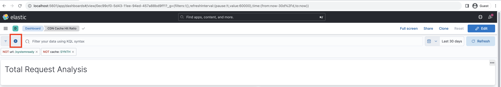

# CDN快取命中率分析

在CDN快取的內容可減少網站使用者所經歷的延遲，這些使用者不需要等待請求回到Apache/Dispatcher或AEM發佈。 有鑑於此，建議您最佳化CDN快取命中率，以最大化可在CDN快取的內容量。

瞭解如何分析提供的AEMas a Cloud Service **CDN記錄** 並獲得以下見解： **快取命中率**、和 **排名在前的URL _未命中_ 和 _通過_ 快取型別**，用於最佳化目的。

CDN記錄檔提供JSON格式，包含各種欄位，包括 `url`， `cache`. 如需詳細資訊，請參閱 [CDN記錄格式](https://experienceleague.adobe.com/docs/experience-manager-cloud-service/content/implementing/developing/logging.html?lang=en#cdn-log:~:text=Toggle%20Text%20Wrapping-,Log%20Format,-The%20CDN%20logs). 此 `cache` 欄位提供關於 _快取的狀態_ 且其可能值為HIT、MISS或PASS。 讓我們檢視可能值的詳細資訊。

| 快取狀態   可能的值 | 說明 |
|------------------------------------|:-----------------------------------------------------:|
| 點選 | 請求的資料為 _在CDN快取中找到，不需要進行擷取_ 對AEM伺服器的要求。 |
| 未命中 | 請求的資料為 _在CDN快取中找不到，必須要求_ 從AEM伺服器。 |
| 通過 | 請求的資料為 _明確設定為不進行快取_ 並一律從AEM伺服器擷取。 |

在本教學課程中， [AEM WKND專案](https://github.com/adobe/aem-guides-wknd) 部署至AEMas a Cloud Service環境，並使用觸發小型效能測試 [Apache JMeter](https://jmeter.apache.org/).

本教學課程的結構化會引導您完成以下程式：

1. 透過Cloud Manager下載CDN記錄
1. 分析這些CDN記錄時，可透過兩種方法執行：本機安裝的儀表板或遠端存取的Splunk或Jupityer Notebook (適用於授權Adobe Experience Platform的使用者)
1. 最佳化CDN快取設定

## 下載CDN記錄

若要下載CDN記錄檔，請遵循下列步驟：

1. 登入Cloud Manager於 [my.cloudmanager.adobe.com](https://my.cloudmanager.adobe.com/) 並選取您的組織和計畫。

1. 針對所需的AEMCS環境，選取 **下載記錄檔** 從省略符號選單。

   {width="500" zoomable="yes"}

1. 在 **下載記錄檔** 對話方塊中，選取 **發佈** 從下拉式功能表中選取服務，然後按一下 **cdn** 列。

   {width="500" zoomable="yes"}

如果下載的記錄檔來自 _今天_ 副檔名為 `.log` 否則對於過去的記錄檔，副檔名為 `.log.gz`.

## 分析下載的CDN記錄檔

若要獲得如快取命中率，以及MISS和PASS快取型別的前URL等深入分析，請分析下載的CDN記錄檔。 這些見解有助於最佳化 [CDN快取設定](https://experienceleague.adobe.com/en/docs/experience-manager-cloud-service/content/implementing/content-delivery/caching) 並提升網站效能。

若要分析CDN記錄，本教學課程提供三個選項：

1. **Elasticsearch、Logstash和Kibana (ELK)**：此 [麋鹿儀表板工具](https://github.com/adobe/AEMCS-CDN-Log-Analysis-Tooling/blob/main/ELK/README.md) 可在本機安裝。
1. **Splunk**：此 [Splunk儀表板工具](https://github.com/adobe/AEMCS-CDN-Log-Analysis-Tooling/blob/main/Splunk/READEME.md) 需要存取Splunk和 [AEMCS記錄轉送已啟用](https://experienceleague.adobe.com/en/docs/experience-manager-cloud-service/content/implementing/developing/logging#splunk-logs) 擷取CDN記錄。
1. [Jupyter Notebook](https://jupyter.org/)：這可做為的一部分從遠端存取 [Adobe Experience Platform](https://experienceleague.adobe.com/en/docs/experience-platform/data-science-workspace/jupyterlab/analyze-your-data) 適用於已授權Adobe Experience Platform的客戶，而不需安裝其他軟體。

### 選項1：使用ELK儀表板工具

此 [麋鹿棧疊](https://www.elastic.co/elastic-stack) 是一組工具，提供可擴充的解決方案，以搜尋、分析和視覺化資料。 它包含Elasticsearch、Logstash和Kibana。

若要識別關鍵詳細資訊，請使用 [AEMCS-CDN-Log-Analysis-Tooling](https://github.com/adobe/AEMCS-CDN-Log-Analysis-Tooling) 專案。 此專案提供ELK棧疊的Docker容器和預先設定的Kibana儀表板，以分析CDN記錄。

1. 請依照下列步驟操作： [如何設定ELK Docker容器](https://github.com/adobe/AEMCS-CDN-Log-Analysis-Tooling/blob/main/ELK/README.md#how-to-set-up-the-elk-docker-containerhow-to-setup-the-elk-docker-container) 並確保匯入 **CDN快取命中率** Kibana儀表板。

1. 若要識別CDN快取命中率和前幾個URL，請執行以下步驟：

   1. 複製下載的CDN記錄檔至環境特定的記錄檔資料夾內，例如 `ELK/logs/stage`.

   1. 開啟 **CDN快取命中率** 按一下左上角，即可使用儀表板 _導覽功能表> Analytics >控制面板> CDN快取命中率_.

      {width="500" zoomable="yes"}

   1. 從右上角選取所需的時間範圍。

      {width="500" zoomable="yes"}

   1. 此 **CDN快取命中率** 控制面板的說明一目瞭然。

   1. 此 _請求分析總數_ 段落顯示下列詳細資訊：
      - 依據快取型別的快取比率
      - 依快取型別區分的快取計數

      {width="500" zoomable="yes"}

   1. 此 _依請求或MIME型別分析_ 顯示下列詳細資料：
      - 依據快取型別的快取比率
      - 依快取型別區分的快取計數
      - 主要遺漏和通過URL

      {width="500" zoomable="yes"}

#### 依環境名稱或程式ID篩選

若要依環境名稱篩選擷取的記錄，請遵循以下步驟：

1. 在「CDN快取命中率」控制面板中，按一下 **新增篩選器** 圖示。

   {width="500" zoomable="yes"}

1. 在 **新增篩選器** 強制回應視窗，選取 `aem_env_name.keyword` 欄位，以及 `is` 運運算元及下一個欄位的所需環境名稱，最後按一下 _新增篩選器_.

   {width="500" zoomable="yes"}

#### 依主機名稱篩選

若要依主機名稱篩選擷取的記錄，請遵循以下步驟：

1. 在「CDN快取命中率」控制面板中，按一下 **新增篩選器** 圖示。

   {width="500" zoomable="yes"}

1. 在 **新增篩選器** 強制回應視窗，選取 `host.keyword` 欄位，以及 `is` 運運算元及下一個欄位所需的主機名稱，最後按一下 _新增篩選器_.

   {width="500" zoomable="yes"}

同樣地，根據分析需求將更多篩選器新增到儀表板。

### 選項2：使用Splunk圖示板工具

此 [Splunk](https://www.splunk.com/) 是一種常用的記錄分析工具，可幫助彙總、分析記錄和建立視覺化效果以進行監控和疑難排解。

若要識別關鍵詳細資訊，請使用 [AEMCS-CDN-Log-Analysis-Tooling](https://github.com/adobe/AEMCS-CDN-Log-Analysis-Tooling) 專案。 此專案提供Splunk控制面板以分析CDN記錄。

1. 請依照下列步驟操作： [適用於AEMCS CDN記錄分析的Splunk控制面板](https://github.com/adobe/AEMCS-CDN-Log-Analysis-Tooling/blob/main/Splunk/READEME.md) 並確保匯入 **CDN快取命中率** Splunk儀表板。
1. 如有需要，請更新 _索引、來源型別及其他_ 在Splunk儀表板中篩選值。

   {width="500" zoomable="yes"}

### 選項3：使用Jupyter Notebook

如果使用者不想在本機安裝軟體（亦即上節的ELK儀表板工具），有另一個選項，但需要Adobe Experience Platform的授權。

此 [Jupyter Notebook](https://jupyter.org/) 是開放原始碼的Web應用程式，可讓您建立包含程式碼、文字和視覺效果的檔案。 它用於資料轉換、視覺化和統計模型製作。 可從遠端存取 [做為Adobe Experience Platform的一部分](https://experienceleague.adobe.com/en/docs/experience-platform/data-science-workspace/jupyterlab/analyze-your-data).

#### 下載互動式Python筆記本檔案

首先，下載 [AEM-as-a-CloudService - CDN記錄分析 — Jupyter Notebook](./assets/cdn-logs-analysis/aemcs_cdn_logs_analysis.ipynb) 檔案的常見問答，這將有助於CDN記錄分析。 這份「互動式Python筆記本」檔案內容不言自明，但各節的關鍵重點為：

- **安裝其他程式庫**：安裝 `termcolor` 和 `tabulate` Python資料庫。
- **載入CDN記錄**：載入CDN記錄檔，使用 `log_file` 變數值；請務必更新其值。 這也會將此CDN記錄轉換為 [熊貓資料框架](https://pandas.pydata.org/docs/reference/frame.html).
- **執行分析**：第一個程式碼區塊為 _顯示總計、HTML、JS/CSS和影像要求的分析結果_；它提供快取命中率百分比、長條圖和圓餅圖。
第二個程式碼區塊為 _HTML、JS/CSS和影像的前5大遺漏和通過請求URL_；會以表格格式顯示URL及其計數。

#### 執行Jupyter Notebook

接下來，請依照下列步驟在Adobe Experience Platform中執行Jupyter Notebook：

1. 登入 [Adobe Experience Cloud](https://experience.adobe.com/)，位於首頁> **快速存取** 區段>按一下 **Experience Platform**

   {width="500" zoomable="yes"}

1. 在Adobe Experience Platform首頁>資料科學區段>中，按一下 **Notebooks** 功能表專案。 若要啟動Jupyter Notebooks環境，請按一下 **JupyterLab** 標籤。

   {width="500" zoomable="yes"}

1. 在JupyterLab功能表中，使用 **上傳檔案** 圖示，上傳下載的CDN記錄檔及 `aemcs_cdn_logs_analysis.ipynb` 檔案。

   {width="500" zoomable="yes"}

1. 開啟 `aemcs_cdn_logs_analysis.ipynb` 按兩下檔案。

1. 在 **載入CDN記錄檔** 筆記本的區段，更新 `log_file` 值。

   {width="500" zoomable="yes"}

1. 若要執行選取的儲存格並前進，請按一下 **播放** 圖示。

   {width="500" zoomable="yes"}

1. 執行 **顯示總計、HTML、JS/CSS和影像要求的分析結果** 程式碼儲存格中，輸出會顯示快取命中率百分比、長條圖和圓餅圖。

   {width="500" zoomable="yes"}

1. 執行 **HTML、JS/CSS和影像的前5大遺漏和通過請求URL** 程式碼儲存格中，輸出會顯示前5個MISS和PASS請求URL。

   {width="500" zoomable="yes"}

您可以增強Jupyter Notebook，根據您的需求分析CDN記錄。

## 最佳化CDN快取設定

分析CDN記錄後，您可以最佳化CDN快取設定以改善網站效能。 AEM最佳實務是快取命中率為90%或更高。

如需詳細資訊，請參閱 [最佳化CDN快取設定](https://experienceleague.adobe.com/en/docs/experience-manager-cloud-service/content/implementing/content-delivery/caching).

AEM WKND專案具有參考CDN設定，如需詳細資訊，請參閱 [CDN設定](https://github.com/adobe/aem-guides-wknd/blob/main/dispatcher/src/conf.d/available_vhosts/wknd.vhost#L137-L190) 從 `wknd.vhost` 檔案。
