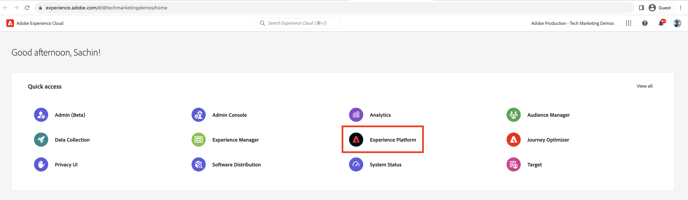

# CDN快取命中率分析

在CDN快取的內容可減少網站使用者所經歷的延遲，這些使用者不需要等待請求回到Apache/Dispatcher或AEM發佈。 有鑑於此，建議您最佳化CDN快取命中率，以最大化可在CDN快取的內容量。

瞭解如何分析提供的AEM as a Cloud Service **CDN記錄檔**，並取得深入分析，例如&#x200B;**快取命中率**，以及&#x200B;_MISS_&#x200B;和&#x200B;_PASS_&#x200B;快取型別&#x200B;**的**&#x200B;大URL，以用於最佳化目的。

CDN記錄以JSON格式提供，其中包含各種欄位，包括`url`、`cache`。 如需詳細資訊，請參閱[CDN記錄格式](https://experienceleague.adobe.com/docs/experience-manager-cloud-service/content/implementing/developing/logging.html?lang=en#cdn-log:~:text=Toggle%20Text%20Wrapping-,Log%20Format,-The%20CDN%20logs)。 `cache`欄位提供快取&#x200B;_的_&#x200B;狀態相關資訊，其可能值為HIT、MISS或PASS。 讓我們檢視可能值的詳細資訊。

| 快取 可能的值的狀態 | 說明 |
|------------------------------------|:-----------------------------------------------------:|
| 點選 | 要求的資料在CDN快取中找到&#x200B;_，不需要向AEM伺服器提出fetch_&#x200B;要求。 |
| 未命中 | 要求的資料在CDN快取中找不到&#x200B;_，必須向AEM伺服器要求_。 |
| 通過 | 要求的資料已明確設定為&#x200B;_不快取_，且一律會從AEM伺服器擷取。 |

在此教學課程中，[AEM WKND專案](https://github.com/adobe/aem-guides-wknd)已部署至AEM as a Cloud Service環境，並使用[Apache JMeter](https://jmeter.apache.org/)觸發小型效能測試。

本教學課程的結構化會引導您完成以下程式：

1. 透過Cloud Manager下載CDN記錄檔
1. 分析這些CDN記錄時，可透過兩種方法執行：本機安裝的儀表板或遠端存取的Splunk或Jupityer Notebook (適用於授權Adobe Experience Platform的使用者)
1. 最佳化CDN快取設定

## 下載CDN記錄

若要下載CDN記錄檔，請遵循下列步驟：

1. 在[my.cloudmanager.adobe.com](https://my.cloudmanager.adobe.com/)登入Cloud Manager並選取您的組織和程式。

1. 針對所需的AEMCS環境，從省略符號選單中選取&#x200B;**下載記錄檔**。

   {width="500" zoomable="yes"}

1. 在&#x200B;**下載記錄檔**&#x200B;對話方塊中，從下拉式功能表選取&#x200B;**Publish**&#x200B;服務，然後按一下&#x200B;**CDN**&#x200B;列旁的下載圖示。

   {width="500" zoomable="yes"}

如果下載的記錄檔是來自&#x200B;_today_，則副檔名為`.log`，否則對於過去的記錄檔，副檔名為`.log.gz`。

## 分析下載的CDN記錄檔

若要獲得如快取命中率，以及MISS和PASS快取型別的前URL等深入分析，請分析下載的CDN記錄檔。 這些見解有助於最佳化[CDN快取設定](https://experienceleague.adobe.com/zh-hant/docs/experience-manager-cloud-service/content/implementing/content-delivery/caching)並增強網站效能。

若要分析CDN記錄，本教學課程提供三個選項：

1. **Elasticsearch、Logstash和Kibana (ELK)**： [ELK儀表板工具](https://github.com/adobe/AEMCS-CDN-Log-Analysis-Tooling/blob/main/ELK/README.md)可安裝在本機。
1. **Splunk**： [Splunk儀表板工具](https://github.com/adobe/AEMCS-CDN-Log-Analysis-Tooling/blob/main/Splunk/README.md)需要存取Splunk以及已啟用[AEMCS記錄檔轉送](https://experienceleague.adobe.com/en/docs/experience-manager-cloud-service/content/implementing/developing/logging#splunk-logs)才能擷取CDN記錄。
1. **Jupyter Notebook**：已授權Adobe Experience Platform的客戶，可透過[Adobe Experience Platform](https://experienceleague.adobe.com/en/docs/experience-platform/data-science-workspace/jupyterlab/analyze-your-data)從遠端存取它，不需安裝額外的軟體。

### 選項1：使用ELK儀表板工具

[ELK棧疊](https://www.elastic.co/elastic-stack)是一組工具，可提供可擴充的解決方案，以搜尋、分析和視覺化資料。 它包含Elasticsearch、Logstash和Kibana。

若要識別金鑰詳細資料，請使用[AEMCS-CDN-Log-Analysis-Tooling](https://github.com/adobe/AEMCS-CDN-Log-Analysis-Tooling)專案。 此專案提供ELK棧疊的Docker容器和預先設定的Kibana儀表板，以分析CDN記錄。

1. 按照[如何設定ELK Docker容器](https://github.com/adobe/AEMCS-CDN-Log-Analysis-Tooling/blob/main/ELK/README.md#how-to-set-up-the-elk-docker-containerhow-to-setup-the-elk-docker-container)中的步驟操作，並確定匯入&#x200B;**CDN快取命中率** Kibana儀表板。

1. 若要識別CDN快取命中率和前幾個URL，請執行以下步驟：

   1. 複製下載的CDN記錄檔於特定環境的記錄檔資料夾中，例如`ELK/logs/stage`。

   1. 按一下左上角的&#x200B;_導覽功能表> Analytics >控制面板> CDN快取命中率_，開啟&#x200B;**CDN快取命中率**&#x200B;控制面板。

      {width="500" zoomable="yes"}

   1. 從右上角選取所需的時間範圍。

      {width="500" zoomable="yes"}

   1. **CDN快取命中率**&#x200B;儀表板不言自明。

   1. _請求分析總數_&#x200B;區段會顯示下列詳細資料：
      - 依據快取型別的快取比率
      - 依快取型別區分的快取計數

      {width="500" zoomable="yes"}

   1. _依要求或MIME型別的分析_&#x200B;會顯示下列詳細資料：
      - 依據快取型別的快取比率
      - 依快取型別區分的快取計數
      - 主要遺漏和通過URL

      {width="500" zoomable="yes"}

#### 依環境名稱或程式ID篩選

若要依環境名稱篩選擷取的記錄，請遵循以下步驟：

1. 在CDN快取點選率儀表板中，按一下&#x200B;**新增篩選器**&#x200B;圖示。

   {width="500" zoomable="yes"}

1. 在&#x200B;**新增篩選器**&#x200B;強制回應視窗中，從下拉式功能表中選取`aem_env_name.keyword`欄位，並為下一個欄位選取`is`運運算元和所需的環境名稱，最後按一下&#x200B;_新增篩選器_。

   {width="500" zoomable="yes"}

#### 依主機名稱篩選

若要依主機名稱篩選擷取的記錄，請遵循以下步驟：

1. 在CDN快取點選率儀表板中，按一下&#x200B;**新增篩選器**&#x200B;圖示。

   {width="500" zoomable="yes"}

1. 在&#x200B;**新增篩選器**&#x200B;強制回應視窗中，從下拉式功能表中選取`host.keyword`欄位，並為下一個欄位選取`is`運運算元和所需的主機名稱，最後按一下&#x200B;_新增篩選器_。

   {width="500" zoomable="yes"}

同樣地，根據分析需求將更多篩選器新增到儀表板。

### 選項2：使用Splunk圖示板工具

[Splunk](https://www.splunk.com/)是一種常用的記錄分析工具，可協助彙總、分析記錄及建立視覺效果，以進行監控和疑難排解。

若要識別金鑰詳細資料，請使用[AEMCS-CDN-Log-Analysis-Tooling](https://github.com/adobe/AEMCS-CDN-Log-Analysis-Tooling)專案。 此專案提供Splunk控制面板以分析CDN記錄。

1. 遵循AEMCS CDN記錄分析](https://github.com/adobe/AEMCS-CDN-Log-Analysis-Tooling/blob/main/Splunk/README.md)的[Splunk儀表板的步驟並確保匯入&#x200B;**CDN快取命中率** Splunk儀表板。
1. 如有需要，請更新Splunk儀表板中的&#x200B;_索引、Source型別和其他_&#x200B;篩選器值。

   {width="500" zoomable="yes"}

>[!NOTE]
>
>Splunk圖示板中的UI和圖形與ELK圖示板不同，但關鍵細節是相似的。

### 選項3：使用Jupyter Notebook

如果使用者不想在本機安裝軟體（亦即上節的ELK儀表板工具），有另一個選項，但需要Adobe Experience Platform的授權。

[Jupyter Notebook](https://jupyter.org/)是開放原始碼的Web應用程式，可讓您建立包含程式碼、文字和視覺效果的檔案。 它用於資料轉換、視覺化和統計模型製作。 它可以作為Adobe Experience Platform](https://experienceleague.adobe.com/en/docs/experience-platform/data-science-workspace/jupyterlab/analyze-your-data)的一部分從遠端[存取。

#### 下載互動式Python筆記本檔案

首先，下載[AEM-as-a-CloudService - CDN記錄分析 — Jupyter Notebook](./assets/cdn-logs-analysis/aemcs_cdn_logs_analysis.ipynb)檔案，這有助於進行CDN記錄分析。 這份「互動式Python筆記本」檔案內容不言自明，但各節的關鍵重點為：

- **安裝其他資料庫**：安裝`termcolor`和`tabulate` Python資料庫。
- **載入CDN記錄檔**：使用`log_file`變數值載入CDN記錄檔；請確定更新其值。 它也會將此CDN記錄檔轉換為[Pandas DataFrame](https://pandas.pydata.org/docs/reference/frame.html)。
- **執行分析**：第一個程式碼區塊是&#x200B;_顯示總計、HTML、JS/CSS和影像要求的分析結果_；它提供快取命中率百分比、長條圖和圓餅圖。
第二個程式碼區塊是HTML、JS/CSS和影像_的_&#x200B;前5個遺漏和傳遞要求URL；它以表格格式顯示URL及其計數。

#### 執行Jupyter Notebook

接下來，請依照下列步驟在Adobe Experience Platform中執行Jupyter Notebook：

1. 登入[Adobe Experience Cloud](https://experience.adobe.com/)，在首頁> **快速存取**&#x200B;區段>按一下&#x200B;**Experience Platform**&#x200B;中

   {width="500" zoomable="yes"}

1. 在Adobe Experience Platform首頁>資料科學區段>中，按一下&#x200B;**Notebooks**&#x200B;功能表專案。 若要啟動Jupyter Notebooks環境，請按一下&#x200B;**JupyterLab**&#x200B;標籤。

   {width="500" zoomable="yes"}

1. 在JupyterLab功能表中，使用&#x200B;**上傳檔案**&#x200B;圖示，上傳下載的CDN記錄檔和`aemcs_cdn_logs_analysis.ipynb`檔案。

   {width="500" zoomable="yes"}

1. 按兩下以開啟`aemcs_cdn_logs_analysis.ipynb`檔案。

1. 在筆記本的&#x200B;**載入CDN記錄檔**&#x200B;區段中，更新`log_file`值。

   {width="500" zoomable="yes"}

1. 若要執行選取的儲存格並前進，請按一下&#x200B;**播放**&#x200B;圖示。

   {width="500" zoomable="yes"}

1. 執行Total、Analysis、JS/CSS和Image Requests **程式碼儲存格的**&#x200B;顯示HTML結果後，輸出會顯示快取命中率百分比、長條圖和圓餅圖。

   {width="500" zoomable="yes"}

1. 執行HTML、JS/CSS和影像&#x200B;**程式碼儲存格的**&#x200B;前5名遺漏和通過要求URL後，輸出會顯示前5名遺漏和通過要求URL。

   {width="500" zoomable="yes"}

您可以增強Jupyter Notebook，根據您的需求分析CDN記錄。

## 最佳化CDN快取設定

分析CDN記錄後，您可以最佳化CDN快取設定以改善網站效能。 AEM最佳實務是快取命中率為90%或更高。

如需詳細資訊，請參閱[最佳化CDN快取設定](https://experienceleague.adobe.com/zh-hant/docs/experience-manager-cloud-service/content/implementing/content-delivery/caching)。

AEM WKND專案具有參考CDN設定，如需詳細資訊，請參閱`wknd.vhost`檔案中的[CDN設定](https://github.com/adobe/aem-guides-wknd/blob/main/dispatcher/src/conf.d/available_vhosts/wknd.vhost#L137-L190)。
