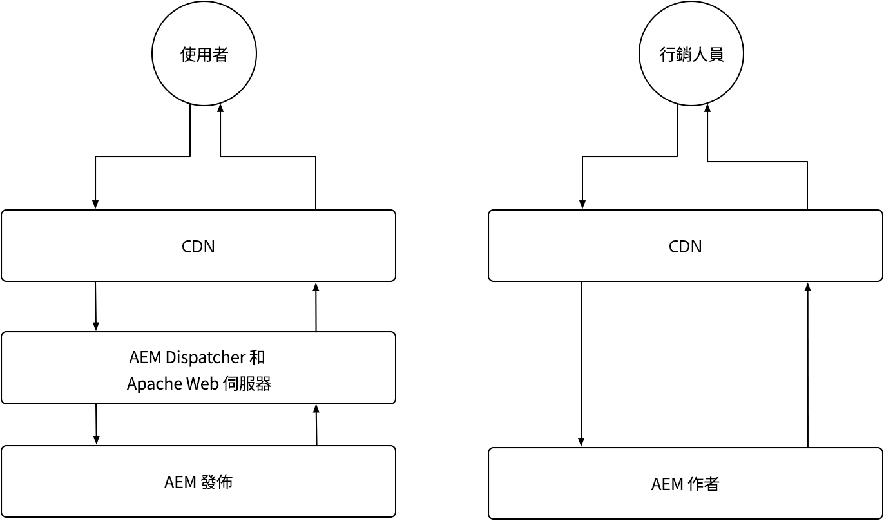

# AEM as a Cloud Service快取

在AEM as a Cloud Service中，瞭解快取至關重要。 快取涉及儲存及重複使用先前擷取的資料，以提高系統效率並減少載入時間。 此機制可大幅加快內容傳送、提升網站效能及最佳化使用者體驗。

AEM as a Cloud Service有多個快取層，且Author服務與Publish服務之間的策略也不同。

{align="center"}

## AEM快取

AEM as a Cloud Service具有強大、可設定的多層快取策略，包括CDN、AEM Dispatcher以及客戶管理的CDN （選用）。 可以微調跨圖層的快取以最佳化效能，確保AEM僅提供最佳體驗。 AEM對Author和Publish服務有不同的快取考量。 探索以下各服務的快取策略。

    

    

        

          <figure class="image is-16by9">
            
          </figure>
        

        

          

            
<a href="./publish.md" title="AEM Publish服務快取">AEM Publish服務快取</a>

            
AEM Publish服務使用受管理的CDN和AEM Dispatcher來最佳化一般使用者網頁體驗。

            <a href="./publish.md" class="spectrum-Button spectrum-Button--outline spectrum-Button--primary spectrum-Button--sizeM">
              學習
            </a>
          

        

      

    

    

        

            

            <figure class="image is-16by9">
                
            </figure>
            

            

            

                
<a href="./author.md" title="AEM作者服務快取">AEM作者服務快取</a>

                
AEM Author服務使用受管理的CDN來提供最佳化的撰寫體驗。

                <a href="./author.md" class="spectrum-Button spectrum-Button--outline spectrum-Button--primary spectrum-Button--sizeM">
                學習
                </a>
            

            

        

    

