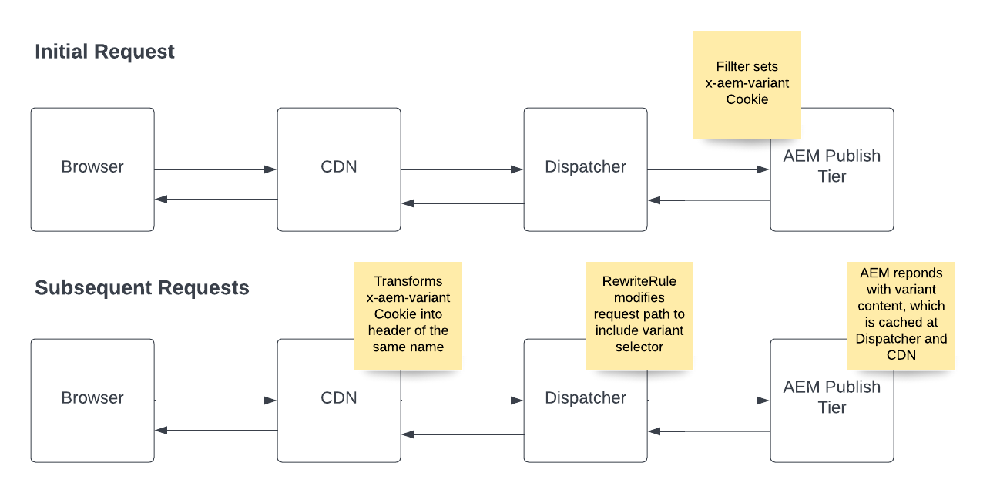

# 快取頁變型

瞭解如何設定和使用雲服AEM務以支援快取頁面變型。

## 示例使用案例

+ 任何基於用戶的地理位置和具有動態內容的頁面的快取而提供不同的服務組合和相應定價選項的服務提供商都應在CDN和Dispatcher處進行管理。

+ 零售客戶在全國範圍內擁有商店，每個商店都根據其所在位置提供不同的服務，並且應在CDN和Dispatcher處管理包含動態內容的頁面快取。

## 解決方案概覽

+ 標識變型鍵及其可能具有的值數。 在我們的示例中，我們因美國州而異，因此最大數為50。 這個小到不會導致CDN的變型限制問題。 [查看變型限制部分](#variant-limitations)。

+ 代AEM碼必須設定cookie __&quot;x-aem變數&quot;__ 訪問者的首選狀態(如 `Set-Cookie: x-aem-variant=NY`)的HTTP請求的相應HTTP響應。

+ 訪問者的後續請求將發送該cookie(例如 `“Cookie: x-aem-variant=NY”`)，並在CDN級別將cookie轉換為預定義的標頭(即 `x-aem-variant:NY`)。

+ Apache重寫規則修改請求路徑以將頭值作為Apache Sling選擇器(例如， `/page.variant=NY.html`). 這允許AEM發佈根據選擇器為不同內容提供服務，而調度程式則為每個變數快取一頁。

+ Dispatcher發送的響AEM應必須包含HTTP響應標頭 `Vary: x-aem-variant`。 這指示CDN儲存不同標頭值的不同快取副本。

## HTTP請求流



>[!NOTE]
>
>上面的初始HTTP請求流必須在請求使用變型的任何內容之前進行。

## 使用狀況

1. 要演示該功能，我們將使用 [WKND](https://experienceleague.adobe.com/docs/experience-manager-learn/getting-started-wknd-tutorial-develop/overview.html?lang=zh-Hant)以實施為例，

1. 實施 [SlingServlet過濾器](https://sling.apache.org/documentation/the-sling-engine/filters.html) AEM設定 `x-aem-variant` HTTP響應上的cookie，帶變數值。

1. AEMCDN自動轉換 `x-aem-variant` Cookie到同名的HTTP標頭。

1. 將Apache Web伺服器mod_rewrite規則添加到 `dispatcher` 項目，它修改請求路徑以包括變型選擇器。

1. 使用雲管理器部署篩選器和重寫規則。

1. Test整個請求流。

## 程式碼範例

+ 要設定的示例SlingServletFilter `x-aem-variant` 包含值的cookieAEM。

   ```
   package com.adobe.aem.guides.wknd.core.servlets.filters;
   
   import javax.servlet.*;
   import java.io.IOException;
   
   import org.apache.sling.api.SlingHttpServletRequest;
   import org.apache.sling.api.SlingHttpServletResponse;
   import org.apache.sling.servlets.annotations.SlingServletFilter;
   import org.apache.sling.servlets.annotations.SlingServletFilterScope;
   import org.osgi.service.component.annotations.Component;
   import org.slf4j.Logger;
   import org.slf4j.LoggerFactory;
   
   
   // Invoke filter on  HTTP GET /content/wknd.*.foo|bar.html|json requests.
   // This code and scope is for example purposes only, and will not interfere with other requests.
   @Component
   @SlingServletFilter(scope = {SlingServletFilterScope.REQUEST},
           resourceTypes = {"cq:Page"},
           pattern = "/content/wknd/.*",
           extensions = {"html", "json"},
           methods = {"GET"})
   public class PageVariantFilter implements Filter {
       private static final Logger log = LoggerFactory.getLogger(PageVariantFilter.class);
       private static final String VARIANT_COOKIE_NAME = "x-aem-variant";
   
       @Override
       public void init(FilterConfig filterConfig) throws ServletException { }
   
       @Override
       public void doFilter(ServletRequest servletRequest, ServletResponse servletResponse, FilterChain filterChain) throws IOException, ServletException {
           SlingHttpServletResponse slingResponse = (SlingHttpServletResponse) servletResponse;
           SlingHttpServletRequest slingRequest = (SlingHttpServletRequest) servletRequest;
   
           // Check is the variant was previously set
           final String existingVariant = slingRequest.getCookie(VARIANT_COOKIE_NAME).getValue();
   
           if (existingVariant == null) {
               // Variant has not been set, so set it now
               String newVariant = "NY"; // Hard coding as an example, but should be a calculated value
               slingResponse.setHeader("Set-Cookie", VARIANT_COOKIE_NAME + "=" + newVariant + "; Path=/; HttpOnly; Secure; SameSite=Strict");
               log.debug("x-aem-variant cookie is set with the value {}", newVariant);
           } else {
               log.debug("x-aem-variant previously set with value {}", existingVariant);
           }
   
           filterChain.doFilter(servletRequest, slingResponse);
       }
   
       @Override
       public void destroy() { }
   }
   ```

+ 中的「重寫」規則示例 __dispatcher/src/conf.d/rewrite.rules__ 檔案，該檔案在Git中作為原始碼管理，並使用Cloud Manager進行部署。

   ```
   ...
   
   RewriteCond %{REQUEST_URI} ^/us/.*  
   RewriteCond %{HTTP:x-aem-variant} ^.*$  
   RewriteRule ^([^?]+)\.(html.*)$ /content/wknd$1.variant=%{HTTP:x-aem-variant}.$2 [PT,L] 
   
   ...
   ```

## 變型限制

+ AEMCDN最多可管理200種變體。 這意味著 `x-aem-variant` 頭最多可以有200個唯一值。 有關詳細資訊，請查看 [CDN配置限制](https://docs.fastly.com/en/guides/resource-limits)。

+ 必須小心，確保所選的變型密鑰不超過此數。  例如，用戶ID不是一個好的密鑰，因為它對於大多數網站來說很容易超過200個值，而如果一個國家/地區的州數少於200個，則它更適合。

>[!NOTE]
>
>當變型超過200時，CDN將用「變型太多」響應來響應，而不是頁面內容。
