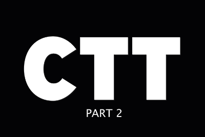

# 雲5

## 簡介

歡迎使用AEM工程的Cloud 5系列。 任何產品實施階段的主要問題之一，是有足夠的程式碼範例和/或這些範例、工具或API的即時示範。 此系列的目標是在5分鐘或更短時間內提供AEMas a Cloud Service的實用資訊。

造訪 [建議方塊](https://forms.office.com/r/74P5Xz4UH0) 來提交主題意見。

## 第1季

每個季節長度不同，會依固定排程發行。 第1季的主題主要是根據我們在與客戶和合作夥伴的日常接洽中遇到的過去請求而來。 請瀏覽此頁面以取得每週更新，或在您選擇的社交網路上跟隨我們。

<table>
  <tr>
   <td>
      
      

         <a href="./cloud5-aem-cdn-part1.md"><strong>AEM CDN深入探討（第1部分）</strong></a>         
          <em>雲高級建築師達林·孔策和詹姆斯·塔爾博特</em>
      

      

         
         第1部分說明AEM as a Cloud Service的CDN，以及如何在實作中使用它。
      

     </td>   
     <td>
      
      

         <a href="./cloud5-aem-cdn-part2.md"><strong>AEM CDN深入探討（第2部分）</strong></a>
          <em>雲高級建築師達林·孔策和詹姆斯·塔爾博特</em>
      

      

         
         第2部分繼續說明AEMas a Cloud ServiceCDN。 我們會回答關於您使用新CDN取得哪些功能的一些較常見問題和迷思。
      

   </td>
     <td>
        
      

         <a href="./cloud5-aem-log-files.md"><strong>記錄檔與記錄</strong></a>
          <em>雲高級建築師達林·孔策和詹姆斯·塔爾博特</em>
      

      

         
         這是如何存取AEMas a Cloud Service記錄的快速說明，包括如何透過使用者介面以及API存取記錄。
      

   </td> 
  </tr>
  <tr>
   <td>
        
      

        <a href="./cloud5-getting-login-token-integrations.md"><strong>與存取權杖整合</strong></a>        
          <em>雲高級建築師達林·孔策和詹姆斯·塔爾博特</em>
      

      

         
         有關如何與登入Token互動，以在雲端服務環境中執行整合工作的快速概述和示範。
      

     </td>   
     <td>
        
      

        <a href="./cloud5-aem-dispatcher-cloud.md"><strong>雲端中的Dispatcher</strong></a>
          <em>雲高級建築師達林·孔策和詹姆斯·塔爾博特</em>
      

      

         
        Darin和James討論AEM雲端中的Dispatcher，包括一些最佳作法和與AMS/On-Prem的差異。 
      

   </td>
     <td>
        
      

         <a href="./cloud5-aem-content-migration-part-1.md"><strong>遷移（第1部分）</strong></a>
          <em>高級雲架構師和阿普爾斯米特博士的Darin Kuntze和James Talbot</em>
      

      

         
         移轉至雲端的秘訣和技巧第一部分（共兩部分）。 我們第一部分的主要重點是讓您做好遷移準備的最佳做法和準備工作。
      

   </td> 
  </tr>
<tr>
   <td>
        
      

        <a href="./cloud5-aem-content-migration-part-2.md"><strong>遷移（第2部分）</strong></a>     
          <em>雲高級建築師達林·孔策和詹姆斯·塔爾博特</em>
      

      

         
         移轉至雲端的秘訣和技巧第二部分（共兩部分）。 第二部分主要是使用可用的移轉工具。
      

     </td>   
     <td>
        
      

         <a href="./cloud5-aem-dispatcher-validator.md"><strong>Dispatcher驗證器</strong></a>
          <em>雲高級建築師達林·孔策和詹姆斯·塔爾博特</em>
      

      

         
         在先前的移轉討論中，我們會審視Dispatcher驗證器及其可完成的部分工作。
      

   </td>
     <td>
        
      

         <a href="./cloud5-aem-search-and-indexing.md"><strong>索引和搜尋提示</strong></a>
          <em>雲高級建築師達林·孔策和詹姆斯·塔爾博特</em>
      

      

         
         對於索引和搜索等複雜項目，團隊向您展示了優化開發時間和解決問題的一些簡單成功，然後才出現問題。
      

   </td> 
  </tr>
    <tr>
        <td>
            
            

                <a href="./cloud5-adobe-app-builder.md"><strong>Adobe應用程式產生器</strong></a>         
                <em>高級雲端架構師與阿莫·阿南德</em>
            

            
 
                請查看一些您可以使用AdobeApp Builder執行的酷炫操作，並了解雲端中自訂功能未來的新概念。
            

        </td>
        <td></td>
        <td></td>
    </tr>
</table>