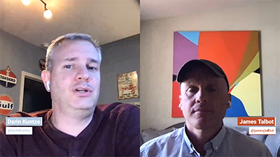

# 雲5

>[!VIDEO](https://video.tv.adobe.com/v/346567)

## 簡介

歡迎觀看第二季的AEM Engineering雲端5系列。 任何產品實施階段的主要問題之一，是有足夠的程式碼範例和/或這些範例、工具或API的即時示範。 此系列的目標是在5分鐘或更短時間內提供AEMas a Cloud Service的實用資訊。

## 建議方塊

造訪 [建議方塊](https://forms.office.com/r/74P5Xz4UH0) 來提交主題意見。

## 第2季

每個季節長度不同，會依固定排程發行。 第2季的主題主要是根據我們在與客戶和合作夥伴的日常接洽中遇到的過去的要求而來。 請瀏覽此頁面以取得每週更新，或在您選擇的社交網路上跟隨我們。

<table>
    <tr>
        <td>
            
            

                <a href="season-2/cloud5-experience-v-content-fragments.md"><strong>片段</strong></a>        
                 <em>雲高級建築師達林·孔策和詹姆斯·塔爾博特</em>
            

            

                 
                以色彩繽紛的方式呈現體驗與內容片段之間的差異。 劇透：每個人都贏。
            

        </td>   
         <td>
            
            

                <a href="season-2/cloud5-repo-modernizer.md"><strong>Repository Modernizer</strong></a> 
                <em>雲高級建築師達林·孔策和詹姆斯·塔爾博特</em>
            

            

                 
                使用repository modernizer將現有專案套件重新建構為與AEM as a cloud service相容的獨立套件，可快速深入了解。
            

         </td>
         <td>
            
            

                  <a href="season-2/cloud5-admin-console.md"><strong>Admin Console</strong></a>
                <em>雲高級建築師達林·孔策和詹姆斯·塔爾博特</em>
            

            

             
               Darin和James討論了一些應了解的關於管理控制台、布建和存取的常見事項。
            

         </td> 
  </tr>
  <tr>
         <td>
            
            

                  <a href="season-2/cloud5-sling-job-scheduler.md"><strong>Sling作業</strong></a>
                <em>雲高級建築師達林·孔策和詹姆斯·塔爾博特</em>
            

            

             
               達林和詹姆士討論AEM雲端服務中作業排程和耗用量的相關問題。
            

         </td> 
         <td>
            
            

                  <a href="season-2/cloud5-repoinit.md"><strong>Sling Repository初始值設定項</strong></a>
                <em>雲高級建築師達林·孔策和詹姆斯·塔爾博特</em>
            

            

             
              了解幾項秘訣，以充份運用Sling Repository Initializer（亦即重新指向）的功能。
            

         </td>   
     <td>
            
      

         <a href="season-2/cloud5-fix-your-cache.md"><strong>修正……快取</strong></a>
          <em>高級雲設計師達米安·朗斯維爾特和詹姆斯·塔爾博特</em>
      

      

          
             探索區域，以最佳化快取，並加快網站在AEMas a Cloud Service上的執行速度。
      

   </td> 
  </tr>
<tr>
   <td>
           
      

            <a href="season-2/cloud5-fix-your-rewrites.md"><strong>修正……重寫</strong></a>
          <em>雲高級建築師達林·孔策和詹姆斯·塔爾博特</em>
      

      

         
         快速了解有助於加快重寫程式開發及最佳化AEMas a Cloud Service的項目。
      

     </td>   
     <td>
            
      

            <a href="season-2/cloud5-mocm-experience-audit.md"><strong>Cloud Manager的奧秘……體驗稽核</strong></a>
          <em>與雲高級架構師達林·孔策合作</em>
      

      

         
        探索Cloud Manager的基本概念及其體驗稽核功能。
      

   </td>
     <td>
            
      

            <a href="season-2/cloud5-mocm-unit-tests.md"><strong>Cloud Manager的奧秘……單元測試</strong></a>
          <em>雲高級架構師Darin Kuntze和Bryan Stopp</em>
      

      

         
        Darin和Bryan討論了Cloud Manager如何將單元測試執行和代碼覆蓋報告整合到其CI/CD管道中，以幫助鼓勵和推廣單元測試AEM代碼的最佳做法。
      

   </td> 
  </tr>
    <tr>
        <td>
               
            

                <a href="season-2/cloud5-mocm-functional-tests.md"><strong>Cloud Manager的奧秘……功能測試</strong> </a>        
                <em>雲高級架構師Darin Kuntze和Bryan Stopp</em>
            

            
 
                Darin和Bryan討論內置於AEMas a Cloud Service部署流程中的不同類型的功能測試，以確保代碼的質量和可靠性。
            

        </td>
        <td></td>
        <td></td>
    </tr>
</table>
