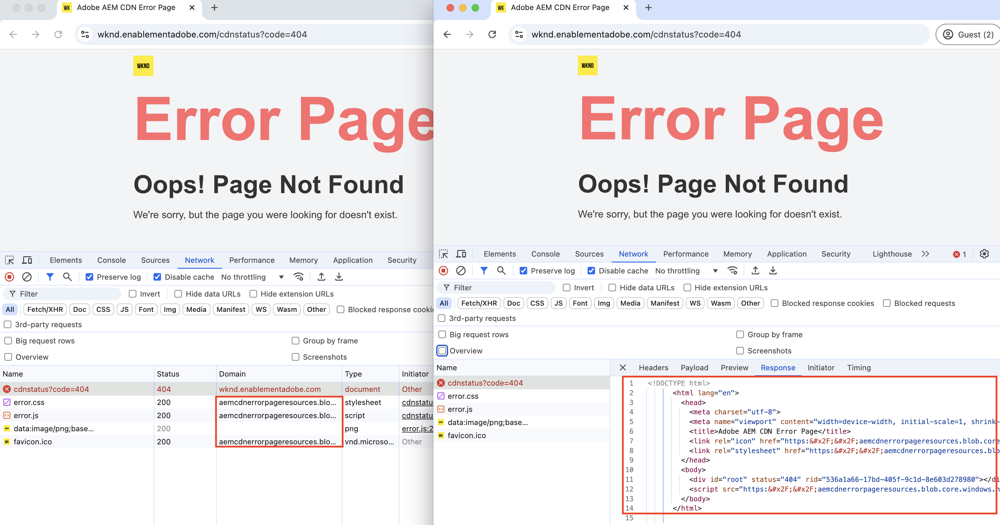

# 自訂錯誤頁面

瞭解如何為您的AEM as a Cloud Service託管網站實施作業自訂錯誤頁面。

在本教學課程中，您將學習：

- 預設錯誤頁面
- 提供錯誤頁面的來源
   - AEM服務型別 — 作者、發佈、預覽
   - Adobe管理的CDN
- 自訂錯誤頁面的選項
   - ErrorDocument Apache指示詞
   - ACS AEM Commons — 錯誤頁面處理常式
   - CDN錯誤頁面

## 預設錯誤頁面

讓我們檢閱何時顯示錯誤頁面、預設錯誤頁面，以及提供這些頁面的來源。

發生下列情況時會顯示錯誤頁面：

- 頁面不存在(404)
- 未獲存取頁面的授權(403)
- 發生伺服器錯誤(500)，因為程式碼問題或伺服器無法連線。

AEM as a Cloud Service為上述案例提供&#x200B;_預設錯誤頁面_。 這是一般頁面，不符合您的品牌。

預設錯誤頁面&#x200B;_是從_ AEM服務型別&#x200B;_（作者、發佈、預覽）或_ Adobe管理的CDN _提供_。 如需詳細資訊，請參閱下表。

| 錯誤頁面提供自 | 詳細資料 |
|---------------------|:-----------------------:|
| AEM服務型別 — 作者、發佈、預覽 | 當頁面請求是由AEM服務型別提供且發生上述任何錯誤情況時，錯誤頁面是由AEM服務型別提供。 依預設，除非設定`x-aem-error-pass: true`標頭，否則5XX錯誤頁面會被Adobe管理的CDN錯誤頁面覆寫。 |
| Adobe管理的CDN | 當Adobe管理的CDN _無法連線到AEM服務型別_ （原始伺服器）時，錯誤頁面會從Adobe管理的CDN提供服務。 **這是不太可能發生但值得規劃的事件。** |

>[!NOTE]
>
>在AEM as Cloud Service中，從後端收到5XX錯誤時，CDN會提供一般錯誤頁面。 若要允許後端的實際回應通過，您必須將下列標頭新增至回應： `x-aem-error-pass: true`。
>這僅適用於來自AEM或Apache/Dispatcher層的回應。 來自中繼基礎結構層的其他非預期錯誤仍會顯示一般錯誤頁面。


例如，AEM服務型別和Adobe管理的CDN提供的預設錯誤頁面如下：


不過，您可以&#x200B;_自訂AEM服務型別和Adobe管理的_ CDN錯誤頁面，以符合您的品牌，並提供更佳的使用者體驗。

## 自訂錯誤頁面的選項

下列選項可用於自訂錯誤頁面：

| 適用於 | 選項名稱 | 描述 |
|---------------------|:-----------------------:|:-----------------------:|
| AEM服務型別 — 發佈和預覽 | ErrorDocument指示詞 | 使用Apache設定檔案中的[ErrorDocument](https://httpd.apache.org/docs/2.4/custom-error.html)指示詞來指定自訂錯誤頁面的路徑。 僅適用於AEM服務型別 — 發佈和預覽。 |
| AEM服務型別 — 作者、發佈、預覽 | ACS AEM Commons錯誤頁面處理常式 | 使用[ACS AEM Commons錯誤頁面處理常式](https://adobe-consulting-services.github.io/acs-aem-commons/features/error-handler/index.html)來自訂所有AEM服務型別的錯誤。 |
| Adobe管理的CDN | CDN錯誤頁面 | 當Adobe管理的CDN無法連線AEM服務型別（原始伺服器）時，請使用CDN錯誤頁面來自訂錯誤頁面。 |


## 先決條件

在本教學課程中，您將學習如何使用&#x200B;_ErrorDocument_&#x200B;指示詞、_ACS AEM Commons Error Page Handler_&#x200B;和&#x200B;_CDN Error Pages_&#x200B;選項來自訂錯誤頁面。 若要按照本教學課程進行學習，您需要：

- [本機AEM開發環境](https://experienceleague.adobe.com/en/docs/experience-manager-learn/cloud-service/local-development-environment-set-up/overview)或AEM as a Cloud Service環境。 _CDN錯誤頁面_&#x200B;選項適用於AEM as a Cloud Service環境。

- 要自訂錯誤頁面的[AEM WKND專案](https://github.com/adobe/aem-guides-wknd)。

## 設定

- 請依照下列步驟，複製AEM WKND專案並部署至本機AEM開發環境：

  ```
  # For local AEM development environment
  $ git clone git@github.com:adobe/aem-guides-wknd.git
  $ cd aem-guides-wknd
  $ mvn clean install -PautoInstallSinglePackage -PautoInstallSinglePackagePublish
  ```

- 若為AEM as a Cloud Service環境，請執行[完整棧疊管道](https://experienceleague.adobe.com/en/docs/experience-manager-cloud-service/content/implementing/using-cloud-manager/cicd-pipelines/introduction-ci-cd-pipelines#full-stack-pipeline)以部署AEM WKND專案，請參閱[非生產管道](https://experienceleague.adobe.com/en/docs/experience-manager-learn/cloud-service/cloud-manager/cicd-non-production-pipeline)範例。

- 確認WKND網站頁面可正確轉譯。

## ErrorDocument Apache指示詞以自訂AEM提供的錯誤頁面{#errordocument}

若要自訂AEM提供的錯誤頁面，請使用`ErrorDocument` Apache指示詞。

在AEM as a Cloud Service中，`ErrorDocument` Apache指示詞選項僅適用於發佈和預覽服務型別。 它不適用於作者服務型別，因為Apache + Dispatcher不屬於部署架構的一部分。

讓我們檢閱[AEM WKND](https://github.com/adobe/aem-guides-wknd)專案如何使用`ErrorDocument` Apache指示詞來顯示自訂錯誤頁面。

- `ui.content.sample`模組包含品牌化[錯誤頁面](https://github.com/adobe/aem-guides-wknd/tree/main/ui.content.sample/src/main/content/jcr_root/content/wknd/language-masters/en/errors) @ `/content/wknd/language-masters/en/errors`。 在您的[本機AEM](http://localhost:4502/sites.html/content/wknd/language-masters/en/errors)或AEM as a Cloud Service `https://author-p<ID>-e<ID>.adobeaemcloud.com/ui#/aem/sites.html/content/wknd/language-masters/en/errors`環境中檢閱這些專案。

- 來自`dispatcher`模組的`wknd.vhost`檔案包含：
   - 指向上述[錯誤頁面](https://github.com/adobe/aem-guides-wknd/blob/main/dispatcher/src/conf.d/variables/custom.vars#L7-L8)的[ErrorDocument指示詞](https://github.com/adobe/aem-guides-wknd/blob/main/dispatcher/src/conf.d/available_vhosts/wknd.vhost#L139-L143)。
   - [DispatcherPassError](https://github.com/adobe/aem-guides-wknd/blob/main/dispatcher/src/conf.d/available_vhosts/wknd.vhost#L133)值設為1，讓Dispatcher處理所有錯誤。

  ```
  # In `wknd.vhost` file:
  
  ...
  
  ## ErrorDocument directive
  ErrorDocument 404 ${404_PAGE}
  ErrorDocument 500 ${500_PAGE}
  ErrorDocument 502 ${500_PAGE}
  ErrorDocument 503 ${500_PAGE}
  ErrorDocument 504 ${500_PAGE}
  
  ## Add Header for 5XX error page response
  <IfModule mod_headers.c>
    ### By default, CDN overrides 5XX error pages. To allow the actual response of the backend to pass through, add the header x-aem-error-pass: true
    Header set x-aem-error-pass "true" "expr=%{REQUEST_STATUS} >= 500 && %{REQUEST_STATUS} < 600"
  </IfModule>
  
  ...
  ## DispatcherPassError directive
  <IfModule disp_apache2.c>
      ...
      DispatcherPassError        1
  </IfModule>
  
  # In `custom.vars` file
  ...
  ## Define the error page paths
  Define 404_PAGE /content/wknd/us/en/errors/404.html
  Define 500_PAGE /content/wknd/us/en/errors/500.html
  ...
  ```

- 在您的環境中輸入不正確的頁面名稱或路徑，檢閱WKND網站的自訂錯誤頁面，例如[https://publish-p105881-e991000.adobeaemcloud.com/us/en/foo/bar.html](https://publish-p105881-e991000.adobeaemcloud.com/us/en/foo/bar.html)。

## ACS AEM Commons-Error頁面處理常式，用於自訂AEM提供的錯誤頁面{#acs-aem-commons}

若要在&#x200B;_所有AEM服務型別_&#x200B;中自訂AEM提供的錯誤頁面，您可以使用[ACS AEM Commons Error Page Handler](https://adobe-consulting-services.github.io/acs-aem-commons/features/error-handler/index.html)選項。

。如需詳細的逐步指示，請參閱[如何使用](https://adobe-consulting-services.github.io/acs-aem-commons/features/error-handler/index.html#how-to-use)區段。

## 用於自訂CDN伺服錯誤頁面的CDN錯誤頁面{#cdn-error-pages}

若要自訂Adobe管理的CDN所提供的錯誤頁面，請使用CDN錯誤頁面選項。

讓我們實作CDN錯誤頁面，以在Adobe管理的CDN無法連線AEM服務型別（原始伺服器）時自訂錯誤頁面。

>[!IMPORTANT]
>
> _Adobe管理的CDN無法連線到AEM服務型別_ （原始伺服器）是&#x200B;**不可能的事件**，但值得規劃。

實作CDN錯誤頁面的高層級步驟為：

- 將自訂錯誤頁面內容開發為單頁應用程式(SPA)。
- 將CDN錯誤頁面所需的靜態檔案託管在公開可存取的位置。
- 設定CDN規則(errorPages)並參考上述靜態檔案。
- 使用Cloud Manager管道將已設定的CDN規則部署到AEM as a Cloud Service環境。
- 測試CDN錯誤頁面。


### CDN錯誤頁面概觀

CDN錯誤頁面會由Adobe管理的CDN實作為單頁應用程式(SPA)。 Adobe管理的CDN所傳送的SPA HTML檔案包含最低限度的HTML程式碼片段。 自訂錯誤頁面內容是使用JavaScript檔案動態產生。 必須在客戶可公開存取的位置開發及託管JavaScript檔案。

Adobe管理的CDN所傳送的HTML程式碼片段結構如下：

```html
<!DOCTYPE html>
<html lang="en">
  <head>
    
    ...

    <title>{title}</title>
    <link rel="icon" href="{icoUrl}">
    <link rel="stylesheet" href="{cssUrl}">
  </head>
  <body>
    <script src="{jsUrl}"></script>
  </body>
</html>
```

HTML程式碼片段包含下列預留位置：

1. **jsUrl**： JavaScript檔案的絕對URL，可透過動態建立HTML元素來呈現錯誤頁面內容。
1. **cssUrl**：設定錯誤頁面內容樣式的CSS檔案絕對URL。
1. **icoUrl**： Favicon的絕對URL。


### 開發自訂錯誤頁面

讓我們將WKND特定的品牌錯誤頁面內容開發為單頁應用程式(SPA)。

為了示範，請使用[React](https://react.dev/)，不過您可以使用任何JavaScript架構或資料庫。

- 執行下列命令，建立新的React專案：

  ```
  $ npx create-react-app aem-cdn-error-page
  ```

- 在您最愛的程式碼編輯器中開啟專案，並更新下列檔案：

   - `src/App.js`：它是呈現錯誤頁面內容的主要元件。

     ```javascript
     import logo from "./wknd-logo.png";
     import "./App.css";
     
     function App() {
       return (
         <>
           <div className="App">
             <div className="container">
             
             </div>
           </div>
           <div className="container">
             <div className="error-code">CDN Error Page</div>
             <h1 className="error-message">Ruh-Roh! Page Not Found</h1>
             <p className="error-description">
               We're sorry, we are unable to fetch this page!
             </p>
           </div>
         </>
       );
     }
     
     export default App;
     ```

   - `src/App.css`：設定錯誤頁面內容的樣式。

     ```css
     .App {
       text-align: left;
     }
     
     .App-logo {
       height: 14vmin;
       pointer-events: none;
     }
     
     
     body {
       margin-top: 0;
       padding: 0;
       font-family: Arial, sans-serif;
       background-color: #fff;
       color: #333;
       display: flex;
       justify-content: center;
       align-items: center;
     }
     
     .container {
       text-align: letf;
       padding-top: 10px;
     }
     
     .error-code {
       font-size: 4rem;
       font-weight: bold;
       color: #ff6b6b;
     }
     
     .error-message {
       font-size: 2.5rem;
       margin-bottom: 10px;
     }
     
     .error-description {
       font-size: 1rem;
       margin-bottom: 20px;
     }
     ```

   - 將`wknd-logo.png`檔案新增至`src`資料夾。 將[檔案](https://github.com/adobe/aem-guides-wknd/blob/main/ui.frontend/src/main/webpack/resources/images/favicons/favicon-512.png)復製為`wknd-logo.png`。

   - 將`favicon.ico`檔案新增至`public`資料夾。 將[檔案](https://github.com/adobe/aem-guides-wknd/blob/main/ui.frontend/src/main/webpack/resources/images/favicons/favicon-32.png)復製為`favicon.ico`。

   - 執行專案以驗證WKND品牌CDN錯誤頁面內容：

     ```
     $ npm start
     ```

     開啟瀏覽器並導覽至`http://localhost:3000/`以檢視CDN錯誤頁面內容。

   - 建置專案以產生靜態檔案：

     ```
     $ npm run build
     ```

     靜態檔案產生於`build`資料夾中。


或者，您也可以下載包含上述React專案檔案的[aem-cdn-error-page.zip](./assets/aem-cdn-error-page.zip)檔案。

接著，將以上靜態檔案託管於可公開存取的位置。

### CDN錯誤頁面所需的主機靜態檔案

讓我們在Azure Blob儲存體中託管靜態檔案。 不過，您可以使用任何靜態檔案託管服務，例如[Netlify](https://www.netlify.com/)、[Vercel](https://vercel.com/)或[AWS S3](https://aws.amazon.com/s3/)。

- 請依照官方[Azure Blob儲存體](https://learn.microsoft.com/en-us/azure/storage/blobs/storage-quickstart-blobs-portal)檔案操作，建立容器並上傳靜態檔案。

  >[!IMPORTANT]
  >
  >如果您使用其他靜態檔案託管服務，請依照其檔案託管靜態檔案。

- 請確定靜態檔案可公開存取。 我的WKND示範特定儲存體帳戶設定如下：

   - **儲存體帳戶名稱**： `aemcdnerrorpageresources`
   - **容器名稱**： `static-files`

  

- 在上述`static-files`容器中，已上傳`build`資料夾中的以下檔案：

   - `error.js`： `build/static/js/main.<hash>.js`檔案已重新命名為`error.js`和[可公開存取](https://aemcdnerrorpageresources.blob.core.windows.net/static-files/error.js)。
   - `error.css`： `build/static/css/main.<hash>.css`檔案已重新命名為`error.css`和[可公開存取](https://aemcdnerrorpageresources.blob.core.windows.net/static-files/error.css)。
   - `favicon.ico`： `build/favicon.ico`檔案已依原樣上傳，且[可公開存取](https://aemcdnerrorpageresources.blob.core.windows.net/static-files/favicon.ico)。

接下來，設定CDN規則(errorPages)並參考上述靜態檔案。

### 設定CDN規則

讓我們設定使用上述靜態檔案來呈現CDN錯誤頁面內容的`errorPages` CDN規則。

1. 從您AEM專案的主要`config`資料夾開啟`cdn.yaml`檔案。 例如，[WKND專案的cdn.yaml](https://github.com/adobe/aem-guides-wknd/blob/main/config/cdn.yaml)檔案。

1. 將下列CDN規則新增至`cdn.yaml`檔案：

   ```yaml
   kind: "CDN"
   version: "1"
   metadata:
     envTypes: ["dev", "stage", "prod"]
   data:
     # The CDN Error Page configuration. 
     # The error page is displayed when the Adobe-managed CDN is unable to reach the origin server.
     # It is implemented as a Single Page Application (SPA) and WKND branded content must be generated dynamically using the JavaScript file 
     errorPages:
       spa:
         title: Adobe AEM CDN Error Page # The title of the error page
         icoUrl: https://aemcdnerrorpageresources.blob.core.windows.net/static-files/favicon.ico # The PUBLIC URL of the favicon
         cssUrl: https://aemcdnerrorpageresources.blob.core.windows.net/static-files/error.css # The PUBLIC URL of the CSS file
         jsUrl: https://aemcdnerrorpageresources.blob.core.windows.net/static-files/error.js # The PUBLIC URL of the JavaScript file
   ```

1. 儲存、提交變更，並將其推送至Adobe上游存放庫。

### 部署CDN規則

最後，透過Cloud Manager管道將已設定的CDN規則部署至AEM as a Cloud Service環境。

1. 在Cloud Manager中，導覽至&#x200B;**管道**&#x200B;區段。

1. 建立新管道或選取僅部署&#x200B;**Config**&#x200B;檔案的現有管道。 如需詳細步驟，請參閱[建立設定管道](https://experienceleague.adobe.com/en/docs/experience-manager-learn/cloud-service/security/traffic-filter-and-waf-rules/how-to-setup#deploy-rules-through-cloud-manager)。

1. 按一下&#x200B;**執行**&#x200B;按鈕以部署CDN規則。


### 測試CDN錯誤頁面

若要測試CDN錯誤頁面，請遵循以下步驟：

- 在瀏覽器中，導覽至AEM as a Cloud Service的發佈URL，將`cdnstatus?code=404`附加至URL (例如，[https://publish-p105881-e991000.adobeaemcloud.com/cdnstatus?code=404](https://publish-p105881-e991000.adobeaemcloud.com/cdnstatus?code=404))或使用[自訂網域URL](https://wknd.enablementadobe.com/cdnstatus?code=404)存取

  

- 支援的程式碼為：403、404、406、500和503。

- 驗證瀏覽器網路索引標籤，以檢視從Azure Blob儲存體載入的靜態檔案。 Adobe管理的CDN所傳送的HTML檔案包含最低限度的內容，而JavaScript檔案會動態建立標示為的錯誤頁面內容。

  

## 摘要

在本教學課程中，您已瞭解提供錯誤頁面的預設錯誤頁面，以及自訂錯誤頁面的選項。 您已瞭解如何使用`ErrorDocument` Apache指示詞、`ACS AEM Commons Error Page Handler`和`CDN Error Pages`選項來實作自訂錯誤頁面。

## 其他資源

- [設定CDN錯誤頁面](https://experienceleague.adobe.com/en/docs/experience-manager-cloud-service/content/implementing/content-delivery/cdn-error-pages)

- [Cloud Manager — 設定管道](https://experienceleague.adobe.com/en/docs/experience-manager-cloud-service/content/implementing/using-cloud-manager/cicd-pipelines/introduction-ci-cd-pipelines#config-deployment-pipeline)
