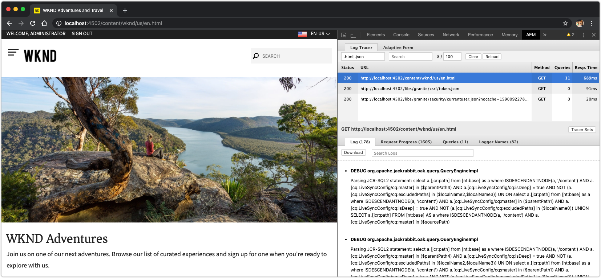

# 其他AEM SDK除錯工具

其他各種工具可協助您在AEM SDK的本機快速入門上除錯應用程式。

## CRXDE Lite

CRXDE Lite是以Web為基礎的介面，可與AEM的資料儲存庫JCR互動。 CRXDE Lite可完整檢視JCR，包括節點、屬性、屬性值和權限。

CRXDE Lite位於：

+ 「工具>一般> CRXDE Lite」
+ 或直接寄至 [http://localhost:4502/crx/de/index.jsp](http://localhost:4502/crx/de/index.jsp)

## 說明查詢

在AEM SDK的本機快速入門中解釋查詢網頁工具，提供AEM解譯和執行查詢的重要深入資訊，以及確保AEM以效能方式執行查詢的重要工具。

Explain Query位於：

+ 「工具>診斷>查詢效能>說明查詢標籤」
+ [「http://localhost:4502/libs/granite/operations/content/diagnosistools/queryPerformance.html](http://localhost:4502/libs/granite/operations/content/diagnosistools/queryPerformance.html) >說明查詢」索引標籤

## QueryBuilder除錯程式

QueryBuilder除錯程式是網路工具，可協助您使用AEM的 [QueryBuilder語法除錯和瞭解搜尋查詢](https://docs.adobe.com/content/help/en/experience-manager-65/developing/platform/query-builder/querybuilder-api.html) 。

QueryBuilder除錯程式位於：

+ [http://localhost:4502/libs/cq/search/content/querydebug.html](http://localhost:4502/libs/cq/search/content/querydebug.html)

## Sling Log Tracer和AEM Chrome增效模組

[隨附於AEM SDK本機快速入門的Sling Log Tracer](https://sling.apache.org/documentation/bundles/log-tracers.html)，可讓您深入追蹤HTTP請求，並依請求提供深入的除錯資訊。 必 [須配置Log Tracer OSGi配置](https://sling.apache.org/documentation/bundles/log-tracers.html#configuration-1) ，才能啟用此功能。

[Google Chrome網頁瀏覽器專用的開放原始碼](https://chrome.google.com/webstore/detail/aem-chrome-plug-in/ejdcnikffjleeffpigekhccpepplaode?hl=en-US) AEM Chrome增效模組已與Log Tracer整合 ，可直接在Chrome的「開發工具」中公開除錯資訊。

_AEM Chrome增效模組是開放原始碼工具，Adobe不提供支援。_

