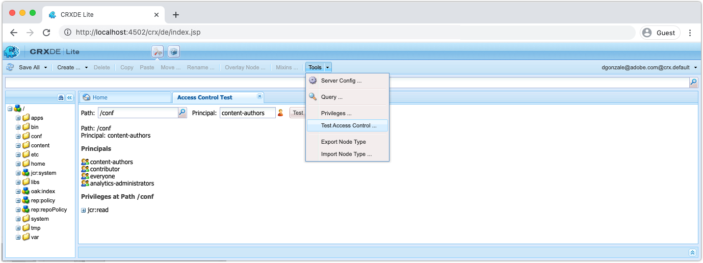

# 偵錯AEM SDK的其他工具

還有其他各種工具，協助您在AEM SDK的本機Quickstart上偵錯應用程式。

## CRXDE Lite

CRXDE Lite是網頁型介面，用於與AEM的資料存放庫JCR互動。 CRXDE Lite可完全顯示JCR，包括節點、屬性、屬性值和許可權。

CRXDE Lite位於：

+ 「工具>一般> CRXDE Lite」
+ 或直接在[http://localhost:4502/crx/de/index.jsp](http://localhost:4502/crx/de/index.jsp)

### 偵錯內容

CRXDE Lite提供對JCR的直接存取。 透過CRXDE Lite看到的內容受限於授予您使用者的許可權，這表示根據您的存取權，您可能無法檢視或修改JCR中的所有內容。

+ JCR結構可使用左側導覽窗格導覽和操作
+ 在左側導覽窗格中選取節點，會顯示底部窗格中的node屬性。
   + 可以從窗格新增、移除或變更屬性
+ 在左側導覽中連按兩下檔案節點，會在右上窗格中開啟檔案內容
+ 點選左上方的「儲存全部」按鈕以保留已變更的專案，或點選「儲存全部」旁的向下箭頭以還原任何未儲存的變更。

直接透過CRXDE Lite對AEM SDK所做的任何變更可能很難追蹤和控管。 請視情況確定透過CRXDE Lite進行的變更回到了AEM專案的可變內容套件(`ui.content`)並認可到Git。 理想情況下，所有應用程式內容變更都源自程式碼基底，並透過部署流入AEM SDK，而不是直接透過CRXDE Lite變更AEM SDK。

### 偵錯存取控制

CRXDE Lite提供測試和評估特定使用者或群組（亦稱為主體）之特定節點上存取控制的方法。

若要存取CRXDE Lite中的「測試存取控制」主控台，請導覽至：

+ CRXDE Lite >工具>測試存取控制……

1. 使用路徑欄位，選取要評估的JCR路徑
1. 使用「主參與者」欄位，選取路徑評估對象或群組
1. 點選測試按鈕

結果顯示如下：

+ __Path__&#x200B;會重申評估過的路徑
+ __主體__&#x200B;會重申路徑評估對象的使用者或群組
+ __主參與者__&#x200B;列出選取的主參與者所屬的所有主參與者。
   + 這有助於瞭解透過繼承提供許可權的可傳遞群組成員資格
+ __位於路徑__&#x200B;的許可權列出所選主體在評估路徑上的所有JCR許可權

## 說明查詢

說明AEM SDK本機Quickstart中的「查詢Web型」工具，該工具可提供AEM如何解譯和執行查詢的關鍵深入分析，以及確保AEM以高效方式執行查詢的寶貴工具。

說明查詢位於：

+ 「工具」 > 「診斷」 > 「查詢效能」 > 「說明查詢」標籤
+ [http://localhost:4502/libs/granite/operations/content/diagnosistools/queryPerformance.html](http://localhost:4502/libs/granite/operations/content/diagnosistools/queryPerformance.html) >說明查詢索引標籤

## QueryBuilder Debugger

QueryBuilder偵錯工具是網頁式工具，可協助您使用AEM的[QueryBuilder](https://experienceleague.adobe.com/docs/experience-manager-65/developing/platform/query-builder/querybuilder-api.html?lang=zh-Hant)語法偵錯並瞭解搜尋查詢。

QueryBuilder Debugger位於：

+ [http://localhost:4502/libs/cq/search/content/querydebug.html](http://localhost:4502/libs/cq/search/content/querydebug.html)
