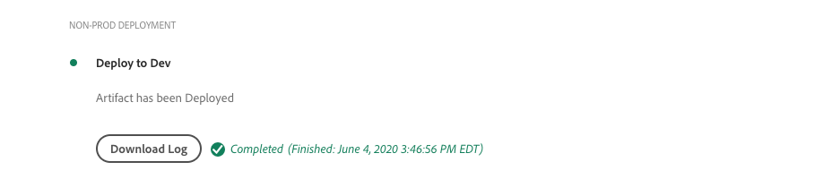

# 將AEM除錯為雲端服務建立與部署

Adobe Cloud Manager可協助建立程式碼並將之部署至AEM做為雲端服務。 在構建過程中的步驟中可能會發生故障，需要採取措施來解決這些故障。 本指南將逐步瞭解部署中常見的故障，以及如何最佳地處理這些故障。


## 驗證

驗證步驟只會確保基本的Cloud Manager配置有效。 常見的驗證失敗包括：

### 環境處於無效狀態

+ __錯誤消息：__ 環境處於無效狀態。
   
+ __原因：__ 管線的目標環境處於過渡狀態，此時它無法接受新建。
+ __解析度：__ 等待狀態解析為執行中（或更新可用）狀態。如果正在刪除環境，請重新建立該環境，或選擇要構建的不同環境。

### 找不到與管線關聯的環境

+ __錯誤消息：__ 該環境被標籤為已刪除。
   
+ __原因：__ 已刪除管線配置為使用的環境。即使重新建立了同名的新環境，Cloud Manager也不會自動將管道與該同名環境重新關聯。
+ __解析度：__ 編輯管線配置，然後重新選取要部署到的環境。

### 找不到與管線關聯的Git分支

+ __錯誤消息：__ 管線無效：XXXXXX。Reason=Branch=xxxx在儲存庫中未找到。
   中找不到Reason=Branch=xxxx
+ __原因：__ 已刪除管線配置為使用的Git分支。
+ __解決方__ 案：使用完全相同的名稱重新建立遺失的Git分支，或重新設定管道以從不同的現有分支建立。

## 構建和單元測試


構建和設備測試階段執行從管線配置的Git分支中檢出的項目的Maven構建(`mvn clean package`)。

在此階段中發現的錯誤應可在本地重建項目，但有以下例外：

+ 使用[Maven Central](https://search.maven.org/)上不可用的Maven依賴關係，包含該依賴關係的Maven儲存庫為：
   + 無法從Cloud Manager（如私有內部Maven儲存庫）訪問，或者Maven儲存庫需要驗證，並且提供了不正確的憑據。
   + 未在項目的`pom.xml`中明確註冊。 請注意，當Maven資料庫增加建置時間時，就不鼓勵它加入。
+ 設備測試因定時問題而失敗。 當單元測試對時間敏感時，可能會發生這種情況。 強指示器依賴測試代碼中的`.sleep(..)`。
+ 使用不支援的Maven增效模組。

## 程式碼掃描


程式碼掃描會混合使用Java和AEM特定的最佳實務來執行靜態程式碼分析。

如果程式碼中存在「重大安全性」弱點，程式碼掃描會導致建立失敗。 較小的違規可以覆蓋，但建議修正。 請注意，程式碼掃描不完善，可能導致[誤報](https://docs.adobe.com/content/help/en/experience-manager-cloud-service/implementing/developing/understand-test-results.html#dealing-with-false-positives)。

若要解決程式碼掃描問題，請透過&#x200B;**下載詳細資訊**&#x200B;按鈕下載Cloud Manager提供的CSV格式報表，並檢視所有項目。

如需詳細資訊，請參閱AEM特定規則，請參閱Cloud Manager檔案的「自訂AEM特定程式碼掃描規則」[。](https://docs.adobe.com/content/help/en/experience-manager-cloud-manager/using/how-to-use/custom-code-quality-rules.html)

## 建立影像


「建立」影像負責將「建立與單元測試」步驟中建立的程式碼對象與AEM版本結合，以形成單一可部署的對象。

雖然在「建置與裝置測試」期間發現任何程式碼建立與編譯問題，但嘗試結合自訂建置工件與AEM版本時，可能會發現設定或結構問題。

### 重複的OSGi配置

當多個OSGi組態透過目標AEM環境的執行模式解析時，「建立影像」步驟會失敗，並出現錯誤：

```
[ERROR] Unable to convert content-package [/tmp/packages/enduser.all-1.0-SNAPSHOT.zip]: 
Configuration ‘com.example.ExampleComponent’ already defined in Feature Model ‘com.example.groupId:example.all:slingosgifeature:xxxxx:X.X’, 
set the ‘mergeConfigurations’ flag to ‘true’ if you want to merge multiple configurations with same PID
```

#### 原因1

+ __原因：__ AEM專案的所有套件，包含多個程式碼套件，而且多個程式碼套件提供相同的OSGi組態，導致產生衝突，導致「建置影像」步驟無法決定應使用哪個套件，因此造成建置失敗。請注意，這不適用於OSGi工廠配置，只要它們具有唯一的名稱。
+ __解析度：__ 檢視部署為AEM應用程式一部分的所有程式碼套件（包括任何隨附的第三方程式碼套件），尋找可透過執行模式解析至目標環境的重複OSGi組態。在AEM中，錯誤訊息的「將mergeConfigurations標幟設為true」指引是不可能的，因此應該忽略。

#### 原因2

+ __原因：__ AEM專案的錯誤包含兩次相同的程式碼套件，因此會重複上述套件中包含的任何OSGi組態。
+ __解析度：__ 檢視所有專案中內嵌的所有pom.xml套件，並確保其設定 `filevault-package-maven-plugin` [](https://docs.adobe.com/content/help/en/experience-manager-cloud-service/implementing/developing/aem-project-content-package-structure.html#cloud-manager-target) 已設定 `<cloudManagerTarget>none</cloudManagerTarget>`。

### 格式錯誤的重新指向指令碼

重新指向指令碼定義基準內容、用戶、ACL等。 在AEM做為雲端服務時，重新指向指令碼會在「建立影像」期間套用，但是在AEM SDK的本機快速入門上，會在啟用OSGi重新指向工廠設定時套用這些指令碼。 因此，Repoinit指令碼可能會在AEM SDK的本機快速入門上悄然失敗（隨著登入），但會導致「建立影像」步驟失敗，導致部署停止。

+ __原因：重__ 新指向指令碼格式錯誤。請注意，在對儲存庫執行失敗指令碼後，可能會將儲存庫保留為不完整的狀態，作為任何重新指向指令碼。
+ __解決方__ 案：在部署重新指向指令碼OSGi組態時，檢視AEM SDK的本機快速入門，以判斷錯誤是否及錯誤為何。

### 不滿足要求的重新指向內容相關性

重新指向指令碼定義基準內容、用戶、ACL等。 在AEM SDK的本機快速入門中，重新指向指令碼會在重新指向OSGi工廠設定啟動時套用，換言之，在儲存庫啟動後，可能會直接或透過內容套件產生內容變更。 在AEM中，重新指向指令碼是在「建立影像」期間套用至儲存庫，儲存庫中可能不包含重新指向指令碼所仰賴的內容。

+ __原因：__ 重新指向指令碼取決於不存在的內容。
+ __解析度：__ 確保重新指向指令碼所依賴的內容存在。通常，這表示定義不充分的重新指向指令碼缺少定義這些缺少但必需的內容結構的指令。 若要在本機重新產生這項功能，請刪除AEM、解壓縮Jar並新增包含repoinit指令碼的repoinit OSGi設定至安裝資料夾，然後啟動AEM。 AEM SDK本機快速入門的error.log中會出現錯誤。


### 應用程式的核心元件版本大於部署的版本

_此問題只會影響不自動更新至最新AEM版本的非生產環境。_

AEM作為雲端服務會在每個AEM版本中自動包含最新的核心元件版本，這表示在AEM作為雲端服務環境自動或手動更新後，其中已部署最新版的核心元件。

如果出現以下情況，「構建映像」步驟可能會失敗：

+ 部署應用程式會更新`core`(OSGi bundle)項目中的核心元件主依賴關係版本
+ 部署應用程式接著會部署至沙盒（非生產）AEM做為Cloud Service環境，而此環境尚未更新為使用包含該新核心元件版本的AEM版本。

為避免此失敗，每當有AEM雲端服務環境的更新可供使用時，請將更新加入下一個建立／部署中，並務必在應用程式碼基底中增加核心元件版本後再加入更新。

+ __症狀：「__
建立影像」步驟失敗，並顯示錯誤報告， 
`com.adobe.cq.wcm.core.components...` 專案無法匯入特定版本範圍的封 `core` 裝。

   ```
   [ERROR] Bundle com.example.core:0.0.3-SNAPSHOT is importing package(s) Package com.adobe.cq.wcm.core.components.models;version=[12.13,13) in start level 20 but no bundle is exporting these for that start level in the required version range.
   [ERROR] Analyser detected errors on feature 'com.adobe.granite:aem-ethos-app-image:slingosgifeature:aem-runtime-application-publish-dev:1.0.0-SNAPSHOT'. See log output for error messages.
   [INFO] ------------------------------------------------------------------------
   [INFO] BUILD FAILURE
   [INFO] ------------------------------------------------------------------------
   ```

+ __原因：__  應用程式的OSGi套件(定義於專案中 `core` )會從核心元件核心相依性匯入Java類別，其版本層級與部署至AEM的雲端服務版本不同。
+ __解析度:__
   + 使用Git，還原為核心元件版本增量之前存在的工作提交。 將此提交推送到Cloud Manager Git分支，並從此分支執行環境更新。 這會將AEM的Cloud Service升級至最新的AEM版本，其中包含較新的核心元件版本。 AEM as a Cloud Service更新為最新的AEM版本（此版本將擁有最新的核心元件版本）後，請重新部署原本失敗的程式碼。
   + 若要在本機重制此問題，請確定AEM SDK版本與AEM的雲端服務環境所使用的AEM版本相同。


### 建立Adobe支援案例

如果上述疑難排解方法無法解決問題，請透過下列方式建立Adobe支援案例：

+ [Adobe Admin Console](https://adminconsole.adobe.com) >支援標籤>建立案例

   _如果您是多個Adobe組織的成員，請在建立案例之前，先確定已在Adobe組織切換器中選取具有失敗管道的Adobe組織。_

## 部署至

「部署至」步驟負責擷取「建立影像」中產生的程式碼對象、使用它啟動新的AEM作者和發佈服務，並在成功時移除任何舊的AEM作者和發佈服務。 在此步驟中也會安裝和更新可變的內容封裝和索引。

在除錯「部署至」步驟之前，請先熟悉[AEM作為Cloud Service記錄檔](./logs.md)。 `aemerror`記錄檔包含有關啟動和關閉Pod的資訊，這些資訊可能與「部署至問題」有關。 請注意，透過Cloud Manager「部署至」步驟中的「下載記錄檔」按鈕提供的記錄檔不是`aemerror`記錄檔，而且不包含您應用程式啟動的詳細資訊。



「部署至」步驟可能失敗的三個主要原因：

### Cloud Manager管道包含舊版AEM

+ __原因：__ Cloud Manager管道包含舊版AEM，而非部署至目標環境。當管道重新使用並指向執行較新版AEM的新環境時，可能會發生這種情況。 這可透過檢查環境的AEM版本是否大於管道的AEM版本來識別。
   
+ __解析度:__
   + 如果目標環境有可用的更新，請從環境的操作中選擇更新，然後重新運行構建版本。
   + 如果目標環境沒有「可用更新」，表示它正在執行最新版的AEM。 要解決此問題，請刪除管線並重新建立它。


### Cloud Manager逾時

在新部署的AEM服務啟動期間執行的程式碼需要很長時間，Cloud Manager會在部署完成之前逾時。 在這些情況下，即使認為Cloud Manager狀態報告為「失敗」，部署最終也可能成功。

+ __原因：__ 自訂程式碼可能會執行在OSGi Bundle或元件生命週期早期觸發的作業，例如大型查詢或內容遍歷，大幅延遲AEM的啟動時間。
+ __解析度：__ 檢視在OSGi Bundle生命週期早期執行的程式碼實作，並檢視失敗時（以GMT為記錄時間）前後的 `aemerror` AEM Author和Publish服務記錄檔，如雲端管理員所示，並尋找指示任何自訂記錄檔執行程式的記錄檔訊息。

### 程式碼或組態不相容

大部份的程式碼和設定違規都會擷取到組建版本的較早階段，不過，自訂程式碼或設定可能與AEM（雲端服務）不相容，而且無法偵測到，直到它在容器中執行為止。

+ __原因：__ 自訂程式碼可能會叫用冗長的作業，例如在OSGi Bundle或Component生命週期早期觸發的大型查詢或內容遍歷，大幅延遲AEM的啟動時間。
+ __解決方__ 法： `aemerror` 如Cloud Manager所示，在失敗的時間（以GMT為記錄時間）內，檢閱AEM Author和Publish服務的記錄檔。
   1. 查看自定義應用程式提供的Java類所拋出的任何ERRORS的日誌。 如果發現任何問題，請解決、推送固定程式碼，並重新建立管道。
   1. 檢視您在自訂應用程式中延伸／互動的AEM各方面所報告的任何ERRORS記錄檔，並進行調查；這些錯誤可能不直接歸因於Java類。 如果發現任何問題，請解決、推送固定程式碼，並重新建立管道。

### 在內容封裝中包含/var

`/var` 是可變的，包含多種暫時的執行時期內容。將`/var`包含在內容套件中(例如 `ui.content`)部署時，可能會導致部署步驟失敗。

此問題難以識別，因為它不會導致初始部署失敗，只會在後續部署中失敗。 明顯的症狀包括：

+ 初始部署成功，但是新的或變更的可變內容（屬於部署的一部分）似乎不存在於AEM Publish服務中。
+ AEM Author中的內容啟動／取消啟動已封鎖
+ 後續部署在「部署至」步驟中失敗，「部署至」步驟在大約60分鐘後失敗。

要驗證此問題是失敗行為的原因：

1. 確定至少一個屬於部署的內容包寫入`/var`。
1. 驗證主（粗體）分發隊列是否在以下位置被阻止：
   + AEM Author >工具>部署>散發
      
1. 在後續部署失敗時，請使用「下載記錄」按鈕下載Cloud Manager的「部署至」記錄：

   

   ...並驗證log語句之間是否間隔約60分鐘：

   ```
   2020-01-01T01:01:02+0000 Begin deployment in aem-program-x-env-y-dev [CorrelationId: 1234]
   ```

   ... 和 ...

   ```
   2020-01-01T02:04:10+0000 Failed deployment in aem-program-x-env-y-dev
   ```

   請注意，此記錄檔不會在報告成功的初始部署上包含這些指標，而只會在後續的失敗部署上。

+ __原因：__ AEM的複製服務使用者用來將內容套件部署至AEM Publish服務時，無法在AEM  `/var` Publish上寫入。這會導致將內容套件部署至AEM Publish服務失敗。
+ __解決方__ 案：下列解決此問題的方式依偏好順序列出：
   1. 如果`/var`資源不需要，請從作為應用程式一部分部署的內容包中刪除`/var`下的任何資源。
   2. 如果需要`/var`資源，請使用[repoint](https://docs.adobe.com/content/help/en/experience-manager-cloud-service/implementing/deploying/overview.html#repoinit)定義節點結構。 Repoinit指令碼可透過OSGi執行模式定位至AEM Author、AEM Publish或兩者。
   3. 如果`/var`資源僅需要於AEM作者，且無法使用[repoinit](https://docs.adobe.com/content/help/en/experience-manager-cloud-service/implementing/deploying/overview.html#repoinit)合理地建立模型，請將它們移至離散內容套件，此套件僅由[embedding](https://docs.adobe.com/content/help/en/experience-manager-cloud-service/implementing/developing/aem-project-content-package-structure.html#embeddeds)安裝在AEM Author執行模式檔案夾(`<target>/apps/example-packages/content/install.author</target>`)的`all`套件中。

### 建立Adobe支援案例

如果上述疑難排解方法無法解決問題，請透過下列方式建立Adobe支援案例：

+ [Adobe Admin Console](https://adminconsole.adobe.com) >支援標籤>建立案例

   _如果您是多個Adobe組織的成員，請在建立案例之前，先確定已在Adobe組織切換器中選取具有失敗管道的Adobe組織。_
