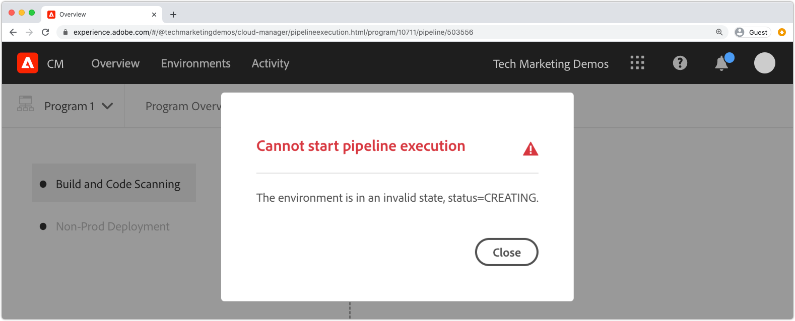

# 偵錯AEMas a Cloud Service建置和部署

AdobeCloud Manager有助於程式碼構建和部署到AEMas a Cloud Service。 在建置流程的步驟中可能會發生失敗，需要採取行動來解決。 本指南會逐步引導您瞭解部署中的常見失敗，以及如何採取最佳方法。


## 驗證 

驗證步驟只會確保基本Cloud Manager設定有效。 常見的驗證失敗包括：

### 環境處於無效狀態

+ __錯誤訊息：__ 環境處於無效狀態。
  
+ __原因：__ 管道的目標環境處於轉換狀態，此時無法接受新的組建。
+ __解析度：__ 等待狀態解析為執行中（或更新可用）狀態。 如果要刪除環境，請重新建立環境，或選擇要建置到的其他環境。

### 找不到與管道關聯的環境

+ __錯誤訊息：__ 環境標籤為已刪除。
  
+ __原因：__ 管道設定為使用的環境已刪除。
即使重新建立了相同名稱的新環境，Cloud Manager也不會自動將管道重新關聯至該相同名稱環境。
+ __解析度：__ 編輯管道設定，並重新選取要部署到的環境。

### 找不到與管道相關聯的Git分支

+ __錯誤訊息：__ 無效的管道： XXXXXX。 在存放庫中找不到Reason=Branch=xxxx。
  
+ __原因：__ 管道設定為使用的Git分支已刪除。
+ __解析度：__ 使用完全相同的名稱重新建立缺少的Git分支，或重新設定管道以從不同的現有分支建置。

## 建置及單元測試


建置和單元測試階段會執行Maven建置(`mvn clean package`)所代表的(從管道的Git分支中籤出的專案。

在本機建置專案時，此階段發現的錯誤應可重新產生，但有下列例外：

+ Maven相依性在以下位置無法使用： [Maven Central](https://search.maven.org/) 會使用，且包含相依性的Maven存放庫為：
   + 無法從Cloud Manager聯絡，例如私人內部Maven存放庫或Maven存放庫需要驗證並提供不正確的認證。
   + 未在專案的 `pom.xml`. 請注意，不建議加入Maven存放庫，因為這會增加建置時間。
+ 由於時間問題，單元測試失敗。 當單元測試對時間敏感時，可能會發生這種情況。 強烈指標取決於 `.sleep(..)` 在測試程式碼中。
+ 使用不支援的Maven外掛程式。

## 程式碼掃描


程式碼掃描會混合使用Java和AEM專屬的最佳實務來執行靜態程式碼分析。

如果程式碼中存在嚴重安全性漏洞，程式碼掃描會導致組建失敗。 可以覆寫較小的違規，但建議修正這些違規。 請注意，程式碼掃描並不完美，可能會導致 [誤判](https://experienceleague.adobe.com/docs/experience-manager-cloud-service/implementing/using-cloud-manager/test-results/overview-test-results.html#dealing-with-false-positives).

若要解決程式碼掃描問題，請下載Cloud Manager透過以下網址提供的CSV格式報表： **下載詳細資料** 按鈕並檢閱任何專案。

如需更多詳細資訊，請參閱AEM特定規則，請參閱「 Cloud Manager檔案」 [自訂AEM特定的程式碼掃描規則](https://experienceleague.adobe.com/docs/experience-manager-cloud-manager/using/how-to-use/custom-code-quality-rules.html).

## 建置影像


組建影像負責將在「建置和單位測試」步驟中建立的組建程式碼成品與AEM版本結合，以形成單一可部署成品。

雖然在建置和單元測試期間發現任何程式碼建置和編譯問題，但在嘗試將自訂建置成品與AEM版本結合時，可能會發現設定或結構問題。

### 複製OSGi設定

當目標AEM環境透過執行模式解析多個OSGi設定時，建置影像步驟會失敗並出現錯誤：

```
[ERROR] Unable to convert content-package [/tmp/packages/enduser.all-1.0-SNAPSHOT.zip]: 
Configuration 'com.example.ExampleComponent' already defined in Feature Model 'com.example.groupId:example.all:slingosgifeature:xxxxx:X.X', 
set the 'mergeConfigurations' flag to 'true' if you want to merge multiple configurations with same PID
```

#### 原因1

+ __原因：__ AEM專案的所有套件包含多個程式碼套件，且多個程式碼套件會提供相同的OSGi設定，導致衝突，導致「建置影像」步驟無法決定應使用哪個套件，進而導致建置失敗。 請注意，這不適用於OSGi原廠設定，只要它們有唯一名稱。
+ __解析度：__ 檢閱作為AEM應用程式的一部分部署的所有程式碼套件（包括任何包含的第三方程式碼套件），尋找透過執行模式解析到目標環境的重複OSGi設定。 在AEM as a Cloud Service中不可能有錯誤訊息「將mergeConfigurations標幟設為true」的指引，應予以忽略。

#### 原因2

+ __原因：__ AEM專案錯誤地包含相同的程式碼套件兩次，導致所述套件中包含的任何OSGi設定重複。
+ __解析度：__ 檢閱所有專案中內嵌的所有pom.xml套件，並確定它們具有 `filevault-package-maven-plugin` [設定](https://experienceleague.adobe.com/docs/experience-manager-cloud-service/implementing/developing/aem-project-content-package-structure.html#cloud-manager-target) 設為 `<cloudManagerTarget>none</cloudManagerTarget>`.

### 格式錯誤的repoinit指令碼

Repoinit指令碼可定義基準內容、使用者、ACL等。 在AEMas a Cloud Service中，Repoinit指令碼會在建置影像期間套用，但在AEM SDK的本機Quickstart中，這些指令碼會在OSGi Repoinit工廠設定啟動時套用。 因此，Repoinit指令碼可能會在AEM SDK的本機Quickstart上悄悄失敗（記錄），但會導致「建置影像」步驟失敗，並停止部署。

+ __原因：__ repoinit指令碼格式錯誤。 這可能會導致您的存放庫處於不完整狀態，因為在失敗指令碼未對存放庫執行後，任何repoinit指令碼都會受到影響。
+ __解析度：__ 部署了repoinit指令碼OSGi設定時，請檢閱AEM SDK的本機Quickstart ，以判斷錯誤是否及其內容。

### 不滿意的repoinit內容相依性

Repoinit指令碼可定義基準內容、使用者、ACL等。 在AEM SDK的本機Quickstart中，Repoinit指令碼會在Repoinit OSGi工廠設定啟動時套用，換言之，在存放庫啟動且可能直接或透過內容套件產生內容變更後。 在AEMas a Cloud Service中，Repoinit指令碼會在「建置影像」期間套用至存放庫，該存放庫可能未包含Repoinit指令碼所相依的內容。

+ __原因：__ repoinit指令碼取決於不存在的內容。
+ __解析度：__ 確認repoinit指令碼所依賴的內容存在。 這通常表示未充分定義的repoinit指令碼遺漏了定義這些遺漏但必要的內容結構的指令。 可以透過刪除AEM、解壓縮Jar並將包含repoinit指令碼的repoinit OSGi設定新增到安裝資料夾，以及啟動AEM在本機重新產生這種情況。 錯誤會顯示在AEM SDK本機Quickstart的error.log中。


### 應用程式的核心元件版本高於已部署的版本

_此問題只會影響不會自動更新至最新AEM版本的非生產環境。_

AEMas a Cloud Service會在每個AEM發行版本中自動包含最新核心元件版本，這表示在自動或手動更新AEMas a Cloud Service環境且已部署最新版本的核心元件之後。

在以下情況下，「建置影像」步驟可能會失敗：

+ 部署應用程式會更新中的核心元件Maven相依性版本 `core` （OSGi套件）專案
+ 然後，部署應用程式會部署到沙箱（非生產） AEMas a Cloud Service環境，該環境尚未更新為使用包含新核心元件版本的AEM版本。

為防止此失敗，只要有AEMas a Cloud Service環境的更新可用，包括更新作為下一個建置/部署的一部分，並一律確保在增加應用程式程式碼庫中的核心元件版本之後包括更新。

+ __症狀：__
「建置影像」步驟失敗並出現「錯誤」報告， `com.adobe.cq.wcm.core.components...` 特定版本範圍內的套件無法由匯入 `core` 專案。

  ```
  [ERROR] Bundle com.example.core:0.0.3-SNAPSHOT is importing package(s) Package com.adobe.cq.wcm.core.components.models;version=[12.13,13) in start level 20 but no bundle is exporting these for that start level in the required version range.
  [ERROR] Analyser detected errors on feature 'com.adobe.granite:aem-ethos-app-image:slingosgifeature:aem-runtime-application-publish-dev:1.0.0-SNAPSHOT'. See log output for error messages.
  [INFO] ------------------------------------------------------------------------
  [INFO] BUILD FAILURE
  [INFO] ------------------------------------------------------------------------
  ```

+ __原因：__  應用程式的OSGi套件(定義於 `core` 專案)從核心元件核心相依性匯入Java類別，且版本層級與部署至AEMas a Cloud Service的版本層級不同。
+ __解析度:__
   + 使用Git時，請還原成核心元件版本增加之前存在的工作認可。 將此提交推送到Cloud Manager Git分支，並從此分支執行環境更新。 這會將AEMas a Cloud Service升級至最新的AEM版本，其中包含較新的核心元件版本。 AEMas a Cloud Service更新至最新的AEM版本後（其中包含最新的核心元件版本），請重新部署原本失敗的程式碼。
   + 若要在本機重現此問題，請確定AEM SDK版本與AEMas a Cloud Service環境使用的AEM發行版本相同。


### 建立Adobe支援案例

如果上述的疑難排解方法皆無法解決問題，請透過以下方式建立Adobe支援案例：

+ [Adobe Admin Console](https://adminconsole.adobe.com) >支援標籤>建立案例

  _如果您是多個Adobe組織的成員，在建立案例之前，請確定已在Adobe組織切換器中選取具有失敗管道的Adobe組織。_

## 部署至

「部署至」步驟負責取得在「建置影像」中產生的程式碼成品，並使用它啟動新的AEM製作和發佈服務，並在成功後移除任何舊的AEM製作和發佈服務。 在此步驟中也會安裝及更新可變內容套件和索引。

熟悉 [AEMas a Cloud Service記錄](./logs.md) 在偵錯「部署至」步驟之前。 此 `aemerror` 記錄檔包含有關Pod啟動和關閉的資訊，可能與「部署到問題」相關。 請注意，可透過Cloud Manager部署至步驟中的下載記錄按鈕使用的記錄不是 `aemerror` 記錄，不會包含與您的應用程式啟動相關的詳細資訊。


「部署至」步驟可能失敗的三個主要原因：

### Cloud Manager管道儲存舊的AEM版本

+ __原因：__ Cloud Manager管道儲存的AEM版本比部署到目標環境的版本舊。 當重複使用管道並指向執行較新版本AEM的新環境時，可能會發生這種情況。 您可透過檢視環境的AEM版本是否大於管道的AEM版本來識別它。
  
+ __解析度:__
   + 如果目標環境有可用的更新，請從環境的動作中選取更新，然後重新執行組建。
   + 如果目標環境沒有可用的更新，這表示它執行的是最新版的AEM。 要解決此問題，請刪除管道並重新建立它。


### Cloud Manager逾時

在新部署的AEM服務啟動期間執行的程式碼需要很長時間，以至於Cloud Manager在部署完成之前逾時。 在這些情況下，部署最終可能會成功，即使認為Cloud Manager狀態報告失敗。

+ __原因：__ 自訂程式碼可能會執行在OSGi套件組合或元件生命週期早期觸發的作業，例如大型查詢或內容周遊，這會大幅延遲AEM的啟動時間。
+ __解析度：__ 檢閱在OSGi Bundle生命週期早期執行的程式碼實作，並檢閱 `aemerror` Cloud Manager所顯示的失敗時間（以GMT記錄時間）前後的AEM作者和發佈服務記錄，並尋找指出任何自訂記錄執行流程的記錄訊息。

### 不相容的程式碼或設定

大部分的程式碼和設定違規都會在組建的初期階段擷取，不過自訂程式碼或設定可能會與AEMas a Cloud Service不相容，並且一直未偵測到，直到在容器中執行為止。

+ __原因：__ 自訂程式碼可能會叫用冗長的作業，例如在OSGi套件組合或元件生命週期早期觸發的大型查詢或內容周遊，這會大幅延遲AEM的啟動時間。
+ __解析度：__ 檢閱 `aemerror` Cloud Manager所顯示的失敗發生時間（以GMT為記錄時間）前後的AEM製作和發佈服務記錄。
   1. 檢閱記錄檔，瞭解自訂應用程式提供的Java類別所擲回的任何ERROR。 如果發現任何問題，請解決，推送修復的程式碼，然後重新建置管道。
   1. 檢閱記錄檔，以找出您在自訂應用程式中延伸/互動之AEM各方面所回報的錯誤，並加以調查；這些ERROR可能不會直接歸因於Java類別。 如果發現任何問題，請解決，推送修復的程式碼，然後重新建置管道。

### 在內容封裝中包含/var

`/var` 是可變動的，包含多種暫時性的執行階段內容。 包含 `/var` 在內容套件中(例如 `ui.content`)透過Cloud Manager部署可能會導致部署步驟失敗。

此問題很難識別，因為它不會導致初始部署失敗，只會在後續部署中失敗。 明顯的症狀包括：

+ 初始部署成功，但作為部署一部分的新增或變更的可變內容似乎不存在於AEM Publish服務中。
+ AEM Author中的內容啟用/停用功能已封鎖
+ 後續部署會在「部署至」步驟中失敗，而「部署至」步驟會在約60分鐘後失敗。

若要驗證此問題是失敗行為的原因：

1. 判斷部署中至少有一個內容套件會將寫入 `/var`.
1. 驗證主要（粗體）散發佇列是否已在下列位置封鎖：
   + AEM作者>工具>部署>發佈
     
1. 後續部署失敗時，使用下載記錄按鈕下載Cloud Manager的「部署到」記錄：

   

   ...並確認記錄陳述式之間約有60分鐘間隔：

   ```
   2020-01-01T01:01:02+0000 Begin deployment in aem-program-x-env-y-dev [CorrelationId: 1234]
   ```

   ... 和 ...

   ```
   2020-01-01T02:04:10+0000 Failed deployment in aem-program-x-env-y-dev
   ```

   請注意，在報告為成功的初始部署中，此記錄不會包含這些指標，而只會在後續的失敗部署中包含。

+ __原因：__ 用於將內容套件部署至AEM Publish服務的AEM復寫服務使用者無法寫入 `/var` 在AEM發佈上。 這會導致將內容套件部署到AEM Publish服務失敗。
+ __解析度：__ 以下是解決此問題的方式會依偏好設定順序列出：
   1. 如果 `/var` 資源不需要移除下的任何資源 `/var` 從部署為應用程式一部分的內容套件。
   2. 如果 `/var` 資源是必要的，請使用定義節點結構 [repoinit](https://experienceleague.adobe.com/docs/experience-manager-cloud-service/implementing/deploying/overview.html#repoinit). Repoinit指令碼可以透過OSGi執行模式鎖定為AEM Author、AEM Publish或兩者。
   3. 如果 `/var` 資源僅在AEM作者上需要，不能合理使用進行模型化 [repoinit](https://experienceleague.adobe.com/docs/experience-manager-cloud-service/implementing/deploying/overview.html#repoinit)，將其移至獨立內容套件，該套件僅由安裝在AEM Author上 [內嵌](https://experienceleague.adobe.com/docs/experience-manager-cloud-service/implementing/developing/aem-project-content-package-structure.html#embeddeds) 它位在 `all` 封裝在AEM Author執行模式資料夾中(`<target>/apps/example-packages/content/install.author</target>`)。
   4. 提供適當的ACL給 `sling-distribution-importer` 服務使用者，如本中所述 [ADOBEKB](https://helpx.adobe.com/in/experience-manager/kb/cm/cloudmanager-deploy-fails-due-to-sling-distribution-aem.html).

### 建立Adobe支援案例

如果上述的疑難排解方法皆無法解決問題，請透過以下方式建立Adobe支援案例：

+ [Adobe Admin Console](https://adminconsole.adobe.com) >支援標籤>建立案例

  _如果您是多個Adobe組織的成員，在建立案例之前，請確定已在Adobe組織切換器中選取具有失敗管道的Adobe組織。_
